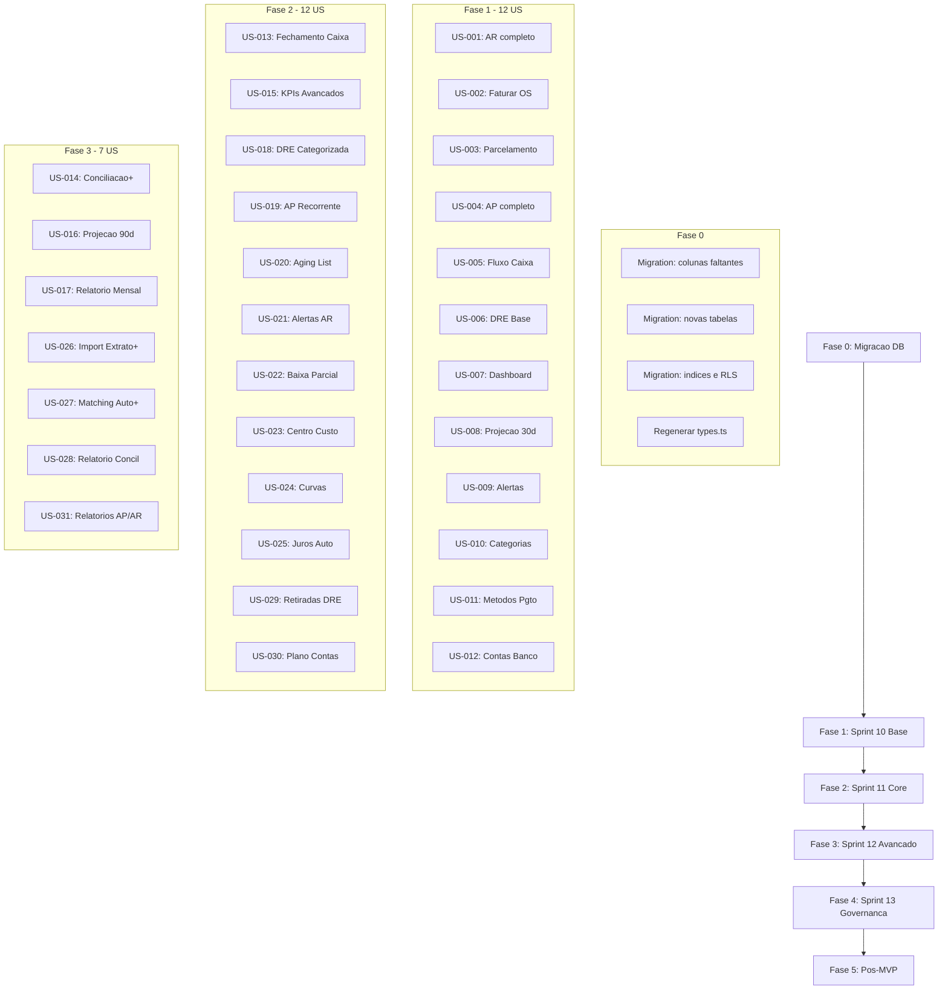

# Plano de Implementacao - Modulo Financeiro Completo (US-FIN-001 a US-FIN-034)

## Validacao (repo erp-retifica-formiguense)

Marcados **concluidos** no frontmatter (US-FIN-010 a US-FIN-021) apos checagem no codigo; **US-FIN-022 a US-FIN-030** tambem marcados como `completed` no frontmatter.

| US  | Evidencia principal                                                                                                                       |
| --- | ----------------------------------------------------------------------------------------------------------------------------------------- |
| 010 | `ConfigFinanceiro.tsx` edicao via `updateExpenseCategory`, `ensureDefaultExpenseCategories`; unicidade tratada no insert (erro duplicate) |
| 011 | `FinancialConfigService` + form com `applies_to` e escopo recebivel/pagar/ambos                                                           |
| 012 | `baKind` bank/cash, form diferenciado agencia/conta para banco                                                                            |
| 013 | `FechamentoCaixa.tsx` preview/diferenca; `CashFlowService` bloqueia create/update/delete se existe `cash_closings` na data                |
| 015 | `AdvancedIndicatorsService.compute` + `FinancialAdvancedIndicators` no `Financeiro.tsx`                                                   |
| 018 | `DRE.tsx` `compareThreeMonths`, persistencia `monthly_dre` via `DreCategorizedService`                                                    |
| 019 | Rota `/ap-recorrentes`, `ApRecurringService.save` / `generateNextPayable`                                                                 |
| 020 | `/inadimplencia-aging`, `ArAgingService` buckets e data referencia; agregacao por cliente                                                 |
| 021 | `ArDueAlertService`, `useArDueAlertsPanel`, `ArDueAlertsCard`, `NotificationsPanel`, migration `status` em `ar_due_alerts`                |

**Pendencias menores (nao impedem marcar concluido):** aging usa rotulos de faixas alinhados ao service (`a_vencer`, `d0_30`, etc.) em vez dos nomes literais do texto da US.

## Contexto

O modulo financeiro ja possui base parcial: 12 paginas, ~28 services, 1 hook principal (`useFinancial`), 4 componentes em `components/financial/`. Porem, muitas features estao incompletas ou ausentes em relacao as 34 user stories documentadas. Este plano cobre **todos os gaps** organizados em 6 fases incrementais.

**Referencia de arquitetura:** O fluxo `PedidosCompra -> PurchaseOrdersManager -> usePurchaseOrders -> PurchaseOrderService` sera o padrao a seguir.

---

## Fase 0 - Migracao de Banco de Dados

Antes de qualquer codigo frontend, ajustar o schema do Supabase via `apply_migration` para suportar todas as US.

### Colunas faltantes em tabelas existentes

- `**accounts_receivable`**: adicionar `source text`, `source_id uuid`, `is_renegotiated boolean DEFAULT false`, `last_late_fee_date date` (US-FIN-002, 003, 025)
- `**accounts_payable`**: adicionar `competence_date date`, `invoice_file_url text` (US-FIN-004)
- `**cash_closings`**: adicionar `opening_balance`, `total_income`, `total_expenses`, `system_balance`, `physical_cash`, `bank_balance`, `total_verified`, `status text DEFAULT 'open'` - campos exigidos por US-FIN-013 (schema atual tem `expected_balance/counted_balance/difference_amount` - alinhar)
- `**payment_methods`**: adicionar `org_id uuid`, `applies_to text[]` (US-FIN-011)
- `**bank_accounts`**: adicionar `kind text DEFAULT 'bank'` (bank/cash) (US-FIN-012)
- `**cost_centers`**: adicionar `description text`, `parent_id uuid REFERENCES cost_centers(id)` (US-FIN-023)
- `**suppliers`**: adicionar `default_expense_category_id uuid`, `default_cost_center_id uuid` (US-FIN-030)
- `**monthly_dre`**: adicionar colunas categorized DRE: `deductions`, `admin_expenses`, `commercial_expenses`, `financial_expenses`, `taxes`, `partners_withdrawals`, `net_revenue`, `operational_result` (US-FIN-018)
- `**ap_recurring_schedules`**: adicionar `cost_center_id uuid`, `source_type text`, `frequency text DEFAULT 'monthly'`, `start_date date`, `end_date date` (US-FIN-019)
- `**bank_statement_lines`**: adicionar `bank_transaction_id text`, `status text DEFAULT 'pending'` (US-FIN-026)
- `**bank_reconciliation_items`**: adicionar `status text`, `adjustment_reason text` (US-FIN-014)

### Novas tabelas

- `**ar_due_alerts`** (US-FIN-021): `id, org_id, receivable_account_id, alert_type, reference_date, is_read, created_at` + indice unico
- `**ar_late_fee_rules`** (US-FIN-025): `id, org_id, penalty_percent, daily_interest_percent, grace_days, is_active, created_at`
- `**ar_late_fee_history`** (US-FIN-025): `id, receivable_account_id, calculated_date, penalty_amount, interest_amount, total_fee, days_overdue`
- `**financial_notifications`** (US-FIN-009): `id, org_id, type, title, message, reference_id, reference_type, is_read, created_at`
- `**ap_payment_history`** (analoga a `receipt_history` para AP): `id, org_id, payable_id, amount_paid, paid_at, payment_method, notes, registered_by, created_at`
- `**monthly_financial_reports`** (US-FIN-017): `id, org_id, month, year, pdf_url, generated_by, generated_at, created_at`
- `**fin_accounting_entries`** (US-FIN-033): `id, org_id, source_type, source_id, event_type, idempotency_key UNIQUE, account_code, debit, credit, competence_date, status, created_at`
- `**bank_transmission_batches**` (US-FIN-034): `id, org_id, bank_account_id, direction, file_hash, status, total_items, processed_items, created_at`

### Indices e constraints

- `UNIQUE (org_id, source, source_id, installment_number)` em `accounts_receivable` (US-FIN-002)
- `UNIQUE (org_id, closing_date)` em `cash_closings` (US-FIN-013)
- RLS em todas as novas tabelas por `org_id`

---

## Fase 1 - Sprint 10 Base (US-FIN-001 a US-FIN-012)

Completar funcionalidades base que ja tem implementacao parcial.

### US-FIN-001 - Registrar Contas a Receber

**Existente:** [ContasReceber.tsx](src/pages/ContasReceber.tsx), [AccountsReceivableService](src/services/financial/accountsReceivableService.ts), [schemas.ts](src/services/financial/schemas.ts)
**Gaps:**

- Adicionar acao de **editar** AR na UI (service `update` ja existe, falta UI flow)
- Migrar tabela para `ResponsiveTable`
- Exibir campos auditoria (`created_by`, `updated_by`)
- Garantir validacao `competence_date <= due_date` e `due_date >= hoje`

### US-FIN-002 - Faturar OS Aprovada

**Existente:** [ReceivableFromBudgetService](src/services/financial/receivableFromBudgetService.ts), [OrderBillingService](src/services/financial/orderBillingService.ts)
**Gaps:**

- Integrar no fluxo de aprovacao de orcamento (modal de condicao de pagamento: a vista/parcelado/sinal+saldo)
- Criar componente `BudgetPaymentConditionModal` em `components/financial/`
- Hook `useReceivableGeneration` fino que chama `ReceivableFromBudgetService`
- Garantir campos `source`/`source_id` em AR

### US-FIN-003 - Parcelamento e Renegociacao de AR

**Existente:** `createInstallmentPlan` no service, dialog de parcelas em `ContasReceber.tsx`
**Gaps:**

- Criar fluxo de renegociacao (reparcelar saldo aberto N->M)
- Registrar em `ar_renegotiations` com motivo e responsavel
- Nao permitir editar parcelas ja pagas

### US-FIN-004 - Registrar Contas a Pagar

**Existente:** [ContasPagar.tsx](src/pages/ContasPagar.tsx), [AccountsPayableService](src/services/financial/accountsPayableService.ts)
**Gaps:**

- Adicionar campo `competence_date` no formulario
- Adicionar upload de anexo NF/boleto (`invoice_file_url` -> Supabase Storage bucket `invoices`)
- Usar `SupplierLookupService` no lugar de input texto para fornecedor
- Validacao `competence_date <= due_date`
- Migrar para `ResponsiveTable`

### US-FIN-005 - Fluxo de Caixa Diario

**Existente:** [FluxoCaixa.tsx](src/pages/FluxoCaixa.tsx), [CashFlowService](src/services/financial/cashFlowService.ts)
**Gaps:**

- Implementar paginacao backend na UI (atualmente busca 500)
- Adicionar `cost_center_id` no formulario de criacao
- Criar acao de edicao e exclusao de lancamentos
- Vincular automaticamente ao registrar pagamento AR/AP

### US-FIN-006 - DRE Mensal Base

**Existente:** [DRE.tsx](src/pages/DRE.tsx), [DreCategorizedService](src/services/financial/dreCategorizedService.ts)
**Gaps:**

- Implementar **exportacao PDF/Excel** (botao existe sem handler)
- Service `exportDrePdf` / `exportDreExcel`

### US-FIN-007 - Dashboard Financeiro Basico

**Existente:** [Financeiro.tsx](src/pages/Financeiro.tsx), [FinancialKpiService](src/services/financial/financialKpiService.ts)
**Gaps:**

- Remover `@ts-nocheck`
- Tipar corretamente e refatorar helpers para `lib/financialFormat.ts`
- Adicionar paginacao nas listas de AR/AP/fluxo
- Usar `ResponsiveTable` nas listagens

### US-FIN-008 - Projecao de Caixa Base (30 dias)

**Existente:** [ProjectionService](src/services/financial/projectionService.ts)
**Gaps:**

- Implementar calculo on-demand de projecao 30 dias (AR/AP pendentes por `due_date`)
- Alerta visual quando saldo projetado < 0

### US-FIN-009 - Alertas de Contas Proximas ao Vencimento

**Existente:** `FinancialReportService.upcomingAlerts` parcialmente em [RelatoriosFinanceiros.tsx](src/pages/RelatoriosFinanceiros.tsx)
**Gaps:**

- Criar service `FinancialNotificationService` com tabela `financial_notifications`
- Card de alertas no dashboard `/financeiro` com badge
- Logica de geracao: AR/AP pending com vencimento em 7, 3, 0 dias

### US-FIN-010 - Gerenciar Categorias de Despesa

**Existente:** CRUD basico em [ConfigFinanceiro.tsx](src/pages/ConfigFinanceiro.tsx)
**Gaps:**

- Adicionar edicao inline (atualmente so cria)
- Seed de categorias ao criar org (verificar se existe)
- Garantir unicidade nome/org

### US-FIN-011 - Configurar Metodos de Pagamento/Recebimento

**Existente:** Parcial em `ConfigFinanceiro.tsx`
**Gaps:**

- Adicionar campo `applies_to` (receivable/payable/both) no formulario
- Adicionar `org_id` no service se faltante
- Edicao de metodos existentes

### US-FIN-012 - Configurar Contas Bancarias e Caixas

**Existente:** Parcial em `ConfigFinanceiro.tsx`
**Gaps:**

- Adicionar campo `kind` (bank/cash)
- Diferenciar formulario banco vs caixa (agencia/conta so para banco)

---

## Fase 2 - Sprint 11 Core (US-FIN-013 a 025, 029, 030)

### US-FIN-013 - Fechamento de Caixa Diario

**Existente:** [FechamentoCaixa.tsx](src/pages/FechamentoCaixa.tsx), [CashClosingService](src/services/financial/cashClosingService.ts)
**Gaps:**

- Alinhar schema (campos opening_balance, total_income, total_expenses, etc.)
- Pre-preencher totais do dia via `cash_flow`
- Calculo de diferenca em tempo real
- Status `open/closed/divergent` com obs obrigatoria quando divergente
- Bloqueio de novos lancamentos em dia fechado

### US-FIN-015 - Indicadores Financeiros Avancados

**Existente:** Parcial em dashboard
**Gaps:**

- Criar service `AdvancedIndicatorsService` com: % inadimplencia, PMR, PMP, ticket medio, giro de caixa
- Cards no dashboard com tendencia mes anterior

### US-FIN-018 - DRE Categorizada

**Existente:** `DreCategorizedService.computeMonth/computeYear` + UI em DRE.tsx
**Gaps:**

- Mapear `expense_categories.category` (kind) para linhas DRE conforme diagrama
- Comparativo 3 periodos lado a lado
- Persistir em `monthly_dre` ao calcular
- Export funcional

### US-FIN-019 - Recorrencia de Contas a Pagar

**Existente:** [ApRecurringService](src/services/financial/apRecurringService.ts) - **sem pagina**
**Gaps:**

- Criar pagina/tab `RecorrenciasAP` (pode ser tab em `/contas-pagar` ou aba em `/config-financeiro`)
- CRUD de templates recorrentes
- Botao "Gerar proximo lancamento" ou cron/edge function
- Idempotencia template+ciclo

### US-FIN-020 - Aging List de Inadimplencia

**Existente:** Parcial em `RelatoriosFinanceiros.tsx` (aba Aging)
**Gaps:**

- Buckets corretos: current, 1-30, 31-60, 61-90, 90+
- Drill-down por cliente com detalhes (OS, orcamento, vencimento, valor aberto)
- Data referencia configuravel
- Usar `FinancialReportService.agingReceivables` expandido

### US-FIN-021 - Alertas de Vencimento AR

**Gaps (novo):**

- Service `ArDueAlertService`: gerar alertas 7/3/0 dias antes vencimento
- Tabela `ar_due_alerts`
- Badge no dashboard + lista de alertas com acoes (abrir conta, marcar em negociacao, renegociar)
- Nao duplicar alerta por conta/tipo/data

### US-FIN-022 - Baixa Parcial e Renegociacao

**Existente:** Dialog de pagamento em `ContasReceber.tsx`, `ReceiptHistoryService.recordPayment`
**Gaps:**

- Implementar baixa parcial (valor < total -> manter `pending` com saldo)
- Tolerancia centavos (< R$ 0.05 -> `paid`)
- Renegociar vencimento/valor com juros/multa/desconto
- Historico completo em `receipt_history`

### US-FIN-023 - Centro de Custo em AP e AR

**Existente:** `cost_center_id` ja existe em AR/AP/cash_flow; `CostCenterService` e `CostCenterSelect`
**Gaps:**

- Tornar centro de custo obrigatorio ou com inferencia (OS, PO, supplier/customer defaults)
- Hierarquia (`parent_id`) no cadastro
- Filtro por centro de custo em relatorios e DRE

### US-FIN-024 - Curva de Vencimentos e Recebimentos

**Existente:** `FinancialReportService.dueCurve` parcial em `RelatoriosFinanceiros.tsx`
**Gaps:**

- Janela configuravel (default 90 dias)
- Buckets: current, 1-30, 31-60, 61-90
- Grafico (dia/semana) usando Recharts (ja no projeto)
- Separar AP e AR
- Filtro por centro de custo

### US-FIN-025 - Juros e Multa Automaticos em AR

**Gaps (novo):**

- Tabela `ar_late_fee_rules` com config por org (multa %, juros diario %)
- Service `ArLateFeeService`: calcular e persistir `late_fee` em AR overdue
- Historico em `ar_late_fee_history`
- Evitar recalculo no mesmo dia
- Tab de config em `/config-financeiro`

### US-FIN-029 - Retirada dos Socios na DRE

**Existente:** [RetiradasSocios.tsx](src/pages/RetiradasSocios.tsx), [PartnerWithdrawalService](src/services/financial/partnerWithdrawalService.ts)
**Gaps:**

- Linha dedicada na DRE (lucro antes retiradas - retiradas = lucro final)
- Integrar com `DreCategorizedService`
- Edicao/exclusao de retiradas

### US-FIN-030 - Plano de Contas no Fornecedor

**Existente:** `suppliers.chart_account_code` ja existe
**Gaps:**

- Adicionar `default_expense_category_id` e `default_cost_center_id` em `suppliers`
- Secao "Classificacao Financeira" no cadastro de fornecedor
- Sugestao automatica na conciliacao baseada no fornecedor

---

## Fase 3 - Sprint 12 Avancado (US-FIN-014, 016, 017, 022, 026-028, 031)

### US-FIN-014 - Conciliacao Bancaria e Cartoes (aprimorar)

**Existente:** [ConciliacaoBancaria.tsx](src/pages/ConciliacaoBancaria.tsx) com import/match parcial
**Gaps:**

- Taxas de maquininha: usar `CardMachineService` para calcular liquido/taxa esperada
- Painel lado a lado ERP vs extrato com drag-and-drop ou clique para vincular
- Status matched/pending/adjusted nos itens
- Trilha de auditoria (usuario, data, motivo) ao confirmar/ajustar/desvincular
- Fechar sessao de conciliacao

### US-FIN-016 - Fluxo de Caixa Projetado (90 dias)

**Existente:** [FluxoProjetado.tsx](src/pages/FluxoProjetado.tsx) basico, [ProjectionService](src/services/financial/projectionService.ts)
**Gaps:**

- Cenarios otimista/realista/pessimista com fatores AR/AP
- Resumo mensal + grafico diario
- Alerta saldo minimo (default R$ 10.000)
- Drill-down por semana

### US-FIN-017 - Relatorio para Reuniao Mensal

**Gaps (novo):**

- Service `MonthlyReportService`: agregar DRE comparativa, indicadores, top 10 clientes/despesas, projecao, recomendacoes
- Gerar PDF (usando biblioteca como jsPDF/pdfmake ou edge function)
- Salvar em `monthly_financial_reports`
- Pagina `/relatorios-financeiros` com tab dedicada ou nova rota

### US-FIN-026 - Importar Extrato Bancario (aprimorar)

**Existente:** `StatementImportService.importFromText`, parsers OFX/CSV
**Gaps:**

- Suporte CNAB
- Idempotencia (reimportacao nao duplica via `bank_transaction_id`)
- Resumo auditavel pos-import (lidos/importados/ignorados/erro)
- Status nas linhas

### US-FIN-027 - Matching Automatico (aprimorar)

**Existente:** `ReconciliationMatchingService.autoMatchImport`
**Gaps:**

- Tolerancia de valor configuravel
- Match por agrupamento (soma N lancamentos ERP = 1 linha extrato)
- Score de confianca transparente
- Fila de pendencias

### US-FIN-028 - Relatorio Formal de Conciliacao

**Gaps (novo):**

- Service `ReconciliationReportService`: gerar relatorio por conta/periodo
- Conteudo: saldos iniciais, reconciliados, pendencias, saldo final, diferenca
- Export PDF
- Snapshot imutavel da sessao

### US-FIN-031 - Relatorios Filtraveis AP/AR

**Gaps (novo):**

- Pagina dedicada ou tabs em `/relatorios-financeiros`
- Filtros ricos: fornecedor/cliente, competencia, liquidacao, vencimento, categoria, centro, status
- Totais agregados
- Export PDF/Excel
- Persistencia de layout colunas por usuario (localStorage)

---

## Fase 4 - Sprint 13 Governanca (US-FIN-032)

### US-FIN-032 - Workflow de Aprovacao com Alcadas

**Existente:** [AprovacaoContasPagar.tsx](src/pages/AprovacaoContasPagar.tsx), [ApprovalApService](src/services/financial/approvalApService.ts)
**Gaps:**

- Status `awaiting_approval` como padrao ao criar AP quando tiers existem
- Alcanar recalcula ao editar valor da AP
- Bloqueio de pagamento ate aprovacao
- Paginacao na lista de pendentes
- Trilha completa de auditoria (`approval_history_ap` expandir)

---

## Fase 5 - Pos-MVP (US-FIN-033, US-FIN-034)

### US-FIN-033 - Integracao Contabil/Fiscal Automatica

- Service `FinAccountingIntegrationService`
- Tabela `fin_accounting_entries` com idempotency_key
- Mapeamento categoria -> conta contabil
- Evento por tipo (create/pay/reneg/cancel)
- Fila de pendencias quando mapeamento invalido

### US-FIN-034 - Integracao Bancaria Transacional (Remessa/Retorno)

- Service `BankTransmissionService`
- Tabela `bank_transmission_batches`
- Geracao de remessa em lote
- Processamento de retorno com idempotencia
- Fila de rejeicoes
- Conciliacao assistida pos-retorno

---

## Transversais (aplicar em todas as fases)

### Qualidade e Clean Architecture

- Extrair logica inline de paginas para `components/financial/<feature>/`
- Paginas devem ser composicao pura (layout + orquestracao via hooks)
- Hooks finos: estado + chamar services + loading/error
- Todo acesso Supabase em services
- `ResponsiveTable` em todas as listagens
- Paginacao backend em todas as listagens (10 itens/pagina)
- Validacao Zod em todos os formularios
- Responsividade mobile-first obrigatoria

### Arquivos-chave a modificar/criar

**Services (criar/expandir):**

- `src/services/financial/arDueAlertService.ts`
- `src/services/financial/arLateFeeService.ts`
- `src/services/financial/financialNotificationService.ts`
- `src/services/financial/advancedIndicatorsService.ts`
- `src/services/financial/monthlyReportService.ts`
- `src/services/financial/reconciliationReportService.ts`
- `src/services/financial/finAccountingIntegrationService.ts`
- `src/services/financial/bankTransmissionService.ts`
- `src/services/financial/apPaymentHistoryService.ts`

**Componentes (criar):**

- `src/components/financial/accounts-receivable/` (AR table, form, filters, renegotiation dialog, etc.)
- `src/components/financial/accounts-payable/` (AP table, form, filters, recurring tab, file upload)
- `src/components/financial/cash-flow/` (entries table, form, closing form)
- `src/components/financial/dashboard/` (KPI cards, alerts card, charts)
- `src/components/financial/reconciliation/` (matching panel, report)
- `src/components/financial/dre/` (DRE table, export, comparison)
- `src/components/financial/reports/` (aging, curves, filters, export)
- `src/components/financial/config/` (categories, methods, bank accounts, cost centers, tiers, late fees)

**Hooks (criar/expandir):**

- `src/hooks/useAccountsReceivable.ts`
- `src/hooks/useAccountsPayable.ts`
- `src/hooks/useCashFlow.ts`
- `src/hooks/useDashboardFinanceiro.ts`
- `src/hooks/useReconciliation.ts`
- `src/hooks/useDre.ts`
- `src/hooks/useFinancialReports.ts`
- `src/hooks/useFinancialConfig.ts`

### Ordem de Execucao

