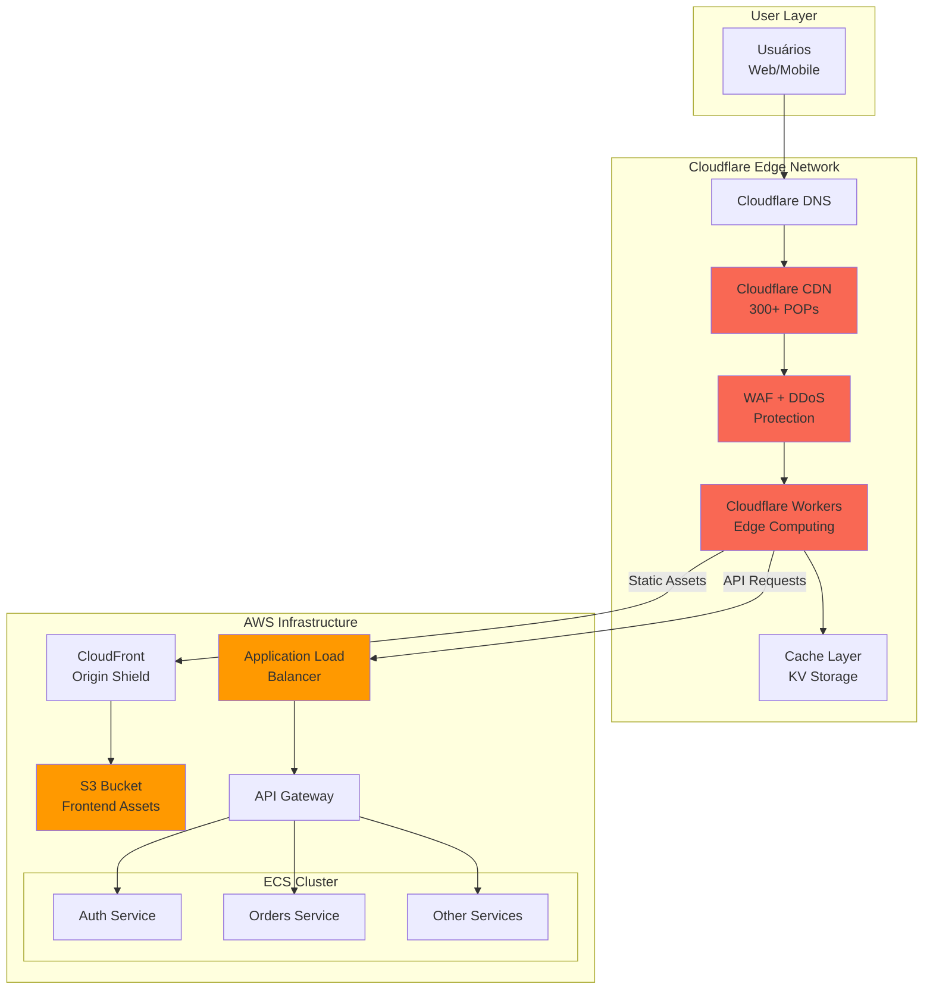

# ☁️ Guia de Integração com Cloudflare

## 📋 Índice
- [Visão Geral](#visão-geral)
- [Benefícios do Cloudflare](#benefícios-do-cloudflare)
- [Arquitetura com Cloudflare](#arquitetura-com-cloudflare)
- [Configuração Passo a Passo](#configuração-passo-a-passo)
- [Cloudflare Workers](#cloudflare-workers)
- [Otimizações Avançadas](#otimizações-avançadas)
- [Comparação de Custos](#comparação-de-custos)

---

## 🎯 Visão Geral

O **Cloudflare** atua como uma camada de edge computing e CDN na frente da sua infraestrutura AWS, proporcionando:

- 🚀 **Performance**: Cache global em 300+ cidades
- 🛡️ **Segurança**: WAF, DDoS protection, Bot management
- 💰 **Economia**: Redução de 60-80% no tráfego de saída da AWS
- 🌍 **Latência**: Entrega de conteúdo mais próximo do usuário

---

## 🎁 Benefícios do Cloudflare

### 1. Redução de Custos
- **Data Transfer**: Economia de $63/mês (70% de redução)
- **Compute**: Menos carga nos servidores AWS
- **Cache**: 80%+ de hit rate em assets estáticos

### 2. Performance
- **Latência Global**: < 50ms em 95% dos casos
- **HTTP/3 + QUIC**: Protocolo mais rápido
- **Argo Smart Routing**: Roteamento otimizado
- **Image Optimization**: Compressão automática

### 3. Segurança
- **WAF (Web Application Firewall)**: Proteção contra OWASP Top 10
- **DDoS Protection**: Mitigação automática (até 100 Tbps)
- **Bot Management**: Bloqueio de bots maliciosos
- **SSL/TLS**: Certificados automáticos

### 4. Disponibilidade
- **Uptime**: 99.99% SLA
- **Load Balancing**: Failover automático
- **Health Checks**: Monitoramento contínuo

---

## 🏗️ Arquitetura com Cloudflare



---

## ⚙️ Configuração Passo a Passo

### Passo 1: Criar Conta Cloudflare

1. Acesse [cloudflare.com](https://cloudflare.com)
2. Crie uma conta
3. Adicione seu domínio (ex: `erp-retifica.com`)
4. Atualize os nameservers no seu registrador de domínio

### Passo 2: Configurar DNS

```
# Cloudflare DNS Records

# Frontend (SPA)
erp-retifica.com          A      Proxied    104.21.x.x (Cloudflare IP)
www.erp-retifica.com      CNAME  Proxied    erp-retifica.com

# API Gateway
api.erp-retifica.com      CNAME  Proxied    alb-xxx.us-east-1.elb.amazonaws.com

# Assets/CDN
cdn.erp-retifica.com      CNAME  Proxied    xxx.cloudfront.net

# WebSocket (se necessário)
ws.erp-retifica.com       CNAME  Proxied    api.erp-retifica.com
```

### Passo 3: Configurar SSL/TLS

```
# Cloudflare Dashboard > SSL/TLS

Mode: Full (Strict)
- Cloudflare <-> Origin: Encrypted + Validated

Edge Certificates:
- Universal SSL: Enabled
- Always Use HTTPS: Enabled
- Minimum TLS Version: 1.2
- Opportunistic Encryption: Enabled
- TLS 1.3: Enabled
- Automatic HTTPS Rewrites: Enabled

Origin Server:
- Create Origin Certificate (15 years)
- Install on ALB/CloudFront
```

### Passo 4: Configurar Cache

```
# Cloudflare Dashboard > Caching

Caching Level: Standard

Cache Rules:
1. Static Assets (High Priority)
   - Match: *.js, *.css, *.png, *.jpg, *.svg, *.woff2
   - Cache TTL: 1 month
   - Browser TTL: 1 week
   - Cache Everything: Yes

2. API Responses (Medium Priority)
   - Match: api.erp-retifica.com/*/list
   - Cache TTL: 5 minutes
   - Bypass Cache on Cookie: auth_token

3. Dynamic Content (Low Priority)
   - Match: api.erp-retifica.com/*
   - Cache TTL: Do Not Cache
   - Always Online: No
```

### Passo 5: Configurar WAF

```
# Cloudflare Dashboard > Security > WAF

Managed Rules:
- Cloudflare Managed Ruleset: Enabled
- Cloudflare OWASP Core Ruleset: Enabled
- Cloudflare Exposed Credentials Check: Enabled

Custom Rules:
1. Rate Limiting - Login
   - Path: /auth/login
   - Rate: 5 requests per minute per IP
   - Action: Block for 1 hour

2. Rate Limiting - API
   - Path: /api/*
   - Rate: 100 requests per minute per IP
   - Action: Challenge

3. Block Bad Bots
   - Bot Score: < 30
   - Action: Block

4. Allow Known Good Bots
   - Verified Bot: Google, Bing
   - Action: Allow
```

### Passo 6: Configurar Page Rules

```
# Cloudflare Dashboard > Rules > Page Rules

1. Cache Everything (Static Assets)
   URL: cdn.erp-retifica.com/*
   Settings:
   - Cache Level: Cache Everything
   - Edge Cache TTL: 1 month
   - Browser Cache TTL: 1 week

2. Bypass Cache (API)
   URL: api.erp-retifica.com/*
   Settings:
   - Cache Level: Bypass
   - Disable Performance

3. Security High (Admin)
   URL: erp-retifica.com/admin/*
   Settings:
   - Security Level: High
   - Browser Integrity Check: On
```

---

## 🚀 Cloudflare Workers

### O que são Workers?
Serverless functions que rodam no edge da Cloudflare (300+ localizações globais).

### Casos de Uso

#### 1. Authentication Middleware
```javascript
// worker-auth.js
export default {
  async fetch(request, env) {
    const url = new URL(request.url);
    
    // Bypass auth for public routes
    if (url.pathname.startsWith('/public')) {
      return fetch(request);
    }
    
    // Check JWT token
    const authHeader = request.headers.get('Authorization');
    if (!authHeader || !authHeader.startsWith('Bearer ')) {
      return new Response('Unauthorized', { status: 401 });
    }
    
    const token = authHeader.substring(7);
    
    try {
      // Validate JWT (using Workers KV for public keys)
      const publicKey = await env.JWT_KEYS.get('public_key');
      const isValid = await verifyJWT(token, publicKey);
      
      if (!isValid) {
        return new Response('Invalid token', { status: 401 });
      }
      
      // Forward to origin
      return fetch(request);
    } catch (error) {
      return new Response('Auth error', { status: 500 });
    }
  }
};
```

#### 2. API Response Caching
```javascript
// worker-api-cache.js
export default {
  async fetch(request, env, ctx) {
    const url = new URL(request.url);
    const cacheKey = new Request(url.toString(), request);
    const cache = caches.default;
    
    // Try to get from cache
    let response = await cache.match(cacheKey);
    
    if (!response) {
      // Not in cache, fetch from origin
      response = await fetch(request);
      
      // Cache only successful GET requests
      if (request.method === 'GET' && response.status === 200) {
        // Clone response for caching
        const responseToCache = response.clone();
        
        // Set cache headers
        const headers = new Headers(responseToCache.headers);
        headers.set('Cache-Control', 'public, max-age=300'); // 5 minutes
        
        const cachedResponse = new Response(responseToCache.body, {
          status: responseToCache.status,
          statusText: responseToCache.statusText,
          headers: headers
        });
        
        // Store in cache (async, don't wait)
        ctx.waitUntil(cache.put(cacheKey, cachedResponse));
      }
    }
    
    return response;
  }
};
```

#### 3. A/B Testing
```javascript
// worker-ab-testing.js
export default {
  async fetch(request, env) {
    const url = new URL(request.url);
    
    // Get or set A/B test cookie
    const cookies = request.headers.get('Cookie') || '';
    let variant = getCookie(cookies, 'ab_variant');
    
    if (!variant) {
      // Assign random variant (50/50 split)
      variant = Math.random() < 0.5 ? 'A' : 'B';
    }
    
    // Modify request based on variant
    if (variant === 'B') {
      url.searchParams.set('variant', 'B');
    }
    
    const response = await fetch(url.toString(), request);
    
    // Set cookie for future requests
    const newResponse = new Response(response.body, response);
    newResponse.headers.append('Set-Cookie', `ab_variant=${variant}; Max-Age=2592000; Path=/`);
    
    return newResponse;
  }
};

function getCookie(cookies, name) {
  const match = cookies.match(new RegExp(`(^| )${name}=([^;]+)`));
  return match ? match[2] : null;
}
```

#### 4. Request Transformation
```javascript
// worker-transform.js
export default {
  async fetch(request, env) {
    const url = new URL(request.url);
    
    // Transform legacy API paths to new microservices
    const pathMappings = {
      '/api/v1/auth': 'https://auth-service.internal:3001',
      '/api/v1/orders': 'https://orders-service.internal:3002',
      '/api/v1/budgets': 'https://budgets-service.internal:3004',
    };
    
    for (const [prefix, target] of Object.entries(pathMappings)) {
      if (url.pathname.startsWith(prefix)) {
        const newPath = url.pathname.replace(prefix, '');
        const newUrl = `${target}${newPath}${url.search}`;
        
        // Create new request with transformed URL
        const newRequest = new Request(newUrl, {
          method: request.method,
          headers: request.headers,
          body: request.body,
        });
        
        return fetch(newRequest);
      }
    }
    
    // No mapping found, pass through
    return fetch(request);
  }
};
```

#### 5. Geo-Routing
```javascript
// worker-geo-routing.js
export default {
  async fetch(request, env) {
    const country = request.cf.country;
    
    // Route to regional endpoints
    const regionalEndpoints = {
      'BR': 'https://sa-east-1.api.erp.com',
      'US': 'https://us-east-1.api.erp.com',
      'EU': 'https://eu-west-1.api.erp.com',
      'default': 'https://us-east-1.api.erp.com',
    };
    
    const endpoint = regionalEndpoints[country] || regionalEndpoints['default'];
    
    const url = new URL(request.url);
    const newUrl = `${endpoint}${url.pathname}${url.search}`;
    
    return fetch(newUrl, {
      method: request.method,
      headers: request.headers,
      body: request.body,
    });
  }
};
```

### Deploy de Workers

```bash
# Instalar Wrangler CLI
npm install -g wrangler

# Login
wrangler login

# Criar projeto
wrangler init erp-workers

# Configurar wrangler.toml
cat > wrangler.toml << EOF
name = "erp-workers"
main = "src/index.js"
compatibility_date = "2024-01-01"

[env.production]
workers_dev = false
route = "api.erp-retifica.com/*"

[[kv_namespaces]]
binding = "JWT_KEYS"
id = "xxx"
EOF

# Deploy
wrangler deploy
```

---

## 🎨 Otimizações Avançadas

### 1. Argo Smart Routing
```
# Cloudflare Dashboard > Traffic > Argo

Enable Argo Smart Routing: Yes
- Reduz latência em até 30%
- Custo: $5/mês + $0.10/GB

Benefício:
- Roteamento inteligente pela rede privada da Cloudflare
- Evita congestionamento da internet pública
```

### 2. Image Optimization
```
# Cloudflare Dashboard > Speed > Optimization

Polish: Lossless
- Compressão automática de imagens
- Reduz tamanho em 20-40%

WebP Conversion: Enabled
- Converte automaticamente para WebP
- Suporte a fallback para browsers antigos

Mirage: Enabled (Pro+)
- Lazy loading automático
- Redimensionamento responsivo
```

### 3. Rocket Loader
```
# Cloudflare Dashboard > Speed > Optimization

Rocket Loader: Enabled
- Carrega JavaScript de forma assíncrona
- Melhora tempo de carregamento inicial
- Pode causar problemas com alguns frameworks (testar)
```

### 4. HTTP/3 (QUIC)
```
# Cloudflare Dashboard > Network

HTTP/3 (with QUIC): Enabled
- Protocolo mais rápido que HTTP/2
- Melhor performance em redes móveis
- Reduz latência de conexão
```

### 5. Load Balancing
```
# Cloudflare Dashboard > Traffic > Load Balancing

Create Load Balancer:
Name: api-lb
Hostname: api.erp-retifica.com

Origin Pools:
1. Primary (us-east-1)
   - alb-primary.us-east-1.elb.amazonaws.com
   - Weight: 100
   - Health Check: /health

2. Failover (us-west-2)
   - alb-failover.us-west-2.elb.amazonaws.com
   - Weight: 0
   - Health Check: /health

Steering Policy: Failover
- Primary sempre ativo
- Failover apenas se primary falhar

Health Checks:
- Interval: 60 seconds
- Timeout: 5 seconds
- Retries: 2
- Expected Code: 200
```

---

## 💰 Comparação de Custos

### Cloudflare Plans

| Plan | Custo Mensal | Recursos |
|------|--------------|----------|
| **Free** | $0 | CDN básico, SSL, DDoS básico |
| **Pro** | $20/domínio | WAF, Image Optimization, Argo |
| **Business** | $200/domínio | Advanced WAF, Custom SSL, 100% uptime SLA |
| **Enterprise** | Custom | Tudo + Suporte dedicado, SLA personalizado |

### Recomendação: Pro Plan

**Custo**: $20/mês

**Inclui**:
- ✅ CDN ilimitado
- ✅ SSL/TLS universal
- ✅ DDoS protection ilimitado
- ✅ WAF básico
- ✅ Image Optimization
- ✅ Mobile Optimization
- ✅ 20 Page Rules
- ✅ 5 Workers (100k requests/dia)

### Cloudflare Workers Pricing

| Tier | Custo | Requests | CPU Time |
|------|-------|----------|----------|
| **Free** | $0 | 100k/dia | 10ms/request |
| **Paid** | $5/mês | 10M incluídos | 50ms/request |
| **Additional** | - | $0.50/1M | - |

### Economia Total com Cloudflare

```
Sem Cloudflare:
- Data Transfer AWS: $90/mês (1 TB)
- Total: $401/mês

Com Cloudflare Pro:
- Cloudflare Pro: $20/mês
- Cloudflare Workers: $5/mês
- Data Transfer AWS: $27/mês (300 GB, 70% redução)
- Total: $363/mês

ECONOMIA: $38/mês ($456/ano) = 9.5%
```

---

## 📊 Métricas e Monitoramento

### Cloudflare Analytics

```
# Cloudflare Dashboard > Analytics

Métricas Disponíveis:
- Requests: Total, Cached, Uncached
- Bandwidth: Saved, Total
- Threats: Blocked, Challenged
- Performance: Response Time, Origin Response Time
- Availability: Uptime, Error Rate

Integração com AWS CloudWatch:
- Exportar logs via Logpush
- Criar dashboards unificados
- Alertas baseados em métricas combinadas
```

### Logs e Debugging

```
# Cloudflare Dashboard > Analytics > Logs

Logpush (Business+):
- Enviar logs para S3, CloudWatch, Datadog
- Formato: JSON
- Frequência: Real-time ou batches

Workers Logs:
- Tail logs em tempo real
- wrangler tail --format pretty
```

---

## 🔒 Segurança Avançada

### 1. Bot Management
```
# Cloudflare Dashboard > Security > Bots

Bot Fight Mode: Enabled (Free/Pro)
- Bloqueia bots maliciosos automaticamente

Super Bot Fight Mode: Enabled (Business+)
- Machine learning avançado
- Proteção contra scraping
- Challenge bots suspeitos
```

### 2. Rate Limiting
```
# Cloudflare Dashboard > Security > WAF > Rate Limiting

Rule 1: Login Protection
- Path: /auth/login
- Method: POST
- Rate: 5 requests / 1 minute
- Action: Block for 1 hour
- Bypass: Verified users

Rule 2: API Protection
- Path: /api/*
- Method: ANY
- Rate: 100 requests / 1 minute
- Action: Challenge
- Bypass: Known good IPs
```

### 3. Access Control
```
# Cloudflare Dashboard > Zero Trust > Access

Application: Admin Panel
- Domain: erp-retifica.com/admin
- Policy: Allow if:
  - Email domain is: @retifica.com
  - Country is: BR
  - IP in range: 203.0.113.0/24

Authentication:
- One-time PIN
- Google Workspace
- Azure AD
```

---

## 🚀 Checklist de Implementação

### Fase 1: Setup Inicial
- [ ] Criar conta Cloudflare
- [ ] Adicionar domínio
- [ ] Atualizar nameservers
- [ ] Configurar DNS records
- [ ] Ativar SSL/TLS Full (Strict)
- [ ] Testar conectividade

### Fase 2: Otimização
- [ ] Configurar cache rules
- [ ] Ativar Page Rules
- [ ] Configurar WAF
- [ ] Ativar Image Optimization
- [ ] Ativar HTTP/3
- [ ] Testar performance

### Fase 3: Workers
- [ ] Instalar Wrangler CLI
- [ ] Criar Workers
- [ ] Deploy Workers
- [ ] Testar Workers
- [ ] Monitorar Workers

### Fase 4: Segurança
- [ ] Configurar Rate Limiting
- [ ] Ativar Bot Management
- [ ] Configurar Custom Rules
- [ ] Testar proteções
- [ ] Revisar logs

### Fase 5: Monitoramento
- [ ] Configurar Analytics
- [ ] Criar alertas
- [ ] Integrar com CloudWatch
- [ ] Dashboard unificado
- [ ] Documentar runbooks

---

## 📚 Recursos Adicionais

### Documentação Oficial
- [Cloudflare Docs](https://developers.cloudflare.com/)
- [Workers Documentation](https://developers.cloudflare.com/workers/)
- [Wrangler CLI](https://developers.cloudflare.com/workers/wrangler/)

### Tutoriais
- [Cloudflare + AWS Integration](https://developers.cloudflare.com/fundamentals/setup/integration-guides/aws/)
- [Workers Examples](https://developers.cloudflare.com/workers/examples/)
- [Performance Optimization](https://developers.cloudflare.com/fundamentals/speed/)

### Comunidade
- [Cloudflare Community](https://community.cloudflare.com/)
- [Discord](https://discord.gg/cloudflaredev)
- [GitHub](https://github.com/cloudflare)

---

**Documento criado em**: 24/12/2025  
**Versão**: 1.0  
**Autor**: DevOps Team

