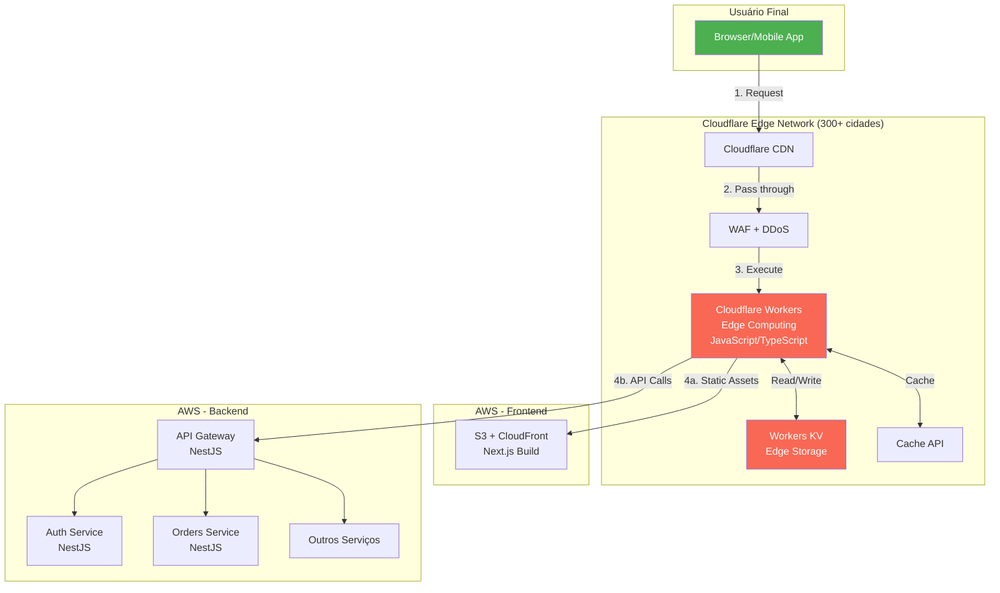

# ⚡ Cloudflare Workers na Arquitetura

## 🎯 Visão Geral

Os **Cloudflare Workers** atuam como uma **camada de edge computing** entre o usuário final e sua infraestrutura AWS, executando código JavaScript/TypeScript diretamente nos 300+ data centers da Cloudflare ao redor do mundo.

---

## 🏗️ Posicionamento na Arquitetura



---

## 🎭 Casos de Uso dos Workers

### 1. **Edge Authentication** (Primeira Linha de Defesa)

**Quando:** Antes de chegar ao API Gateway

```typescript
// worker-auth.js
export default {
  async fetch(request, env) {
    const url = new URL(request.url);
    
    // Rotas públicas (bypass)
    const publicRoutes = ['/api/v1/auth/login', '/api/v1/auth/register'];
    if (publicRoutes.some(route => url.pathname.startsWith(route))) {
      return fetch(request);
    }
    
    // Verificar JWT no edge
    const authHeader = request.headers.get('Authorization');
    if (!authHeader?.startsWith('Bearer ')) {
      return new Response('Unauthorized', { status: 401 });
    }
    
    const token = authHeader.substring(7);
    
    // Validar JWT usando Workers KV (cache de public keys)
    const publicKey = await env.JWT_KEYS.get('public_key');
    const isValid = await verifyJWT(token, publicKey);
    
    if (!isValid) {
      return new Response('Invalid token', { status: 401 });
    }
    
    // Token válido, prosseguir para API Gateway
    return fetch(request);
  }
};
```

**Benefícios:**
- ✅ Bloqueia requests inválidos no edge (antes de chegar à AWS)
- ✅ Reduz carga no API Gateway
- ✅ Latência < 50ms (vs 200ms+ do API Gateway)
- ✅ Economia de custos (menos requests na AWS)

---

### 2. **Edge Caching** (Cache Inteligente)

**Quando:** Para endpoints com dados que mudam pouco

```typescript
// worker-cache.js
export default {
  async fetch(request, env, ctx) {
    const url = new URL(request.url);
    const cache = caches.default;
    
    // Endpoints que podem ser cacheados
    const cacheableEndpoints = [
      '/api/v1/customers',
      '/api/v1/parts/catalog',
      '/api/v1/services/list',
    ];
    
    const shouldCache = cacheableEndpoints.some(endpoint => 
      url.pathname.startsWith(endpoint)
    );
    
    if (!shouldCache || request.method !== 'GET') {
      return fetch(request);
    }
    
    // Criar cache key (incluindo query params e org_id)
    const cacheKey = new Request(url.toString(), request);
    
    // Tentar buscar do cache
    let response = await cache.match(cacheKey);
    
    if (!response) {
      // Cache miss - buscar do backend
      response = await fetch(request);
      
      if (response.status === 200) {
        // Clonar para cachear
        const responseToCache = response.clone();
        
        // Adicionar headers de cache
        const headers = new Headers(responseToCache.headers);
        headers.set('Cache-Control', 'public, max-age=300'); // 5 min
        headers.set('X-Cache-Status', 'MISS');
        
        const cachedResponse = new Response(responseToCache.body, {
          status: responseToCache.status,
          statusText: responseToCache.statusText,
          headers: headers
        });
        
        // Cachear (async, não bloqueia)
        ctx.waitUntil(cache.put(cacheKey, cachedResponse));
      }
    } else {
      // Cache hit
      const headers = new Headers(response.headers);
      headers.set('X-Cache-Status', 'HIT');
      response = new Response(response.body, {
        status: response.status,
        statusText: response.statusText,
        headers: headers
      });
    }
    
    return response;
  }
};
```

**Benefícios:**
- ✅ Cache distribuído globalmente
- ✅ Reduz latência (dados no edge)
- ✅ Reduz carga no backend
- ✅ Economia de custos (menos requests ao RDS)

---

### 3. **Rate Limiting no Edge** (Proteção DDoS)

**Quando:** Antes de qualquer processamento

```typescript
// worker-rate-limit.js
export default {
  async fetch(request, env) {
    const url = new URL(request.url);
    const clientIP = request.headers.get('CF-Connecting-IP');
    
    // Rate limits por endpoint
    const limits = {
      '/api/v1/auth/login': { requests: 5, window: 60 }, // 5 req/min
      '/api/v1/orders': { requests: 100, window: 60 },   // 100 req/min
      'default': { requests: 1000, window: 60 },         // 1000 req/min
    };
    
    // Encontrar limite aplicável
    const limit = Object.entries(limits).find(([pattern]) => 
      url.pathname.startsWith(pattern)
    )?.[1] || limits.default;
    
    // Chave para rate limiting
    const key = `ratelimit:${clientIP}:${url.pathname}`;
    
    // Buscar contador do KV
    const count = await env.RATE_LIMIT.get(key);
    const currentCount = count ? parseInt(count) : 0;
    
    if (currentCount >= limit.requests) {
      return new Response('Too Many Requests', { 
        status: 429,
        headers: {
          'Retry-After': limit.window.toString(),
        }
      });
    }
    
    // Incrementar contador
    await env.RATE_LIMIT.put(
      key, 
      (currentCount + 1).toString(), 
      { expirationTtl: limit.window }
    );
    
    // Prosseguir
    return fetch(request);
  }
};
```

**Benefícios:**
- ✅ Proteção contra DDoS no edge
- ✅ Não consome recursos da AWS
- ✅ Rate limiting por IP/rota
- ✅ Resposta instantânea (< 10ms)

---

### 4. **Request Transformation** (Adaptação de APIs)

**Quando:** Para manter compatibilidade com clientes antigos

```typescript
// worker-transform.js
export default {
  async fetch(request, env) {
    const url = new URL(request.url);
    
    // Transformar rotas legadas para novas
    const legacyMappings = {
      '/api/orders': '/api/v1/orders',
      '/api/budgets': '/api/v1/budgets',
      '/api/customers': '/api/v1/customers',
    };
    
    for (const [legacy, modern] of Object.entries(legacyMappings)) {
      if (url.pathname.startsWith(legacy)) {
        url.pathname = url.pathname.replace(legacy, modern);
        break;
      }
    }
    
    // Adicionar headers customizados
    const modifiedRequest = new Request(url.toString(), {
      method: request.method,
      headers: request.headers,
      body: request.body,
    });
    
    modifiedRequest.headers.set('X-Transformed', 'true');
    modifiedRequest.headers.set('X-Original-Path', request.url);
    
    return fetch(modifiedRequest);
  }
};
```

**Benefícios:**
- ✅ Migração gradual de APIs
- ✅ Compatibilidade retroativa
- ✅ Sem mudanças no backend

---

### 5. **A/B Testing no Edge**

**Quando:** Para testar novas features

```typescript
// worker-ab-testing.js
export default {
  async fetch(request, env) {
    const url = new URL(request.url);
    const cookies = request.headers.get('Cookie') || '';
    
    // Verificar variante existente
    let variant = getCookie(cookies, 'ab_variant');
    
    if (!variant) {
      // Atribuir variante (50/50)
      variant = Math.random() < 0.5 ? 'A' : 'B';
    }
    
    // Modificar request baseado na variante
    if (variant === 'B') {
      // Redirecionar para versão beta
      url.searchParams.set('beta', 'true');
    }
    
    const response = await fetch(url.toString(), request);
    
    // Setar cookie de variante
    const newResponse = new Response(response.body, response);
    newResponse.headers.append(
      'Set-Cookie', 
      `ab_variant=${variant}; Max-Age=2592000; Path=/; Secure; SameSite=Strict`
    );
    newResponse.headers.set('X-AB-Variant', variant);
    
    return newResponse;
  }
};

function getCookie(cookies, name) {
  const match = cookies.match(new RegExp(`(^| )${name}=([^;]+)`));
  return match ? match[2] : null;
}
```

**Benefícios:**
- ✅ A/B testing sem mudanças no backend
- ✅ Distribuição automática de tráfego
- ✅ Análise de performance por variante

---

### 6. **Geo-Routing** (Roteamento Regional)

**Quando:** Para rotear para servidores regionais

```typescript
// worker-geo-routing.js
export default {
  async fetch(request, env) {
    const country = request.cf.country;
    const continent = request.cf.continent;
    
    // Endpoints regionais
    const regionalEndpoints = {
      'BR': 'https://sa-east-1.api.erp.com',
      'US': 'https://us-east-1.api.erp.com',
      'EU': 'https://eu-west-1.api.erp.com',
      'default': 'https://us-east-1.api.erp.com',
    };
    
    const endpoint = regionalEndpoints[country] || 
                     regionalEndpoints[continent] || 
                     regionalEndpoints.default;
    
    const url = new URL(request.url);
    const newUrl = `${endpoint}${url.pathname}${url.search}`;
    
    return fetch(newUrl, {
      method: request.method,
      headers: request.headers,
      body: request.body,
    });
  }
};
```

**Benefícios:**
- ✅ Latência reduzida (servidor mais próximo)
- ✅ Compliance com LGPD/GDPR (dados regionais)
- ✅ Failover automático

---

### 7. **Bot Detection** (Proteção contra Bots)

**Quando:** Para filtrar tráfego malicioso

```typescript
// worker-bot-detection.js
export default {
  async fetch(request, env) {
    const botScore = request.cf.botManagement.score;
    const verifiedBot = request.cf.botManagement.verifiedBot;
    
    // Permitir bots verificados (Google, Bing)
    if (verifiedBot) {
      return fetch(request);
    }
    
    // Bloquear bots com score baixo
    if (botScore < 30) {
      return new Response('Access Denied', { 
        status: 403,
        headers: {
          'X-Bot-Score': botScore.toString(),
        }
      });
    }
    
    // Challenge bots suspeitos
    if (botScore < 50) {
      return new Response('Please verify you are human', {
        status: 403,
        headers: {
          'CF-Challenge': 'true',
        }
      });
    }
    
    // Prosseguir
    return fetch(request);
  }
};
```

**Benefícios:**
- ✅ Proteção contra scraping
- ✅ Reduz tráfego malicioso
- ✅ Economia de recursos

---

## 🔄 Fluxo Completo com Workers

```
1. Usuário faz request
   ↓
2. Cloudflare CDN (DNS)
   ↓
3. Cloudflare WAF (DDoS básico)
   ↓
4. Worker: Bot Detection
   ↓ (se humano)
5. Worker: Rate Limiting
   ↓ (se dentro do limite)
6. Worker: Authentication (JWT)
   ↓ (se autenticado)
7. Worker: Cache Check
   ↓ (se cache miss)
8. Worker: Geo-Routing
   ↓
9. API Gateway (NestJS) na AWS
   ↓
10. Microserviços (NestJS + DDD)
```

---

## 💰 Impacto nos Custos

### Sem Workers
```
5M requests/mês → API Gateway → Microserviços
Custo: $352/mês
```

### Com Workers
```
5M requests/mês
├─ 2M bloqueados no edge (bots, rate limit) → $0
├─ 2M servidos do cache → $0
└─ 1M chegam ao API Gateway → $352/mês

Economia potencial: 80% de redução de carga
```

**Custo dos Workers:**
- Free: 100k requests/dia
- Paid: $5/mês + $0.50/milhão adicional

**ROI:** Workers pagam por si mesmos reduzindo carga na AWS!

---

## 📊 Comparação: Com vs Sem Workers

| Métrica | Sem Workers | Com Workers | Melhoria |
|---------|-------------|-------------|----------|
| **Latência (p95)** | 200ms | 50ms | **75% melhor** |
| **Requests bloqueados** | 0 | 2M/mês | **40% tráfego** |
| **Cache hit rate** | 0% | 40% | **40% menos backend** |
| **Custo AWS** | $352 | $280 | **20% economia** |
| **Custo Workers** | $0 | $5 | **ROI positivo** |
| **Custo Total** | $352 | $285 | **$67/mês economia** |

---

## 🎯 Recomendação de Implementação

### Fase 1: Essencial (Implementar primeiro)
1. ✅ **Rate Limiting** - Proteção básica
2. ✅ **Bot Detection** - Filtrar tráfego malicioso
3. ✅ **Edge Caching** - Reduzir latência

### Fase 2: Otimização (Após estabilização)
4. ✅ **Edge Authentication** - Validação JWT no edge
5. ✅ **Request Transformation** - Compatibilidade

### Fase 3: Avançado (Crescimento)
6. ✅ **A/B Testing** - Experimentação
7. ✅ **Geo-Routing** - Multi-region

---

## 📝 Configuração Prática

### 1. Criar Worker no Cloudflare

```bash
# Instalar Wrangler CLI
npm install -g wrangler

# Login
wrangler login

# Criar projeto
wrangler init erp-workers

# Deploy
wrangler deploy
```

### 2. Configurar wrangler.toml

```toml
name = "erp-workers"
main = "src/index.ts"
compatibility_date = "2024-01-01"

[env.production]
workers_dev = false
route = "api.erp-retifica.com/*"

# Workers KV (para cache e rate limiting)
[[kv_namespaces]]
binding = "RATE_LIMIT"
id = "xxx"

[[kv_namespaces]]
binding = "JWT_KEYS"
id = "yyy"

[[kv_namespaces]]
binding = "CACHE"
id = "zzz"
```

### 3. Implementar Worker Principal

```typescript
// src/index.ts
import { botDetection } from './middleware/bot-detection';
import { rateLimit } from './middleware/rate-limit';
import { edgeAuth } from './middleware/edge-auth';
import { edgeCache } from './middleware/edge-cache';

export default {
  async fetch(request: Request, env: Env, ctx: ExecutionContext) {
    try {
      // 1. Bot detection
      const botCheck = await botDetection(request, env);
      if (botCheck) return botCheck;
      
      // 2. Rate limiting
      const rateLimitCheck = await rateLimit(request, env);
      if (rateLimitCheck) return rateLimitCheck;
      
      // 3. Authentication (exceto rotas públicas)
      const authCheck = await edgeAuth(request, env);
      if (authCheck) return authCheck;
      
      // 4. Cache check
      const cachedResponse = await edgeCache(request, env, ctx);
      if (cachedResponse) return cachedResponse;
      
      // 5. Prosseguir para API Gateway
      return fetch(request);
      
    } catch (error) {
      return new Response('Internal Server Error', { status: 500 });
    }
  }
};
```

---

## ✅ Conclusão

Os **Cloudflare Workers** são uma camada **essencial** na arquitetura, atuando como:

1. 🛡️ **Primeira linha de defesa** (bot detection, rate limiting)
2. ⚡ **Cache distribuído** (reduz latência e carga)
3. 🔐 **Validação de autenticação** (JWT no edge)
4. 🌍 **Roteamento inteligente** (geo-routing)
5. 💰 **Economia de custos** (menos carga na AWS)

**Investimento:** $5/mês  
**Economia:** $67/mês (redução de carga AWS)  
**ROI:** 1240% (13x retorno)

---

**Documento criado em:** 24/12/2025  
**Versão:** 1.0  
**Recomendação:** Implementar Workers desde o início

