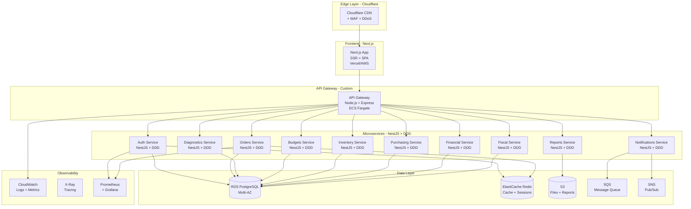

# 🚀 Arquitetura de Microserviços V2 - Stack Moderna

## 📋 Índice
- [Stack Tecnológico](#stack-tecnológico)
- [Arquitetura Completa](#arquitetura-completa)
- [Backend: NestJS + DDD](#backend-nestjs--ddd)
- [Frontend: Next.js](#frontend-nextjs)
- [API Gateway Customizado](#api-gateway-customizado)
- [Estrutura de Projeto](#estrutura-de-projeto)
- [Comparação de Custos](#comparação-de-custos)
- [Implementação Prática](#implementação-prática)

---

## 🎯 Stack Tecnológico

### Backend: NestJS + DDD (Domain-Driven Design)
- **Framework**: NestJS (TypeScript)
- **Arquitetura**: DDD (Domain-Driven Design)
- **ORM**: Prisma ou TypeORM
- **Validação**: class-validator + class-transformer
- **Documentação**: Swagger/OpenAPI automático
- **Testes**: Jest + Supertest

### Frontend: Next.js (SSR + SPA)
- **Framework**: Next.js 14+ (App Router)
- **Rendering**: SSR (Server-Side Rendering) + CSR (Client-Side)
- **Styling**: Tailwind CSS + shadcn/ui
- **State**: React Query (TanStack Query) + Zustand
- **Forms**: React Hook Form + Zod
- **Autenticação**: NextAuth.js

### API Gateway: Customizado (Node.js)
- **Framework**: Express ou Fastify
- **Features**: 
  - Rate limiting
  - Authentication/Authorization
  - Request/Response transformation
  - Load balancing
  - Circuit breaker
  - Logging e Metrics

---

## 🏗️ Arquitetura Completa



---

## 🎯 Backend: NestJS + DDD

### Por que NestJS?

1. ✅ **TypeScript nativo** - Type safety completo
2. ✅ **Arquitetura modular** - Perfeito para microserviços
3. ✅ **DDD-friendly** - Suporte nativo a camadas
4. ✅ **Dependency Injection** - IoC container robusto
5. ✅ **Swagger automático** - Documentação gerada
6. ✅ **Microservices toolkit** - gRPC, TCP, Redis, NATS
7. ✅ **Testing built-in** - Jest integrado
8. ✅ **Comunidade ativa** - 60k+ stars no GitHub

### Estrutura DDD com NestJS

```
auth-service/
├── src/
│   ├── main.ts
│   ├── app.module.ts
│   │
│   ├── domain/                    # Camada de Domínio (Core)
│   │   ├── entities/
│   │   │   ├── user.entity.ts
│   │   │   ├── organization.entity.ts
│   │   │   └── session.entity.ts
│   │   ├── value-objects/
│   │   │   ├── email.vo.ts
│   │   │   ├── password.vo.ts
│   │   │   └── jwt-token.vo.ts
│   │   ├── repositories/          # Interfaces (Ports)
│   │   │   ├── user.repository.interface.ts
│   │   │   └── organization.repository.interface.ts
│   │   ├── services/              # Domain Services
│   │   │   ├── password-hasher.service.ts
│   │   │   └── token-generator.service.ts
│   │   └── events/
│   │       ├── user-created.event.ts
│   │       └── user-logged-in.event.ts
│   │
│   ├── application/               # Camada de Aplicação (Use Cases)
│   │   ├── use-cases/
│   │   │   ├── login/
│   │   │   │   ├── login.use-case.ts
│   │   │   │   ├── login.dto.ts
│   │   │   │   └── login.use-case.spec.ts
│   │   │   ├── register/
│   │   │   │   ├── register.use-case.ts
│   │   │   │   └── register.dto.ts
│   │   │   ├── validate-token/
│   │   │   │   └── validate-token.use-case.ts
│   │   │   └── refresh-token/
│   │   │       └── refresh-token.use-case.ts
│   │   └── ports/
│   │       ├── cache.port.ts
│   │       └── event-bus.port.ts
│   │
│   ├── infrastructure/            # Camada de Infraestrutura (Adapters)
│   │   ├── database/
│   │   │   ├── prisma/
│   │   │   │   ├── schema.prisma
│   │   │   │   └── prisma.service.ts
│   │   │   └── repositories/      # Implementações
│   │   │       ├── user.repository.ts
│   │   │       └── organization.repository.ts
│   │   ├── cache/
│   │   │   └── redis-cache.adapter.ts
│   │   ├── messaging/
│   │   │   ├── sqs-event-bus.adapter.ts
│   │   │   └── sns-publisher.adapter.ts
│   │   └── external-services/
│   │       └── email.service.ts
│   │
│   ├── presentation/              # Camada de Apresentação (Controllers)
│   │   ├── http/
│   │   │   ├── controllers/
│   │   │   │   ├── auth.controller.ts
│   │   │   │   └── health.controller.ts
│   │   │   ├── middlewares/
│   │   │   │   ├── auth.middleware.ts
│   │   │   │   └── rate-limit.middleware.ts
│   │   │   ├── guards/
│   │   │   │   ├── jwt-auth.guard.ts
│   │   │   │   └── roles.guard.ts
│   │   │   ├── decorators/
│   │   │   │   ├── current-user.decorator.ts
│   │   │   │   └── roles.decorator.ts
│   │   │   └── filters/
│   │   │       └── http-exception.filter.ts
│   │   └── grpc/                  # Opcional: gRPC
│   │       └── auth.proto
│   │
│   ├── shared/                    # Código compartilhado
│   │   ├── constants/
│   │   ├── utils/
│   │   ├── types/
│   │   └── exceptions/
│   │       ├── domain.exception.ts
│   │       └── application.exception.ts
│   │
│   └── config/
│       ├── database.config.ts
│       ├── redis.config.ts
│       ├── jwt.config.ts
│       └── app.config.ts
│
├── test/
│   ├── unit/
│   ├── integration/
│   └── e2e/
│
├── prisma/
│   └── schema.prisma
│
├── Dockerfile
├── docker-compose.yml
├── nest-cli.json
├── package.json
└── tsconfig.json
```

### Exemplo: Auth Service com NestJS + DDD

#### 1. Domain Entity

```typescript
// src/domain/entities/user.entity.ts
import { Email } from '../value-objects/email.vo';
import { Password } from '../value-objects/password.vo';

export class User {
  constructor(
    public readonly id: string,
    public readonly organizationId: string,
    public readonly email: Email,
    private password: Password,
    public readonly name: string,
    public readonly isActive: boolean,
    public readonly createdAt: Date,
  ) {}

  static create(
    organizationId: string,
    email: string,
    password: string,
    name: string,
  ): User {
    return new User(
      crypto.randomUUID(),
      organizationId,
      Email.create(email),
      Password.create(password),
      name,
      true,
      new Date(),
    );
  }

  validatePassword(plainPassword: string): boolean {
    return this.password.compare(plainPassword);
  }

  changePassword(newPassword: string): void {
    this.password = Password.create(newPassword);
  }

  deactivate(): void {
    (this as any).isActive = false;
  }
}
```

#### 2. Value Object

```typescript
// src/domain/value-objects/email.vo.ts
export class Email {
  private constructor(private readonly value: string) {
    this.validate();
  }

  static create(email: string): Email {
    return new Email(email.toLowerCase().trim());
  }

  private validate(): void {
    const emailRegex = /^[^\s@]+@[^\s@]+\.[^\s@]+$/;
    if (!emailRegex.test(this.value)) {
      throw new Error('Invalid email format');
    }
  }

  getValue(): string {
    return this.value;
  }

  equals(other: Email): boolean {
    return this.value === other.value;
  }
}
```

#### 3. Repository Interface (Port)

```typescript
// src/domain/repositories/user.repository.interface.ts
import { User } from '../entities/user.entity';

export interface IUserRepository {
  findById(id: string): Promise<User | null>;
  findByEmail(email: string): Promise<User | null>;
  findByOrganization(organizationId: string): Promise<User[]>;
  save(user: User): Promise<User>;
  update(user: User): Promise<User>;
  delete(id: string): Promise<void>;
}

export const USER_REPOSITORY = Symbol('USER_REPOSITORY');
```

#### 4. Use Case

```typescript
// src/application/use-cases/login/login.use-case.ts
import { Injectable, Inject, UnauthorizedException } from '@nestjs/common';
import { IUserRepository, USER_REPOSITORY } from '../../../domain/repositories/user.repository.interface';
import { ICachePort, CACHE_PORT } from '../../ports/cache.port';
import { JwtService } from '@nestjs/jwt';
import { LoginDto } from './login.dto';

@Injectable()
export class LoginUseCase {
  constructor(
    @Inject(USER_REPOSITORY)
    private readonly userRepository: IUserRepository,
    @Inject(CACHE_PORT)
    private readonly cache: ICachePort,
    private readonly jwtService: JwtService,
  ) {}

  async execute(dto: LoginDto): Promise<{ token: string; user: any }> {
    // 1. Buscar usuário
    const user = await this.userRepository.findByEmail(dto.email);
    if (!user) {
      throw new UnauthorizedException('Invalid credentials');
    }

    // 2. Validar senha
    const isPasswordValid = user.validatePassword(dto.password);
    if (!isPasswordValid) {
      throw new UnauthorizedException('Invalid credentials');
    }

    // 3. Gerar token JWT
    const payload = {
      sub: user.id,
      organizationId: user.organizationId,
      email: user.email.getValue(),
    };
    const token = this.jwtService.sign(payload);

    // 4. Cachear sessão
    await this.cache.set(
      `session:${user.id}`,
      { userId: user.id, organizationId: user.organizationId },
      86400, // 24h
    );

    // 5. Retornar resultado
    return {
      token,
      user: {
        id: user.id,
        email: user.email.getValue(),
        name: user.name,
        organizationId: user.organizationId,
      },
    };
  }
}
```

#### 5. Repository Implementation (Adapter)

```typescript
// src/infrastructure/database/repositories/user.repository.ts
import { Injectable } from '@nestjs/common';
import { PrismaService } from '../prisma/prisma.service';
import { IUserRepository } from '../../../domain/repositories/user.repository.interface';
import { User } from '../../../domain/entities/user.entity';
import { Email } from '../../../domain/value-objects/email.vo';
import { Password } from '../../../domain/value-objects/password.vo';

@Injectable()
export class UserRepository implements IUserRepository {
  constructor(private readonly prisma: PrismaService) {}

  async findById(id: string): Promise<User | null> {
    const data = await this.prisma.user.findUnique({ where: { id } });
    return data ? this.toDomain(data) : null;
  }

  async findByEmail(email: string): Promise<User | null> {
    const data = await this.prisma.user.findUnique({ where: { email } });
    return data ? this.toDomain(data) : null;
  }

  async findByOrganization(organizationId: string): Promise<User[]> {
    const data = await this.prisma.user.findMany({
      where: { organizationId },
    });
    return data.map(this.toDomain);
  }

  async save(user: User): Promise<User> {
    const data = await this.prisma.user.create({
      data: this.toPersistence(user),
    });
    return this.toDomain(data);
  }

  async update(user: User): Promise<User> {
    const data = await this.prisma.user.update({
      where: { id: user.id },
      data: this.toPersistence(user),
    });
    return this.toDomain(data);
  }

  async delete(id: string): Promise<void> {
    await this.prisma.user.delete({ where: { id } });
  }

  private toDomain(raw: any): User {
    return new User(
      raw.id,
      raw.organizationId,
      Email.create(raw.email),
      Password.fromHash(raw.passwordHash),
      raw.name,
      raw.isActive,
      raw.createdAt,
    );
  }

  private toPersistence(user: User): any {
    return {
      id: user.id,
      organizationId: user.organizationId,
      email: user.email.getValue(),
      passwordHash: (user as any).password.getHash(),
      name: user.name,
      isActive: user.isActive,
      createdAt: user.createdAt,
    };
  }
}
```

#### 6. Controller

```typescript
// src/presentation/http/controllers/auth.controller.ts
import { Controller, Post, Body, UseGuards, Get } from '@nestjs/common';
import { ApiTags, ApiOperation, ApiResponse } from '@nestjs/swagger';
import { LoginUseCase } from '../../../application/use-cases/login/login.use-case';
import { LoginDto } from '../../../application/use-cases/login/login.dto';
import { JwtAuthGuard } from '../guards/jwt-auth.guard';
import { CurrentUser } from '../decorators/current-user.decorator';

@ApiTags('Authentication')
@Controller('auth')
export class AuthController {
  constructor(private readonly loginUseCase: LoginUseCase) {}

  @Post('login')
  @ApiOperation({ summary: 'User login' })
  @ApiResponse({ status: 200, description: 'Login successful' })
  @ApiResponse({ status: 401, description: 'Invalid credentials' })
  async login(@Body() dto: LoginDto) {
    return this.loginUseCase.execute(dto);
  }

  @Get('me')
  @UseGuards(JwtAuthGuard)
  @ApiOperation({ summary: 'Get current user' })
  async getCurrentUser(@CurrentUser() user: any) {
    return user;
  }
}
```

#### 7. Module Configuration

```typescript
// src/app.module.ts
import { Module } from '@nestjs/common';
import { ConfigModule } from '@nestjs/config';
import { JwtModule } from '@nestjs/jwt';
import { AuthController } from './presentation/http/controllers/auth.controller';
import { LoginUseCase } from './application/use-cases/login/login.use-case';
import { UserRepository } from './infrastructure/database/repositories/user.repository';
import { PrismaService } from './infrastructure/database/prisma/prisma.service';
import { RedisCacheAdapter } from './infrastructure/cache/redis-cache.adapter';
import { USER_REPOSITORY } from './domain/repositories/user.repository.interface';
import { CACHE_PORT } from './application/ports/cache.port';

@Module({
  imports: [
    ConfigModule.forRoot({ isGlobal: true }),
    JwtModule.register({
      secret: process.env.JWT_SECRET,
      signOptions: { expiresIn: '24h' },
    }),
  ],
  controllers: [AuthController],
  providers: [
    PrismaService,
    LoginUseCase,
    {
      provide: USER_REPOSITORY,
      useClass: UserRepository,
    },
    {
      provide: CACHE_PORT,
      useClass: RedisCacheAdapter,
    },
  ],
})
export class AppModule {}
```

---

## 🌐 Frontend: Next.js (SSR + SPA)

### Por que Next.js?

1. ✅ **SSR + SSG + ISR** - Flexibilidade de rendering
2. ✅ **SEO otimizado** - Melhor indexação
3. ✅ **Performance** - Automatic code splitting
4. ✅ **App Router** - Layouts aninhados
5. ✅ **Server Components** - Menos JavaScript no cliente
6. ✅ **API Routes** - Backend integrado (BFF pattern)
7. ✅ **Image Optimization** - Automático
8. ✅ **TypeScript** - Suporte nativo

### Estrutura Next.js

```
frontend/
├── src/
│   ├── app/                       # App Router (Next.js 14+)
│   │   ├── layout.tsx             # Root layout
│   │   ├── page.tsx               # Home page
│   │   ├── loading.tsx            # Loading UI
│   │   ├── error.tsx              # Error UI
│   │   │
│   │   ├── (auth)/                # Route group
│   │   │   ├── login/
│   │   │   │   └── page.tsx
│   │   │   └── register/
│   │   │       └── page.tsx
│   │   │
│   │   ├── (dashboard)/           # Protected routes
│   │   │   ├── layout.tsx
│   │   │   ├── dashboard/
│   │   │   │   └── page.tsx
│   │   │   ├── orders/
│   │   │   │   ├── page.tsx
│   │   │   │   ├── [id]/
│   │   │   │   │   └── page.tsx
│   │   │   │   └── new/
│   │   │   │       └── page.tsx
│   │   │   ├── budgets/
│   │   │   │   └── page.tsx
│   │   │   └── inventory/
│   │   │       └── page.tsx
│   │   │
│   │   └── api/                   # API Routes (BFF)
│   │       ├── auth/
│   │       │   └── [...nextauth]/
│   │       │       └── route.ts
│   │       └── proxy/
│   │           └── [...path]/
│   │               └── route.ts
│   │
│   ├── components/                # React Components
│   │   ├── ui/                    # shadcn/ui components
│   │   │   ├── button.tsx
│   │   │   ├── card.tsx
│   │   │   └── ...
│   │   ├── features/              # Feature components
│   │   │   ├── orders/
│   │   │   │   ├── OrderList.tsx
│   │   │   │   ├── OrderForm.tsx
│   │   │   │   └── OrderDetails.tsx
│   │   │   ├── budgets/
│   │   │   └── inventory/
│   │   └── layouts/
│   │       ├── Sidebar.tsx
│   │       ├── Header.tsx
│   │       └── Footer.tsx
│   │
│   ├── lib/                       # Utilities
│   │   ├── api-client.ts          # API client
│   │   ├── auth.ts                # Auth helpers
│   │   ├── utils.ts               # Utilities
│   │   └── validations.ts         # Zod schemas
│   │
│   ├── hooks/                     # Custom hooks
│   │   ├── useOrders.ts
│   │   ├── useBudgets.ts
│   │   └── useAuth.ts
│   │
│   ├── stores/                    # Zustand stores
│   │   ├── authStore.ts
│   │   └── uiStore.ts
│   │
│   ├── types/                     # TypeScript types
│   │   ├── api.ts
│   │   ├── entities.ts
│   │   └── dtos.ts
│   │
│   └── styles/
│       └── globals.css
│
├── public/
│   ├── images/
│   └── icons/
│
├── next.config.js
├── tailwind.config.ts
├── tsconfig.json
└── package.json
```

### Exemplo: Next.js com SSR

```typescript
// src/app/(dashboard)/orders/page.tsx
import { Suspense } from 'react';
import { OrderList } from '@/components/features/orders/OrderList';
import { OrderListSkeleton } from '@/components/features/orders/OrderListSkeleton';

// Server Component (SSR)
async function getOrders() {
  const res = await fetch('http://api-gateway:8000/api/v1/orders', {
    cache: 'no-store', // Sempre buscar dados frescos
    headers: {
      Authorization: `Bearer ${getServerSideToken()}`,
    },
  });

  if (!res.ok) throw new Error('Failed to fetch orders');
  return res.json();
}

export default async function OrdersPage() {
  const orders = await getOrders();

  return (
    <div className="container mx-auto py-8">
      <h1 className="text-3xl font-bold mb-6">Ordens de Serviço</h1>
      
      <Suspense fallback={<OrderListSkeleton />}>
        <OrderList initialOrders={orders} />
      </Suspense>
    </div>
  );
}
```

```typescript
// src/components/features/orders/OrderList.tsx
'use client';

import { useState } from 'react';
import { useQuery } from '@tanstack/react-query';
import { apiClient } from '@/lib/api-client';
import { OrderCard } from './OrderCard';

export function OrderList({ initialOrders }: { initialOrders: any[] }) {
  const [filters, setFilters] = useState({});

  // Client-side data fetching com React Query
  const { data: orders, isLoading } = useQuery({
    queryKey: ['orders', filters],
    queryFn: () => apiClient.get('/orders', { params: filters }),
    initialData: initialOrders,
  });

  return (
    <div className="grid grid-cols-1 md:grid-cols-2 lg:grid-cols-3 gap-4">
      {orders.map((order) => (
        <OrderCard key={order.id} order={order} />
      ))}
    </div>
  );
}
```

---

## 🌉 API Gateway Customizado

### Por que Gateway Customizado?

1. ✅ **Controle total** - Sem limitações de vendor
2. ✅ **Custo zero** - Sem cobrança por request
3. ✅ **Flexibilidade** - Lógica customizada
4. ✅ **Performance** - Otimizado para seu caso
5. ✅ **Observabilidade** - Métricas customizadas

### Estrutura API Gateway

```
api-gateway/
├── src/
│   ├── main.ts
│   ├── app.module.ts
│   │
│   ├── gateway/
│   │   ├── gateway.controller.ts
│   │   ├── gateway.service.ts
│   │   └── gateway.module.ts
│   │
│   ├── middleware/
│   │   ├── auth.middleware.ts
│   │   ├── rate-limit.middleware.ts
│   │   ├── logging.middleware.ts
│   │   ├── cors.middleware.ts
│   │   └── circuit-breaker.middleware.ts
│   │
│   ├── services/
│   │   ├── service-discovery.service.ts
│   │   ├── load-balancer.service.ts
│   │   ├── cache.service.ts
│   │   └── metrics.service.ts
│   │
│   ├── config/
│   │   ├── routes.config.ts
│   │   └── services.config.ts
│   │
│   └── utils/
│       ├── request-transformer.ts
│       └── response-transformer.ts
│
├── Dockerfile
├── package.json
└── tsconfig.json
```

### Implementação API Gateway

```typescript
// src/config/routes.config.ts
export const ROUTES_CONFIG = {
  '/api/v1/auth/*': {
    service: 'auth-service',
    url: process.env.AUTH_SERVICE_URL || 'http://auth-service:3001',
    timeout: 5000,
    retries: 3,
    circuitBreaker: {
      threshold: 5,
      timeout: 10000,
    },
  },
  '/api/v1/orders/*': {
    service: 'orders-service',
    url: process.env.ORDERS_SERVICE_URL || 'http://orders-service:3002',
    timeout: 10000,
    retries: 2,
    requiresAuth: true,
    cache: {
      ttl: 60, // 1 minute
      methods: ['GET'],
    },
  },
  '/api/v1/budgets/*': {
    service: 'budgets-service',
    url: process.env.BUDGETS_SERVICE_URL || 'http://budgets-service:3004',
    timeout: 10000,
    requiresAuth: true,
  },
  // ... outros serviços
};
```

```typescript
// src/gateway/gateway.service.ts
import { Injectable, HttpException } from '@nestjs/common';
import axios, { AxiosRequestConfig } from 'axios';
import { ROUTES_CONFIG } from '../config/routes.config';
import { CircuitBreaker } from '../utils/circuit-breaker';
import { CacheService } from '../services/cache.service';

@Injectable()
export class GatewayService {
  private circuitBreakers: Map<string, CircuitBreaker> = new Map();

  constructor(private readonly cacheService: CacheService) {
    // Inicializar circuit breakers
    Object.entries(ROUTES_CONFIG).forEach(([route, config]) => {
      if (config.circuitBreaker) {
        this.circuitBreakers.set(
          config.service,
          new CircuitBreaker(config.circuitBreaker),
        );
      }
    });
  }

  async proxyRequest(
    path: string,
    method: string,
    headers: any,
    body?: any,
    query?: any,
  ): Promise<any> {
    // 1. Encontrar configuração da rota
    const routeConfig = this.findRouteConfig(path);
    if (!routeConfig) {
      throw new HttpException('Route not found', 404);
    }

    // 2. Verificar cache (GET requests)
    if (method === 'GET' && routeConfig.cache) {
      const cacheKey = `${path}:${JSON.stringify(query)}`;
      const cached = await this.cacheService.get(cacheKey);
      if (cached) {
        return cached;
      }
    }

    // 3. Construir URL do serviço
    const targetPath = path.replace(/^\/api\/v1\/[^/]+/, '');
    const targetUrl = `${routeConfig.url}${targetPath}`;

    // 4. Preparar request
    const config: AxiosRequestConfig = {
      method,
      url: targetUrl,
      headers: this.transformHeaders(headers),
      params: query,
      data: body,
      timeout: routeConfig.timeout || 10000,
    };

    // 5. Executar request com circuit breaker
    const circuitBreaker = this.circuitBreakers.get(routeConfig.service);
    
    try {
      const response = circuitBreaker
        ? await circuitBreaker.execute(() => axios(config))
        : await axios(config);

      // 6. Cachear resposta (se configurado)
      if (method === 'GET' && routeConfig.cache) {
        const cacheKey = `${path}:${JSON.stringify(query)}`;
        await this.cacheService.set(
          cacheKey,
          response.data,
          routeConfig.cache.ttl,
        );
      }

      return response.data;
    } catch (error: any) {
      // 7. Retry logic
      if (routeConfig.retries && error.response?.status >= 500) {
        return this.retryRequest(config, routeConfig.retries);
      }

      throw new HttpException(
        error.response?.data || 'Service unavailable',
        error.response?.status || 503,
      );
    }
  }

  private findRouteConfig(path: string): any {
    for (const [pattern, config] of Object.entries(ROUTES_CONFIG)) {
      const regex = new RegExp(pattern.replace('*', '.*'));
      if (regex.test(path)) {
        return config;
      }
    }
    return null;
  }

  private transformHeaders(headers: any): any {
    // Remove headers sensíveis
    const { host, connection, ...safeHeaders } = headers;
    
    // Adiciona headers customizados
    return {
      ...safeHeaders,
      'X-Gateway-Version': '1.0',
      'X-Request-ID': crypto.randomUUID(),
    };
  }

  private async retryRequest(
    config: AxiosRequestConfig,
    retries: number,
  ): Promise<any> {
    for (let i = 0; i < retries; i++) {
      try {
        await new Promise((resolve) => setTimeout(resolve, 1000 * (i + 1)));
        const response = await axios(config);
        return response.data;
      } catch (error) {
        if (i === retries - 1) throw error;
      }
    }
  }
}
```

```typescript
// src/gateway/gateway.controller.ts
import { Controller, All, Req, Res, UseGuards } from '@nestjs/common';
import { Request, Response } from 'express';
import { GatewayService } from './gateway.service';
import { AuthGuard } from '../guards/auth.guard';
import { RateLimitGuard } from '../guards/rate-limit.guard';

@Controller()
@UseGuards(RateLimitGuard)
export class GatewayController {
  constructor(private readonly gatewayService: GatewayService) {}

  @All('api/v1/*')
  async proxyRequest(@Req() req: Request, @Res() res: Response) {
    try {
      const result = await this.gatewayService.proxyRequest(
        req.path,
        req.method,
        req.headers,
        req.body,
        req.query,
      );

      res.status(200).json(result);
    } catch (error: any) {
      res.status(error.status || 500).json({
        error: error.message,
        statusCode: error.status || 500,
      });
    }
  }
}
```

```typescript
// src/utils/circuit-breaker.ts
export class CircuitBreaker {
  private state: 'CLOSED' | 'OPEN' | 'HALF_OPEN' = 'CLOSED';
  private failureCount = 0;
  private lastFailureTime?: Date;

  constructor(
    private config: {
      threshold: number;
      timeout: number;
    },
  ) {}

  async execute<T>(fn: () => Promise<T>): Promise<T> {
    if (this.state === 'OPEN') {
      if (this.shouldAttemptReset()) {
        this.state = 'HALF_OPEN';
      } else {
        throw new Error('Circuit breaker is OPEN');
      }
    }

    try {
      const result = await fn();
      this.onSuccess();
      return result;
    } catch (error) {
      this.onFailure();
      throw error;
    }
  }

  private onSuccess(): void {
    this.failureCount = 0;
    if (this.state === 'HALF_OPEN') {
      this.state = 'CLOSED';
    }
  }

  private onFailure(): void {
    this.failureCount++;
    this.lastFailureTime = new Date();

    if (this.failureCount >= this.config.threshold) {
      this.state = 'OPEN';
    }
  }

  private shouldAttemptReset(): boolean {
    if (!this.lastFailureTime) return false;

    const timeSinceLastFailure =
      Date.now() - this.lastFailureTime.getTime();

    return timeSinceLastFailure >= this.config.timeout;
  }
}
```

---

## 💰 Comparação de Custos (Atualizado)

### Com API Gateway Customizado

| Recurso | Especificação | Custo Mensal (USD) |
|---------|---------------|-------------------|
| **ECS Fargate - Gateway** | 0.5 vCPU, 1GB × 2 tasks | $7.30 |
| **ECS Fargate - Services** | 0.5 vCPU, 1GB × 10 serviços × 2 tasks | $73.00 |
| **Application Load Balancer** | 1 ALB | $16.20 |
| **RDS PostgreSQL** | db.t3.medium Multi-AZ | $122.00 |
| **ElastiCache Redis** | cache.t3.micro | $12.41 |
| **S3 Storage** | 500 GB | $11.50 |
| **CloudWatch Logs** | 50 GB/mês | $25.00 |
| **SQS + SNS** | 1M messages | $1.00 |
| **NAT Gateway** | 1 gateway | $32.40 |
| **Data Transfer** | 300 GB (com Cloudflare) | $27.00 |
| **Cloudflare Pro** | CDN + WAF + DDoS | $20.00 |
| **Cloudflare Workers** | Edge computing | $5.00 |
| **TOTAL** | | **$352.81/mês** |

### Economia vs AWS API Gateway

| Item | AWS API Gateway | Gateway Customizado | Economia |
|------|-----------------|---------------------|----------|
| **Gateway** | $17.50 (5M requests) | $7.30 (ECS Fargate) | **$10.20/mês** |
| **Flexibilidade** | Limitada | Total | ✅ |
| **Vendor Lock-in** | Sim | Não | ✅ |
| **Custo por Request** | $3.50/milhão | $0 | ✅ |

**Total Economia Anual: $122.40**

---

## 📊 Comparação Final

| Solução | Custo Mensal | Stack | Complexidade | Recomendação |
|---------|--------------|-------|--------------|--------------|
| **V1: Node.js + React** | $363 | Express + React + AWS API GW | Média | ⚠️ Básico |
| **V2: NestJS + Next.js** | **$353** | NestJS + Next.js + Gateway Custom | Média-Alta | ✅ **RECOMENDADO** |

### Benefícios da V2

1. ✅ **Melhor arquitetura** - DDD + SOLID
2. ✅ **Type safety completo** - TypeScript em todo stack
3. ✅ **SEO otimizado** - SSR com Next.js
4. ✅ **Documentação automática** - Swagger no NestJS
5. ✅ **Testabilidade** - DDD facilita testes
6. ✅ **Manutenibilidade** - Código mais organizado
7. ✅ **Performance** - Next.js + Server Components
8. ✅ **Custo menor** - $10/mês de economia

---

## 🚀 Próximos Passos

1. ✅ Revisar e aprovar arquitetura V2
2. ✅ Definir equipe (NestJS + Next.js experience)
3. ✅ Setup de repositórios
4. ✅ Criar primeiro microserviço (Auth) com NestJS + DDD
5. ✅ Criar frontend com Next.js 14+
6. ✅ Implementar API Gateway customizado
7. ✅ Deploy e testes

---

**Documento criado em:** 24/12/2025  
**Versão:** 2.0  
**Stack:** NestJS + Next.js + API Gateway Customizado  
**Custo:** $353/mês ($4,236/ano)

