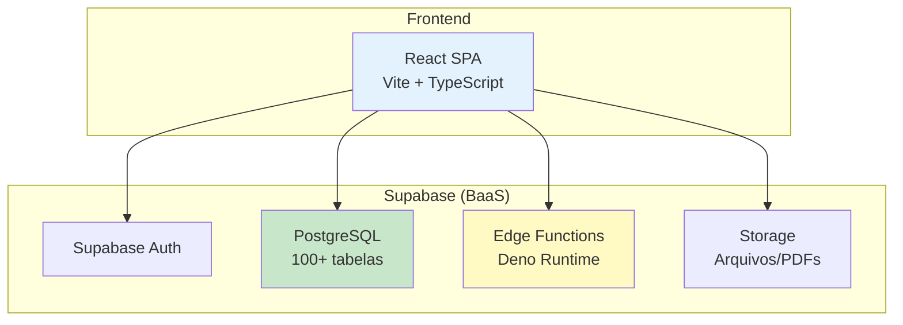
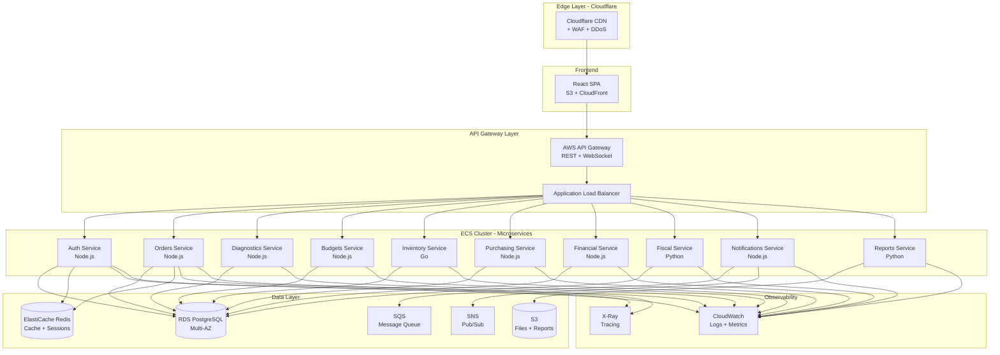

# 🚀 Estratégia de Migração: Monolito → Microserviços (ECS)

## 📋 Índice
- [Visão Geral](#visão-geral)
- [Arquitetura Atual (Monolito)](#arquitetura-atual-monolito)
- [Arquitetura Proposta (Microserviços)](#arquitetura-proposta-microserviços)
- [Estratégia de Migração](#estratégia-de-migração)
- [Comparação de Custos](#comparação-de-custos)
- [Implementação Técnica](#implementação-técnica)
- [Roadmap de Migração](#roadmap-de-migração)

---

## 🎯 Visão Geral

### Situação Atual
- **Arquitetura**: Monolito com Supabase (BaaS)
- **Frontend**: React SPA hospedado em CDN
- **Backend**: Supabase Edge Functions (Deno) + PostgreSQL
- **Autenticação**: Supabase Auth
- **Storage**: Supabase Storage

### Objetivo da Migração
Transformar o monolito em uma arquitetura de microserviços escalável usando **AWS ECS (Elastic Container Service)** com possibilidade de integração com **Cloudflare** para otimização de entrega e segurança.

### Benefícios Esperados
- ✅ **Escalabilidade independente** por domínio
- ✅ **Deploy independente** de cada serviço
- ✅ **Isolamento de falhas** (fault tolerance)
- ✅ **Tecnologias heterogêneas** (Node.js, Go, Python conforme necessidade)
- ✅ **Melhor observabilidade** e monitoramento
- ✅ **Equipes autônomas** por domínio

---

## 🏗️ Arquitetura Atual (Monolito)



### Módulos Identificados (Domínios de Negócio)
1. **Auth & Organizations** - Autenticação e multi-tenancy
2. **Orders** - Ordens de serviço e workflow
3. **Diagnostics** - Diagnósticos e checklists
4. **Budgets** - Orçamentos e aprovações
5. **Inventory** - Estoque e movimentações
6. **Purchasing** - Compras e fornecedores
7. **Financial** - Contas a pagar/receber, DRE
8. **Fiscal** - Notas fiscais e impostos
9. **Notifications** - Alertas e notificações
10. **Reports** - Relatórios e analytics

---

## 🎨 Arquitetura Proposta (Microserviços)

### Arquitetura de Alto Nível



### Definição dos Microserviços

| Microserviço | Responsabilidade | Tecnologia | Porta |
|--------------|------------------|------------|-------|
| **auth-service** | Autenticação, JWT, multi-tenancy, RBAC | Node.js + Express | 3001 |
| **orders-service** | Ordens de serviço, workflow, timeline | Node.js + Express | 3002 |
| **diagnostics-service** | Diagnósticos, checklists, medições | Node.js + Express | 3003 |
| **budgets-service** | Orçamentos, aprovações, contas a receber | Node.js + Express | 3004 |
| **inventory-service** | Estoque, movimentações, reservas | Go + Gin | 3005 |
| **purchasing-service** | Compras, fornecedores, cotações | Node.js + Express | 3006 |
| **financial-service** | Contas a pagar, DRE, fluxo de caixa | Node.js + Express | 3007 |
| **fiscal-service** | NF-e, impostos, apurações | Python + FastAPI | 3008 |
| **notifications-service** | Alertas, notificações, e-mails | Node.js + Express | 3009 |
| **reports-service** | Relatórios, PDFs, analytics | Python + FastAPI | 3010 |

### Comunicação entre Serviços

#### Síncrona (REST)
- **API Gateway** → Microserviços
- Microserviços → Microserviços (quando necessário)
- Autenticação via JWT propagado

#### Assíncrona (Event-Driven)
- **SQS** para filas de processamento
- **SNS** para pub/sub de eventos
- **EventBridge** para eventos de domínio

**Eventos Principais:**
- `OrderCreated` → Notifica diagnósticos
- `BudgetApproved` → Cria contas a receber, reserva estoque
- `InventoryLow` → Cria necessidade de compra
- `PaymentReceived` → Atualiza financeiro

---

## 📊 Comparação de Custos

### Cenário Base
- **Usuários simultâneos**: 100-200
- **Requisições/mês**: ~5 milhões
- **Armazenamento**: 500 GB
- **Tráfego de saída**: 1 TB/mês

---

### 💰 Opção 1: AWS ECS Fargate (Serverless Containers)

#### Infraestrutura

| Recurso | Especificação | Quantidade | Custo Mensal (USD) |
|---------|---------------|------------|-------------------|
| **ECS Fargate Tasks** | 0.5 vCPU, 1 GB RAM | 10 serviços × 2 tasks | $73.00 |
| **Application Load Balancer** | ALB padrão | 1 | $16.20 |
| **RDS PostgreSQL** | db.t3.medium (2 vCPU, 4 GB) Multi-AZ | 1 | $122.00 |
| **ElastiCache Redis** | cache.t3.micro (0.5 GB) | 1 | $12.41 |
| **S3 Storage** | Standard | 500 GB | $11.50 |
| **CloudWatch Logs** | 50 GB/mês | - | $25.00 |
| **API Gateway** | REST API | 5M requests | $17.50 |
| **SQS + SNS** | Mensagens | 1M requests | $1.00 |
| **NAT Gateway** | Para acesso internet | 1 | $32.40 |
| **Data Transfer** | Saída | 1 TB | $90.00 |

**TOTAL ECS FARGATE: ~$401/mês**

#### Com Cloudflare (Otimização)

| Recurso | Especificação | Custo Mensal (USD) |
|---------|---------------|-------------------|
| **Cloudflare Pro** | CDN + WAF + DDoS | $20.00 |
| **Cloudflare Workers** | Edge computing (opcional) | $5.00 |
| **Redução Data Transfer** | 70% de economia | -$63.00 |

**TOTAL ECS FARGATE + CLOUDFLARE: ~$363/mês**

---

### 💰 Opção 2: AWS ECS EC2 (Instâncias Dedicadas)

#### Infraestrutura

| Recurso | Especificação | Quantidade | Custo Mensal (USD) |
|---------|---------------|------------|-------------------|
| **EC2 Instances** | t3.medium (2 vCPU, 4 GB) | 3 instâncias | $75.00 |
| **Application Load Balancer** | ALB padrão | 1 | $16.20 |
| **RDS PostgreSQL** | db.t3.medium Multi-AZ | 1 | $122.00 |
| **ElastiCache Redis** | cache.t3.micro | 1 | $12.41 |
| **S3 Storage** | Standard | 500 GB | $11.50 |
| **CloudWatch Logs** | 50 GB/mês | - | $25.00 |
| **API Gateway** | REST API | 5M requests | $17.50 |
| **SQS + SNS** | Mensagens | 1M requests | $1.00 |
| **NAT Gateway** | Para acesso internet | 1 | $32.40 |
| **Data Transfer** | Saída | 1 TB | $90.00 |

**TOTAL ECS EC2: ~$403/mês**

#### Com Cloudflare

**TOTAL ECS EC2 + CLOUDFLARE: ~$365/mês**

---

### 💰 Opção 3: AWS EKS (Kubernetes)

#### Infraestrutura

| Recurso | Especificação | Quantidade | Custo Mensal (USD) |
|---------|---------------|------------|-------------------|
| **EKS Cluster** | Control Plane | 1 | $72.00 |
| **EC2 Worker Nodes** | t3.medium | 3 instâncias | $75.00 |
| **Application Load Balancer** | ALB padrão | 1 | $16.20 |
| **RDS PostgreSQL** | db.t3.medium Multi-AZ | 1 | $122.00 |
| **ElastiCache Redis** | cache.t3.micro | 1 | $12.41 |
| **S3 Storage** | Standard | 500 GB | $11.50 |
| **CloudWatch Logs** | 50 GB/mês | - | $25.00 |
| **SQS + SNS** | Mensagens | 1M requests | $1.00 |
| **NAT Gateway** | Para acesso internet | 1 | $32.40 |
| **Data Transfer** | Saída | 1 TB | $90.00 |

**TOTAL EKS: ~$457/mês**

#### Com Cloudflare

**TOTAL EKS + CLOUDFLARE: ~$419/mês**

---

### 📈 Comparação Resumida

| Solução | Custo Mensal | Custo Anual | Complexidade | Escalabilidade | Recomendação |
|---------|--------------|-------------|--------------|----------------|--------------|
| **ECS Fargate** | $401 | $4,812 | ⭐⭐ Baixa | ⭐⭐⭐⭐⭐ Excelente | ✅ **RECOMENDADO** |
| **ECS Fargate + CF** | $363 | $4,356 | ⭐⭐ Baixa | ⭐⭐⭐⭐⭐ Excelente | ✅ **MELHOR CUSTO-BENEFÍCIO** |
| **ECS EC2** | $403 | $4,836 | ⭐⭐⭐ Média | ⭐⭐⭐⭐ Boa | ⚠️ Mais trabalho operacional |
| **ECS EC2 + CF** | $365 | $4,380 | ⭐⭐⭐ Média | ⭐⭐⭐⭐ Boa | ⚠️ Mais trabalho operacional |
| **EKS** | $457 | $5,484 | ⭐⭐⭐⭐⭐ Alta | ⭐⭐⭐⭐⭐ Excelente | ❌ Over-engineering |
| **EKS + CF** | $419 | $5,028 | ⭐⭐⭐⭐⭐ Alta | ⭐⭐⭐⭐⭐ Excelente | ❌ Over-engineering |

### 💡 Comparação com Supabase Atual

| Solução | Custo Mensal Estimado |
|---------|----------------------|
| **Supabase Pro** | $25 + overages (~$100-200) = **~$125-225** |
| **ECS Fargate + Cloudflare** | **$363** |

**Diferença**: +$138-238/mês (+61-106%)

**Justificativa**: Maior controle, escalabilidade independente, sem vendor lock-in, melhor observabilidade.

---

## 🛠️ Implementação Técnica

### 1. Frontend (React SPA)

#### Hospedagem
- **S3** para arquivos estáticos
- **CloudFront** para CDN
- **Cloudflare** na frente para otimização adicional

#### Estrutura
```
frontend/
├── Dockerfile
├── nginx.conf
├── src/
│   ├── config/
│   │   └── api.config.ts  # URLs dos microserviços
│   ├── services/
│   │   ├── authService.ts
│   │   ├── ordersService.ts
│   │   ├── budgetsService.ts
│   │   └── ...
│   └── ...
└── package.json
```

#### Configuração de API
```typescript
// src/config/api.config.ts
export const API_CONFIG = {
  baseURL: process.env.VITE_API_GATEWAY_URL || 'https://api.erp.com',
  endpoints: {
    auth: '/auth',
    orders: '/orders',
    diagnostics: '/diagnostics',
    budgets: '/budgets',
    inventory: '/inventory',
    purchasing: '/purchasing',
    financial: '/financial',
    fiscal: '/fiscal',
    notifications: '/notifications',
    reports: '/reports',
  },
  timeout: 30000,
};
```

---

### 2. API Gateway

#### AWS API Gateway Configuration
```yaml
# api-gateway.yaml
openapi: 3.0.0
info:
  title: ERP Retífica API Gateway
  version: 1.0.0

paths:
  /auth/{proxy+}:
    x-amazon-apigateway-any-method:
      x-amazon-apigateway-integration:
        uri: http://auth-service.internal:3001/{proxy}
        type: http_proxy
        
  /orders/{proxy+}:
    x-amazon-apigateway-any-method:
      x-amazon-apigateway-integration:
        uri: http://orders-service.internal:3002/{proxy}
        type: http_proxy
        
  # ... outros serviços
```

#### Application Load Balancer (ALB)
```yaml
# alb-target-groups.yaml
TargetGroups:
  - Name: auth-service-tg
    Port: 3001
    Protocol: HTTP
    HealthCheck:
      Path: /health
      Interval: 30
      Timeout: 5
      
  - Name: orders-service-tg
    Port: 3002
    Protocol: HTTP
    HealthCheck:
      Path: /health
      Interval: 30
      Timeout: 5
      
  # ... outros serviços
```

---

### 3. Microserviços (Exemplo: Auth Service)

#### Estrutura de Diretórios
```
auth-service/
├── Dockerfile
├── docker-compose.yml
├── package.json
├── tsconfig.json
├── src/
│   ├── index.ts
│   ├── config/
│   │   ├── database.ts
│   │   ├── redis.ts
│   │   └── jwt.ts
│   ├── controllers/
│   │   ├── authController.ts
│   │   └── organizationController.ts
│   ├── services/
│   │   ├── authService.ts
│   │   └── tokenService.ts
│   ├── repositories/
│   │   ├── userRepository.ts
│   │   └── organizationRepository.ts
│   ├── middlewares/
│   │   ├── authMiddleware.ts
│   │   └── errorHandler.ts
│   ├── models/
│   │   ├── User.ts
│   │   └── Organization.ts
│   ├── routes/
│   │   └── index.ts
│   └── utils/
│       ├── logger.ts
│       └── validator.ts
└── tests/
    ├── unit/
    └── integration/
```

#### Dockerfile
```dockerfile
# auth-service/Dockerfile
FROM node:20-alpine AS builder

WORKDIR /app

COPY package*.json ./
RUN npm ci --only=production

COPY . .
RUN npm run build

FROM node:20-alpine

WORKDIR /app

COPY --from=builder /app/node_modules ./node_modules
COPY --from=builder /app/dist ./dist
COPY --from=builder /app/package.json ./

EXPOSE 3001

HEALTHCHECK --interval=30s --timeout=5s --start-period=10s --retries=3 \
  CMD node -e "require('http').get('http://localhost:3001/health', (r) => {process.exit(r.statusCode === 200 ? 0 : 1)})"

CMD ["node", "dist/index.js"]
```

#### Código Base (index.ts)
```typescript
// auth-service/src/index.ts
import express from 'express';
import helmet from 'helmet';
import cors from 'cors';
import { createLogger } from './utils/logger';
import { errorHandler } from './middlewares/errorHandler';
import routes from './routes';
import { connectDatabase } from './config/database';
import { connectRedis } from './config/redis';

const app = express();
const logger = createLogger('auth-service');
const PORT = process.env.PORT || 3001;

// Middlewares
app.use(helmet());
app.use(cors());
app.use(express.json());
app.use(express.urlencoded({ extended: true }));

// Health check
app.get('/health', (req, res) => {
  res.status(200).json({ status: 'healthy', service: 'auth-service' });
});

// Routes
app.use('/api/v1', routes);

// Error handler
app.use(errorHandler);

// Start server
async function start() {
  try {
    await connectDatabase();
    await connectRedis();
    
    app.listen(PORT, () => {
      logger.info(`Auth Service running on port ${PORT}`);
    });
  } catch (error) {
    logger.error('Failed to start service', error);
    process.exit(1);
  }
}

start();
```

#### ECS Task Definition
```json
{
  "family": "auth-service",
  "networkMode": "awsvpc",
  "requiresCompatibilities": ["FARGATE"],
  "cpu": "512",
  "memory": "1024",
  "containerDefinitions": [
    {
      "name": "auth-service",
      "image": "123456789.dkr.ecr.us-east-1.amazonaws.com/auth-service:latest",
      "portMappings": [
        {
          "containerPort": 3001,
          "protocol": "tcp"
        }
      ],
      "environment": [
        {
          "name": "NODE_ENV",
          "value": "production"
        },
        {
          "name": "PORT",
          "value": "3001"
        }
      ],
      "secrets": [
        {
          "name": "DATABASE_URL",
          "valueFrom": "arn:aws:secretsmanager:us-east-1:123456789:secret:db-url"
        },
        {
          "name": "JWT_SECRET",
          "valueFrom": "arn:aws:secretsmanager:us-east-1:123456789:secret:jwt-secret"
        },
        {
          "name": "REDIS_URL",
          "valueFrom": "arn:aws:secretsmanager:us-east-1:123456789:secret:redis-url"
        }
      ],
      "logConfiguration": {
        "logDriver": "awslogs",
        "options": {
          "awslogs-group": "/ecs/auth-service",
          "awslogs-region": "us-east-1",
          "awslogs-stream-prefix": "ecs"
        }
      },
      "healthCheck": {
        "command": ["CMD-SHELL", "curl -f http://localhost:3001/health || exit 1"],
        "interval": 30,
        "timeout": 5,
        "retries": 3,
        "startPeriod": 60
      }
    }
  ]
}
```

---

### 4. Banco de Dados

#### Estratégia de Database

**Opção A: Database per Service (Recomendado para longo prazo)**
- Cada microserviço tem seu próprio schema
- Isolamento completo de dados
- Maior autonomia

**Opção B: Shared Database (Recomendado para migração inicial)**
- Um único RDS PostgreSQL
- Schemas separados por serviço
- Facilita migração gradual

#### Schema Separation
```sql
-- RDS PostgreSQL
CREATE SCHEMA auth;
CREATE SCHEMA orders;
CREATE SCHEMA diagnostics;
CREATE SCHEMA budgets;
CREATE SCHEMA inventory;
CREATE SCHEMA purchasing;
CREATE SCHEMA financial;
CREATE SCHEMA fiscal;
CREATE SCHEMA notifications;
CREATE SCHEMA reports;

-- Permissões por serviço
CREATE USER auth_service WITH PASSWORD 'xxx';
GRANT ALL ON SCHEMA auth TO auth_service;

CREATE USER orders_service WITH PASSWORD 'xxx';
GRANT ALL ON SCHEMA orders TO orders_service;
GRANT SELECT ON auth.organizations TO orders_service; -- Cross-schema read

-- ... outros usuários
```

---

### 5. Comunicação Assíncrona

#### Event Bus (EventBridge)
```typescript
// shared/events/eventBus.ts
import { EventBridge } from 'aws-sdk';

const eventBridge = new EventBridge();

export async function publishEvent(eventType: string, detail: any) {
  await eventBridge.putEvents({
    Entries: [
      {
        Source: 'erp.retifica',
        DetailType: eventType,
        Detail: JSON.stringify(detail),
        EventBusName: 'erp-event-bus',
      },
    ],
  }).promise();
}

// Exemplo de uso
await publishEvent('BudgetApproved', {
  budgetId: '123',
  orderId: '456',
  organizationId: '789',
  items: [...],
  totalAmount: 5000,
});
```

#### Message Queue (SQS)
```typescript
// shared/queues/sqsClient.ts
import { SQS } from 'aws-sdk';

const sqs = new SQS();
const QUEUE_URL = process.env.NOTIFICATIONS_QUEUE_URL;

export async function sendToQueue(message: any) {
  await sqs.sendMessage({
    QueueUrl: QUEUE_URL,
    MessageBody: JSON.stringify(message),
  }).promise();
}

// Consumer
export async function consumeQueue(handler: (message: any) => Promise<void>) {
  while (true) {
    const response = await sqs.receiveMessage({
      QueueUrl: QUEUE_URL,
      MaxNumberOfMessages: 10,
      WaitTimeSeconds: 20,
    }).promise();

    if (response.Messages) {
      for (const message of response.Messages) {
        try {
          await handler(JSON.parse(message.Body));
          await sqs.deleteMessage({
            QueueUrl: QUEUE_URL,
            ReceiptHandle: message.ReceiptHandle,
          }).promise();
        } catch (error) {
          console.error('Error processing message', error);
        }
      }
    }
  }
}
```

---

### 6. Observabilidade

#### CloudWatch Logs
```typescript
// shared/utils/logger.ts
import winston from 'winston';
import CloudWatchTransport from 'winston-cloudwatch';

export function createLogger(serviceName: string) {
  return winston.createLogger({
    level: 'info',
    format: winston.format.json(),
    defaultMeta: { service: serviceName },
    transports: [
      new winston.transports.Console(),
      new CloudWatchTransport({
        logGroupName: `/ecs/${serviceName}`,
        logStreamName: `${serviceName}-${new Date().toISOString().split('T')[0]}`,
        awsRegion: 'us-east-1',
      }),
    ],
  });
}
```

#### X-Ray Tracing
```typescript
// shared/middlewares/xrayMiddleware.ts
import AWSXRay from 'aws-xray-sdk';
import express from 'express';

export function xrayMiddleware() {
  return AWSXRay.express.openSegment('auth-service');
}

export function xrayCloseMiddleware() {
  return AWSXRay.express.closeSegment();
}

// Uso no app
app.use(xrayMiddleware());
app.use('/api/v1', routes);
app.use(xrayCloseMiddleware());
```

#### Métricas Customizadas
```typescript
// shared/utils/metrics.ts
import { CloudWatch } from 'aws-sdk';

const cloudwatch = new CloudWatch();

export async function publishMetric(
  metricName: string,
  value: number,
  unit: string = 'Count'
) {
  await cloudwatch.putMetricData({
    Namespace: 'ERP/Retifica',
    MetricData: [
      {
        MetricName: metricName,
        Value: value,
        Unit: unit,
        Timestamp: new Date(),
      },
    ],
  }).promise();
}

// Exemplo de uso
await publishMetric('OrdersCreated', 1);
await publishMetric('BudgetApprovalTime', 120, 'Seconds');
```

---

### 7. CI/CD Pipeline

#### GitHub Actions Workflow
```yaml
# .github/workflows/deploy-auth-service.yml
name: Deploy Auth Service

on:
  push:
    branches: [main]
    paths:
      - 'services/auth-service/**'

jobs:
  build-and-deploy:
    runs-on: ubuntu-latest
    
    steps:
      - uses: actions/checkout@v3
      
      - name: Configure AWS credentials
        uses: aws-actions/configure-aws-credentials@v2
        with:
          aws-access-key-id: ${{ secrets.AWS_ACCESS_KEY_ID }}
          aws-secret-access-key: ${{ secrets.AWS_SECRET_ACCESS_KEY }}
          aws-region: us-east-1
      
      - name: Login to Amazon ECR
        id: login-ecr
        uses: aws-actions/amazon-ecr-login@v1
      
      - name: Build, tag, and push image to Amazon ECR
        env:
          ECR_REGISTRY: ${{ steps.login-ecr.outputs.registry }}
          ECR_REPOSITORY: auth-service
          IMAGE_TAG: ${{ github.sha }}
        run: |
          cd services/auth-service
          docker build -t $ECR_REGISTRY/$ECR_REPOSITORY:$IMAGE_TAG .
          docker push $ECR_REGISTRY/$ECR_REPOSITORY:$IMAGE_TAG
          docker tag $ECR_REGISTRY/$ECR_REPOSITORY:$IMAGE_TAG $ECR_REGISTRY/$ECR_REPOSITORY:latest
          docker push $ECR_REGISTRY/$ECR_REPOSITORY:latest
      
      - name: Update ECS service
        run: |
          aws ecs update-service \
            --cluster erp-cluster \
            --service auth-service \
            --force-new-deployment
```

---

### 8. Infraestrutura como Código (Terraform)

#### Estrutura de Diretórios
```
terraform/
├── environments/
│   ├── dev/
│   │   ├── main.tf
│   │   └── terraform.tfvars
│   ├── staging/
│   │   ├── main.tf
│   │   └── terraform.tfvars
│   └── production/
│       ├── main.tf
│       └── terraform.tfvars
├── modules/
│   ├── ecs-service/
│   │   ├── main.tf
│   │   ├── variables.tf
│   │   └── outputs.tf
│   ├── rds/
│   │   ├── main.tf
│   │   ├── variables.tf
│   │   └── outputs.tf
│   ├── redis/
│   │   ├── main.tf
│   │   ├── variables.tf
│   │   └── outputs.tf
│   └── networking/
│       ├── main.tf
│       ├── variables.tf
│       └── outputs.tf
└── shared/
    ├── variables.tf
    └── outputs.tf
```

#### Exemplo: ECS Service Module
```hcl
# terraform/modules/ecs-service/main.tf
resource "aws_ecs_task_definition" "service" {
  family                   = var.service_name
  network_mode             = "awsvpc"
  requires_compatibilities = ["FARGATE"]
  cpu                      = var.cpu
  memory                   = var.memory
  execution_role_arn       = aws_iam_role.ecs_execution_role.arn
  task_role_arn            = aws_iam_role.ecs_task_role.arn

  container_definitions = jsonencode([
    {
      name      = var.service_name
      image     = var.image_url
      essential = true
      
      portMappings = [
        {
          containerPort = var.container_port
          protocol      = "tcp"
        }
      ]
      
      environment = var.environment_variables
      secrets     = var.secrets
      
      logConfiguration = {
        logDriver = "awslogs"
        options = {
          "awslogs-group"         = "/ecs/${var.service_name}"
          "awslogs-region"        = var.aws_region
          "awslogs-stream-prefix" = "ecs"
        }
      }
      
      healthCheck = {
        command     = ["CMD-SHELL", "curl -f http://localhost:${var.container_port}/health || exit 1"]
        interval    = 30
        timeout     = 5
        retries     = 3
        startPeriod = 60
      }
    }
  ])
}

resource "aws_ecs_service" "service" {
  name            = var.service_name
  cluster         = var.cluster_id
  task_definition = aws_ecs_task_definition.service.arn
  desired_count   = var.desired_count
  launch_type     = "FARGATE"

  network_configuration {
    subnets          = var.private_subnet_ids
    security_groups  = [aws_security_group.service.id]
    assign_public_ip = false
  }

  load_balancer {
    target_group_arn = aws_lb_target_group.service.arn
    container_name   = var.service_name
    container_port   = var.container_port
  }

  depends_on = [aws_lb_listener_rule.service]
}

resource "aws_lb_target_group" "service" {
  name        = "${var.service_name}-tg"
  port        = var.container_port
  protocol    = "HTTP"
  vpc_id      = var.vpc_id
  target_type = "ip"

  health_check {
    path                = "/health"
    healthy_threshold   = 2
    unhealthy_threshold = 3
    timeout             = 5
    interval            = 30
    matcher             = "200"
  }
}

resource "aws_lb_listener_rule" "service" {
  listener_arn = var.alb_listener_arn

  action {
    type             = "forward"
    target_group_arn = aws_lb_target_group.service.arn
  }

  condition {
    path_pattern {
      values = ["/${var.service_name}/*"]
    }
  }
}

resource "aws_security_group" "service" {
  name        = "${var.service_name}-sg"
  description = "Security group for ${var.service_name}"
  vpc_id      = var.vpc_id

  ingress {
    from_port       = var.container_port
    to_port         = var.container_port
    protocol        = "tcp"
    security_groups = [var.alb_security_group_id]
  }

  egress {
    from_port   = 0
    to_port     = 0
    protocol    = "-1"
    cidr_blocks = ["0.0.0.0/0"]
  }
}

resource "aws_cloudwatch_log_group" "service" {
  name              = "/ecs/${var.service_name}"
  retention_in_days = 30
}
```

---

## 🗓️ Roadmap de Migração

### Fase 1: Preparação (2-3 semanas)

#### Semana 1-2: Setup de Infraestrutura
- [ ] Criar conta AWS e configurar IAM
- [ ] Configurar VPC, Subnets, NAT Gateway
- [ ] Provisionar RDS PostgreSQL (Multi-AZ)
- [ ] Provisionar ElastiCache Redis
- [ ] Configurar S3 buckets
- [ ] Setup de CloudWatch e X-Ray
- [ ] Configurar Secrets Manager

#### Semana 2-3: Preparação de Código
- [ ] Criar repositórios Git para cada microserviço
- [ ] Definir estrutura de pastas padrão
- [ ] Criar biblioteca compartilhada (shared)
- [ ] Implementar logger centralizado
- [ ] Implementar middleware de autenticação
- [ ] Criar Dockerfiles para cada serviço
- [ ] Setup de CI/CD (GitHub Actions)

---

### Fase 2: Migração de Serviços Core (4-6 semanas)

#### Semana 1-2: Auth Service
- [ ] Migrar lógica de autenticação do Supabase Auth
- [ ] Implementar geração de JWT
- [ ] Migrar gestão de organizações (multi-tenancy)
- [ ] Migrar sistema de permissões (RBAC)
- [ ] Testes unitários e de integração
- [ ] Deploy no ECS
- [ ] Validação em ambiente de staging

#### Semana 3-4: Orders Service
- [ ] Migrar CRUD de ordens de serviço
- [ ] Migrar gestão de workflow
- [ ] Migrar timeline de eventos
- [ ] Integrar com Auth Service
- [ ] Testes e deploy

#### Semana 5-6: Diagnostics & Budgets Services
- [ ] Migrar serviço de diagnósticos
- [ ] Migrar serviço de orçamentos
- [ ] Implementar comunicação assíncrona (eventos)
- [ ] Testes e deploy

---

### Fase 3: Migração de Serviços Secundários (4-6 semanas)

#### Semana 1-2: Inventory & Purchasing Services
- [ ] Migrar serviço de estoque
- [ ] Migrar serviço de compras
- [ ] Implementar reservas de peças
- [ ] Integrar com eventos de orçamentos

#### Semana 3-4: Financial & Fiscal Services
- [ ] Migrar serviço financeiro
- [ ] Migrar serviço fiscal
- [ ] Implementar geração de contas a receber
- [ ] Integrar com eventos de pagamentos

#### Semana 5-6: Notifications & Reports Services
- [ ] Migrar serviço de notificações
- [ ] Migrar serviço de relatórios
- [ ] Implementar filas SQS
- [ ] Implementar geração de PDFs

---

### Fase 4: Otimização e Go-Live (2-3 semanas)

#### Semana 1: Testes e Otimização
- [ ] Testes de carga (stress testing)
- [ ] Otimização de queries
- [ ] Ajuste de auto-scaling
- [ ] Configuração de alarmes CloudWatch
- [ ] Testes de failover

#### Semana 2: Migração de Dados
- [ ] Backup completo do Supabase
- [ ] Migração de dados para RDS
- [ ] Validação de integridade
- [ ] Migração de arquivos para S3

#### Semana 3: Go-Live
- [ ] Deploy em produção (blue-green)
- [ ] Monitoramento intensivo 24/7
- [ ] Rollback plan pronto
- [ ] Suporte dedicado

---

### Fase 5: Pós-Migração (ongoing)

#### Mês 1-2: Estabilização
- [ ] Monitoramento contínuo
- [ ] Correção de bugs críticos
- [ ] Ajustes de performance
- [ ] Coleta de feedback dos usuários

#### Mês 3+: Evolução
- [ ] Implementar auto-scaling avançado
- [ ] Adicionar cache distribuído
- [ ] Implementar circuit breakers
- [ ] Melhorar observabilidade
- [ ] Adicionar novos microserviços conforme necessário

---

## 🎯 Recomendações Finais

### ✅ Arquitetura Recomendada
**ECS Fargate + Cloudflare**
- **Custo**: $363/mês (~$4,356/ano)
- **Complexidade**: Baixa
- **Escalabilidade**: Excelente
- **Manutenção**: Mínima (serverless)

### 🚫 Não Recomendado (para este caso)
**EKS (Kubernetes)**
- Over-engineering para o tamanho atual
- Complexidade desnecessária
- Custo 15% maior
- Requer expertise Kubernetes

### 📊 Quando Considerar EKS?
- **Mais de 50 microserviços**
- **Múltiplos ambientes complexos**
- **Necessidade de service mesh (Istio)**
- **Equipe com expertise Kubernetes**

### 🔄 Estratégia de Migração
**Strangler Fig Pattern** (Recomendado)
- Migrar serviço por serviço
- Manter Supabase rodando em paralelo
- Roteamento gradual de tráfego
- Rollback fácil em caso de problemas

### 📈 Métricas de Sucesso
- **Latência**: < 200ms p95
- **Disponibilidade**: 99.9% uptime
- **Error Rate**: < 0.1%
- **Deploy Frequency**: Múltiplos por dia
- **MTTR**: < 1 hora

---

## 📚 Recursos Adicionais

### Documentação AWS
- [ECS Fargate Best Practices](https://docs.aws.amazon.com/AmazonECS/latest/bestpracticesguide/)
- [RDS PostgreSQL](https://docs.aws.amazon.com/AmazonRDS/latest/UserGuide/)
- [API Gateway](https://docs.aws.amazon.com/apigateway/)

### Ferramentas Recomendadas
- **Terraform**: IaC
- **Docker**: Containerização
- **GitHub Actions**: CI/CD
- **Postman**: Testes de API
- **k6**: Load testing
- **Datadog/New Relic**: APM (opcional)

### Treinamento da Equipe
- AWS Certified Solutions Architect
- Docker & Kubernetes Fundamentals
- Microservices Patterns
- DevOps Best Practices

---

**Documento criado em**: 24/12/2025  
**Versão**: 1.0  
**Autor**: DevOps Team  
**Status**: Proposta Inicial

