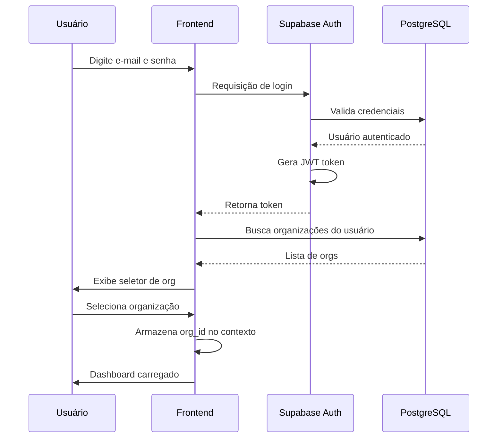

# 🔐 Autenticação e Multi-tenancy - Regras de Negócio

## 🔄 Fluxo de Autenticação



## 🏢 Sistema Multi-tenant

### Isolamento de Dados

Cada organização possui dados **completamente isolados** através de:

1. **Column `org_id` em todas as tabelas**
2. **Row Level Security (RLS)** do PostgreSQL
3. **Validação no backend** via triggers

### Exemplo de Política RLS

```sql
-- Usuários só veem dados da própria organização
CREATE POLICY "users_org_isolation"
ON orders FOR ALL
USING (
  org_id IN (
    SELECT organization_id 
    FROM organization_users 
    WHERE user_id = auth.uid() 
    AND is_active = true
  )
);
```

## 🔑 Gestão de Sessões

- **Duração**: 24 horas de inatividade
- **Renovação**: Automática com atividade
- **Logout**: Manual ou automático por inatividade

---

**Última Atualização**: 2025-01-14
