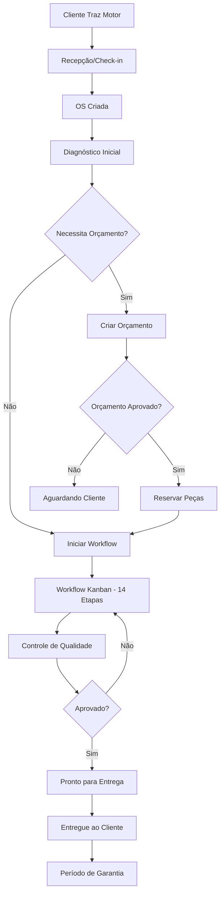
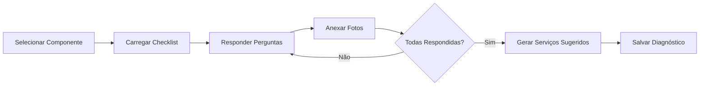
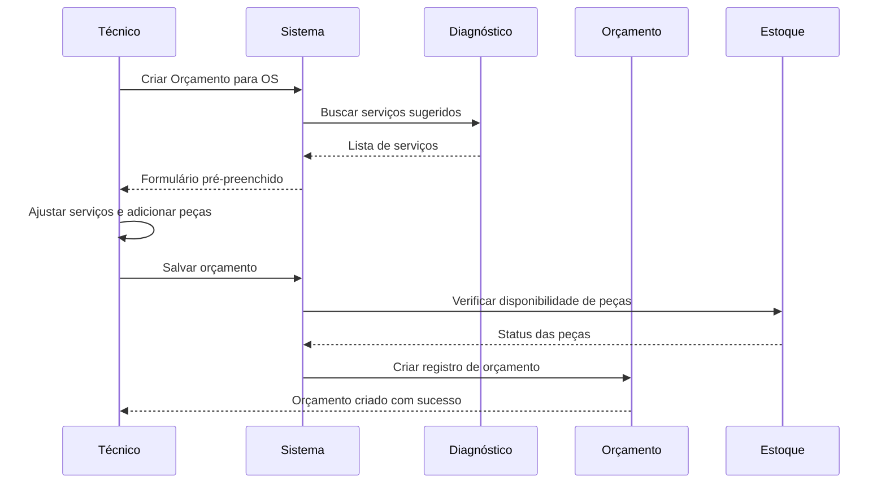
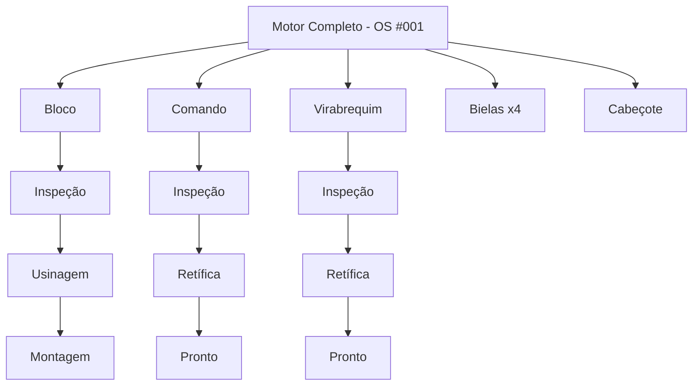

# 🔧 Operações e Workflow - Regras de Negócio

## 🎯 Visão Geral

O módulo de Operações é o coração do ERP Retífica, gerenciando todo o ciclo de vida de um motor desde a entrada até a entrega, passando por diagnóstico, orçamento, execução e controle de qualidade.

---

## 📋 Fluxo Completo de Operações



---

## 🚪 1. Recepção de Motores (Check-in)

### Formulário de Entrada
Ao receber um motor, o usuário preenche:

#### **Dados do Cliente**
- Nome/Razão Social
- CPF/CNPJ
- Telefone(s)
- Email (opcional)
- Endereço completo

#### **Dados do Veículo**
- Placa (formato: ABC-1234 ou ABC1D23)
- Marca/Modelo
- Ano/Modelo
- Cor (opcional)
- Hodômetro/Horímetro

#### **Dados do Motor**
- **Tipo de Motor**: Seleção de tipos cadastrados
  - Diesel 4 cilindros
  - Diesel 6 cilindros
  - Diesel V8
  - Gasolina 4 cilindros
  - Gasolina 6 cilindros
  - Gasolina V6/V8
  - Flex
  - Customizados
- **Número de Série** (opcional)
- **Aplicação**: Caminhão, Carro, Máquina Agrícola, Gerador, etc.

#### **Motivo da Entrada**
- ⚙️ Retífica completa
- 🔍 Diagnóstico
- 🔧 Manutenção preventiva
- 🛠️ Reparo específico
- 🔄 Revisão
- 📝 Outro (descrever)

#### **Sintomas Relatados**
Campo de texto livre para descrever o problema:
- Barulho no motor
- Perda de potência
- Superaquecimento
- Consumo excessivo de óleo
- Etc.

#### **Estado Visual Inicial**
- Fotos do motor (até 10)
- Observações de danos externos
- Estado de limpeza
- Componentes faltantes

### Geração Automática da OS
Ao salvar o check-in:
```typescript
// OS criada automaticamente
{
  "number": "OS-20250114-0001", // Auto-incrementado diariamente
  "status": "checkin", // Status inicial
  "customer_id": "uuid",
  "vehicle_data": {...},
  "engine_data": {...},
  "entry_reason": "Retífica completa",
  "symptoms": "Motor batendo, perda de compressão",
  "created_by": "user_id",
  "created_at": "2025-01-14T10:30:00Z",
  "expected_delivery": null, // Será definido após orçamento
  "org_id": "current_org"
}
```

---

## 🔍 2. Sistema de Diagnóstico

### Checklists Dinâmicos por Componente

O sistema oferece checklists especializados para cada tipo de componente:

#### **Componentes Disponíveis**
1. **Bloco do Motor** (cylinder_block)
2. **Eixo Comando** (camshaft)
3. **Virabrequim** (crankshaft)
4. **Bielas** (connecting_rods)
5. **Cabeçote** (cylinder_head)
6. **Pistões** (pistons)



### Estrutura do Checklist

#### Exemplo: Checklist de Bloco do Motor
```json
{
  "component": "bloco",
  "questions": [
    {
      "id": "q1",
      "text": "O bloco apresenta trincas visíveis?",
      "type": "yes_no",
      "critical": true,
      "photos_required": true
    },
    {
      "id": "q2",
      "text": "Medida do diâmetro do cilindro 1 (mm)",
      "type": "number",
      "unit": "mm",
      "tolerance": {
        "min": 85.0,
        "max": 86.5
      }
    },
    {
      "id": "q3",
      "text": "Estado dos alojamentos de mancais",
      "type": "select",
      "options": ["Perfeito", "Bom", "Desgastado", "Danificado"]
    }
  ]
}
```

### Tipos de Respostas
- **yes_no**: Sim/Não
- **text**: Texto livre
- **number**: Valor numérico (com tolerâncias)
- **select**: Seleção única
- **multi_select**: Seleção múltipla
- **photo**: Foto obrigatória

### Fotos do Diagnóstico
- **Limite**: Até 20 fotos por componente
- **Formato**: JPG, PNG, HEIC
- **Tamanho máximo**: 10MB por foto
- **Armazenamento**: Supabase Storage (`diagnostic-photos/`)
- **Vinculação**: Cada foto pode ser vinculada a uma pergunta específica

### Serviços Gerados Automaticamente
Com base nas respostas, o sistema sugere serviços:
```typescript
// Exemplo de lógica de sugestão
if (bloco.q1 === 'yes') { // Trinca visível
  suggestedServices.push({
    service: "Solda de trinca em bloco",
    estimated_cost: 1500.00,
    urgency: "critical"
  });
}

if (bloco.q2 > 86.0) { // Fora de tolerância
  suggestedServices.push({
    service: "Retífica de cilindros",
    estimated_cost: 800.00,
    urgency: "high"
  });
}
```

### Estados do Diagnóstico
- `in_progress`: Em andamento
- `completed`: Concluído
- `reviewed`: Revisado por gerente
- `approved_for_budget`: Aprovado para orçamento

---

## 💰 3. Criação de Orçamentos

### Fluxo de Criação


### Itens do Orçamento

#### **Serviços**
```typescript
{
  "service_name": "Retífica de cilindros",
  "description": "Brunimento e retífica de 4 cilindros",
  "quantity": 4,
  "unit_price": 200.00,
  "total": 800.00,
  "estimated_hours": 6
}
```

#### **Peças**
```typescript
{
  "part_id": "uuid",
  "part_name": "Pistão STD",
  "part_code": "PST-001",
  "quantity": 4,
  "unit_price": 150.00,
  "total": 600.00,
  "in_stock": true,
  "supplier": "Mahle"
}
```

#### **Mão de Obra**
```typescript
{
  "description": "Montagem completa do motor",
  "hours": 12,
  "hour_rate": 80.00,
  "total": 960.00
}
```

### Cálculo Automático
```typescript
// Fórmula de cálculo
subtotal = sum(services) + sum(parts) + sum(labor);
discount = subtotal * (discount_percentage / 100);
subtotal_after_discount = subtotal - discount;

// Impostos (se módulo fiscal ativo)
taxes = calculateTaxes(subtotal_after_discount, tax_regime);

total = subtotal_after_discount + taxes;
```

### Aprovação de Orçamento
Ver: [budgets-approval.md](./budgets-approval.md)

---

## 🔄 4. Workflow Kanban (14 Etapas)

```mermaid
graph LR
    A[1.Entrada] --> B[2.Desmontagem]
    B --> C[3.Limpeza]
    C --> D[4.Inspeção]
    D --> E[5.Usinagem]
    E --> F[6.Montagem]
    F --> G[7.Teste]
    G --> H[8.Metrologia]
    H --> I[9.Qualidade]
    I --> J[10.Pintura]
    J --> K[11.Pronto]
    K --> L[12.Entregue]
    L --> M[13.Garantia]
    
    style A fill:#e3f2fd
    style D fill:#fff3e0
    style I fill:#fce4ec
    style K fill:#e8f5e9
    style L fill:#f3e5f5
    style M fill:#e0f2f1
```



### Etapas Padrão

#### **1. Entrada (Check-in)**
- **Status**: `checkin`
- **Cor**: Azul claro
- **Responsável**: Recepção
- **Ações**:
  - Preencher formulário de entrada
  - Tirar fotos iniciais
  - Criar OS
- **Próximo**: Desmontagem

#### **2. Desmontagem**
- **Status**: `disassembly`
- **Cor**: Roxo
- **Responsável**: Técnico
- **Checklist Obrigatório**: ✅
  - [ ] Drenar todos os fluidos
  - [ ] Fotografar antes da desmontagem
  - [ ] Identificar todas as peças
  - [ ] Separar parafusos e porcas por conjunto
- **Próximo**: Limpeza

#### **3. Limpeza**
- **Status**: `cleaning`
- **Cor**: Verde claro
- **Responsável**: Operador de limpeza
- **Checklist Obrigatório**: ✅
  - [ ] Limpeza com desengraxante
  - [ ] Secagem completa
  - [ ] Verificação visual de trincas óbvias
- **Próximo**: Inspeção

#### **4. Inspeção e Diagnóstico**
- **Status**: `inspection`
- **Cor**: Laranja
- **Responsável**: Técnico especializado
- **Checklist Obrigatório**: ✅
  - [ ] Medições dimensionais
  - [ ] Teste de estanqueidade
  - [ ] Inspeção por líquido penetrante
  - [ ] Diagnóstico completo de todos os componentes
- **Bloqueio**: Não pode avançar sem diagnóstico aprovado
- **Próximo**: Usinagem ou Orçamento

#### **5. Usinagem**
- **Status**: `machining`
- **Cor**: Cinza
- **Responsável**: Operador de máquinas
- **Checklist Obrigatório**: ✅
  - [ ] Retífica de cilindros executada
  - [ ] Brunimento concluído
  - [ ] Retífica de virabrequim (se necessário)
  - [ ] Retífica de comando (se necessário)
  - [ ] Medições pós-usinagem registradas
- **Próximo**: Montagem

#### **6. Montagem**
- **Status**: `assembly`
- **Cor**: Azul
- **Responsável**: Montador
- **Checklist Obrigatório**: ✅
  - [ ] Peças novas instaladas conforme orçamento
  - [ ] Torques aplicados conforme especificação
  - [ ] Folgas conferidas
  - [ ] Registros fotográficos de etapas críticas
- **Próximo**: Teste

#### **7. Teste de Bancada**
- **Status**: `testing`
- **Cor**: Amarelo
- **Responsável**: Técnico de testes
- **Checklist Obrigatório**: ✅
  - [ ] Teste de compressão
  - [ ] Teste de pressão de óleo
  - [ ] Teste de partida a frio
  - [ ] Teste de temperatura de trabalho
  - [ ] Verificação de ruídos anormais
- **Bloqueio**: Não pode avançar se falhar no teste
- **Próximo**: Metrologia

#### **8. Metrologia**
- **Status**: `metrology`
- **Cor**: Roxo escuro
- **Responsável**: Inspetor de qualidade
- **Checklist Obrigatório**: ✅
  - [ ] Medições finais conferidas
  - [ ] Tolerâncias dentro do especificado
  - [ ] Relatório de metrologia gerado
- **Próximo**: Controle de Qualidade

#### **9. Controle de Qualidade**
- **Status**: `quality_control`
- **Cor**: Rosa
- **Responsável**: Supervisor de qualidade
- **Checklist Obrigatório**: ✅
  - [ ] Inspeção visual final
  - [ ] Conferência de todos os documentos
  - [ ] Verificação de garantia
  - [ ] Aprovação final assinada
- **Bloqueio**: Não pode avançar sem aprovação do supervisor
- **Próximo**: Pintura ou Pronto

#### **10. Pintura (Opcional)**
- **Status**: `painting`
- **Cor**: Laranja claro
- **Responsável**: Pintor
- **Checklist**: ✅
  - [ ] Preparação da superfície
  - [ ] Aplicação de primer
  - [ ] Pintura final
  - [ ] Secagem completa
- **Próximo**: Pronto

#### **11. Pronto para Entrega**
- **Status**: `ready`
- **Cor**: Verde
- **Responsável**: Gerente de operações
- **Ações**:
  - Avisar cliente
  - Gerar documentação de entrega
  - Preparar nota fiscal (se aplicável)
- **Próximo**: Entregue

#### **12. Entregue**
- **Status**: `delivered`
- **Cor**: Roxo
- **Responsável**: Recepção/Expedição
- **Checklist Obrigatório**: ✅
  - [ ] Cliente identificado (CPF/RG)
  - [ ] Assinatura do cliente na OS
  - [ ] Pagamento confirmado
  - [ ] Termo de garantia entregue
  - [ ] Manual de instruções entregue
- **Próximo**: Garantia

#### **13. Em Garantia**
- **Status**: `warranty`
- **Cor**: Azul claro
- **Responsável**: Pós-venda
- **Duração**: Configurável (padrão: 90 dias)
- **Ações**:
  - Monitorar período de garantia
  - Registrar reclamações (se houver)
  - Agendar revisões preventivas

#### **14. Finalizado**
- **Status**: `finished`
- **Cor**: Cinza claro
- **Responsável**: Sistema (automático após garantia)
- **Ações**:
  - Arquivar documentação
  - Calcular estatísticas de performance
  - Solicitar avaliação do cliente (NPS)

---

## ✅ Sistema de Checklists Obrigatórios

### Bloqueio de Avanço
Etapas com checklists obrigatórios (marcados com ✅) **não podem avançar** para a próxima etapa sem que todos os itens estejam marcados.

```typescript
// Validação de avanço
function canAdvanceToNextStep(order, nextStatus) {
  const currentStepConfig = getStepConfig(order.status);
  
  if (currentStepConfig.requires_checklist) {
    const checklist = getOrderChecklist(order.id, order.status);
    
    if (!checklist || !checklist.all_items_checked) {
      throw new Error("Checklist obrigatório não concluído");
    }
  }
  
  return true;
}
```

### Exceções (Permissão Especial)
Apenas **Admin, Owner ou Super Admin** podem forçar o avanço sem checklist completo (com justificativa registrada).

---

## 🎯 Gestão de Componentes

### Movimentação por Componente
Cada motor pode ser desmembrado em componentes que seguem fluxos independentes:



### Visão no Kanban
- **Card da OS**: Mostra status geral
- **Indicador de progresso**: Percentual de componentes concluídos
- **Drill-down**: Clique para ver detalhes de cada componente
- **Alerta**: Se algum componente está atrasado

---

## 🔒 Permissões por Etapa

| Ação | Super Admin | Owner | Admin | Manager | Operator | Viewer |
|------|-------------|-------|-------|---------|----------|--------|
| Criar OS | ✅ | ✅ | ✅ | ✅ | ✅ | ❌ |
| Editar OS | ✅ | ✅ | ✅ | ✅ | ✏️ | ❌ |
| Deletar OS | ✅ | ✅ | ✅ | ❌ | ❌ | ❌ |
| Movimentar Kanban | ✅ | ✅ | ✅ | ✅ | ✅ | ❌ |
| Forçar Avanço (sem checklist) | ✅ | ✅ | ✅ | ❌ | ❌ | ❌ |
| Fazer Diagnóstico | ✅ | ✅ | ✅ | ✅ | ✅ | ❌ |
| Criar Orçamento | ✅ | ✅ | ✅ | ✅ | ✏️ | ❌ |
| Aprovar Qualidade | ✅ | ✅ | ✅ | ✅ | ❌ | ❌ |

---

## 📊 Métricas de Performance

### Por Etapa
- Tempo médio em cada etapa
- Gargalos identificados
- Comparação com metas

### Por Técnico
- OS finalizadas no período
- Tempo médio de execução
- Taxa de retrabalho

### Por Tipo de Serviço
- Retíficas completas: X dias
- Diagnósticos: Y dias
- Reparos específicos: Z dias

---

**Última Atualização**: 2025-01-14  
**Versão**: 1.0.0
