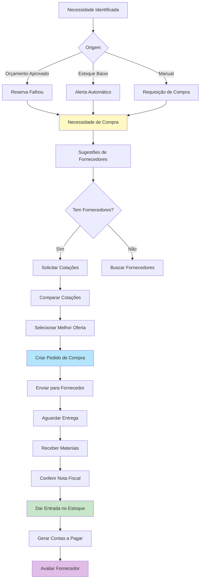
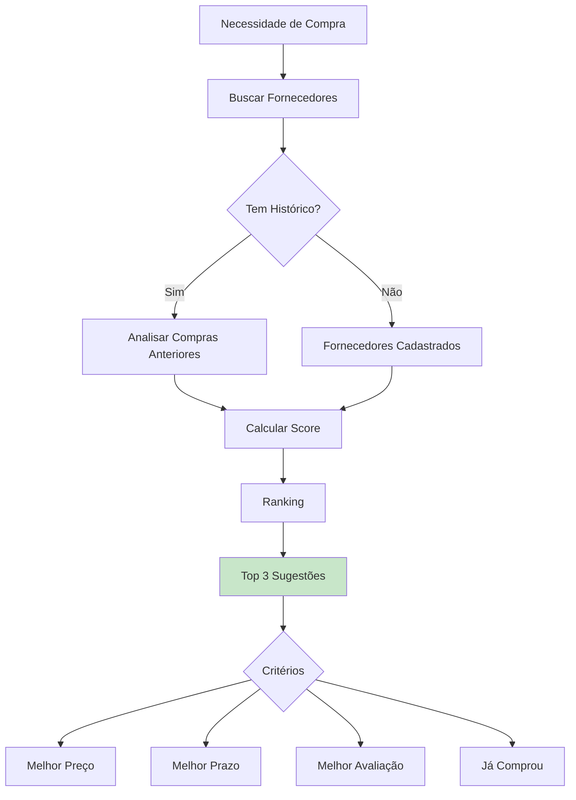
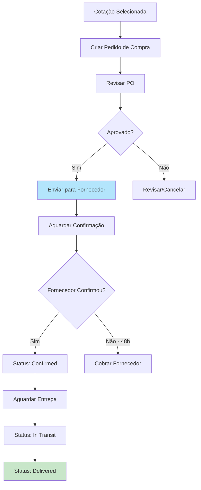
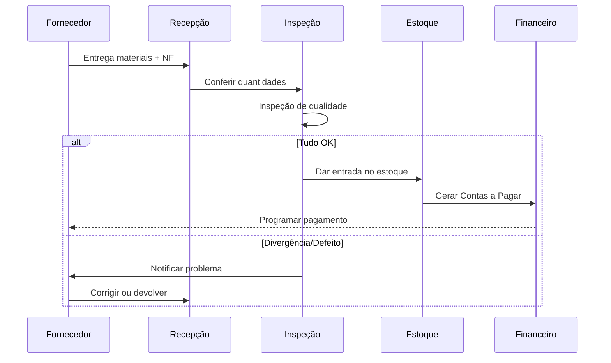

# 🛒 Módulo de Compras - Regras de Negócio

## 🎯 Visão Geral

O Módulo de Compras gerencia todo o ciclo de aquisição de peças e materiais, desde a identificação da necessidade até o recebimento e pagamento, com sugestões inteligentes de fornecedores e controle completo do processo.

---

## 📋 Fluxo Completo de Compras



---

## 🔔 Necessidades de Compra

### Geração Automática

#### 1. Orçamento Aprovado (Peça Indisponível)
```typescript
async function createNeedFromBudget(budgetId, partId, deficit) {
  await createPurchaseNeed({
    org_id: budget.org_id,
    part_id: partId,
    quantity_needed: deficit,
    priority: 'high',
    reason: 'budget_approval',
    required_by: budget.expected_delivery,
    generated_from: 'budget',
    reference_id: budgetId,
    auto_generated: true,
    status: 'pending'
  });
}
```

#### 2. Estoque Abaixo do Mínimo
```typescript
async function createNeedFromStockAlert(partId) {
  const part = await getPart(partId);
  const currentQty = await getPartAvailableQuantity(partId);
  const quantityToOrder = part.optimal_stock 
    ? part.optimal_stock - currentQty 
    : part.minimum_stock * 2;
  
  await createPurchaseNeed({
    org_id: part.org_id,
    part_id: partId,
    quantity_needed: quantityToOrder,
    priority: currentQty === 0 ? 'urgent' : 'normal',
    reason: 'stock_minimum',
    required_by: addDays(new Date(), 7), // 7 dias
    auto_generated: true,
    status: 'pending'
  });
}
```

#### 3. Requisição Manual
```typescript
// Usuário identifica necessidade manualmente
await createPurchaseNeed({
  org_id: user.org_id,
  part_id: partId,
  quantity_needed: quantity,
  priority: priority, // 'urgent', 'high', 'normal', 'low'
  reason: 'manual_request',
  justification: "Motor especial de cliente premium",
  required_by: requiredDate,
  requested_by: user.id,
  auto_generated: false,
  status: 'pending'
});
```

### Priorização
```typescript
// Ordem de priorização
const priorityOrder = {
  urgent: 1,    // 🔴 Pedido parado aguardando peça
  high: 2,      // 🟠 OS aprovada precisa da peça
  normal: 3,    // 🟡 Reposição de estoque
  low: 4        // 🟢 Estoque preventivo
};
```

---

## 🏪 Gestão de Fornecedores

### Cadastro de Fornecedor
```typescript
interface Supplier {
  id: string;
  org_id: string;
  
  // Identificação
  trade_name: string; // "Auto Peças Silva"
  legal_name: string; // Razão social
  tax_id: string; // CNPJ/CPF
  state_registration?: string; // IE
  
  // Contato
  email: string;
  phone: string;
  whatsapp?: string;
  website?: string;
  
  // Endereço
  address: {
    street: string;
    number: string;
    complement?: string;
    neighborhood: string;
    city: string;
    state: string;
    zip_code: string;
  };
  
  // Contatos
  contacts: Array<{
    name: string;
    role: string; // "Vendedor", "Gerente"
    email: string;
    phone: string;
  }>;
  
  // Condições Comerciais
  payment_terms: string; // "30/60/90 dias", "À vista"
  minimum_order_value?: number;
  delivery_time_days: number; // Prazo médio
  accepts_returns: boolean;
  return_policy?: string;
  
  // Produtos Fornecidos
  categories: string[]; // ["Pistões", "Anéis", "Bronzinas"]
  brands: string[]; // ["Mahle", "Metal Leve"]
  
  // Performance
  rating: number; // 1-5 estrelas
  total_orders: number;
  on_time_delivery_rate: number; // %
  quality_rating: number; // 1-5
  price_rating: number; // 1-5 (competitividade)
  
  // Status
  is_active: boolean;
  is_preferred: boolean;
  notes?: string;
  
  // Metadados
  created_at: Date;
  last_purchase_date?: Date;
}
```

### Avaliação de Fornecedores
```typescript
async function rateSupplier(purchaseOrderId, evaluation) {
  const po = await getPurchaseOrder(purchaseOrderId);
  
  await createSupplierEvaluation({
    supplier_id: po.supplier_id,
    purchase_order_id: purchaseOrderId,
    delivery_rating: evaluation.delivery, // 1-5
    quality_rating: evaluation.quality,
    price_rating: evaluation.price,
    service_rating: evaluation.service,
    overall_rating: (evaluation.delivery + evaluation.quality + evaluation.price + evaluation.service) / 4,
    comments: evaluation.comments,
    delivered_on_time: evaluation.delivered_on_time,
    had_quality_issues: evaluation.had_issues,
    evaluated_by: evaluation.user_id,
    evaluated_at: new Date()
  });
  
  // Recalcular rating médio do fornecedor
  await recalculateSupplierRating(po.supplier_id);
}
```

---

## 💡 Sugestões Inteligentes de Fornecedores



### Algoritmo de Sugestão
```typescript
async function suggestSuppliersForPart(partId, quantity) {
  // 1. Buscar fornecedores que já forneceram esta peça
  const historicalSuppliers = await getSuppliersByPartHistory(partId);
  
  // 2. Buscar fornecedores por categoria/marca
  const categorySuppliers = await getSuppliersByPartCategory(partId);
  
  // 3. Combinar e remover duplicatas
  const allSuppliers = [...new Set([...historicalSuppliers, ...categorySuppliers])];
  
  // 4. Calcular score para cada fornecedor
  const scoredSuppliers = await Promise.all(
    allSuppliers.map(async (supplier) => {
      // Buscar última compra desta peça com este fornecedor
      const lastPurchase = await getLastPurchase(partId, supplier.id);
      
      // Calcular score
      const score = calculateSupplierScore({
        rating: supplier.rating,
        onTimeRate: supplier.on_time_delivery_rate,
        qualityRating: supplier.quality_rating,
        priceRating: supplier.price_rating,
        lastPurchaseDate: lastPurchase?.date,
        lastPrice: lastPurchase?.unit_price,
        deliveryTime: supplier.delivery_time_days,
        isPreferred: supplier.is_preferred
      });
      
      return {
        supplier,
        score,
        last_price: lastPurchase?.unit_price,
        last_purchase_date: lastPurchase?.date,
        estimated_delivery: addDays(new Date(), supplier.delivery_time_days)
      };
    })
  );
  
  // 5. Ordenar por score
  const ranked = scoredSuppliers.sort((a, b) => b.score - a.score);
  
  // 6. Retornar top 3
  return ranked.slice(0, 3);
}

function calculateSupplierScore(data) {
  let score = 0;
  
  // Rating geral (peso 30%)
  score += (data.rating / 5) * 30;
  
  // Pontualidade (peso 25%)
  score += (data.onTimeRate / 100) * 25;
  
  // Qualidade (peso 25%)
  score += (data.qualityRating / 5) * 25;
  
  // Competitividade de preço (peso 15%)
  score += (data.priceRating / 5) * 15;
  
  // Bônus: comprou recentemente (últimos 90 dias)
  if (data.lastPurchaseDate && differenceInDays(new Date(), data.lastPurchaseDate) <= 90) {
    score += 5;
  }
  
  // Bônus: fornecedor preferido
  if (data.isPreferred) {
    score += 10;
  }
  
  return score;
}
```

---

## 💰 Cotações

### Solicitação de Cotação
```typescript
async function requestQuotations(needId) {
  const need = await getPurchaseNeed(needId);
  const suggestedSuppliers = await suggestSuppliersForPart(need.part_id, need.quantity_needed);
  
  // Criar cotação para cada fornecedor sugerido
  for (const suggestion of suggestedSuppliers) {
    const quotation = await createQuotation({
      org_id: need.org_id,
      purchase_need_id: needId,
      supplier_id: suggestion.supplier.id,
      part_id: need.part_id,
      quantity: need.quantity_needed,
      requested_delivery: need.required_by,
      status: 'requested',
      requested_at: new Date(),
      requested_by: user.id
    });
    
    // Enviar email/WhatsApp para fornecedor
    await notifySupplierForQuotation(quotation.id);
  }
}
```

### Registro de Cotação Recebida
```typescript
async function registerQuotationResponse(quotationId, responseData) {
  await updateQuotation(quotationId, {
    status: 'received',
    unit_price: responseData.unit_price,
    total_price: responseData.unit_price * responseData.quantity,
    delivery_time_days: responseData.delivery_time,
    estimated_delivery_date: addDays(new Date(), responseData.delivery_time),
    payment_terms: responseData.payment_terms,
    notes: responseData.notes,
    valid_until: responseData.valid_until || addDays(new Date(), 7),
    received_at: new Date()
  });
  
  // Notificar que cotação foi recebida
  await notify('quotation_received', {
    quotation_id: quotationId,
    supplier: supplier.trade_name,
    price: responseData.unit_price
  });
}
```

### Comparação de Cotações
```typescript
async function compareQuotations(needId) {
  const quotations = await getQuotations({
    purchase_need_id: needId,
    status: 'received'
  });
  
  // Ordenar por diferentes critérios
  const byPrice = [...quotations].sort((a, b) => a.unit_price - b.unit_price);
  const byDelivery = [...quotations].sort((a, b) => a.delivery_time_days - b.delivery_time_days);
  const bySupplierRating = [...quotations].sort((a, b) => b.supplier.rating - a.supplier.rating);
  
  return {
    all: quotations,
    cheapest: byPrice[0],
    fastest: byDelivery[0],
    best_rated: bySupplierRating[0],
    comparison_matrix: quotations.map(q => ({
      supplier: q.supplier.trade_name,
      price: q.unit_price,
      total: q.total_price,
      delivery_days: q.delivery_time_days,
      payment_terms: q.payment_terms,
      supplier_rating: q.supplier.rating,
      score: calculateQuotationScore(q)
    }))
  };
}

function calculateQuotationScore(quotation) {
  // Normalizar preço (menor é melhor)
  const priceScore = (1 - (quotation.unit_price / maxPrice)) * 40;
  
  // Normalizar prazo (menor é melhor)
  const deliveryScore = (1 - (quotation.delivery_time_days / maxDelivery)) * 30;
  
  // Rating do fornecedor
  const supplierScore = (quotation.supplier.rating / 5) * 30;
  
  return priceScore + deliveryScore + supplierScore;
}
```

---

## 📝 Pedido de Compra (PO - Purchase Order)



### Criação do PO
```typescript
async function createPurchaseOrder(quotationId) {
  const quotation = await getQuotation(quotationId);
  const need = await getPurchaseNeed(quotation.purchase_need_id);
  
  const po = await createPO({
    org_id: quotation.org_id,
    number: await generatePONumber(), // "PO-20250114-0001"
    supplier_id: quotation.supplier_id,
    quotation_id: quotationId,
    purchase_need_id: need.id,
    
    // Itens (pode ter múltiplos)
    items: [{
      part_id: quotation.part_id,
      description: quotation.part.name,
      quantity: quotation.quantity,
      unit_price: quotation.unit_price,
      total: quotation.total_price
    }],
    
    subtotal: quotation.total_price,
    discount: 0,
    shipping: 0,
    total: quotation.total_price,
    
    payment_terms: quotation.payment_terms,
    expected_delivery: quotation.estimated_delivery_date,
    delivery_address: await getOrganizationAddress(quotation.org_id),
    
    notes: quotation.notes,
    status: 'draft',
    created_by: user.id,
    created_at: new Date()
  });
  
  return po;
}

async function approvePO(poId) {
  await updatePO(poId, {
    status: 'approved',
    approved_by: user.id,
    approved_at: new Date()
  });
  
  // Enviar para fornecedor
  await sendPOToSupplier(poId);
  
  // Atualizar necessidade de compra
  await updatePurchaseNeed(po.purchase_need_id, {
    status: 'ordered',
    purchase_order_id: poId
  });
}
```

### Envio do PO
```typescript
async function sendPOToSupplier(poId) {
  const po = await getPO(poId);
  const supplier = await getSupplier(po.supplier_id);
  
  // Gerar PDF do pedido
  const pdfUrl = await generatePOPDF(poId);
  
  // Enviar por email
  await sendEmail({
    to: supplier.email,
    subject: `Pedido de Compra ${po.number} - ${organization.name}`,
    body: `
      Prezado ${supplier.trade_name},
      
      Segue em anexo nosso Pedido de Compra ${po.number}.
      
      Valor total: R$ ${po.total}
      Prazo de entrega: ${format(po.expected_delivery, 'dd/MM/yyyy')}
      
      Por favor, confirme o recebimento e aceite do pedido.
      
      Atenciosamente,
      ${organization.name}
    `,
    attachments: [{ filename: `PO-${po.number}.pdf`, url: pdfUrl }]
  });
  
  // Se tem WhatsApp, enviar também
  if (supplier.whatsapp) {
    await sendWhatsApp({
      to: supplier.whatsapp,
      message: `Olá! Enviamos um novo pedido de compra ${po.number}. Por favor, confirme o recebimento.`,
      document: pdfUrl
    });
  }
  
  await updatePO(poId, {
    status: 'sent',
    sent_at: new Date()
  });
}
```

---

## 📦 Recebimento de Materiais



### Processo de Recebimento
```typescript
async function receivePurchaseOrder(poId, receivingData) {
  const po = await getPO(poId);
  
  // 1. Registrar recebimento
  const receiving = await createReceiving({
    purchase_order_id: poId,
    received_by: receivingData.user_id,
    received_at: receivingData.date,
    invoice_number: receivingData.invoice_number,
    invoice_date: receivingData.invoice_date,
    invoice_url: receivingData.invoice_url, // Upload da nota
    
    items: receivingData.items.map(item => ({
      part_id: item.part_id,
      ordered_quantity: item.ordered_quantity,
      received_quantity: item.received_quantity,
      approved_quantity: item.approved_quantity, // Após inspeção
      rejected_quantity: item.rejected_quantity,
      unit_price: item.unit_price,
      lot_number: item.lot_number,
      expiry_date: item.expiry_date,
      location: item.storage_location,
      notes: item.notes
    })),
    
    notes: receivingData.notes,
    status: 'received'
  });
  
  // 2. Para cada item, dar entrada no estoque
  for (const item of receivingData.items) {
    if (item.approved_quantity > 0) {
      await receivePartFromPurchase(poId, {
        part_id: item.part_id,
        quantity_received: item.approved_quantity,
        unit_price: item.unit_price,
        lot_number: item.lot_number,
        expiry_date: item.expiry_date,
        location: item.storage_location
      });
    }
    
    // Se teve rejeição, registrar
    if (item.rejected_quantity > 0) {
      await registerRejection({
        receiving_id: receiving.id,
        part_id: item.part_id,
        quantity: item.rejected_quantity,
        reason: item.rejection_reason,
        action: 'return_to_supplier'
      });
    }
  }
  
  // 3. Atualizar status do PO
  const totalReceived = receivingData.items.reduce((sum, item) => sum + item.received_quantity, 0);
  const totalOrdered = po.items.reduce((sum, item) => sum + item.quantity, 0);
  
  if (totalReceived >= totalOrdered) {
    await updatePO(poId, { status: 'completed' });
  } else {
    await updatePO(poId, { status: 'partially_received' });
  }
  
  // 4. Gerar Contas a Pagar
  await createAccountPayable({
    org_id: po.org_id,
    supplier_id: po.supplier_id,
    purchase_order_id: poId,
    description: `Pedido de Compra ${po.number}`,
    amount: po.total,
    due_date: calculateDueDate(po.payment_terms),
    category: 'materiais',
    status: 'pending',
    invoice_number: receivingData.invoice_number,
    invoice_url: receivingData.invoice_url
  });
  
  // 5. Solicitar avaliação do fornecedor
  await requestSupplierEvaluation(poId);
  
  return receiving;
}
```

---

## 📊 Relatórios de Compras

### 1. Compras por Fornecedor
- Total comprado por fornecedor
- Frequência de compras
- Ticket médio
- Performance (prazo, qualidade)

### 2. Análise de Preços
- Histórico de preços por peça
- Variação de preços ao longo do tempo
- Comparação entre fornecedores

### 3. Lead Time Médio
- Tempo médio entre pedido e recebimento
- Por fornecedor
- Por categoria de produto

### 4. Taxa de Conformidade
```typescript
conformityRate = (Pedidos Recebidos sem Problemas / Total de Pedidos) * 100
```

---

## 🔒 Permissões

| Ação | Super Admin | Owner | Admin | Manager | Operator | Viewer |
|------|-------------|-------|-------|---------|----------|--------|
| Ver Compras | ✅ | ✅ | ✅ | ✅ | ✏️ | 📖 |
| Criar Necessidade | ✅ | ✅ | ✅ | ✅ | ✏️ | ❌ |
| Solicitar Cotações | ✅ | ✅ | ✅ | ✅ | ❌ | ❌ |
| Criar PO | ✅ | ✅ | ✅ | ✅ | ❌ | ❌ |
| Aprovar PO | ✅ | ✅ | ✅ | ✅ | ❌ | ❌ |
| Receber Materiais | ✅ | ✅ | ✅ | ✅ | ✏️ | ❌ |
| Gerenciar Fornecedores | ✅ | ✅ | ✅ | ❌ | ❌ | ❌ |
| Avaliar Fornecedor | ✅ | ✅ | ✅ | ✅ | ❌ | ❌ |

---

**Última Atualização**: 2025-01-14  
**Versão**: 1.0.0
