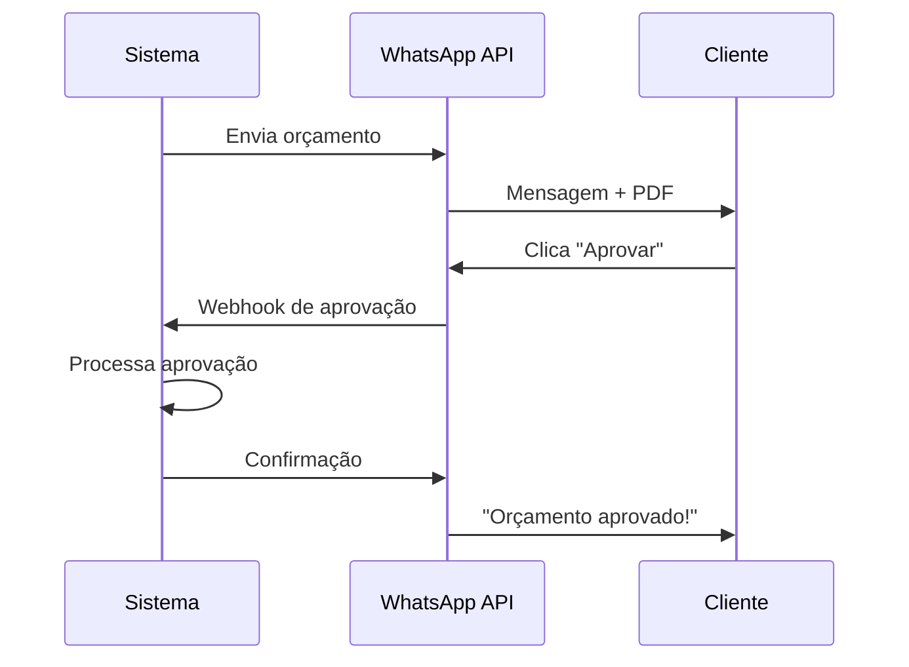
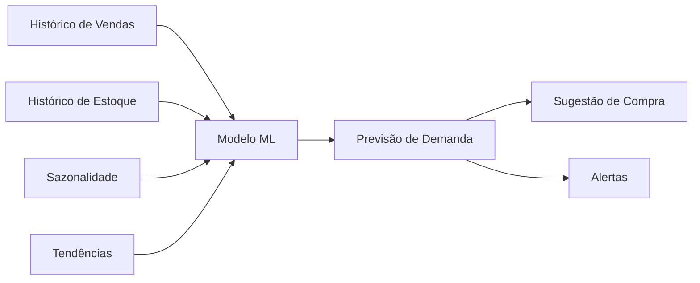

# 🚀 Melhorias Futuras - Roadmap ERP Retífica

## 📋 Índice
- [Visão Geral](#visão-geral)
- [Curto Prazo (Q1-Q2 2025)](#curto-prazo-q1-q2-2025)
- [Médio Prazo (Q3-Q4 2025)](#médio-prazo-q3-q4-2025)
- [Longo Prazo (2026+)](#longo-prazo-2026)
- [Integrações Planejadas](#integrações-planejadas)
- [Otimizações de Performance](#otimizações-de-performance)
- [Melhorias de UX](#melhorias-de-ux)
- [Novos Módulos](#novos-módulos)

---

## 🎯 Visão Geral

Este documento apresenta o roadmap de evolução do ERP Retífica, organizado por prioridade e prazo de implementação.

### Metodologia de Priorização

Usamos o framework **RICE Score** para priorizar funcionalidades:
- **R**each (Alcance): Quantos usuários beneficiados
- **I**mpact (Impacto): Qual o impacto no negócio
- **C**onfidence (Confiança): Certeza da estimativa
- **E**ffort (Esforço): Tempo de desenvolvimento

**Fórmula**: RICE = (Reach × Impact × Confidence) / Effort

---

## 📅 Curto Prazo (Q1-Q2 2025)

### 1. Integração WhatsApp Business API ⭐⭐⭐⭐⭐
**RICE Score**: 9.5/10  
**Prazo**: Q1 2025  
**Esforço**: 2-3 semanas

**Funcionalidades**:
- ✅ Envio automático de orçamentos por WhatsApp
- ✅ Notificações de status da OS para clientes
- ✅ Aprovação de orçamentos via WhatsApp (com link)
- ✅ Chatbot para consulta de status de OS
- ✅ Confirmação de entrega via WhatsApp

**Benefícios**:
- Redução de 70% no tempo de aprovação de orçamentos
- Maior engajamento com clientes
- Automatização de comunicação

**Integração**:

---

### 2. Geração Automática de Notas Fiscais ⭐⭐⭐⭐⭐
**RICE Score**: 9.0/10  
**Prazo**: Q1 2025  
**Esforço**: 3-4 semanas

**Funcionalidades**:
- ✅ Geração de NF-e ao finalizar OS
- ✅ Envio automático por e-mail
- ✅ Integração com SEFAZ
- ✅ Cancelamento e carta de correção
- ✅ Consulta de status na SEFAZ
- ✅ XML e DANFE em PDF

**Benefícios**:
- Elimina digitação manual
- Reduz erros fiscais
- Agiliza faturamento

**Módulos Impactados**:
- Fiscal
- Financeiro (Contas a Receber)
- Operações (OS)

---

### 3. Dashboard Personalizável (Drag & Drop) ⭐⭐⭐⭐
**RICE Score**: 7.5/10  
**Prazo**: Q2 2025  
**Esforço**: 3-4 semanas

**Funcionalidades**:
- ✅ Arrastar e soltar KPIs
- ✅ Redimensionar cards
- ✅ Adicionar/remover widgets
- ✅ Salvar layouts personalizados
- ✅ Compartilhar layouts com equipe
- ✅ Biblioteca de widgets pré-configurados

**Widgets Disponíveis**:
- KPIs numéricos
- Gráficos (linha, barra, pizza)
- Tabelas de dados
- Listas de atividades
- Calendário
- Mapa de calor

---

### 4. Aplicativo Mobile (PWA) ⭐⭐⭐⭐
**RICE Score**: 8.0/10  
**Prazo**: Q2 2025  
**Esforço**: 4-6 semanas

**Funcionalidades**:
- ✅ Instalável (PWA)
- ✅ Funciona offline (cache)
- ✅ Notificações push
- ✅ Câmera para fotos de OS
- ✅ Assinatura digital (touchscreen)
- ✅ Leitura de código de barras

**Benefícios**:
- Mobilidade para técnicos
- Registro de dados em campo
- Redução de papel

---

### 5. Assinatura Digital de Documentos ⭐⭐⭐⭐
**RICE Score**: 7.0/10  
**Prazo**: Q2 2025  
**Esforço**: 2-3 semanas

**Funcionalidades**:
- ✅ Assinatura de orçamentos
- ✅ Assinatura de contratos
- ✅ Assinatura de recebimento
- ✅ Validade jurídica (ICP-Brasil)
- ✅ Certificado A1 e A3
- ✅ Histórico de assinaturas

**Integração**:
- Parceria com Clicksign ou DocuSign
- API REST

---

## 📅 Médio Prazo (Q3-Q4 2025)

### 6. Inteligência Artificial - Previsão de Demanda ⭐⭐⭐⭐⭐
**RICE Score**: 9.5/10  
**Prazo**: Q3 2025  
**Esforço**: 6-8 semanas

**Funcionalidades**:
- ✅ Previsão de peças mais demandadas
- ✅ Sugestão de compra antecipada
- ✅ Otimização de estoque
- ✅ Detecção de sazonalidade
- ✅ Alertas de ruptura iminente

**Tecnologia**:
- Machine Learning (Python)
- Algoritmos: ARIMA, Prophet, LSTM
- Edge Function para processamento

**Modelo de Dados**:

---

### 7. Integração com ERPs Externos ⭐⭐⭐⭐
**RICE Score**: 7.5/10  
**Prazo**: Q3 2025  
**Esforço**: 8-10 semanas

**ERPs Suportados**:
- ✅ TOTVS Protheus
- ✅ SAP Business One
- ✅ Omie
- ✅ Bling
- ✅ Tiny ERP

**Dados Sincronizados**:
- Clientes
- Produtos/Serviços
- Notas Fiscais
- Contas a Pagar/Receber
- Estoque

**Tipo de Integração**:
- API REST (bidirecional)
- Sincronização em tempo real ou agendada

---

### 8. Portal do Cliente ⭐⭐⭐⭐
**RICE Score**: 8.0/10  
**Prazo**: Q4 2025  
**Esforço**: 6-8 semanas

**Funcionalidades**:
- ✅ Login para clientes (self-service)
- ✅ Acompanhamento de OS em tempo real
- ✅ Visualização de orçamentos
- ✅ Aprovação de orçamentos online
- ✅ Histórico de serviços
- ✅ Download de documentos (NF, Garantias)
- ✅ Chat com equipe

**Interface**:
- Subdomínio: portal.erpretifica.com.br
- Totalmente responsivo
- Autenticação segura

---

### 9. Relatórios Customizáveis (Report Builder) ⭐⭐⭐⭐
**RICE Score**: 7.0/10  
**Prazo**: Q4 2025  
**Esforço**: 5-6 semanas

**Funcionalidades**:
- ✅ Construtor visual de relatórios
- ✅ Arrastar campos
- ✅ Filtros avançados
- ✅ Agrupamentos e totalizadores
- ✅ Gráficos personalizados
- ✅ Exportação (PDF, Excel, CSV)
- ✅ Agendamento de envio por e-mail

**Fontes de Dados**:
- Todas as tabelas do sistema
- Joins entre tabelas
- Cálculos personalizados

---

### 10. Módulo de CRM ⭐⭐⭐
**RICE Score**: 6.5/10  
**Prazo**: Q4 2025  
**Esforço**: 6-8 semanas

**Funcionalidades**:
- ✅ Pipeline de vendas
- ✅ Funil de conversão
- ✅ Gestão de leads
- ✅ Histórico de contatos
- ✅ Tarefas e follow-ups
- ✅ E-mail marketing integrado
- ✅ Relatórios de conversão

**Integração com Módulos**:
- Clientes
- Orçamentos
- Ordens de Serviço

---

## 📅 Longo Prazo (2026+)

### 11. Blockchain para Rastreabilidade ⭐⭐⭐
**RICE Score**: 5.0/10  
**Prazo**: 2026  
**Esforço**: 12-16 semanas

**Objetivo**: Garantir imutabilidade do histórico de manutenções.

**Funcionalidades**:
- ✅ Registro de todas as etapas em blockchain
- ✅ Certificado digital imutável
- ✅ QR Code para consulta pública
- ✅ Prova de autenticidade

**Casos de Uso**:
- Motores de equipamentos críticos (aviação, saúde)
- Rastreabilidade para auditorias
- Garantia estendida

---

### 12. Realidade Aumentada (AR) para Treinamento ⭐⭐⭐
**RICE Score**: 4.5/10  
**Prazo**: 2026  
**Esforço**: 16-20 semanas

**Objetivo**: Treinar técnicos com realidade aumentada.

**Funcionalidades**:
- ✅ Visualização 3D de componentes
- ✅ Instruções passo-a-passo em AR
- ✅ Simulação de desmontagem/montagem
- ✅ Compatível com óculos AR (HoloLens, Magic Leap)

---

### 13. Marketplace de Peças ⭐⭐⭐
**RICE Score**: 6.0/10  
**Prazo**: 2026  
**Esforço**: 20-24 semanas

**Objetivo**: Conectar retíficas e fornecedores em plataforma única.

**Funcionalidades**:
- ✅ Catálogo unificado de peças
- ✅ Comparação de preços
- ✅ Compra direta na plataforma
- ✅ Avaliação de fornecedores
- ✅ Rastreamento de entregas

---

## 🔗 Integrações Planejadas

### WhatsApp Business API ✅ (Q1 2025)
- Notificações automáticas
- Aprovação de orçamentos
- Consulta de status

### Certificadoras Digitais (ICP-Brasil) ✅ (Q2 2025)
- Assinatura digital
- NF-e

### Gateways de Pagamento (Q3 2025)
- Mercado Pago
- PagSeguro
- Stripe
- Cielo

### Transportadoras (Q4 2025)
- Correios
- Jadlog
- Total Express
- Rastreamento automático

### Plataformas de E-commerce (2026)
- Integração com lojas online
- Sincronização de pedidos

---

## ⚡ Otimizações de Performance

### Implementadas ✅
- React Query com cache inteligente
- WebSocket para atualizações em tempo real
- Lazy loading de componentes
- Memoization de cálculos pesados

### Planejadas 🔄

**Q2 2025**:
- ✅ Server-side rendering (SSR)
- ✅ Edge caching (CDN)
- ✅ Image optimization automática
- ✅ Code splitting avançado

**Q3 2025**:
- ✅ Service Workers para offline
- ✅ Background sync
- ✅ Prefetching inteligente

**Q4 2025**:
- ✅ GraphQL (substituir REST em queries complexas)
- ✅ Database query optimization
- ✅ Índices adicionais no PostgreSQL

---

## 🎨 Melhorias de UX

### Q2 2025
- ✅ Onboarding interativo (tutorial guiado)
- ✅ Tooltips contextuais
- ✅ Modo escuro aprimorado
- ✅ Animações suaves (Framer Motion)

### Q3 2025
- ✅ Comandos de voz (busca e navegação)
- ✅ Atalhos de teclado customizáveis
- ✅ Temas personalizados (cores da empresa)

### Q4 2025
- ✅ Acessibilidade WCAG 2.1 AA completa
- ✅ Suporte a leitores de tela
- ✅ Navegação por teclado aprimorada
- ✅ Alto contraste

---

## 🆕 Novos Módulos

### Módulo de Manutenção Preventiva (Q3 2025)
**Funcionalidades**:
- Cadastro de equipamentos da oficina
- Planos de manutenção periódica
- Alertas de manutenção vencida
- Histórico de manutenções
- Controle de calibração de instrumentos

### Módulo de Garantia Estendida (Q4 2025)
**Funcionalidades**:
- Venda de garantias estendidas
- Controle de apólices
- Acionamento de garantias
- Relatórios de sinistralidade

### Módulo de Projetos (2026)
**Funcionalidades**:
- Gestão de projetos especiais
- Cronogramas (Gantt)
- Alocação de recursos
- Gestão de custos
- Acompanhamento de milestones

---

## 🗳️ Como Sugerir Melhorias

### Canais Oficiais

1. **Portal de Sugestões**
   - portal.erpretifica.com.br/sugestoes
   - Vote em sugestões existentes
   - Crie novas sugestões

2. **E-mail**
   - sugestoes@erpretifica.com.br
   - Descreva detalhadamente a funcionalidade

3. **Reuniões Trimestrais**
   - Participem de sessões de feedback com a equipe

### Processo de Avaliação

1. **Coleta**: Todas as sugestões são coletadas
2. **Triagem**: Equipe analisa viabilidade
3. **Priorização**: Cálculo do RICE Score
4. **Votação**: Comunidade vota nas mais relevantes
5. **Roadmap**: Top sugestões entram no roadmap
6. **Desenvolvimento**: Implementação e release
7. **Feedback**: Validação com usuários

---

## 📊 Métricas de Sucesso

Acompanhamos o sucesso das melhorias através de:

- **Adoção**: % de usuários usando a nova funcionalidade
- **Satisfação**: NPS (Net Promoter Score)
- **Performance**: Tempo de resposta, uptime
- **ROI**: Retorno sobre investimento
- **Redução de Custos**: Economia gerada
- **Produtividade**: Tarefas concluídas / tempo

---

## 🔗 Links Relacionados

- [Sistema Blueprint](./system-blueprint.md)
- [Guia de Início Rápido](./quick-start.md)
- [FAQ](./faq.md)
- [Fluxos de Usuários](./user-flows/complete-user-journeys.md)

---

**Última Atualização**: 2025-01-14  
**Versão**: 3.0.0  
**Roadmap atualizado trimestralmente**
