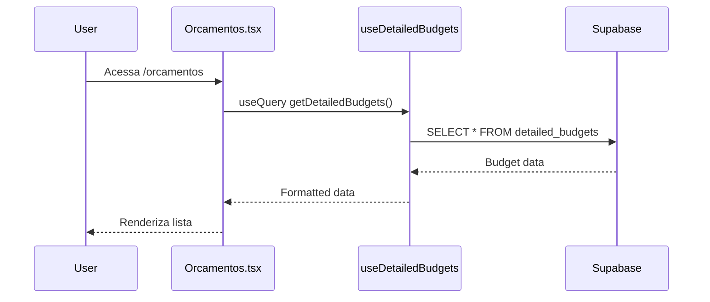
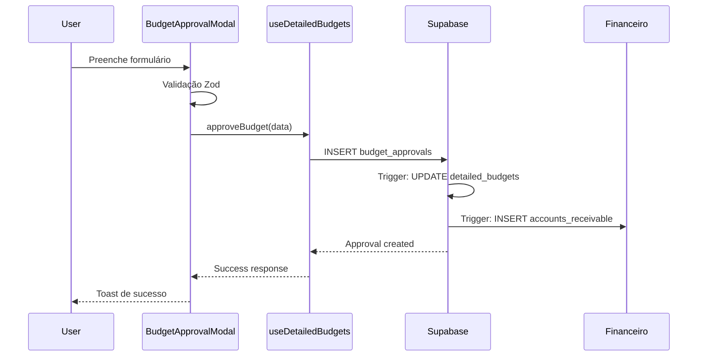

# Arquitetura de Componentes - Módulo de Orçamentação

## Visão Geral da Arquitetura

O módulo de orçamentação segue o padrão de Clean Architecture com separação clara de responsabilidades:

```
src/
├── hooks/
│   └── useDetailedBudgets.ts          # Business Logic Layer
├── components/
│   └── budgets/
│       ├── BudgetApprovalModal.tsx    # Presentation Layer
│       └── BudgetDetails.tsx          # Presentation Layer
└── pages/
    └── Orcamentos.tsx                 # View Layer
```

## Camadas da Arquitetura

### 1. Data Access Layer (Supabase)
**Responsabilidade**: Acesso aos dados e persistência

**Tabelas Envolvidas**:
- `detailed_budgets`: Orçamentos detalhados
- `budget_approvals`: Aprovações documentadas
- `accounts_receivable`: Integração financeira automática

**Policies RLS**:
```sql
-- Acesso por organização
CREATE POLICY "Users can view budgets for their org"
ON detailed_budgets FOR SELECT
USING (order_id IN (
  SELECT id FROM orders WHERE org_id = current_org_id()
));
```

### 2. Business Logic Layer (Hooks)
**Arquivo**: `useDetailedBudgets.ts`

**Responsabilidades**:
- Validação de regras de negócio
- Formatação de dados
- Gerenciamento de estado
- Comunicação com APIs

**Estrutura**:
```typescript
export function useDetailedBudgets() {
  // Estado interno
  const [loading, setLoading] = useState(false);
  
  // Handlers de erro padronizados
  const handleError = (error: any, message: string) => { };
  const handleSuccess = (message: string) => { };
  
  // Operações CRUD
  const getDetailedBudgets = async () => { };
  const createDetailedBudget = async () => { };
  const updateDetailedBudget = async () => { };
  const approveBudget = async () => { };
  
  return { /* API pública */ };
}
```

### 3. Presentation Layer (Componentes)

#### BudgetApprovalModal
**Responsabilidade**: Interface de aprovação de orçamentos

**Props Interface**:
```typescript
interface BudgetApprovalModalProps {
  budget: DetailedBudget | null;
  open: boolean;
  onOpenChange: (open: boolean) => void;
  onApprovalCreated: (approval: any) => void;
}
```

**Funcionalidades**:
- Formulário com validação Zod
- Upload de documentos
- Seleção de itens para aprovação parcial
- Estados de carregamento e erro

#### BudgetDetails  
**Responsabilidade**: Exibição detalhada de orçamentos

**Estrutura de Layout**:
```
┌─────────────────────────────────┐
│ Header + Actions                │
├─────────────────────────────────┤
│ Cliente | Resumo | Informações  │
│ Info    | Financ.| Adicionais   │
├─────────────────────────────────┤
│ Lista de Serviços              │
├─────────────────────────────────┤
│ Lista de Peças                 │
├─────────────────────────────────┤
│ Histórico de Aprovações        │
└─────────────────────────────────┘
```

### 4. View Layer (Páginas)

#### Orcamentos.tsx
**Responsabilidade**: Orquestração da interface principal

**Estrutura do Estado**:
```typescript
const [searchTerm, setSearchTerm] = useState("");
const [statusFilter, setStatusFilter] = useState("todos");
const [componentFilter, setComponentFilter] = useState("todos");
const [selectedBudget, setSelectedBudget] = useState<DetailedBudget | null>(null);
const [isApprovalModalOpen, setIsApprovalModalOpen] = useState(false);
const [isDetailsModalOpen, setIsDetailsModalOpen] = useState(false);
```

## Padrões de Design Implementados

### 1. Container/Presenter Pattern
- **Container**: `Orcamentos.tsx` gerencia estado e lógica
- **Presenter**: Componentes focados em apresentação

### 2. Custom Hooks Pattern
- **Separação**: Lógica de negócio isolada em hooks
- **Reutilização**: Pode ser usado em outros componentes
- **Testabilidade**: Facilita testes unitários

### 3. Compound Components Pattern
```typescript
<Dialog open={isDetailsModalOpen} onOpenChange={setIsDetailsModalOpen}>
  <DialogContent>
    <DialogHeader>
      <DialogTitle>Detalhes do Orçamento</DialogTitle>
    </DialogHeader>
    <BudgetDetails budget={selectedBudget} />
  </DialogContent>
</Dialog>
```

### 4. Render Props Pattern
```typescript
const { data: budgets, refetch } = useQuery({
  queryKey: ['detailed-budgets'],
  queryFn: () => getDetailedBudgets(),
});
```

## Fluxo de Dados

### 1. Carregamento Inicial


### 2. Processo de Aprovação


## Gerenciamento de Estado

### 1. Estado Local (useState)
- **Formulários**: Dados temporários de entrada
- **UI State**: Modais abertos, loading states
- **Filtros**: Busca e filtros de interface

### 2. Estado Servidor (React Query)
- **Cache**: Dados de orçamentos em cache
- **Sincronização**: Atualizações automáticas
- **Optimistic Updates**: Updates otimistas

### 3. Estado Global (Context)
- **Organização**: Contexto da organização atual
- **Usuário**: Dados do usuário autenticado

## Validação e Tratamento de Erros

### 1. Validação Frontend (Zod)
```typescript
const approvalSchema = z.object({
  approval_type: z.enum(['total', 'partial', 'rejected'], {
    required_error: "Tipo de aprovação é obrigatório"
  }),
  approval_method: z.enum(['signature', 'whatsapp', 'email', 'verbal'], {
    required_error: "Método de aprovação é obrigatório"  
  }),
  approved_by_customer: z.string().min(1, "Nome obrigatório"),
});
```

### 2. Tratamento de Erros
- **Toast Messages**: Feedback visual imediato
- **Loading States**: Indicadores de carregamento
- **Fallback UI**: Interface de erro graceful

## Otimizações de Performance

### 1. Lazy Loading
- **Componentes**: Carregamento sob demanda
- **Dados**: Paginação e filtros inteligentes

### 2. Memoização
- **React.memo**: Componentes puros
- **useMemo**: Cálculos complexos
- **useCallback**: Funções estáveis

### 3. Cache Strategy
- **React Query**: Cache automático
- **Stale-While-Revalidate**: Dados sempre frescos

## Acessibilidade

### 1. Keyboard Navigation
- **Tab Order**: Ordem lógica de navegação
- **Focus Management**: Foco em modais
- **Escape Key**: Fechamento de diálogos

### 2. Screen Reader Support
- **ARIA Labels**: Descrições adequadas
- **Semantic HTML**: Estrutura semântica
- **Role Attributes**: Papéis definidos

### 3. Visual Accessibility
- **Color Contrast**: Contraste adequado
- **Focus Indicators**: Indicadores visuais
- **Responsive Design**: Adaptação mobile

## Testes

### 1. Testes Unitários
- **Hooks**: Lógica isolada testável
- **Validação**: Schemas Zod
- **Utilities**: Funções puras

### 2. Testes de Integração
- **Components**: Interação entre componentes
- **API**: Integração com Supabase
- **User Flows**: Fluxos completos

### 3. Testes E2E
- **Critical Paths**: Fluxos críticos
- **Aprovação**: Processo completo
- **Responsividade**: Diferentes dispositivos