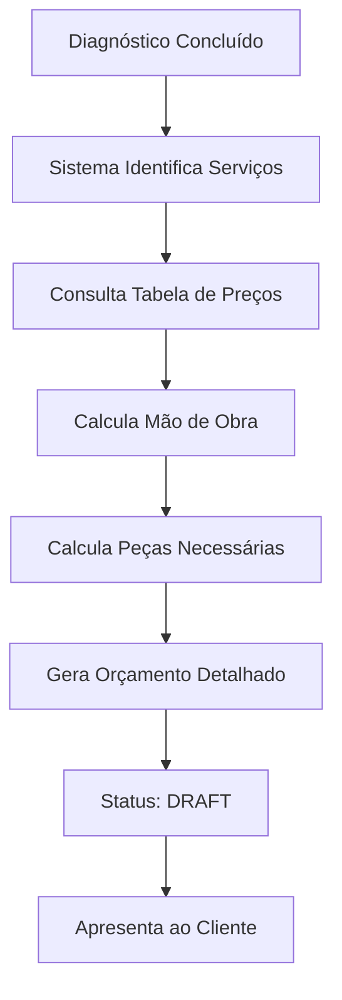
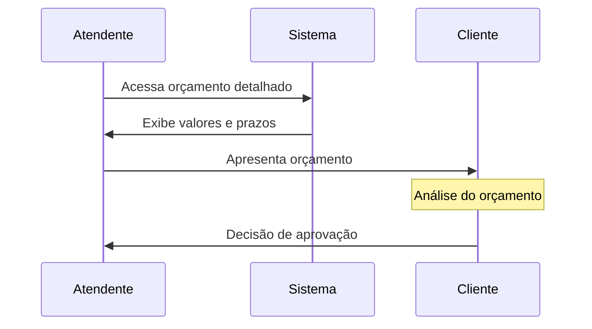
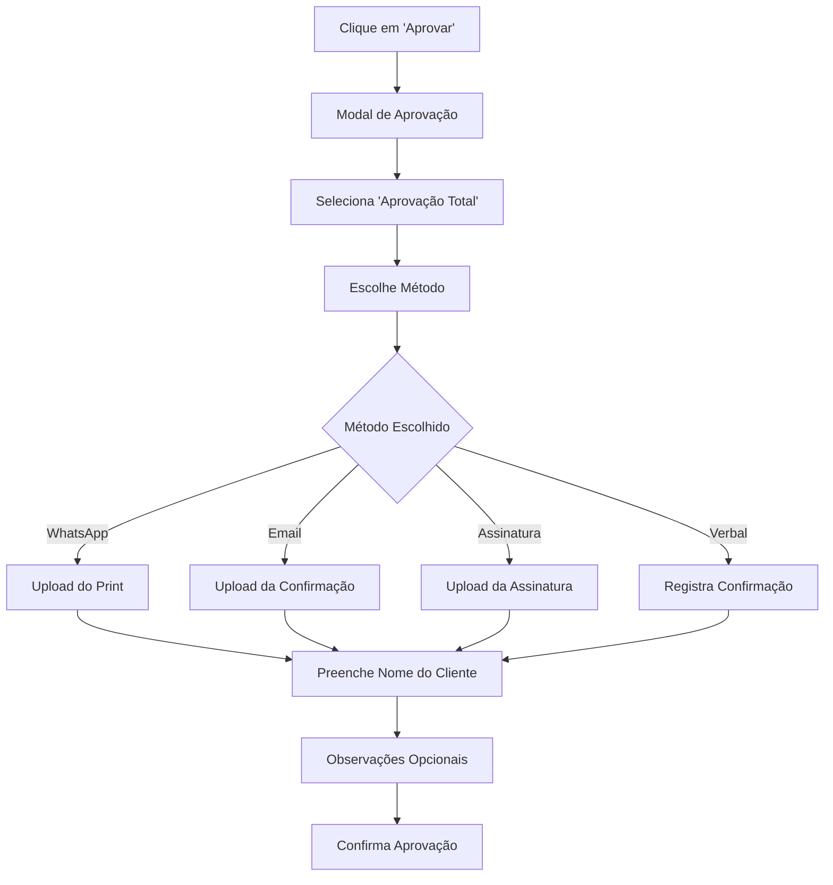
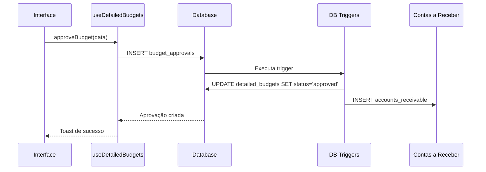
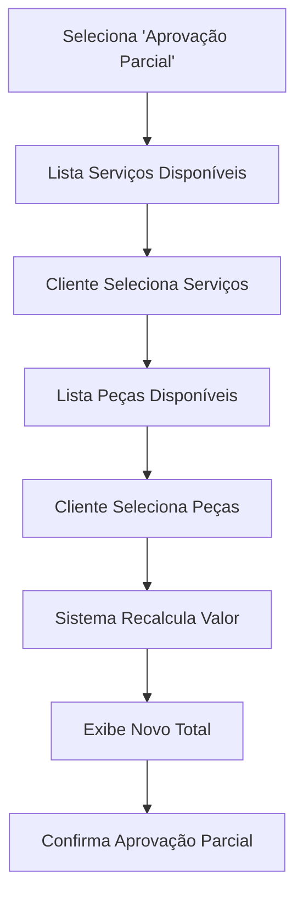
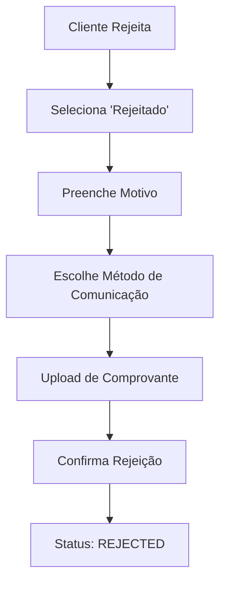
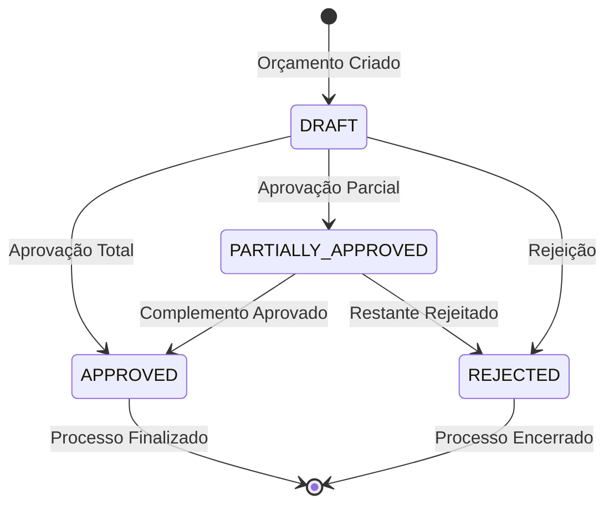

# Fluxo de Aprovação de Orçamentos

## Visão Geral
Documentação completa do fluxo de aprovação de orçamentos detalhados, desde a geração até a integração com o financeiro.

## Atores do Sistema
- **Atendente**: Gera orçamentos e registra aprovações
- **Cliente**: Aprova/rejeita orçamentos
- **Sistema**: Automatiza integrações e notificações

## Fluxo Principal: Aprovação Total

### 1. Geração do Orçamento


**Dados Gerados**:
- Número do orçamento: `ORC-2024-0001`
- Lista de serviços com horas e valores
- Lista de peças com quantidades e preços
- Prazo de entrega estimado
- Período de garantia

### 2. Apresentação ao Cliente


**Informações Apresentadas**:
- Resumo financeiro detalhado
- Breakdown de serviços por componente
- Lista de peças com especificações
- Prazos de execução e entrega
- Condições de garantia

### 3. Registro da Aprovação Total

#### 3.1 Interface de Aprovação


#### 3.2 Validação dos Dados
**Campos Obrigatórios**:
- Tipo de aprovação: `total`
- Método de aprovação: `whatsapp|email|signature|verbal`
- Nome do aprovador: string não vazia
- Documento comprobatório: quando aplicável

**Validação Schema (Zod)**:
```typescript
const approvalSchema = z.object({
  approval_type: z.literal('total'),
  approval_method: z.enum(['signature', 'whatsapp', 'email', 'verbal']),
  approved_by_customer: z.string().min(1, "Nome obrigatório"),
  approval_notes: z.string().optional(),
});
```

### 4. Processamento da Aprovação


#### 4.1 Dados Salvos na Aprovação
```json
{
  "id": "uuid",
  "budget_id": "uuid_do_orcamento",
  "approval_type": "total",
  "approved_services": [...todos_servicos],
  "approved_parts": [...todas_pecas],
  "approved_amount": 1250.00,
  "approval_method": "whatsapp",
  "approval_document": {
    "file_path": "approval_uuid_timestamp.jpg", 
    "file_name": "print_aprovacao.jpg",
    "uploaded_at": "2024-01-15T10:30:00Z"
  },
  "customer_signature": null,
  "approval_notes": "Cliente aprovou via WhatsApp",
  "approved_by_customer": "João Silva",
  "approved_at": "2024-01-15T10:30:00Z",
  "registered_by": "uuid_atendente"
}
```

### 5. Integrações Automáticas

#### 5.1 Geração de Conta a Receber
**Trigger SQL**: `generate_accounts_receivable()`
```sql
INSERT INTO accounts_receivable (
  budget_id,
  order_id, 
  customer_id,
  amount,
  due_date,
  installment_number,
  total_installments
) VALUES (
  NEW.id,
  NEW.order_id,
  order.customer_id,
  NEW.total_amount,
  CURRENT_DATE + INTERVAL '30 days',
  1,
  1
);
```

#### 5.2 Atualização de Status
- **Orçamento**: `draft` → `approved`
- **Ordem de Serviço**: Pode avançar para produção
- **Alertas**: Remove alertas de pendência

## Fluxo Alternativo: Aprovação Parcial

### 1. Seleção de Itens


### 2. Recálculo Automático
**JavaScript**:
```typescript
const calculatePartialAmount = () => {
  const selectedServices = formData.approved_services.map(index => 
    budget.services[parseInt(index)]
  );
  const selectedParts = formData.approved_parts.map(index => 
    budget.parts[parseInt(index)]
  );
  
  return [
    ...selectedServices.map(s => s.total || 0),
    ...selectedParts.map(p => p.total || 0)
  ].reduce((sum, value) => sum + value, 0);
};
```

### 3. Consequências da Aprovação Parcial
- **Status**: `partially_approved`
- **Conta a Receber**: Valor parcial
- **Itens Não Aprovados**: Ficam pendentes
- **Novo Orçamento**: Pode ser gerado para itens restantes

## Fluxo de Exceção: Rejeição

### 1. Registro da Rejeição


### 2. Ações Automáticas na Rejeição
- **Status**: `rejected`
- **Alertas**: Remove da lista de pendentes
- **Auditoria**: Registra motivo da rejeição
- **Workflow**: Para processo de produção

## Estados do Orçamento

### Diagrama de Estados


### Transições Permitidas
| Estado Atual | Próximo Estado | Condição |
|--------------|----------------|----------|
| `draft` | `approved` | Aprovação total |
| `draft` | `partially_approved` | Aprovação parcial |
| `draft` | `rejected` | Rejeição |
| `partially_approved` | `approved` | Aprovação do restante |
| `partially_approved` | `rejected` | Rejeição do restante |

## Documentação e Comprovantes

### Tipos de Documento Aceitos
1. **WhatsApp**: Print da conversa com aprovação
2. **E-mail**: Forward ou screenshot do e-mail
3. **Assinatura**: Digitalização do documento assinado
4. **Verbal**: Registro manual da confirmação

### Armazenamento Seguro
- **Bucket**: `reports` (Supabase Storage)
- **Path**: `approvals/{budget_id}/{timestamp}.{ext}`
- **Segurança**: RLS por organização
- **Backup**: Replicação automática

### Metadados Salvos
```json
{
  "file_path": "approvals/uuid/1705321800.jpg",
  "file_name": "aprovacao_whatsapp.jpg", 
  "file_size": 245760,
  "content_type": "image/jpeg",
  "uploaded_at": "2024-01-15T10:30:00Z",
  "uploaded_by": "uuid_atendente"
}
```

## Notificações e Alertas

### 1. Dashboard de Pendências
**Query para Alertas**:
```sql
SELECT COUNT(*) as pending_count
FROM detailed_budgets db
JOIN orders o ON o.id = db.order_id  
WHERE o.org_id = current_org_id()
AND db.status = 'draft'
AND db.created_at < NOW() - INTERVAL '3 days';
```

### 2. Alertas por Prazo
- **3 dias**: Alerta amarelo
- **7 dias**: Alerta laranja  
- **15 dias**: Alerta vermelho
- **30 dias**: Alerta crítico

### 3. Integração Futura
- **E-mail**: Notificações automáticas
- **WhatsApp API**: Lembretes para clientes
- **SMS**: Alertas críticos

## Métricas e Relatórios

### KPIs Principais
- **Taxa de Aprovação**: % de orçamentos aprovados
- **Tempo Médio**: Da criação à aprovação
- **Valor Médio**: Ticket médio dos orçamentos
- **Conversão**: Por método de apresentação

### Relatórios Disponíveis
- **Orçamentos por Status**: Distribuição atual
- **Performance por Período**: Histórico mensal
- **Análise por Cliente**: Perfil de aprovação
- **Eficiência do Processo**: Tempos e gargalos