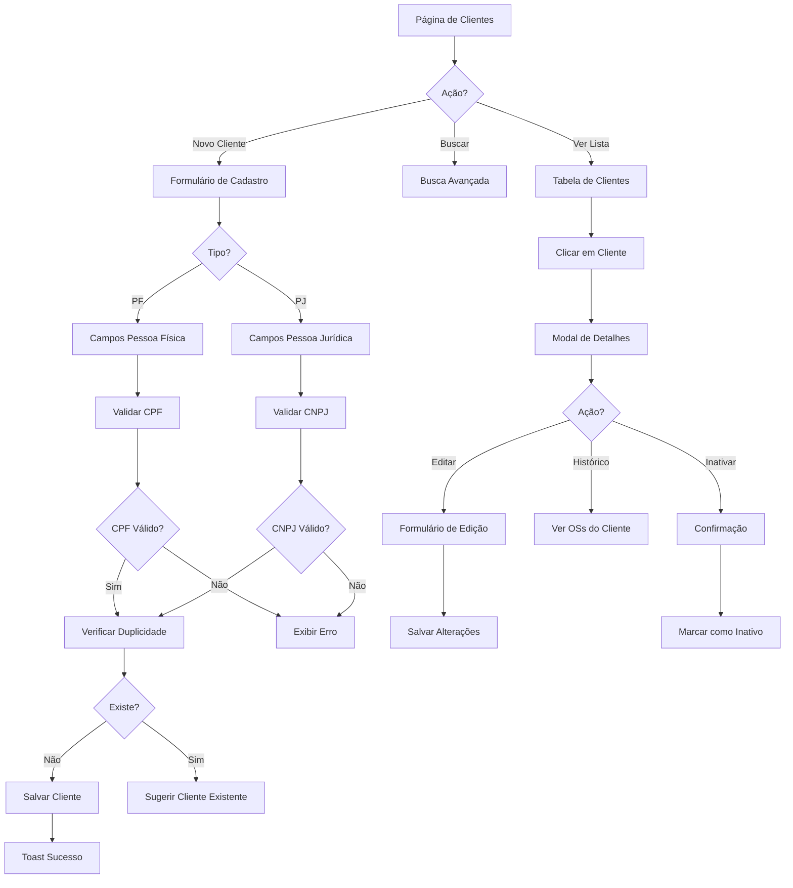
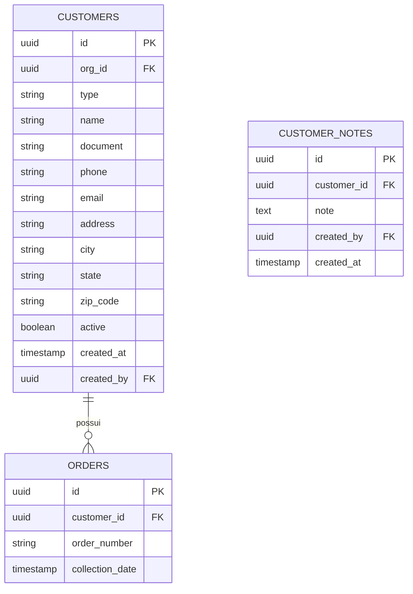

# Módulo de Clientes

## 📋 Visão Geral

Sistema de gestão de clientes (pessoas físicas e jurídicas), incluindo cadastro, edição, busca avançada, histórico de atendimentos e gestão de relacionamento.

## 🎯 Objetivos de Negócio

- **Base de Dados Consolidada**: Centralizar informações de todos os clientes
- **Segmentação PF/PJ**: Distinguir clientes finais de oficinas/revendedores
- **Histórico Completo**: Rastrear todas as interações e OSs do cliente
- **Qualidade de Dados**: Validar CPF/CNPJ, telefones e e-mails
- **Busca Eficiente**: Encontrar clientes rapidamente por múltiplos critérios

## 📊 Métricas de Sucesso

| Métrica | Baseline | Meta |
|---------|----------|------|
| Cadastros duplicados | 8% | ≤ 1% |
| Tempo médio de busca | 45s | ≤ 10s |
| Dados completos (telefone+email) | 60% | ≥ 90% |
| Taxa de erro em validações | 12% | ≤ 2% |
| Satisfação do atendente | - | ≥ 4.5/5 |

## 🏗️ Arquitetura do Módulo

### Fluxo de Gestão de Clientes



### Estrutura de Dados



## 📁 Estrutura de Arquivos

```
src/
├── pages/
│   └── Clientes.tsx                 # Página principal
├── components/
│   └── clientes/
│       ├── ClientesList.tsx         # Tabela de clientes
│       ├── ClienteForm.tsx          # Formulário cadastro/edição
│       ├── ClienteDetails.tsx       # Modal de detalhes
│       ├── ClienteSearch.tsx        # Busca avançada
│       ├── ClienteHistory.tsx       # Histórico de OSs
│       └── ClienteNotes.tsx         # Notas/observações
├── hooks/
│   └── useClientes.ts               # Lógica de clientes
└── lib/
    └── validations/
        └── customerSchema.ts        # Validação Zod
```

## 🗄️ Tabelas do Banco de Dados

### `customers`

```sql
CREATE TABLE customers (
  id UUID PRIMARY KEY DEFAULT gen_random_uuid(),
  org_id UUID NOT NULL REFERENCES organizations(id),
  
  -- Tipo e Identificação
  type TEXT NOT NULL CHECK (type IN ('pf', 'pj')),
  name TEXT NOT NULL,
  document TEXT NOT NULL,  -- CPF ou CNPJ (apenas números)
  
  -- Contato
  phone TEXT NOT NULL,
  email TEXT,
  
  -- Endereço
  address TEXT,
  city TEXT,
  state TEXT,
  zip_code TEXT,
  
  -- Metadados
  active BOOLEAN DEFAULT true,
  notes TEXT,
  created_at TIMESTAMP WITH TIME ZONE DEFAULT now(),
  created_by UUID REFERENCES auth.users(id),
  updated_at TIMESTAMP WITH TIME ZONE DEFAULT now(),
  
  -- Constraints
  CONSTRAINT unique_document_per_org UNIQUE (org_id, document),
  CONSTRAINT valid_phone CHECK (phone ~ '^\(\d{2}\) \d{4,5}-\d{4}$'),
  CONSTRAINT valid_email CHECK (email ~* '^[A-Za-z0-9._%+-]+@[A-Za-z0-9.-]+\.[A-Z|a-z]{2,}$' OR email IS NULL),
  CONSTRAINT valid_cpf CHECK (
    type = 'pj' OR 
    (type = 'pf' AND LENGTH(document) = 11)
  ),
  CONSTRAINT valid_cnpj CHECK (
    type = 'pf' OR 
    (type = 'pj' AND LENGTH(document) = 14)
  )
);

-- Índices
CREATE INDEX idx_customers_org ON customers(org_id);
CREATE INDEX idx_customers_document ON customers(document);
CREATE INDEX idx_customers_name ON customers(name);
CREATE INDEX idx_customers_active ON customers(active);
CREATE INDEX idx_customers_type ON customers(type);

-- Full-text search
CREATE INDEX idx_customers_search ON customers USING gin(
  to_tsvector('portuguese', name || ' ' || COALESCE(email, '') || ' ' || phone)
);

-- Trigger para updated_at
CREATE TRIGGER update_customers_updated_at
BEFORE UPDATE ON customers
FOR EACH ROW
EXECUTE FUNCTION update_updated_at_column();
```

### `customer_notes` (opcional - para notas adicionais)

```sql
CREATE TABLE customer_notes (
  id UUID PRIMARY KEY DEFAULT gen_random_uuid(),
  customer_id UUID NOT NULL REFERENCES customers(id) ON DELETE CASCADE,
  note TEXT NOT NULL,
  created_by UUID REFERENCES auth.users(id),
  created_at TIMESTAMP WITH TIME ZONE DEFAULT now()
);

CREATE INDEX idx_customer_notes_customer ON customer_notes(customer_id);
```

## 🎨 Interface do Usuário

### Página Principal: `/clientes`

```
┌───────────────────────────────────────────────────────┐
│  🏠 Dashboard > Clientes                              │
├───────────────────────────────────────────────────────┤
│                                                       │
│  GESTÃO DE CLIENTES                                  │
│                                                       │
│  [🔍 Buscar por nome, CPF/CNPJ, telefone...]          │
│  [Filtro: Todos ▼] [Tipo: Todos ▼] [+ Novo Cliente] │
│                                                       │
│  ┌─────────────────────────────────────────────────┐ │
│  │ Nome/Razão Social │ Documento │ Telefone │ ...  │ │
│  ├─────────────────────────────────────────────────┤ │
│  │ João Silva        │ 123.456.. │ (11)999.. │ Ver │ │
│  │ Oficina Central   │ 12.345... │ (11)333.. │ Ver │ │
│  │ Maria Santos      │ 987.654.. │ (11)988.. │ Ver │ │
│  │ ...               │ ...       │ ...       │ ... │ │
│  └─────────────────────────────────────────────────┘ │
│                                                       │
│  Mostrando 15 de 247 clientes                        │
│  [← Anterior] [1] [2] [3] ... [17] [Próximo →]      │
│                                                       │
└───────────────────────────────────────────────────────┘
```

### Modal: Novo Cliente

```
┌─────────────────────────────────────┐
│  ➕ Novo Cliente                     │
├─────────────────────────────────────┤
│                                     │
│  Tipo de Cliente:                   │
│  ⚪ Pessoa Física  ⚪ Oficina (PJ)   │
│                                     │
│  Nome/Razão Social: *               │
│  [_________________________]        │
│                                     │
│  CPF/CNPJ: *                        │
│  [_________________________]        │
│  ✓ CPF válido                       │
│                                     │
│  Telefone: *                        │
│  [(__)_____-____]                   │
│                                     │
│  E-mail:                            │
│  [_________________________]        │
│                                     │
│  ━━━ Endereço (opcional) ━━━        │
│                                     │
│  Logradouro:                        │
│  [_________________________]        │
│                                     │
│  Cidade:        Estado:             │
│  [__________]   [SP ▼]              │
│                                     │
│  CEP:                               │
│  [_____-___]                        │
│                                     │
│  Observações:                       │
│  [_________________________]        │
│  [_________________________]        │
│                                     │
│  [Cancelar]  [Salvar Cliente]       │
│                                     │
└─────────────────────────────────────┘
```

### Modal: Detalhes do Cliente

```
┌─────────────────────────────────────────────────┐
│  👤 João Silva                    [Editar] [✕]  │
├─────────────────────────────────────────────────┤
│  [Detalhes] [Histórico] [Notas]                 │
├─────────────────────────────────────────────────┤
│                                                 │
│  📋 INFORMAÇÕES BÁSICAS                         │
│  Tipo: Pessoa Física                            │
│  CPF: 123.456.789-00                            │
│  Telefone: (11) 99999-9999                      │
│  E-mail: joao@email.com                         │
│                                                 │
│  📍 ENDEREÇO                                     │
│  Rua das Flores, 123                            │
│  São Paulo - SP                                 │
│  CEP: 01234-567                                 │
│                                                 │
│  📊 ESTATÍSTICAS                                 │
│  Total de OSs: 8                                │
│  Última OS: 15/10/2025                          │
│  Ticket Médio: R$ 4.500,00                      │
│                                                 │
│  ℹ️ Cliente desde: 10/01/2024                   │
│                                                 │
│  [Ver Todas as OSs] [Adicionar Nota]            │
│                                                 │
└─────────────────────────────────────────────────┘
```

## 📐 Regras de Negócio

### RN-CLI-001: Validação de Documento
```typescript
interface DocumentValidation {
  validateCPF: (cpf: string) => boolean;
  validateCNPJ: (cnpj: string) => boolean;
  formatDocument: (doc: string, type: 'pf' | 'pj') => string;
}

const validateCPF = (cpf: string): boolean => {
  const cleaned = cpf.replace(/\D/g, '');
  if (cleaned.length !== 11) return false;
  if (/^(\d)\1+$/.test(cleaned)) return false; // 111.111.111-11
  
  // Algoritmo de validação de CPF
  let sum = 0;
  for (let i = 0; i < 9; i++) {
    sum += parseInt(cleaned.charAt(i)) * (10 - i);
  }
  let digit = 11 - (sum % 11);
  if (digit > 9) digit = 0;
  if (digit !== parseInt(cleaned.charAt(9))) return false;
  
  sum = 0;
  for (let i = 0; i < 10; i++) {
    sum += parseInt(cleaned.charAt(i)) * (11 - i);
  }
  digit = 11 - (sum % 11);
  if (digit > 9) digit = 0;
  if (digit !== parseInt(cleaned.charAt(10))) return false;
  
  return true;
};

const validateCNPJ = (cnpj: string): boolean => {
  const cleaned = cnpj.replace(/\D/g, '');
  if (cleaned.length !== 14) return false;
  if (/^(\d)\1+$/.test(cleaned)) return false;
  
  // Algoritmo de validação de CNPJ
  const weights1 = [5,4,3,2,9,8,7,6,5,4,3,2];
  const weights2 = [6,5,4,3,2,9,8,7,6,5,4,3,2];
  
  let sum = 0;
  for (let i = 0; i < 12; i++) {
    sum += parseInt(cleaned.charAt(i)) * weights1[i];
  }
  let digit = 11 - (sum % 11);
  if (digit > 9) digit = 0;
  if (digit !== parseInt(cleaned.charAt(12))) return false;
  
  sum = 0;
  for (let i = 0; i < 13; i++) {
    sum += parseInt(cleaned.charAt(i)) * weights2[i];
  }
  digit = 11 - (sum % 11);
  if (digit > 9) digit = 0;
  if (digit !== parseInt(cleaned.charAt(13))) return false;
  
  return true;
};
```

### RN-CLI-002: Verificação de Duplicidade
```typescript
const checkDuplicateCustomer = async (
  document: string, 
  orgId: string,
  excludeId?: string
): Promise<{ exists: boolean; customer?: Customer }> => {
  const query = supabase
    .from('customers')
    .select('*')
    .eq('org_id', orgId)
    .eq('document', document.replace(/\D/g, ''));
    
  if (excludeId) {
    query.neq('id', excludeId);
  }
  
  const { data } = await query.single();
  
  return {
    exists: !!data,
    customer: data || undefined
  };
};
```

### RN-CLI-003: Regras de Inativação
```typescript
interface InactivationRules {
  canInactivate: (customerId: string) => Promise<boolean>;
  inactivationReasons: string[];
}

const canInactivate = async (customerId: string): Promise<boolean> => {
  // Verificar OSs ativas
  const { data: activeOrders } = await supabase
    .from('orders')
    .select('id')
    .eq('customer_id', customerId)
    .in('status', ['pending', 'in_progress'])
    .limit(1);
    
  if (activeOrders && activeOrders.length > 0) {
    throw new Error('Cliente possui OSs ativas. Finalize-as antes de inativar.');
  }
  
  return true;
};
```

## ✅ Casos de Uso Principais

### UC-01: Cadastrar Cliente Pessoa Física
**Pré-condição:** Usuário autenticado com permissão  
**Fluxo:**
1. Usuário acessa `/clientes` e clica em "Novo Cliente"
2. Seleciona tipo "Pessoa Física"
3. Preenche: Nome, CPF, Telefone
4. Sistema valida CPF em tempo real
5. Sistema verifica se CPF já existe
6. Preenche campos opcionais (email, endereço)
7. Clica em "Salvar Cliente"
8. Sistema cria cliente e exibe toast de sucesso

**Pós-condição:** Cliente cadastrado e disponível para uso

---

### UC-02: Buscar Cliente
**Pré-condição:** Existem clientes cadastrados  
**Fluxo:**
1. Usuário digita no campo de busca (nome, documento ou telefone)
2. Sistema busca em tempo real com debounce de 300ms
3. Resultados são filtrados e exibidos na tabela
4. Usuário pode aplicar filtros adicionais (tipo, status)

**Pós-condição:** Lista de clientes filtrada

---

### UC-03: Ver Histórico de OSs do Cliente
**Pré-condição:** Cliente selecionado  
**Fluxo:**
1. Usuário clica em "Ver" na linha do cliente
2. Modal abre na aba "Detalhes"
3. Usuário clica na aba "Histórico"
4. Sistema exibe lista de OSs do cliente ordenadas por data
5. Usuário pode clicar em uma OS para ver detalhes

**Pós-condição:** Histórico exibido

## 🔐 Segurança e Permissões

### RLS Policies

```sql
-- Usuários podem ver clientes da sua organização
CREATE POLICY "Users can view customers from their org"
ON customers FOR SELECT
USING (
  org_id IN (
    SELECT organization_id 
    FROM organization_users 
    WHERE user_id = auth.uid() AND is_active = true
  )
);

-- Usuários podem criar clientes na sua organização
CREATE POLICY "Users can create customers in their org"
ON customers FOR INSERT
WITH CHECK (
  org_id IN (
    SELECT organization_id 
    FROM organization_users 
    WHERE user_id = auth.uid() AND is_active = true
  )
);

-- Usuários podem atualizar clientes da sua organização
CREATE POLICY "Users can update customers from their org"
ON customers FOR UPDATE
USING (
  org_id IN (
    SELECT organization_id 
    FROM organization_users 
    WHERE user_id = auth.uid() AND is_active = true
  )
);

-- Apenas admin pode deletar clientes
CREATE POLICY "Only admins can delete customers"
ON customers FOR DELETE
USING (
  org_id IN (
    SELECT ou.organization_id 
    FROM organization_users ou
    JOIN profiles p ON p.id = ou.user_id
    WHERE ou.user_id = auth.uid() 
    AND ou.is_active = true
    AND p.role = 'admin'
  )
);
```

### Matriz de Permissões

| Papel | Criar | Visualizar | Editar | Inativar | Excluir |
|-------|-------|-----------|--------|----------|---------|
| **Atendente** | ✅ | ✅ (todos) | ✅ (todos) | ❌ | ❌ |
| **Consultor** | ✅ | ✅ (todos) | ✅ (seus clientes) | ❌ | ❌ |
| **Gerente** | ✅ | ✅ (todos) | ✅ (todos) | ✅ | ❌ |
| **Admin** | ✅ | ✅ (todos) | ✅ (todos) | ✅ | ✅ |

## 📋 User Stories

| ID | Título | Prioridade | Status |
|----|--------|-----------|--------|
| [US-CLI-001](./user-stories/US-CLI-001.md) | Cadastrar Cliente Pessoa Física | 🔴 Alta | ✅ Done |
| [US-CLI-002](./user-stories/US-CLI-002.md) | Cadastrar Cliente Pessoa Jurídica | 🔴 Alta | ✅ Done |
| [US-CLI-003](./user-stories/US-CLI-003.md) | Validar CPF/CNPJ e Telefone | 🔴 Alta | ✅ Done |
| [US-CLI-004](./user-stories/US-CLI-004.md) | Editar Dados de Cliente | 🟡 Média | ✅ Done |
| [US-CLI-005](./user-stories/US-CLI-005.md) | Buscar e Filtrar Clientes | 🔴 Alta | ✅ Done |
| [US-CLI-006](./user-stories/US-CLI-006.md) | Inativar Cliente | 🟡 Média | ✅ Done |

## 🧪 Estratégia de Testes

### Testes Unitários

```typescript
// validateDocument.test.ts
describe('validateDocument', () => {
  it('deve validar CPF correto', () => {
    expect(validateCPF('123.456.789-09')).toBe(true);
  });
  
  it('deve rejeitar CPF inválido', () => {
    expect(validateCPF('111.111.111-11')).toBe(false);
  });
  
  it('deve validar CNPJ correto', () => {
    expect(validateCNPJ('11.222.333/0001-81')).toBe(true);
  });
});
```

### Testes E2E

```typescript
// clientes.spec.ts
test('deve cadastrar cliente PF com sucesso', async ({ page }) => {
  await page.goto('/clientes');
  await page.click('text=Novo Cliente');
  await page.click('input[value="pf"]');
  await page.fill('[name="name"]', 'João Silva');
  await page.fill('[name="document"]', '123.456.789-09');
  await page.fill('[name="phone"]', '(11) 99999-9999');
  await page.click('button:has-text("Salvar")');
  
  await expect(page.locator('.toast')).toContainText('Cliente cadastrado');
  await expect(page.locator('table')).toContainText('João Silva');
});
```

## 📅 Roadmap Futuro

### Q2 2025
- ✅ CRUD completo de clientes
- ✅ Validações de CPF/CNPJ
- ✅ Busca avançada

### Q3 2025
- 📋 Integração com API ViaCEP (auto-preenchimento endereço)
- 📋 Tags/categorias personalizadas
- 📋 Segmentação automática (VIP, recorrente, etc.)
- 📋 Score de relacionamento

### Q4 2025
- 📋 Histórico de comunicações (email/SMS)
- 📋 Aniversários e datas importantes
- 📋 Programa de fidelidade
- 📋 Exportação de dados (CSV/Excel)

---

**Última atualização:** 2025-10-28  
**Versão:** 1.0  
**Responsável:** Equipe de Produto
