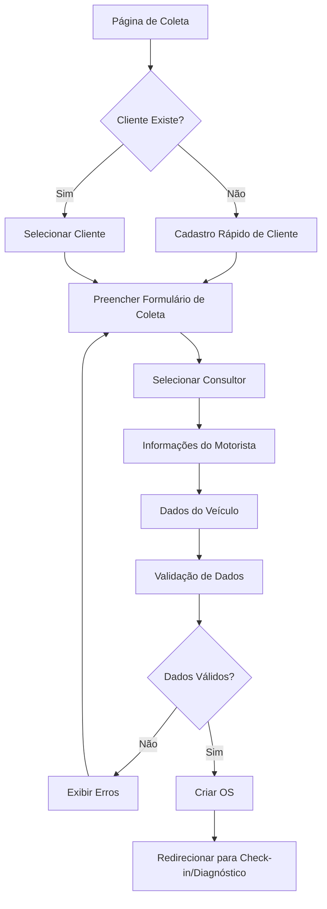
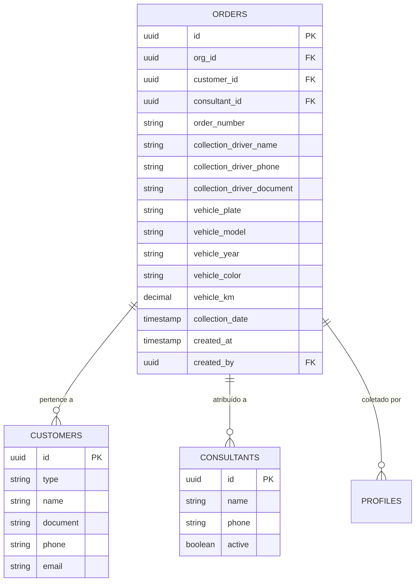

# Módulo de Coleta

## 📋 Visão Geral

Sistema de registro de coleta de motores, primeira etapa do fluxo operacional que captura informações iniciais do cliente, consultor responsável, motorista e veículo para criação da Ordem de Serviço.

## 🎯 Objetivos de Negócio

- **Agilidade no Atendimento**: Reduzir tempo de check-in de 15min para 5min
- **Rastreabilidade Total**: Registrar todas as informações de entrega desde o primeiro contato
- **Gestão de Consultores**: Vincular consultor responsável desde a coleta
- **Validação de Dados**: Garantir dados mínimos para criação de OS válida
- **Experiência do Cliente**: Interface simples e rápida, mesmo para clientes novos

## 📊 Métricas de Sucesso

| Métrica | Baseline | Meta |
|---------|----------|------|
| Tempo médio de coleta | 15 min | ≤ 5 min |
| Taxa de dados completos | 60% | ≥ 95% |
| Coletas com erro | 12% | ≤ 2% |
| Cadastros rápidos de cliente | 0 | ≥ 80% |
| Satisfação do atendente | - | ≥ 4.5/5 |

## 🏗️ Arquitetura do Módulo

### Fluxo de Coleta



### Estrutura de Dados



## 📁 Estrutura de Arquivos

```
src/
├── pages/
│   └── Coleta.tsx                    # Página principal de coleta
├── components/
│   └── coleta/
│       ├── ColetaForm.tsx           # Formulário principal
│       ├── ClienteQuickCreate.tsx   # Modal de cadastro rápido
│       ├── ConsultorSelect.tsx      # Seleção de consultor
│       ├── MotoristaFields.tsx      # Campos do motorista
│       └── VeiculoFields.tsx        # Campos do veículo
├── hooks/
│   ├── useColeta.ts                 # Lógica de coleta
│   └── useQuickCustomer.ts          # Cadastro rápido
└── lib/
    └── validations/
        └── coletaSchema.ts          # Validação Zod
```

## 🗄️ Tabelas do Banco de Dados

### `orders` (campos específicos de coleta)

```sql
CREATE TABLE orders (
  id UUID PRIMARY KEY DEFAULT gen_random_uuid(),
  org_id UUID NOT NULL REFERENCES organizations(id),
  customer_id UUID NOT NULL REFERENCES customers(id),
  consultant_id UUID REFERENCES consultants(id),
  order_number TEXT NOT NULL UNIQUE,
  
  -- Dados do Motorista
  collection_driver_name TEXT,
  collection_driver_phone TEXT,
  collection_driver_document TEXT,
  
  -- Dados do Veículo
  vehicle_plate TEXT,
  vehicle_model TEXT,
  vehicle_year TEXT,
  vehicle_color TEXT,
  vehicle_km DECIMAL,
  
  -- Metadados
  collection_date TIMESTAMP WITH TIME ZONE DEFAULT now(),
  created_at TIMESTAMP WITH TIME ZONE DEFAULT now(),
  created_by UUID REFERENCES auth.users(id),
  
  CONSTRAINT valid_vehicle_plate CHECK (vehicle_plate ~* '^[A-Z]{3}-?[0-9][A-Z0-9][0-9]{2}$'),
  CONSTRAINT valid_phone CHECK (collection_driver_phone ~ '^\(\d{2}\) \d{4,5}-\d{4}$')
);

CREATE INDEX idx_orders_customer ON orders(customer_id);
CREATE INDEX idx_orders_consultant ON orders(consultant_id);
CREATE INDEX idx_orders_collection_date ON orders(collection_date DESC);
```

## 🎨 Interface do Usuário

### Página Principal: `/coleta`

**Layout:**
```
┌─────────────────────────────────────────┐
│  🏠 Dashboard > Coleta                  │
├─────────────────────────────────────────┤
│                                         │
│  REGISTRAR COLETA DE MOTOR             │
│                                         │
│  ┌─────────────────────────────────┐   │
│  │ 1️⃣ CLIENTE                      │   │
│  │ [Buscar Cliente Existente...]   │   │
│  │ ou                              │   │
│  │ [+ Cadastro Rápido]             │   │
│  └─────────────────────────────────┘   │
│                                         │
│  ┌─────────────────────────────────┐   │
│  │ 2️⃣ CONSULTOR RESPONSÁVEL        │   │
│  │ [ Selecione o Consultor... ▼ ]  │   │
│  └─────────────────────────────────┘   │
│                                         │
│  ┌─────────────────────────────────┐   │
│  │ 3️⃣ MOTORISTA                     │   │
│  │ Nome:      [____________]        │   │
│  │ Telefone:  [(__)_____-____]     │   │
│  │ CPF/RG:    [____________]        │   │
│  └─────────────────────────────────┘   │
│                                         │
│  ┌─────────────────────────────────┐   │
│  │ 4️⃣ VEÍCULO                       │   │
│  │ Placa:     [ABC-1234]            │   │
│  │ Modelo:    [____________]        │   │
│  │ Ano:       [____]  Cor: [____]   │   │
│  │ KM:        [________] km         │   │
│  └─────────────────────────────────┘   │
│                                         │
│  [Cancelar]  [Finalizar Coleta →]     │
│                                         │
└─────────────────────────────────────────┘
```

### Modal: Cadastro Rápido de Cliente

```
┌─────────────────────────────────┐
│  ➕ Cadastro Rápido de Cliente  │
├─────────────────────────────────┤
│                                 │
│  Tipo:                          │
│  ⚪ Pessoa Física                │
│  ⚪ Oficina (Pessoa Jurídica)    │
│                                 │
│  Nome/Razão Social: *           │
│  [_______________________]      │
│                                 │
│  CPF/CNPJ: *                    │
│  [_______________________]      │
│                                 │
│  Telefone: *                    │
│  [(__)_____-____]               │
│                                 │
│  E-mail: (opcional)             │
│  [_______________________]      │
│                                 │
│  ℹ️ Campos marcados com *        │
│     são obrigatórios            │
│                                 │
│  [Cancelar]  [Criar Cliente]    │
│                                 │
└─────────────────────────────────┘
```

## 📐 Regras de Negócio

### RN-COL-001: Validação de Cliente
```typescript
interface CustomerValidation {
  mustExist: boolean;           // Cliente deve existir ou ser criado
  allowQuickCreate: boolean;    // Permitir cadastro rápido na coleta
  requiredFields: string[];     // ['name', 'document', 'phone']
  validateDocument: boolean;    // Validar CPF/CNPJ
}
```

### RN-COL-002: Atribuição de Consultor
```typescript
interface ConsultorAssignment {
  isRequired: boolean;           // Consultor é obrigatório?
  allowChange: boolean;          // Pode trocar consultor depois?
  autoAssignLast: boolean;       // Auto-preencher com último consultor do cliente?
  filterActiveOnly: boolean;     // Mostrar apenas consultores ativos
}

// Regra: TRUE - Consultor é obrigatório e pode ser alterado
const CONSULTOR_RULES: ConsultorAssignment = {
  isRequired: true,
  allowChange: true,
  autoAssignLast: true,
  filterActiveOnly: true
};
```

### RN-COL-003: Dados do Motorista
```typescript
interface DriverValidation {
  nameRequired: boolean;         // Nome obrigatório
  phoneRequired: boolean;        // Telefone obrigatório
  documentRequired: boolean;     // CPF/RG obrigatório
  phoneFormat: string;           // Formato: (XX) XXXXX-XXXX
  documentTypes: string[];       // ['cpf', 'rg', 'cnh']
}

// Regra: Apenas nome e telefone são obrigatórios
const DRIVER_RULES: DriverValidation = {
  nameRequired: true,
  phoneRequired: true,
  documentRequired: false,
  phoneFormat: '(99) 99999-9999',
  documentTypes: ['cpf', 'rg', 'cnh']
};
```

### RN-COL-004: Dados do Veículo
```typescript
interface VehicleValidation {
  plateRequired: boolean;        // Placa obrigatória
  plateFormat: RegExp;           // Formato: AAA-9999 ou AAA9A99 (Mercosul)
  modelRequired: boolean;
  yearRequired: boolean;
  kmRequired: boolean;
  validatePlateUniqueness: boolean; // Validar se placa já existe?
}

// Regra: Apenas placa é obrigatória
const VEHICLE_RULES: VehicleValidation = {
  plateRequired: true,
  plateFormat: /^[A-Z]{3}-?[0-9][A-Z0-9][0-9]{2}$/,
  modelRequired: false,
  yearRequired: false,
  kmRequired: false,
  validatePlateUniqueness: false  // Mesmo veículo pode ter múltiplas OSs
};
```

### RN-COL-005: Criação de OS
```typescript
interface OrderCreation {
  autoGenerateNumber: boolean;   // Gerar número da OS automaticamente
  numberFormat: string;          // Formato: OS-YYYY-NNNN
  initialStatus: OrderStatus;    // Status inicial: 'pending'
  initialStage: WorkflowStage;   // Stage inicial: 'coleta'
  sendNotification: boolean;     // Notificar consultor?
}

const OS_CREATION_RULES: OrderCreation = {
  autoGenerateNumber: true,
  numberFormat: 'OS-{YEAR}-{SEQUENTIAL}',
  initialStatus: 'pending',
  initialStage: 'coleta',
  sendNotification: true
};
```

## ✅ Casos de Uso Principais

### UC-01: Registrar Coleta de Cliente Existente

**Ator:** Atendente  
**Pré-condição:** Cliente já cadastrado no sistema

**Fluxo:**
1. Atendente acessa `/coleta`
2. Busca cliente pelo nome/documento/telefone
3. Seleciona cliente da lista
4. Seleciona consultor responsável
5. Preenche dados do motorista (nome + telefone)
6. Preenche placa do veículo
7. Clica em "Finalizar Coleta"
8. Sistema valida dados
9. Sistema cria OS com número automático
10. Sistema redireciona para página de check-in ou diagnóstico

**Pós-condição:** OS criada no stage "coleta" com status "pending"

---

### UC-02: Registrar Coleta com Cadastro Rápido

**Ator:** Atendente  
**Pré-condição:** Cliente não existe no sistema

**Fluxo:**
1. Atendente acessa `/coleta`
2. Clica em "+ Cadastro Rápido"
3. Modal abre com formulário simplificado
4. Preenche tipo (PF/PJ), nome, CPF/CNPJ, telefone
5. Clica em "Criar Cliente"
6. Sistema valida documento (CPF/CNPJ)
7. Sistema cria cliente
8. Modal fecha e cliente é auto-selecionado
9. Atendente continua fluxo normal (UC-01 a partir do passo 4)

**Pós-condição:** Cliente criado e OS registrada

---

### UC-03: Auto-preenchimento de Consultor

**Ator:** Sistema  
**Pré-condição:** Cliente já possui histórico de OSs

**Fluxo:**
1. Atendente seleciona cliente
2. Sistema busca última OS do cliente
3. Sistema auto-preenche campo "Consultor" com consultor da última OS
4. Atendente pode alterar se necessário

**Pós-condição:** Campo consultor pré-preenchido

## 🔐 Segurança e Permissões

### RLS Policies

```sql
-- Usuários podem criar coletas apenas na sua organização
CREATE POLICY "Users can create orders in their org"
ON orders FOR INSERT
WITH CHECK (
  org_id IN (
    SELECT organization_id 
    FROM organization_users 
    WHERE user_id = auth.uid() AND is_active = true
  )
);

-- Usuários podem ver coletas da sua organização
CREATE POLICY "Users can view orders from their org"
ON orders FOR SELECT
USING (
  org_id IN (
    SELECT organization_id 
    FROM organization_users 
    WHERE user_id = auth.uid() AND is_active = true
  )
);
```

### Matriz de Permissões

| Papel | Registrar Coleta | Editar Coleta | Excluir Coleta | Ver Histórico |
|-------|-----------------|---------------|----------------|---------------|
| **Atendente** | ✅ | ✅ (próprias) | ❌ | ✅ (próprias) |
| **Consultor** | ✅ | ✅ (atribuídas a ele) | ❌ | ✅ (atribuídas a ele) |
| **Gerente** | ✅ | ✅ (todas) | ✅ | ✅ (todas) |
| **Admin** | ✅ | ✅ (todas) | ✅ | ✅ (todas) |

## 📋 User Stories

| ID | Título | Prioridade | Status |
|----|--------|-----------|--------|
| [US-COL-001](./user-stories/US-COL-001.md) | Acessar Formulário de Coleta | 🔴 Alta | ✅ Done |
| [US-COL-002](./user-stories/US-COL-002.md) | Cadastro Rápido de Cliente | 🔴 Alta | ✅ Done |
| [US-COL-003](./user-stories/US-COL-003.md) | Selecionar Consultor Responsável | 🔴 Alta | ✅ Done |
| [US-COL-004](./user-stories/US-COL-004.md) | Registrar Dados do Motorista e Veículo | 🔴 Alta | ✅ Done |
| [US-COL-005](./user-stories/US-COL-005.md) | Finalizar Coleta e Criar OS | 🔴 Alta | ✅ Done |

## 🧪 Estratégia de Testes

### Testes Unitários

```typescript
// src/hooks/useColeta.test.ts
describe('useColeta', () => {
  it('deve validar placa de veículo corretamente', () => {
    expect(validatePlate('ABC-1234')).toBe(true);
    expect(validatePlate('ABC1A23')).toBe(true);  // Mercosul
    expect(validatePlate('ABC-12345')).toBe(false);
  });
  
  it('deve formatar telefone automaticamente', () => {
    expect(formatPhone('11999998888')).toBe('(11) 99999-8888');
  });
  
  it('deve validar CPF/CNPJ', () => {
    expect(validateDocument('123.456.789-00', 'cpf')).toBe(true);
    expect(validateDocument('12.345.678/0001-90', 'cnpj')).toBe(true);
  });
});
```

### Testes E2E

```typescript
// e2e/coleta.spec.ts
test('deve registrar coleta completa com sucesso', async ({ page }) => {
  await page.goto('/coleta');
  
  // Buscar cliente
  await page.fill('[data-testid="customer-search"]', 'João Silva');
  await page.click('[data-testid="customer-option-1"]');
  
  // Selecionar consultor
  await page.selectOption('[data-testid="consultant-select"]', '1');
  
  // Preencher motorista
  await page.fill('[data-testid="driver-name"]', 'Carlos Motorista');
  await page.fill('[data-testid="driver-phone"]', '(11) 98888-7777');
  
  // Preencher veículo
  await page.fill('[data-testid="vehicle-plate"]', 'ABC-1234');
  await page.fill('[data-testid="vehicle-model"]', 'Caminhão Mercedes');
  
  // Finalizar
  await page.click('[data-testid="finish-collection"]');
  
  // Verificar redirecionamento
  await expect(page).toHaveURL(/\/ordem\/OS-\d{4}-\d{4}/);
  
  // Verificar toast de sucesso
  await expect(page.locator('.toast')).toContainText('Coleta registrada');
});
```

## 📅 Roadmap Futuro

### Q2 2025
- ✅ Implementação básica de coleta
- ✅ Cadastro rápido de cliente
- ✅ Integração com consultores

### Q3 2025
- 📋 QR Code para rastreamento de coleta
- 📋 Foto do veículo na coleta
- 📋 Assinatura digital do motorista
- 📋 Integração com apps de motorista

### Q4 2025
- 📋 Agendamento de coletas
- 📋 Rastreamento GPS da coleta
- 📋 Notificações SMS/WhatsApp para cliente

## 📚 Documentos de Referência

- [Diagrama de Fluxo Completo](./diagrams/collection-flow.md)
- [Manual do Atendente](./manuals/attendant-guide.md)
- [FAQ: Coleta](./faq.md)

---

**Última atualização:** 2025-10-28  
**Versão:** 1.0  
**Responsável:** Equipe de Produto
