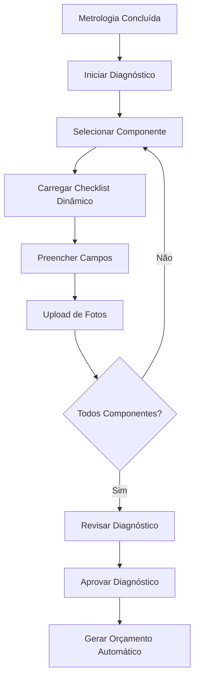
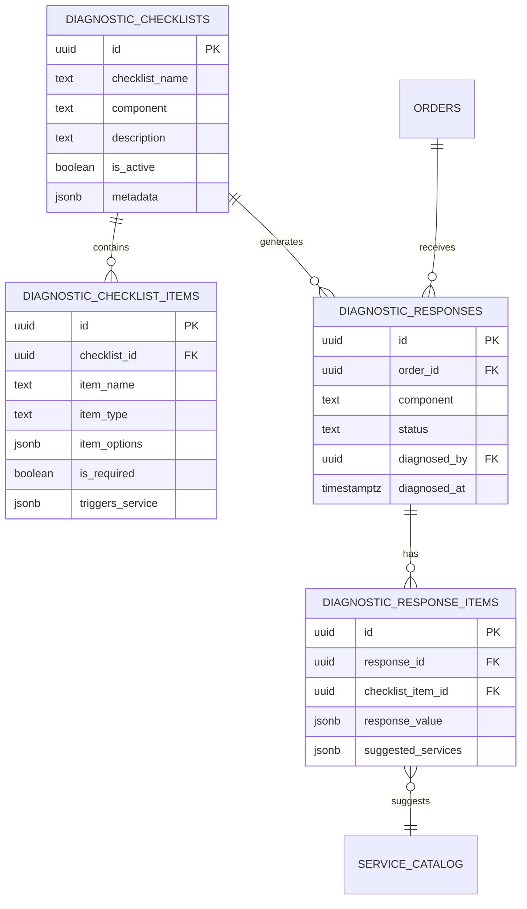

# Módulo de Diagnósticos

## 📋 Visão Geral

O módulo de Diagnósticos permite que técnicos realizem inspeção detalhada de componentes de motores através de checklists dinâmicos e configuráveis. O sistema automaticamente sugere serviços necessários baseado nas respostas do diagnóstico, facilitando a transição para orçamento.

---

## 🎯 Objetivos de Negócio

1. **Padronização:** Garantir que todos os componentes sejam inspecionados seguindo critérios consistentes
2. **Rastreabilidade:** Documentar todas as observações técnicas com fotos e evidências
3. **Automação:** Sugerir automaticamente serviços baseado em condições identificadas
4. **Integração:** Alimentar o módulo de orçamentos com informações precisas

---

## 🏗️ Arquitetura do Módulo

### Fluxo Principal



### Estrutura de Dados



---

## 📁 Estrutura de Arquivos

```
src/components/diagnostics/
├── DiagnosticWizard.tsx          (Wizard principal com steps)
├── ComponentSelector.tsx          (Seleção de componente)
├── ChecklistForm.tsx              (Formulário dinâmico)
├── FieldRenderer.tsx              (Renderiza campos por tipo)
├── PhotoUpload.tsx                (Upload de fotos)
├── ServiceSuggestions.tsx         (Lista serviços sugeridos)
├── DiagnosticReview.tsx           (Revisão antes de aprovar)
└── DiagnosticHistory.tsx          (Histórico de diagnósticos)

src/components/admin/
└── ChecklistConfigurator.tsx      (Config de checklists - admin)

src/hooks/
├── useDiagnosticChecklists.ts     (CRUD checklists)
├── useDiagnosticResponses.ts      (CRUD respostas)
└── useServiceSuggestions.ts       (Lógica de sugestões)

supabase/migrations/
└── [timestamp]_diagnostic_tables.sql
```

---

## 🗄️ Tabelas do Banco

### diagnostic_checklists
Armazena templates de checklists configuráveis por componente.

### diagnostic_checklist_items
Itens individuais de cada checklist (perguntas, campos).

### diagnostic_responses
Respostas consolidadas do diagnóstico de cada componente.

### diagnostic_response_items
Valores de cada campo respondido no diagnóstico.

### service_catalog
Catálogo de serviços que podem ser sugeridos automaticamente.

---

## 🔗 Integrações

### Upstream (recebe dados de):
- **Metrologia:** Medições dimensionais alimentam diagnóstico
- **Order Workflow:** Status "Em Diagnóstico" gatilha funcionalidade

### Downstream (envia dados para):
- **Orçamentos:** Serviços sugeridos pré-preenchem orçamento
- **Motor DNA:** Observações complementam análise visual

---

## 📊 User Stories

| ID | Título | Prioridade | Status |
|----|--------|------------|--------|
| [US-DIAG-001](./user-stories/US-DIAG-001.md) | Criar checklist dinâmico por componente | Crítica | Done |
| [US-DIAG-002](./user-stories/US-DIAG-002.md) | Responder diagnóstico (múltiplos tipos) | Crítica | Done |
| [US-DIAG-003](./user-stories/US-DIAG-003.md) | Upload de fotos durante diagnóstico | Alta | Done |
| [US-DIAG-004](./user-stories/US-DIAG-004.md) | Sugestão automática de serviços | Alta | Done |
| [US-DIAG-005](./user-stories/US-DIAG-005.md) | Aprovar diagnóstico e gerar orçamento | Crítica | Done |
| [US-DIAG-006](./user-stories/US-DIAG-006.md) | Visualizar histórico de diagnósticos | Média | Done |
| [US-DIAG-007](./user-stories/US-DIAG-007.md) | Configurar checklists (admin) | Alta | Done |

---

## 🧪 Estratégia de Testes

### Testes Unitários
- Renderização condicional de tipos de campo
- Validações de campos obrigatórios
- Lógica de sugestão de serviços

### Testes E2E
- Fluxo completo de diagnóstico (7 componentes)
- Upload de múltiplas fotos
- Aprovação e geração de orçamento
- Configuração de checklist customizado

---

## 📝 Regras de Negócio Críticas

### RN001: Tipos de Campo Suportados
- **text:** Campo texto livre
- **textarea:** Campo texto longo
- **number:** Campo numérico
- **select:** Dropdown com opções
- **radio:** Seleção única
- **checkbox:** Seleção múltipla
- **boolean:** Sim/Não
- **scale:** Escala de 1 a 5
- **photo:** Upload de foto

### RN002: Gatilhos de Sugestão
Cada item do checklist pode ter regra de sugestão:
```json
{
  "triggers_service": {
    "condition": "response == 'ruim' || response == 'crítico'",
    "service_codes": ["SRV001", "SRV002"],
    "priority": "alta"
  }
}
```

### RN003: Estados do Diagnóstico
- `pending`: Aguardando preenchimento
- `in_progress`: Parcialmente preenchido
- `completed`: Todos os campos preenchidos
- `approved`: Aprovado pelo técnico/gerente

---

## 🚀 Roadmap Futuro

- [ ] Diagnóstico colaborativo (múltiplos técnicos)
- [ ] Versionamento de checklists
- [ ] Templates de checklist por marca de motor
- [ ] Machine learning para sugestão de serviços
- [ ] Integração com ERP externo

---

**Última atualização:** 2025-01-27  
**Versão:** 1.0
