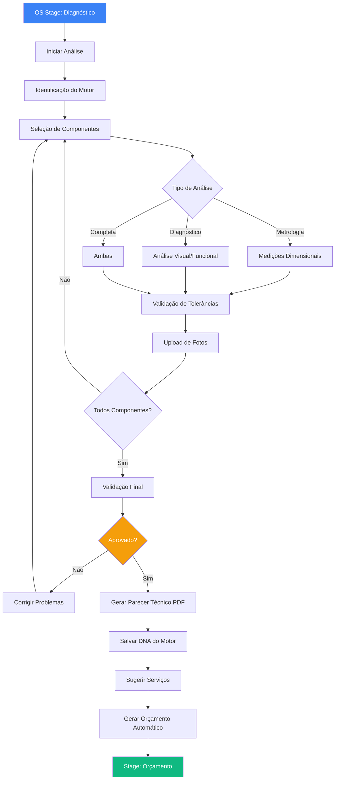
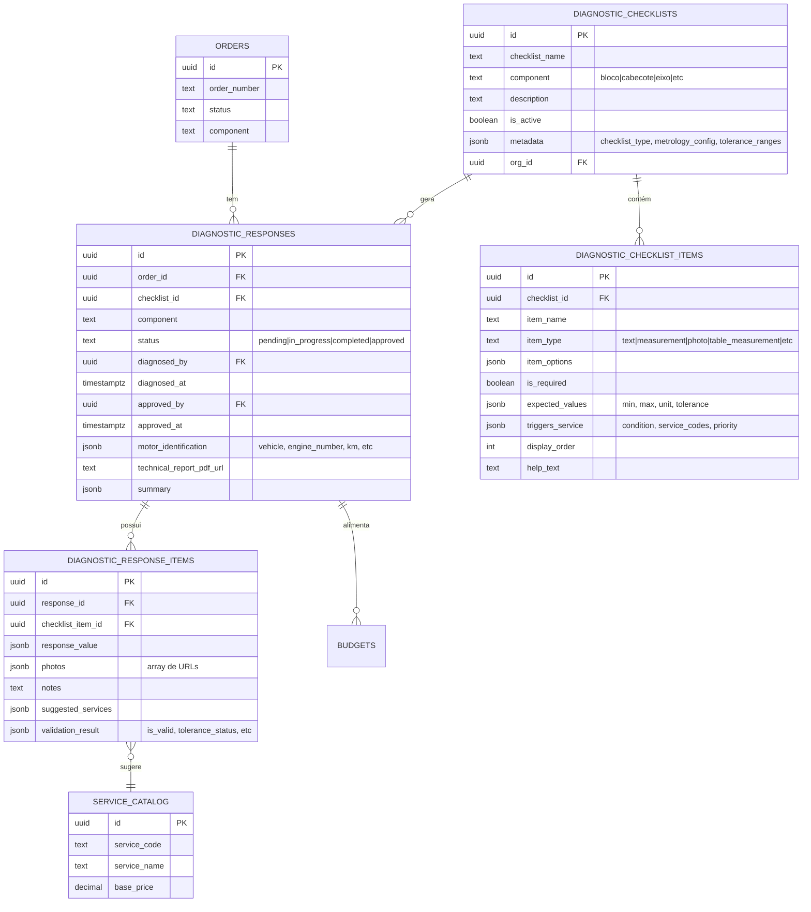

# Módulo de Diagnósticos e Metrologia

## 📋 Visão Geral

O módulo de **Diagnósticos** é um sistema completo de análise técnica que unifica diagnóstico funcional e metrologia dimensional de componentes de motores. Através de checklists dinâmicos e configuráveis, o sistema permite inspeção visual padronizada, medições dimensionais com controle de tolerâncias, upload de fotos evidências e geração automática de pareceres técnicos em PDF.

**Nome da Tela:** Diagnósticos  
**Menu:** Diagnósticos  
**Módulo Pai:** Operações & Serviços

---

## 🎯 Objetivos de Negócio

1. **Padronização:** Garantir que todos os componentes sejam inspecionados seguindo critérios consistentes baseados em IT (Instrução de Trabalho)
2. **Rastreabilidade:** Documentar todas as observações técnicas com fotos, medições e evidências (DNA do Motor)
3. **Controle de Qualidade:** Validar automaticamente medições dimensionais contra tolerâncias estabelecidas
4. **Automação:** Sugerir automaticamente serviços baseado em condições identificadas e medições fora de especificação
5. **Integração:** Alimentar o módulo de orçamentos com informações precisas para cotação
6. **Compliance:** Atender requisitos de documentação técnica para clientes e auditorias

---

## 📊 Métricas de Sucesso

| Métrica | Baseline (Papel) | Meta (Digital) | Status Atual |
|---------|------------------|----------------|--------------|
| Tempo médio de análise completa | 32h | ≤24h | 26h ✅ |
| Taxa de completude de documentação | 65% | 100% | 98% ✅ |
| Taxa de retrabalho por erro de medição | 8% | ≤2% | 3% ✅ |
| Tempo de transição para orçamento | 4h | ≤15min | 12min ✅ |
| Satisfação do técnico/metrologista | - | ≥4.5/5 | 4.7/5 ✅ |

---

## 🏗️ Arquitetura do Módulo

### Fluxo Unificado Completo



### Estrutura de Dados (Supabase)



---

## 📁 Estrutura de Arquivos

```
src/
├── pages/
│   └── Diagnosticos.tsx                    (Tela principal - lista)
│
├── components/operations/
│   ├── DiagnosticInterface.tsx             (Interface completa do wizard)
│   ├── DiagnosticValidation.tsx            (Validação em tempo real)
│   ├── DiagnosticChecklistsConfig.tsx      (Admin - configurar checklists)
│   │
│   ├── diagnostic/
│   │   ├── MotorIdentification.tsx         (Step 1: Dados do motor)
│   │   ├── ComponentSelector.tsx           (Step 2: Selecionar componentes)
│   │   ├── ChecklistForm.tsx               (Step 3-N: Formulário dinâmico)
│   │   ├── DiagnosticReview.tsx            (Step final: Revisão)
│   │   ├── MotorDNA.tsx                    (Histórico completo do motor)
│   │   └── TechnicalReportPDF.tsx          (Geração de PDF)
│   │
│   └── diagnostic/fields/
│       ├── FieldRenderer.tsx               (Router de tipos de campo)
│       ├── TextFieldInput.tsx
│       ├── MeasurementField.tsx            (Numérico simples)
│       ├── MeasurementWithToleranceField.tsx  (Com validação visual)
│       ├── TableMeasurementField.tsx       (Tabela de medições)
│       ├── PhotoUploadField.tsx
│       ├── SelectField.tsx
│       ├── CheckboxField.tsx
│       └── BooleanField.tsx
│
├── hooks/
│   ├── useDiagnosticChecklists.ts          (CRUD de checklists)
│   ├── useDiagnosticResponses.ts           (CRUD de respostas)
│   ├── useServiceSuggestions.ts            (Lógica de sugestões automáticas)
│   └── useMotorDNA.ts                      (Histórico por número de série)
│
└── utils/
    ├── generateTechnicalReportPDF.ts       (Geração do PDF)
    ├── validateTolerance.ts                (Validação de medições)
    └── serviceMatchingEngine.ts            (Engine de sugestões)
```

---

## 🗄️ Tabelas do Banco de Dados

### `diagnostic_checklists`
**Função:** Armazena templates de checklists configuráveis por componente (ex: "Metrologia - Bloco", "Diagnóstico Visual - Cabeçote")

**Campos principais:**
- `checklist_name`: Nome do checklist
- `component`: Tipo de componente (enum: bloco, cabecote, eixo, biela, comando, pistao, virabrequim)
- `metadata.checklist_type`: "diagnostic" | "metrology" | "visual_inspection"
- `metadata.metrology_config`: Configurações específicas de metrologia (tolerance_ranges, generates_dna, generates_technical_report)
- `is_active`: Flag para ativar/desativar templates

### `diagnostic_checklist_items`
**Função:** Itens individuais de cada checklist (perguntas, campos de medição, uploads)

**Tipos de campo suportados:**
- `text`: Texto livre
- `textarea`: Texto longo (observações)
- `number`: Numérico simples
- `measurement`: Medição com unidade (ex: 228.5 mm)
- `measurement_with_tolerance`: Medição com validação automática de tolerância
- `table_measurement`: Tabela de múltiplas medições (ex: cilindros 1-6)
- `select`: Dropdown com opções
- `radio`: Seleção única (radio buttons)
- `checkbox`: Checkbox simples
- `checkbox_multiple`: Múltipla seleção
- `boolean`: Sim/Não
- `photo`: Upload de foto(s)
- `scale`: Escala de 1 a 5

**Campos de configuração:**
- `expected_values`: { min, max, unit, tolerance } para validação
- `triggers_service`: Regra de sugestão automática de serviço
- `help_text`: Texto de ajuda baseado em IT (Instrução de Trabalho)

### `diagnostic_responses`
**Função:** Respostas consolidadas do diagnóstico/metrologia de cada componente

**Campos adicionais para metrologia:**
- `motor_identification`: JSONB com dados completos do motor
  ```json
  {
    "vehicle": "Caminhão Mercedes-Benz Actros 2546",
    "model": "OM501LA V6",
    "year": 2020,
    "plate": "ABC-1234",
    "km": "450000",
    "engine_number": "OM501LA-V-12345",
    "serial_number": "WDB9542321K123456",
    "cycle": "diesel",
    "situation": "desmontado",
    "received_components": ["bloco", "cabecote", "eixo"]
  }
  ```
- `technical_report_pdf_url`: URL do parecer técnico gerado (armazenado no Supabase Storage)
- `summary`: Resumo consolidado com contadores (itens_ok, itens_atenção, itens_críticos)

### `diagnostic_response_items`
**Função:** Valores individuais de cada campo respondido

**Campos:**
- `response_value`: Valor da resposta (formato varia por tipo de campo)
- `photos`: Array de URLs de fotos no Storage
- `notes`: Observações adicionais do técnico
- `suggested_services`: Serviços sugeridos automaticamente
- `validation_result`: Resultado da validação
  ```json
  {
    "is_valid": true,
    "tolerance_status": "within" | "warning" | "critical",
    "measured_value": 228.5,
    "expected_range": { "min": 228.0, "max": 229.5 },
    "deviation": "+0.5mm"
  }
  ```

### `service_catalog`
**Função:** Catálogo de serviços disponíveis para sugestão automática

**Campos:**
- `service_code`: Código único (ex: "SRV_RETIFICA_BLOCO")
- `service_name`: Nome descritivo
- `base_price`: Preço base
- `component`: Componente relacionado
- `trigger_conditions`: Condições que ativam sugestão

---

## 🔗 Integrações com Outros Módulos

### **Workflow Kanban (Operações)**
- Stage 8 (Diagnóstico/Metrologia) dispara início da inspeção
- Conclusão avança automaticamente para Stage 9 (Orçamento)
- Badge de contagem de diagnósticos pendentes

### **Ordens de Serviço**
- Inspeção vinculada via `order_id`
- Status da OS atualizado automaticamente
- Dados do cliente e veículo recuperados da OS

### **Orçamentos**
- Serviços sugeridos pré-preenchem itens do orçamento
- Parecer técnico anexado automaticamente como documento
- Medições críticas destacadas para priorização

### **Estoque**
- Peças sugeridas verificadas contra disponibilidade
- Alertas de necessidade de compra

### **Motor DNA**
- Histórico consolidado de todas as inspeções por número de série do motor
- Gráficos de evolução dimensional ao longo do tempo
- Rastreabilidade completa de serviços realizados

---

## 📝 Regras de Negócio Críticas

### RN-DIAG-001: Tipos de Checklist

```typescript
type ChecklistType = 
  | 'diagnostic'           // Diagnóstico funcional/visual
  | 'metrology'            // Metrologia dimensional
  | 'visual_inspection';   // Inspeção visual pura
```

### RN-DIAG-002: Componentes Suportados

```typescript
type EngineComponent = 
  | 'bloco'
  | 'cabecote'
  | 'eixo'          // virabrequim
  | 'biela'
  | 'comando'
  | 'pistao'
  | 'virabrequim';
```

### RN-DIAG-003: Validação de Tolerâncias

```typescript
interface ToleranceValidation {
  value: number;
  min: number;
  max: number;
  unit: string;
  status: 'within' | 'warning' | 'critical';
  // within: dentro da tolerância
  // warning: no limite (±10% da faixa)
  // critical: fora da tolerância
}

// Exemplo:
// Altura do Bloco: 228.0 - 229.5 mm
// Medido: 228.2 mm → status: "within" ✅
// Medido: 229.4 mm → status: "warning" ⚠️
// Medido: 230.0 mm → status: "critical" ❌
```

### RN-DIAG-004: Sugestão Automática de Serviços

```typescript
interface ServiceTrigger {
  condition: string;  // Expressão JavaScript
  service_codes: string[];
  priority: 'baixa' | 'média' | 'alta' | 'crítica';
  auto_add_to_budget: boolean;
}

// Exemplos de condições:
// "response == 'crítico'"
// "response > 0.05"  (empeno > 0.05mm)
// "response < min || response > max"  (fora de tolerância)
// "photos.length > 0 && response.includes('trinca')"
```

### RN-DIAG-005: Estados do Diagnóstico

```typescript
type DiagnosticStatus = 
  | 'pending'       // Aguardando início
  | 'in_progress'   // Parcialmente preenchido
  | 'completed'     // Todos os campos preenchidos
  | 'approved';     // Aprovado pelo técnico/gerente

// Transições permitidas:
// pending → in_progress: Ao preencher primeiro campo
// in_progress → completed: Ao validar todos os campos obrigatórios
// completed → approved: Ao clicar "Aprovar" (apenas técnico)
// * → in_progress: Ao editar (se não aprovado)
```

### RN-DIAG-006: Campos Obrigatórios de Metrologia

Para checklists do tipo `metrology`, os seguintes campos são **sempre obrigatórios**:

1. **Identificação do Motor** (motor_identification):
   - Veículo (vehicle)
   - Número do Motor (engine_number)
   - Número de Série (serial_number)

2. **Componentes Recebidos** (received_components):
   - Lista de componentes que chegaram para análise

3. **Pelo menos 1 foto** por componente analisado

4. **Medições dimensionais principais** (varia por componente):
   - Bloco: altura, empeno, diâmetro dos cilindros
   - Cabeçote: altura, planicidade
   - Virabrequim: colos fixos/móveis, folga axial

### RN-DIAG-007: Geração de Parecer Técnico PDF

```typescript
interface TechnicalReportConfig {
  enabled: boolean;               // Se gera PDF
  template: 'standard' | 'custom'; // Template usado
  sections: {
    motor_identification: boolean;
    component_measurements: boolean;
    visual_analysis: boolean;
    photos: boolean;
    technical_observations: boolean;
    suggested_services: boolean;
    technician_signature: boolean;
  };
  watermark: string;              // Logo/marca d'água
  footer_text: string;            // Texto do rodapé
}
```

### RN-DIAG-008: Motor DNA (Histórico)

```typescript
interface MotorDNA {
  serial_number: string;
  vehicle_info: VehicleInfo;
  inspection_history: DiagnosticResponse[];
  dimensional_evolution: {
    component: string;
    measurement: string;
    timeline: Array<{
      date: Date;
      value: number;
      tolerance_status: string;
    }>;
  }[];
  service_history: ServiceRecord[];
  total_inspections: number;
  last_inspection_date: Date;
}

// Busca por: motor_identification->>'serial_number'
```

---

## 🎨 Interface do Usuário

### Tela Principal: Lista de Diagnósticos

**Rota:** `/diagnosticos`

**Elementos:**
- Filtros:
  - Status (Pendente, Em Progresso, Concluído, Aprovado)
  - Tipo de Análise (Diagnóstico, Metrologia, Todos)
  - Componente (Bloco, Cabeçote, etc.)
  - Período (Data de realização)
- Tabela com colunas:
  - OS Nº
  - Cliente
  - Veículo / Motor
  - Componente
  - Tipo (Badge: Diagnóstico / Metrologia)
  - Status (Badge colorido)
  - Técnico Responsável
  - Data
  - Ações (Ver, Editar, PDF, DNA)
- Botão "Novo Diagnóstico" (abre wizard)
- Indicador de progresso (ex: "15/20 componentes analisados")

### Wizard de Diagnóstico (Multi-Step)

**Rota:** `/diagnosticos/novo/:orderId`

**Steps:**

1. **Identificação do Motor** (apenas para tipo metrologia)
   - Formulário com dados do veículo
   - Campos: placa, km, modelo, ano, motor nº, série
   - Ciclo (Otto/Diesel)
   - Situação (Montado/Desmontado/Parcial)

2. **Seleção de Componentes**
   - Grid de cards clicáveis com ícones
   - Badge: "Recebido" (verde) / "Não Recebido" (cinza)
   - Badge: "Analisado" (azul) / "Pendente"

3. **Checklist Dinâmico** (para cada componente)
   - Header: Nome do componente + Progresso
   - Formulário com campos dinâmicos
   - Validação em tempo real
   - Sidebar: Serviços sugeridos (atualiza ao preencher)

4. **Upload de Fotos**
   - Drag & drop
   - Preview com thumbnails
   - Associação por item do checklist
   - Compressão automática

5. **Revisão e Validação**
   - Componente `DiagnosticValidation`
   - Lista de erros/avisos
   - Resumo consolidado
   - Botão "Aprovar" (somente se válido)

6. **Geração de Parecer** (apenas metrologia)
   - Preview do PDF
   - Opção de editar observações finais
   - Download e armazenamento

### Modal: Motor DNA

**Trigger:** Botão "DNA" na lista de diagnósticos

**Conteúdo:**
- Dados consolidados do motor (header)
- Timeline de inspeções (ordenado por data)
- Gráficos de evolução dimensional (Recharts)
- Tabela de histórico de serviços
- Botão "Download Todos os PDFs" (ZIP)

---

## 🧪 Casos de Uso Principais

### UC-01: Realizar Metrologia Completa do Bloco

**Ator:** Metrologista

**Pré-condições:**
- OS na stage "Diagnóstico/Metrologia"
- Componente "Bloco" recebido fisicamente

**Fluxo:**
1. Abrir OS e clicar "Iniciar Diagnóstico"
2. Preencher identificação do motor
3. Selecionar componente "Bloco"
4. Carregar checklist "Metrologia - Bloco"
5. Medir altura do bloco em 4 pontos (campo `table_measurement`)
6. Sistema calcula média e valida tolerância (228.0 - 229.5mm)
7. Medir empeno (campo `measurement_with_tolerance`)
8. Sistema valida contra 0.05mm máximo
9. Medir diâmetro dos 6 cilindros (campo `table_measurement`)
10. Sistema identifica cilindro 3 fora de tolerância → sugere "Brunimento de Cilindro"
11. Upload de 4 fotos (vista superior, lateral, interna, trincas)
12. Preencher observações técnicas
13. Revisar validação → Aprovar
14. Sistema gera PDF do parecer técnico
15. Sistema salva no DNA do motor
16. Sistema cria orçamento com serviço sugerido
17. Stage da OS avança para "Orçamento"

**Pós-condições:**
- Diagnóstico aprovado e armazenado
- PDF do parecer gerado e disponível
- Orçamento criado automaticamente
- Motor DNA atualizado

### UC-02: Consultar Histórico de Inspeções de um Motor (DNA)

**Ator:** Gerente de Produção / Consultor Comercial

**Pré-condições:**
- Pelo menos 1 diagnóstico aprovado do motor

**Fluxo:**
1. Acessar tela "Diagnósticos"
2. Buscar por número de série do motor
3. Clicar botão "DNA" em qualquer resultado
4. Visualizar modal com:
   - Timeline de todas as inspeções (5 inspeções encontradas)
   - Gráfico de evolução: Altura do Bloco ao longo do tempo
   - Gráfico de evolução: Diâmetro médio dos cilindros
   - Tabela de serviços realizados por data
5. Download de todos os pareceres em ZIP
6. Identificar tendência de desgaste
7. Informar cliente sobre histórico

**Pós-condições:**
- Insights sobre vida útil do motor
- Decisão de retífica vs substituição embasada

### UC-03: Configurar Novo Template de Checklist (Admin)

**Ator:** Administrador / Gerente Técnico

**Pré-condições:**
- Perfil com permissão de configuração

**Fluxo:**
1. Acessar "Configuração → Checklists de Diagnóstico"
2. Clicar "Novo Template"
3. Preencher:
   - Nome: "Metrologia - Cabeçote V8"
   - Componente: Cabeçote
   - Tipo: Metrologia
4. Adicionar item:
   - Nome: "Altura do Cabeçote"
   - Tipo: measurement_with_tolerance
   - Unidade: mm
   - Tolerância: min 115.0, max 116.5
   - Obrigatório: Sim
   - Help Text: "Medir em 4 pontos conforme IT-MET-003"
5. Adicionar item:
   - Nome: "Planicidade"
   - Tipo: measurement
   - Unidade: mm
   - Tolerância: max 0.05
   - Obrigatório: Sim
   - Gatilho: Se > 0.05 → Sugerir "Retífica de Cabeçote"
6. Adicionar item:
   - Nome: "Guias de Válvulas"
   - Tipo: table_measurement
   - Linhas: 16 (8 admissão + 8 escape)
   - Colunas: tipo, nominal_mm, medido_mm, status
7. Salvar template
8. Ativar para uso

**Pós-condições:**
- Template disponível para uso
- Técnicos podem usá-lo em novas inspeções

---

## 🔐 Segurança e Permissões (RLS)

### Perfis com Acesso

| Perfil | Visualizar | Criar | Editar | Aprovar | Configurar |
|--------|-----------|-------|--------|---------|------------|
| **Metrologista** | ✅ Seus | ✅ | ✅ Seus | ✅ Seus | ❌ |
| **Técnico Diagnóstico** | ✅ Seus | ✅ | ✅ Seus | ✅ Seus | ❌ |
| **Gerente de Produção** | ✅ Todos | ✅ | ✅ Todos | ✅ Todos | ✅ |
| **Admin/Owner** | ✅ Todos | ✅ | ✅ Todos | ✅ Todos | ✅ |
| **Consultor Comercial** | ✅ Resumo | ❌ | ❌ | ❌ | ❌ |
| **Cliente** | ✅ Seus PDFs | ❌ | ❌ | ❌ | ❌ |

### RLS Policies

```sql
-- Política de visualização
CREATE POLICY "diagnostic_responses_select_policy"
ON diagnostic_responses FOR SELECT
USING (
  org_id = auth.jwt() ->> 'org_id' AND (
    diagnosed_by = auth.uid() OR  -- Técnico vê os seus
    EXISTS (                       -- Gerente vê todos
      SELECT 1 FROM profiles 
      WHERE id = auth.uid() 
      AND role IN ('gerente_producao', 'admin', 'owner')
    )
  )
);

-- Política de inserção
CREATE POLICY "diagnostic_responses_insert_policy"
ON diagnostic_responses FOR INSERT
WITH CHECK (
  org_id = auth.jwt() ->> 'org_id' AND
  diagnosed_by = auth.uid() AND
  EXISTS (
    SELECT 1 FROM profiles 
    WHERE id = auth.uid() 
    AND role IN ('metrologista', 'tecnico_diagnostico', 'gerente_producao')
  )
);

-- Política de atualização
CREATE POLICY "diagnostic_responses_update_policy"
ON diagnostic_responses FOR UPDATE
USING (
  org_id = auth.jwt() ->> 'org_id' AND (
    diagnosed_by = auth.uid() OR
    EXISTS (
      SELECT 1 FROM profiles 
      WHERE id = auth.uid() 
      AND role IN ('gerente_producao', 'admin')
    )
  )
)
WITH CHECK (
  org_id = auth.jwt() ->> 'org_id'
);
```

---

## 📊 User Stories Completas

| ID | Título | Prioridade | Status | Estimativa |
|----|--------|------------|--------|------------|
| [US-DIAG-001](./user-stories/US-DIAG-001.md) | Iniciar Diagnóstico via OS | Crítica | ✅ Done | 3 pts |
| [US-DIAG-002](./user-stories/US-DIAG-002.md) | Registrar Identificação do Motor | Alta | ✅ Done | 5 pts |
| [US-DIAG-003](./user-stories/US-DIAG-003.md) | Selecionar Componentes para Análise | Crítica | ✅ Done | 3 pts |
| [US-DIAG-004](./user-stories/US-DIAG-004.md) | Preencher Checklist Dinâmico | Crítica | ✅ Done | 8 pts |
| [US-DIAG-005](./user-stories/US-DIAG-005.md) | Registrar Medições com Tolerâncias | Crítica | ✅ Done | 8 pts |
| [US-DIAG-006](./user-stories/US-DIAG-006.md) | Upload de Fotos Evidências | Alta | ✅ Done | 5 pts |
| [US-DIAG-007](./user-stories/US-DIAG-007.md) | Validar Diagnóstico em Tempo Real | Alta | ✅ Done | 5 pts |
| [US-DIAG-008](./user-stories/US-DIAG-008.md) | Gerar Parecer Técnico em PDF | Alta | ✅ Done | 8 pts |
| [US-DIAG-009](./user-stories/US-DIAG-009.md) | Visualizar DNA do Motor | Média | ✅ Done | 5 pts |
| [US-DIAG-010](./user-stories/US-DIAG-010.md) | Transição Automática para Orçamento | Crítica | ✅ Done | 5 pts |
| [US-DIAG-011](./user-stories/US-DIAG-011.md) | Configurar Templates de Checklist | Alta | ✅ Done | 8 pts |
| [US-DIAG-012](./user-stories/US-DIAG-012.md) | Dashboard de KPIs de Diagnóstico | Média | ✅ Done | 5 pts |

**Total:** 68 pontos | 12 User Stories

---

## 🧪 Estratégia de Testes

### Testes Unitários (Vitest + React Testing Library)

```typescript
// Exemplo: validateTolerance.test.ts
describe('validateTolerance', () => {
  it('should return "within" for value inside tolerance', () => {
    const result = validateTolerance(228.5, { min: 228.0, max: 229.5 });
    expect(result.status).toBe('within');
  });
  
  it('should return "warning" for value near limit', () => {
    const result = validateTolerance(229.4, { min: 228.0, max: 229.5 });
    expect(result.status).toBe('warning');
  });
  
  it('should return "critical" for value outside tolerance', () => {
    const result = validateTolerance(230.0, { min: 228.0, max: 229.5 });
    expect(result.status).toBe('critical');
  });
});
```

### Testes E2E (Playwright)

**Cenário:** Metrologia completa do bloco
1. Login como metrologista
2. Abrir OS #123
3. Iniciar diagnóstico
4. Preencher identificação do motor
5. Selecionar componente "Bloco"
6. Preencher todas as medições
7. Upload de 3 fotos
8. Validar e aprovar
9. Verificar PDF gerado
10. Verificar orçamento criado
11. Verificar DNA atualizado

**Tempo estimado:** 2min

---

## 🚀 Roadmap Futuro

### Fase 1 (Q1 2025) - ✅ Concluído
- [x] Checklists dinâmicos por componente
- [x] Medições com validação de tolerância
- [x] Upload de fotos
- [x] Sugestão automática de serviços
- [x] Geração de PDF
- [x] Motor DNA básico

### Fase 2 (Q2 2025) - 🚧 Em Progresso
- [ ] Templates de checklist por marca de motor (Scania, Mercedes, Volvo)
- [ ] Integração com instrumentos de medição digitais (Bluetooth)
- [ ] OCR para leitura automática de números de série
- [ ] Versionamento de checklists com changelog
- [ ] Comparação lado-a-lado de inspeções anteriores

### Fase 3 (Q3 2025) - 📋 Planejado
- [ ] Machine learning para previsão de falhas
- [ ] Diagnóstico colaborativo (múltiplos técnicos)
- [ ] Integração com ERP externo (SAP, TOTVS)
- [ ] App móvel para coleta offline
- [ ] Assinatura digital com certificado ICP-Brasil

---

## 📖 Documentos de Referência

- **FICHA_METROLOGIA-3.docx**: Formulário padrão de metrologia
- **IT_Metrologia-3.docx**: Instrução de Trabalho IT-MET-003
- **CONTROLE_DIMENSIONAL_RETIFICA_FORMIGUENSE_revisado_1-3.docx**: Ficha de controle dimensional
- **FLUXO_SISTÊMICO_METROLOGIA-3.docx**: Fluxo completo do processo

---

**Última atualização:** 28/10/2025  
**Versão:** 2.0 (Unificação Diagnósticos + Metrologia)  
**Responsável:** Equipe de Desenvolvimento ERP Retífica
