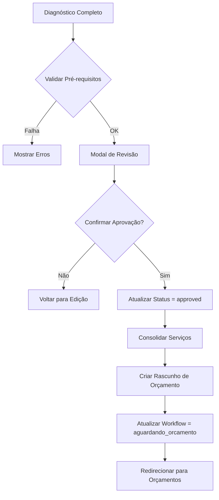

# US-DIAG-005: Aprovar Diagnóstico e Gerar Orçamento

**ID:** US-DIAG-005  
**Epic:** Diagnósticos  
**Sprint:** 3  
**Prioridade:** Crítica  
**Estimativa:** 8 pontos  
**Status:** Done  

---

## 📋 User Story

**Como** técnico/gerente  
**Quero** aprovar o diagnóstico completo e gerar automaticamente um orçamento  
**Para** agilizar o processo de venda e reduzir retrabalho

---

## 🎯 Business Objective

Criar transição fluida entre diagnóstico e orçamento, eliminando digitação manual e reduzindo tempo de resposta ao cliente.

---

## 📐 Business Rules

### RN001: Pré-requisitos para Aprovação
```typescript
const canApproveDiagnostic = (responses: DiagnosticResponse[]) => {
  const checks = {
    // Todos os componentes da OS foram diagnosticados
    all_components_diagnosed: responses.length === order.required_components.length,
    
    // Todos os campos obrigatórios preenchidos
    all_required_answered: responses.every(r => r.status === 'completed'),
    
    // Pelo menos 1 serviço sugerido selecionado
    has_selected_services: responses.some(r => 
      r.response_items.some(i => i.suggested_services.length > 0)
    ),
    
    // Técnico ou gerente
    has_permission: user.role in ['tecnico', 'gerente', 'admin']
  };
  
  return Object.values(checks).every(check => check === true);
};
```

### RN002: Fluxo de Aprovação


### RN003: Consolidação de Serviços
```typescript
const consolidateServices = (responses: DiagnosticResponse[]) => {
  const allServices: ServiceItem[] = [];
  
  responses.forEach(response => {
    response.response_items.forEach(item => {
      item.suggested_services.forEach(serviceCode => {
        // Busca detalhes do serviço no catálogo
        const service = serviceCatalog.find(s => s.service_code === serviceCode);
        
        allServices.push({
          component: response.component,
          service_code: serviceCode,
          service_name: service.service_name,
          base_price: service.base_price,
          quantity: 1,
          unit: service.unit,
          estimated_time_hours: service.estimated_time_hours,
          requires_parts: service.requires_parts,
          diagnostic_item_id: item.id
        });
      });
    });
  });
  
  // Remove duplicatas (mesmo serviço no mesmo componente)
  return allServices.reduce((acc, service) => {
    const existing = acc.find(s => 
      s.service_code === service.service_code && 
      s.component === service.component
    );
    
    if (existing) {
      existing.quantity += 1;
    } else {
      acc.push(service);
    }
    
    return acc;
  }, [] as ServiceItem[]);
};
```

### RN004: Criação de Orçamento
```typescript
const createBudgetFromDiagnostic = async (
  orderId: string,
  diagnosticResponses: DiagnosticResponse[]
) => {
  const services = consolidateServices(diagnosticResponses);
  
  // Cria um detailed_budget para cada componente
  const budgets = await Promise.all(
    services.map(async (service) => {
      return supabase
        .from('detailed_budgets')
        .insert({
          order_id: orderId,
          component: service.component,
          diagnostic_response_id: diagnosticResponses.find(
            r => r.component === service.component
          )?.id,
          status: 'draft',
          services: [service],
          parts: [], // Vazio inicialmente
          subtotal: service.base_price * service.quantity,
          discount_percentage: 0,
          tax_percentage: 0
        })
        .select()
        .single();
    })
  );
  
  return budgets;
};
```

### RN005: Modal de Revisão
**Informações exibidas:**
```
┌─────────────────────────────────────────────────────────┐
│ 📋 REVISAR DIAGNÓSTICO - OS #1234                       │
├─────────────────────────────────────────────────────────┤
│                                                          │
│ Componentes Diagnosticados: 7/7 ✅                      │
│ Campos Preenchidos: 89/92 (97%)                         │
│ Serviços Sugeridos: 12                                  │
│ Serviços Selecionados: 9                                │
│                                                          │
│ ┌───────────────────────────────────────────────────┐  │
│ │ RESUMO POR COMPONENTE:                            │  │
│ ├───────────────────────────────────────────────────┤  │
│ │                                                    │  │
│ │ ✅ Bloco (4 serviços - R$ 2.550,00)               │  │
│ │    • Retífica de camisa                           │  │
│ │    • Soldagem de trinca                           │  │
│ │    • Usinagem do bloco                            │  │
│ │    • Limpeza profunda                             │  │
│ │                                                    │  │
│ │ ✅ Cabeçote (2 serviços - R$ 830,00)              │  │
│ │ ✅ Virabrequim (1 serviço - R$ 950,00)            │  │
│ │ ✅ Biela (1 serviço - R$ 180,00)                  │  │
│ │ ✅ Pistão (1 serviço - R$ 350,00)                 │  │
│ │ ✅ Comando (0 serviços)                            │  │
│ │ ✅ Eixo (0 serviços)                               │  │
│ │                                                    │  │
│ └───────────────────────────────────────────────────┘  │
│                                                          │
│ Valor Total Estimado: R$ 4.860,00                       │
│ Tempo Total Estimado: 18.5 horas                        │
│                                                          │
│ ⚠️ Observações:                                         │
│ • Comando e Eixo não necessitam serviços               │
│ • 3 campos opcionais não foram preenchidos             │
│                                                          │
│ Ao aprovar, um orçamento rascunho será criado          │
│ automaticamente com estes serviços.                    │
│                                                          │
│          [Cancelar]  [✅ Aprovar e Gerar Orçamento]    │
└─────────────────────────────────────────────────────────┘
```

### RN006: Pós-Aprovação
**Ações Automáticas:**
1. Atualizar `diagnostic_responses.status` = `'approved'`
2. Registrar `diagnostic_responses.approved_by` = `auth.uid()`
3. Registrar `diagnostic_responses.approved_at` = `now()`
4. Criar registros em `detailed_budgets` (um por componente)
5. Atualizar `order_workflow.current_stage` = `'aguardando_orcamento'`
6. Criar notificação para gerente: "Diagnóstico aprovado - Criar orçamento"
7. Redirecionar para página de orçamentos

---

## ✅ Acceptance Criteria

**AC1:** Botão "Aprovar Diagnóstico" fica habilitado apenas quando pré-requisitos OK  
**AC2:** Modal de revisão mostra resumo completo  
**AC3:** Ao aprovar, orçamento rascunho é criado automaticamente  
**AC4:** Status do diagnóstico muda para "approved"  
**AC5:** Workflow da OS muda para "aguardando_orcamento"  
**AC6:** Gerente recebe notificação  
**AC7:** Sou redirecionado para página de orçamentos

---

## 🛠️ Definition of Done

- [x] Botão "Aprovar Diagnóstico" implementado
- [x] Modal de revisão criado
- [x] Função `consolidateServices()` implementada
- [x] Função `createBudgetFromDiagnostic()` implementada
- [x] Transição de workflow automática
- [x] Notificações configuradas
- [x] Redirecionamento funcional
- [x] Testes E2E escritos

---

## 📁 Affected Components

```
src/components/diagnostics/
  ├── DiagnosticWizard.tsx         (UPDATE - botão aprovar)
  ├── DiagnosticReview.tsx         (NEW - modal revisão)
  └── ApprovalButton.tsx           (NEW)

src/hooks/
  ├── useDiagnosticResponses.ts    (UPDATE - approve function)
  └── useCreateBudget.ts           (NEW)
```

---

## 🗄️ Database Changes

```sql
-- Função para aprovar diagnóstico e criar orçamento
CREATE OR REPLACE FUNCTION approve_diagnostic_and_create_budget(
  p_order_id UUID
) RETURNS jsonb AS $$
DECLARE
  v_responses RECORD;
  v_budget_ids UUID[];
  v_service RECORD;
BEGIN
  -- Valida se todos os componentes foram diagnosticados
  IF (
    SELECT COUNT(*) FROM diagnostic_responses 
    WHERE order_id = p_order_id AND status != 'completed'
  ) > 0 THEN
    RAISE EXCEPTION 'Nem todos os componentes foram diagnosticados completamente';
  END IF;
  
  -- Atualiza status dos diagnósticos
  UPDATE diagnostic_responses
  SET 
    status = 'approved',
    approved_by = auth.uid(),
    approved_at = NOW()
  WHERE order_id = p_order_id;
  
  -- Cria orçamentos para cada componente
  FOR v_responses IN 
    SELECT DISTINCT dr.component, dr.id AS response_id
    FROM diagnostic_responses dr
    WHERE dr.order_id = p_order_id
  LOOP
    -- Busca serviços sugeridos deste componente
    FOR v_service IN
      SELECT DISTINCT 
        jsonb_array_elements_text(dri.suggested_services) AS service_code
      FROM diagnostic_response_items dri
      WHERE dri.response_id = v_responses.response_id
      AND dri.suggested_services != '[]'::jsonb
    LOOP
      -- Cria orçamento (simplificado - melhorar com agregação)
      INSERT INTO detailed_budgets (
        order_id,
        component,
        diagnostic_response_id,
        status,
        services,
        created_by
      ) VALUES (
        p_order_id,
        v_responses.component,
        v_responses.response_id,
        'draft',
        jsonb_build_array(
          jsonb_build_object(
            'service_code', v_service.service_code
          )
        ),
        auth.uid()
      )
      ON CONFLICT (order_id, component) DO UPDATE
      SET services = detailed_budgets.services || EXCLUDED.services;
      
    END LOOP;
  END LOOP;
  
  -- Atualiza workflow da OS
  UPDATE order_workflow
  SET current_stage = 'aguardando_orcamento'
  WHERE order_id = p_order_id;
  
  -- Cria notificação para gerente
  INSERT INTO notifications (user_id, type, title, message, metadata)
  SELECT 
    p.id,
    'diagnostic_approved',
    'Diagnóstico Aprovado',
    'OS #' || o.order_number || ' - Diagnóstico aprovado. Criar orçamento.',
    jsonb_build_object('order_id', p_order_id)
  FROM profiles p
  JOIN orders o ON o.id = p_order_id
  WHERE p.org_id = o.org_id
    AND p.role IN ('gerente', 'admin');
  
  RETURN jsonb_build_object(
    'success', true,
    'message', 'Diagnóstico aprovado e orçamento criado com sucesso'
  );
END;
$$ LANGUAGE plpgsql SECURITY DEFINER;
```

---

## 🎨 Wireframe

```
┌─────────────────────────────────────────────────────────────┐
│  Diagnóstico - OS #1234                              [X]    │
├─────────────────────────────────────────────────────────────┤
│  Progresso Geral: 7/7 componentes diagnosticados ✅          │
│                                                               │
│  ┌─────────────────────────────────────────────────────────┐│
│  │ ✅ Bloco (4 serviços selecionados)                      ││
│  │ ✅ Cabeçote (2 serviços selecionados)                   ││
│  │ ✅ Virabrequim (1 serviço selecionado)                  ││
│  │ ✅ Biela (1 serviço selecionado)                        ││
│  │ ✅ Pistão (1 serviço selecionado)                       ││
│  │ ✅ Comando (nenhum serviço necessário)                  ││
│  │ ✅ Eixo (nenhum serviço necessário)                     ││
│  └─────────────────────────────────────────────────────────┘│
│                                                               │
│  Total de Serviços: 9                                        │
│  Valor Estimado: R$ 4.860,00                                 │
│  Tempo Estimado: 18.5 horas                                  │
│                                                               │
│              [Ver Resumo Completo]                           │
│              [✅ Aprovar Diagnóstico e Gerar Orçamento]      │
│                                                               │
│  ┌─ MODAL: Revisão Final ─────────────────────────────────┐ │
│  │                                                     [X] │ │
│  │  📋 REVISAR DIAGNÓSTICO - OS #1234                     │ │
│  │  ───────────────────────────────────────────────────── │ │
│  │                                                         │ │
│  │  ✅ Todos os componentes diagnosticados                │ │
│  │  ✅ 89/92 campos preenchidos (97%)                     │ │
│  │  ✅ 9 serviços selecionados                            │ │
│  │                                                         │ │
│  │  RESUMO POR COMPONENTE:                                │ │
│  │  • Bloco: 4 serviços - R$ 2.550,00                    │ │
│  │  • Cabeçote: 2 serviços - R$ 830,00                   │ │
│  │  • Virabrequim: 1 serviço - R$ 950,00                 │ │
│  │  • Biela: 1 serviço - R$ 180,00                       │ │
│  │  • Pistão: 1 serviço - R$ 350,00                      │ │
│  │  • Comando: Sem necessidade de serviços                │ │
│  │  • Eixo: Sem necessidade de serviços                   │ │
│  │                                                         │ │
│  │  ─────────────────────────────────────────────────── │ │
│  │  TOTAL: R$ 4.860,00 | 18.5 horas                      │ │
│  │                                                         │ │
│  │  ⚠️ Ao aprovar, um orçamento rascunho será criado     │ │
│  │     automaticamente. Você poderá editá-lo antes       │ │
│  │     de enviar ao cliente.                              │ │
│  │                                                         │ │
│  │           [Cancelar]  [✅ Aprovar e Continuar]         │ │
│  └─────────────────────────────────────────────────────────┘ │
└─────────────────────────────────────────────────────────────┘
```

---

## 🧪 Test Scenarios

### E2E Test 1: Aprovar Diagnóstico Completo
```gherkin
Given que diagnostiquei todos os 7 componentes
And todos os campos obrigatórios foram preenchidos
And selecionei 9 serviços
When clico em "Aprovar Diagnóstico"
Then modal de revisão abre
And mostra resumo completo
When confirmo aprovação
Then status muda para "approved"
And orçamento rascunho é criado
And workflow muda para "aguardando_orcamento"
And sou redirecionado para /budgets/{order_id}
```

### E2E Test 2: Validação de Pré-requisitos
```gherkin
Given que diagnostiquei apenas 5 de 7 componentes
When tento aprovar diagnóstico
Then botão "Aprovar" está desabilitado
And tooltip mostra: "Complete diagnóstico de todos os componentes"
```

### E2E Test 3: Criação Automática de Orçamento
```gherkin
Given que aprovei diagnóstico com 9 serviços
When orçamento é criado
Then detailed_budgets tem 7 registros (um por componente)
And serviços estão corretamente distribuídos
And subtotais estão calculados
And status é "draft"
```

### E2E Test 4: Notificação ao Gerente
```gherkin
Given que sou técnico
When aprovo diagnóstico
Then notificação é enviada ao gerente
And tipo da notificação é "diagnostic_approved"
And metadata contém order_id
```

---

## 🚫 Negative Scope

**Não inclui:**
- Aprovação multi-nível (técnico → gerente)
- Rejeição de diagnóstico com motivo
- Comparação com diagnósticos anteriores
- Geração de PDF do diagnóstico

---

## 🔗 Dependencies

**Blocks:**
- US-ORC-001 (Criar Orçamento Detalhado)

**Blocked by:**
- US-DIAG-001 (Criar Checklist)
- US-DIAG-002 (Responder Diagnóstico)
- US-DIAG-003 (Upload de Fotos)
- US-DIAG-004 (Sugestão de Serviços)

---

**Última atualização:** 2025-01-27  
**Versão:** 1.0
