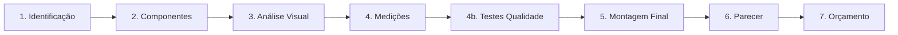

# User Story: Sistema de Diagnóstico e Metrologia Completo

## 📋 Informações Gerais

- **ID**: US-DIAG-001
- **Módulo**: Operações / Diagnóstico
- **Épico**: Sistema de Metrologia e Inspeção Técnica
- **Prioridade**: 🔴 Crítica
- **Estimativa**: 89 pontos
- **Status**: ✅ Implementado (85%) + 🚧 Expansões Necessárias (15%)

---

## 👤 User Story

**Como** técnico metrologista  
**Eu quero** executar diagnósticos completos em componentes de motores com checklists dinâmicos, medições dimensionais, testes de qualidade e upload de fotos  
**Para que** eu possa gerar pareceres técnicos precisos e orçamentos detalhados baseados em evidências

---

## 🎯 Objetivo de Negócio

Digitalizar completamente o processo de metrologia da retífica, eliminando formulários em papel, reduzindo erros humanos, garantindo rastreabilidade total e acelerando a geração de orçamentos técnicos.

**Benefícios Esperados:**
- ⏱️ Redução de 60% no tempo de preenchimento de formulários
- 📊 Aumento de 40% na precisão das medições
- 📸 Evidências fotográficas 100% documentadas
- 🔍 Rastreabilidade completa (DNA do motor)
- 💰 Conversão automática diagnóstico → orçamento
- 📈 KPIs em tempo real

---

## 📐 Regras de Negócio

### RN001: Fluxo de Diagnóstico (5 Etapas Principais)



**Etapa 1 - Identificação do Motor:**
- Ordem de serviço associada (obrigatório)
- Dados do veículo: marca, modelo, ano, placa, km
- Tipo de motor: Diesel / Otto (4 tempos)
- Número do motor (gravação)
- Situação: Motor completo / Parcial / Componente avulso
- Montagem: Montado / Desmontado / Parcialmente montado
- Responsável: Metrologista (auto-preenchido)

**Etapa 2 - Seleção de Componentes:**
- Checkbox múltipla escolha:
  - ☑️ Bloco do Motor
  - ☑️ Cabeçote
  - ☑️ Virabrequim
  - ☑️ Bielas
  - ☑️ Comando de Válvulas
  - ☑️ Pistões
  - ☑️ Eixo Balanceador
  - ☑️ **Volante** (novo - US-MET-014)
- Quantidade de cada componente
- Estado geral (visual rápido)

**Etapa 3 - Análise Visual (por componente):**
- Inspeção externa: Bom / Regular / Ruim / Péssimo
- Presença de:
  - Trincas (Sim/Não + localização + foto obrigatória)
  - Oxidação/Corrosão (Leve/Moderada/Severa)
  - Desgastes anormais (Sim/Não + descrição)
  - Quebras/Danos (Sim/Não + foto)
- Observações técnicas (texto livre até 500 caracteres)
- Upload de fotos (até 10 por componente)

**Etapa 4 - Medições Dimensionais:**
- Formulários dinâmicos por tipo de componente
- Validação em tempo real com tolerâncias
- Indicadores visuais: 🟢 OK / 🟡 Atenção / 🔴 Fora de Spec
- Cálculos automáticos (ovalização, conicidade)
- Sugestão automática de serviços baseada em desvios

**Etapa 4b - Testes de Qualidade Críticos (novo - US-MET-012):**
- **Teste de Trinca** (Bloco + Cabeçote):
  - Método: Líquido Penetrante / Magnético / Ultrassom
  - Resultado: Aprovado / Reprovado
  - Localização de trincas (se houver)
  - Foto obrigatória se reprovado
  - Ação recomendada: Recuperar / Substituir / Descartar

- **Teste Hidrostático** (Bloco):
  - Pressão aplicada (bar): [___]
  - Duração (min): [___]
  - Resultado: Aprovado / Vazamento detectado
  - Localização vazamento (se houver)
  - Foto obrigatória se reprovado

- **Balanceamento** (Virabrequim + Volante):
  - Desbalanceamento inicial (g.mm): [___]
  - Desbalanceamento final (g.mm): [___]
  - Norma aplicada: ISO 1940
  - Aprovado se ≤ 5 g.mm
  - Relatório de balanceamento (upload PDF)

**Etapa 5 - Checklist de Montagem Final (novo - US-MET-015):**
- Opcional (ativa se "Montagem Completa" for solicitada)
- 30+ itens de verificação:
  - Torque de parafusos conforme especificação
  - Folgas axiais e radiais dentro do padrão
  - Alinhamento de eixos
  - Sincronismo do comando
  - Vazamentos (óleo, água, combustível)
  - Pressão de óleo (em bancada)
  - Ruídos anormais
  - Temperatura operacional
  - Etc.
- Status geral: Aprovado para entrega / Requer ajustes

**Etapa 6 - Parecer Técnico:**
- Resumo automático de não conformidades
- Status geral por componente
- Serviços recomendados (auto-gerados)
- Peças necessárias (auto-sugeridas)
- Custo estimado total
- Prazo estimado (em dias úteis)
- Observações finais do metrologista
- Assinatura digital + timestamp

**Etapa 7 - Geração de Orçamento:**
- Botão "Gerar Orçamento"
- Cria automaticamente budget com:
  - Serviços baseados em diagnóstico
  - Peças baseadas em serviços
  - Valores da tabela de preços
  - Observações técnicas
- Redireciona para edição de orçamento

---

### RN002: Medições por Componente

#### 🔧 BLOCO DO MOTOR

| Medição | Tipo | Unidade | Tolerância Típica | Obrigatório | Novo |
|---------|------|---------|-------------------|-------------|------|
| Altura do Bloco (inicial) | Numérico | mm | ± 0.05mm | Sim | - |
| **Altura Após Usinagem** | Numérico | mm | Mínimo conforme fabricante | Não | ✅ US-MET-013 |
| Planicidade da Face | Numérico | mm | ≤ 0.05mm | Sim | - |
| **Empeno do Bloco** | Numérico | mm | ≤ 0.10mm | Sim | ✅ US-MET-013 |
| Diâmetro Cilindros (1º a 6º) | Numérico | mm | ± 0.01mm | Sim | - |
| Ovalização Cilindros | Auto-calculado | mm | ≤ 0.03mm | - | - |
| Conicidade Cilindros | Auto-calculado | mm | ≤ 0.03mm | - | - |
| Diâmetro Mancais (Principal 1-7) | Numérico | mm | ± 0.01mm | Sim | - |
| Alinhamento Mancais | Numérico | mm | ≤ 0.03mm | Sim | - |
| **Diâmetro Buchas Eixo Comando** | Numérico | mm | Conforme fabricante | Não | ✅ US-MET-013 |
| Profundidade Camisas (se aplicável) | Numérico | mm | ± 0.05mm | Não | - |
| Projeção Camisas | Numérico | mm | 0.03 - 0.10mm | Não | - |

**Cálculos Automáticos:**
```typescript
ovalização = Math.abs(diametro_maximo - diametro_minimo)
conicidade = Math.abs(medida_topo - medida_base)
status_cilindro = ovalização <= 0.03 && conicidade <= 0.03 ? 'OK' : 'USINAGEM'
```

---

#### ⚙️ VIRABREQUIM

| Medição | Tipo | Unidade | Tolerância Típica | Obrigatório | Novo |
|---------|------|---------|-------------------|-------------|------|
| Diâmetro Colos Fixos (Munhões 1-7) | Numérico | mm | ± 0.01mm | Sim | - |
| Ovalização Colos Fixos | Auto-calculado | mm | ≤ 0.02mm | - | - |
| Conicidade Colos Fixos | Auto-calculado | mm | ≤ 0.02mm | - | - |
| Diâmetro Colos Móveis (Bielas 1-6) | Numérico | mm | ± 0.01mm | Sim | - |
| Ovalização Colos Móveis | Auto-calculado | mm | ≤ 0.02mm | - | - |
| Conicidade Colos Móveis | Auto-calculado | mm | ≤ 0.02mm | - | - |
| Folga Axial | Numérico | mm | 0.05 - 0.30mm | Sim | - |
| Empenamento (Desalinhamento) | Numérico | mm | ≤ 0.05mm | Sim | - |
| **Dureza (HRC)** | Numérico | HRC | 55-65 HRC | Sim | ✅ US-MET-013 |
| Estado Roscas (Polia/Volante) | Seleção | - | Bom/Regular/Ruim | Sim | - |

**Cálculos Automáticos:**
```typescript
ovalização_fixo = Math.abs(diametro_max_fixo - diametro_min_fixo)
conicidade_fixo = Math.abs(medida_esquerda - medida_direita)
status_colo = ovalização <= 0.02 && conicidade <= 0.02 ? 'OK' : 'RETIFICA'
necessita_balanceamento = empenamento > 0.03
```

---

#### 🏭 CABEÇOTE

| Medição | Tipo | Unidade | Tolerância Típica | Obrigatório | Novo |
|---------|------|---------|-------------------|-------------|------|
| Altura do Cabeçote (inicial) | Numérico | mm | ± 0.05mm | Sim | - |
| **Altura Após Usinagem** | Numérico | mm | Mínimo conforme fabricante | Não | ✅ US-MET-013 |
| Planicidade | Numérico | mm | ≤ 0.05mm | Sim | - |
| **Empeno do Cabeçote** | Numérico | mm | ≤ 0.10mm | Sim | ✅ US-MET-013 |
| Diâmetro Guias Válvula Admissão | Numérico | mm | ± 0.02mm | Sim | - |
| Diâmetro Guias Válvula Escape | Numérico | mm | ± 0.02mm | Sim | - |
| Profundidade Válvulas Admissão | Numérico | mm | Conforme fabricante | Não | - |
| Profundidade Válvulas Escape | Numérico | mm | Conforme fabricante | Não | - |
| Diâmetro Sedes Admissão | Numérico | mm | ± 0.05mm | Não | - |
| Diâmetro Sedes Escape | Numérico | mm | ± 0.05mm | Não | - |
| Ângulo Sedes | Numérico | graus | ± 0.5° | Não | - |

---

#### 🔩 BIELA

| Medição | Tipo | Unidade | Tolerância Típica | Obrigatório |
|---------|------|---------|-------------------|-------------|
| Comprimento Entre Centros | Numérico | mm | ± 0.05mm | Sim |
| Diâmetro Alojamento Bronzina | Numérico | mm | ± 0.01mm | Sim |
| Diâmetro Alojamento Bucha | Numérico | mm | ± 0.01mm | Sim |
| Diâmetro Interno Bucha | Numérico | mm | ± 0.02mm | Sim |
| Paralelismo (Alinhamento) | Numérico | mm | ≤ 0.05mm | Sim |
| Torção | Numérico | mm/100mm | ≤ 0.05mm | Não |

---

#### 📐 COMANDO DE VÁLVULAS

| Medição | Tipo | Unidade | Tolerância Típica | Obrigatório |
|---------|------|---------|-------------------|-------------|
| Diâmetro Mancais (1-5) | Numérico | mm | ± 0.01mm | Sim |
| Altura Ressaltos Admissão | Numérico | mm | Mínimo conforme fabricante | Sim |
| Altura Ressaltos Escape | Numérico | mm | Mínimo conforme fabricante | Sim |
| Desgaste Ressaltos | Seleção | - | Normal/Moderado/Severo | Sim |
| Excentricidade | Numérico | mm | ≤ 0.05mm | Não |
| Estado Engrenagem/Polia | Seleção | - | Bom/Regular/Ruim | Sim |

---

#### 🎡 VOLANTE (novo - US-MET-014)

| Medição | Tipo | Unidade | Tolerância Típica | Obrigatório |
|---------|------|---------|-------------------|-------------|
| Planicidade da Face | Numérico | mm | ≤ 0.05mm | Sim |
| Empeno | Numérico | mm | ≤ 0.10mm | Sim |
| Desbalanceamento | Numérico | g.mm | ≤ 5 g.mm | Sim |
| Estado da Cremalheira | Seleção | - | Bom/Desgastado/Quebrado | Sim |
| Profundidade Dentes | Numérico | mm | Conforme original | Não |
| Diâmetro Interno (Encaixe) | Numérico | mm | ± 0.05mm | Sim |
| Rosqueamento | Seleção | - | Bom/Danificado | Sim |

---

### RN003: Serviços Completos (72+ serviços - US-MET-011)

**Tabela:** `metrology_services`

**Estrutura:**
```sql
CREATE TABLE metrology_services (
  id UUID PRIMARY KEY DEFAULT gen_random_uuid(),
  service_code VARCHAR(20) UNIQUE NOT NULL,
  service_name VARCHAR(200) NOT NULL,
  service_category VARCHAR(50) NOT NULL,
  component_type VARCHAR(50) NOT NULL,
  description TEXT,
  base_price DECIMAL(10,2),
  estimated_time_hours DECIMAL(5,2),
  requires_specialized_equipment BOOLEAN DEFAULT false,
  is_active BOOLEAN DEFAULT true
);
```

**Categorias de Serviços:**

#### 🔧 BLOCO (18 serviços)
1. Retificar Cilindros (brunimento fino)
2. Retificar Cilindros (std / 0.25 / 0.50 / 0.75 / 1.00mm)
3. Encamisar Cilindros
4. Safenas (abertura de canais de óleo)
5. Retificar Mancais (linha de centro)
6. Alinhar Mancais
7. Recuperar Encosto Carcaça
8. Rebaixar Tampa do Mancal e Mandrilhar
9. Projeção das Camisas
10. Recuperar Bocal das Camisas
11. Recuperar Assento Camisas
12. Solda de Bloco (recuperação estrutural)
13. Teste Hidrostático
14. Encher Mancal Central
15. Recuperar Mancal de Encosto
16. Recuperar Rosca da Face
17. Jateamento do Bloco
18. Embuchar Buchas de Comando

#### ⚙️ VIRABREQUIM (8 serviços)
1. Retificar Colos Fixos (std / 0.25 / 0.50 / 0.75mm)
2. Retificar Colos Móveis (std / 0.25 / 0.50 / 0.75mm)
3. Polir Virabrequim (acabamento espelhado)
4. Balancear Virabrequim (dinâmico)
5. Enluvar Ponta (recuperação)
6. Enluvar Pista Retentor
7. Medição de Dureza (HRC)
8. Magnetização (teste de trinca)

#### 🏭 CABEÇOTE (15 serviços)
1. Plainar Cabeçote (retífica de face)
2. Testar Trinca do Cabeçote (líquido penetrante)
3. Recuperar Trinca (solda especializada)
4. Jateamento do Cabeçote
5. Retificar Sedes de Válvulas
6. Trocar Sedes (admissão/escape)
7. Trocar Guias de Válvulas
8. Alargar Guias (padrão)
9. Retificar Alojamento Mancais Comando
10. Esmerilhar Válvulas
11. Montar Válvulas (c/ teste)
12. Plainar Tampa de Válvulas
13. Colocar Buchas de Comando
14. Teste de Vazamento (querosene)
15. Lavação Técnica Completa

#### 🔩 BIELA (5 serviços)
1. Embuchar e Mandrilhar Bielas
2. Retificar Olhal (alojamento bronzina)
3. Rebaixar Bielas (ajuste altura)
4. Rebaixar Tampas
5. Verificar Alinhamento e Torção

#### 📐 COMANDO (5 serviços)
1. Polir Comando (ressaltos e mancais)
2. Trocar Engrenagem Comando
3. Retificar Balanceiros
4. Embuchar Balanceiros
5. Medição de Desgaste (micrômetro)

#### 🎡 VOLANTE (6 serviços - novo US-MET-014)
1. Retificar Volante (face de embreagem)
2. Balancear Volante (estático + dinâmico)
3. Balancear Conjunto Prensa + Disco + Volante
4. Virar Cremalheira (recuperação)
5. Trocar Cremalheira (nova)
6. Solda de Volante (recuperação)

#### 🛠️ MONTAGEM (15 serviços)
1. Montagem Completa do Motor
2. Montagem Parcial (sub-conjuntos)
3. Ajustagem de Folgas (axial/radial)
4. Ajustar Eixo Virabrequim no Bloco
5. Sincronismo do Comando
6. Regular Válvulas (folga térmica)
7. Torquear Parafusos (conforme especificação)
8. Teste de Compressão
9. Teste de Pressão de Óleo
10. Pintura do Conjunto
11. Funcionamento em Bancada
12. Funcionamento no Dinamômetro
13. Break-in (amaciamento controlado)
14. Lavação Final
15. Diferença de Montagem (retrabalho)

---

### RN004: Peças Completas (200+ itens - US-MET-011)

**Tabela:** `metrology_parts`

**Estrutura:**
```sql
CREATE TABLE metrology_parts (
  id UUID PRIMARY KEY DEFAULT gen_random_uuid(),
  part_code VARCHAR(30) UNIQUE NOT NULL,
  part_name VARCHAR(200) NOT NULL,
  part_category VARCHAR(50) NOT NULL,
  component_type VARCHAR(50),
  is_consumable BOOLEAN DEFAULT false,
  oem_compatible BOOLEAN DEFAULT true,
  typical_usage VARCHAR(100),
  unit_measure VARCHAR(20) DEFAULT 'UN',
  is_active BOOLEAN DEFAULT true
);
```

**Categorias de Peças (principais):**

#### 🔒 VEDAÇÃO (20+ itens)
- Retentores: Dianteiro Virabrequim, Traseiro Virabrequim, Comando (simples/duplo labio)
- Pista de Retentor (virabrequim)
- Selo D'água
- Gaxetas: Cabeçote, Cárter, Tampa Válvulas, Bomba Óleo, Bomba Água
- O-rings diversos
- Selos de Válvulas (admissão/escape)
- Junta Tampa de Comando
- Silicone 598 (vedante anaeróbico)
- Adesivo 3M (cola de juntas)

#### ⚙️ VÁLVULAS E COMPONENTES (25+ itens)
- Válvulas Admissão (std / 0.5mm / 1.0mm)
- Válvulas Escape (std / 0.5mm / 1.0mm)
- Guias Válvula Admissão (std / 0.25mm / 0.50mm)
- Guias Válvula Escape (std / 0.25mm / 0.50mm)
- Sedes Admissão (std / 1.0mm / 1.5mm)
- Sedes Escape (std / 1.0mm / 1.5mm)
- Molas Válvulas (interna/externa)
- Retentores Válvulas
- Pratos e Travas (cotters)
- Tuchos (mecânicos/hidráulicos)
- Balancins
- Eixo Balancim
- Buchas Balancim
- Pastilhas de Regulagem (shims)
- Top Brack: Anel, Válvulas, Sedes (diesel)

#### 🔩 BRONZINAS E BUCHAS (15+ itens)
- Bronzinas Mancais (std / 0.25 / 0.50 / 0.75 / 1.0mm)
- Bronzinas Bielas (std / 0.25 / 0.50 / 0.75 / 1.0mm)
- Bronzinas Encosto (axial)
- Buchas de Biela (std / sobremedida)
- Buchas de Comando
- Casquilhos diversos

#### 🛢️ SISTEMA DIESEL (15+ itens)
- Camisas de Bico (sede injetores)
- Canos Injetores (1º ao 6º cilindro)
- Velas Aquecedoras (1ª a 6ª)
- Retentores de Pressão
- Selo de Injetor
- Gaxeta Tampa Injetores

#### 🔧 PARAFUSOS E FIXAÇÃO (10+ items)
- Parafusos Cabeçote (jogo completo)
- Parafusos Bielas
- Parafusos Mancais
- Parafusos Volante
- Pinos Guia do Cabeçote
- Arruelas diversas

#### 📐 COMANDO E SINCRONISMO (12+ itens)
- Correia Dentada
- Kit Corrente (corrente + esticador + guias)
- Tensor da Correia
- Proteção da Correia
- Polia Comando (plástica/metálica)
- Engrenagem Comando
- Engrenagem Virabrequim
- Engrenagem Intermediária
- Esticador Automático

#### 🎡 VOLANTE E EMBREAGEM (8+ itens)
- Volante (novo/retificado)
- Cremalheira Volante
- Kit Embreagem (disco + platô + rolamento)
- Rolamento Piloto
- Parafusos Volante
- Parafusos Embreagem

#### 🛢️ LUBRIFICAÇÃO (12+ itens)
- Bomba de Óleo (completa/kit reparo)
- Pescador de Óleo
- Cárter de Óleo
- Filtro de Óleo
- Válvula de Alívio
- Válvula Termostática
- Sensor Pressão Óleo
- Sensor Temperatura Óleo
- Bujão Cárter com imã

#### 💧 ARREFECIMENTO (10+ itens)
- Bomba D'água (completa/kit reparo)
- Válvula Termostática
- Sensor Temperatura Água
- Tubo D'água
- Flange D'água
- Válvula de Separação

#### 🔌 SENSORES E ELÉTRICA (8+ itens)
- Sensor Rotação (RPM)
- Sensor Posição Virabrequim (CKP)
- Sensor Posição Comando (CMP)
- Sensor MAP
- Sensor Detonação (knock)
- Velas de Ignição (Otto)

#### 🏭 ESTRUTURAIS (10+ itens)
- Camisas de Cilindro (úmidas/secas, std / 0.50 / 1.0mm)
- Pistões (std / 0.25 / 0.50 / 0.75 / 1.0mm)
- Anéis de Pistão (jogo completo por cilindro)
- Pinos de Pistão
- Travas de Pino (clips)
- Eixo Balanceador

#### 🌪️ TURBO E ADMISSÃO (8+ itens)
- Turbina (nova/recondicionada)
- Reparo do Exaustor
- Filtro de Ar
- Filtro de Combustível
- Coletor Admissão (juntas)
- Coletor Escape (juntas)

#### 🧪 CONSUMÍVEIS (8+ itens)
- Óleo Motor (especificação conforme motor)
- Aditivo Radiador
- Desengripante
- Desengraxante
- Estopa Industrial
- Lixa d'água (diversas granulações)
- Pasta de Polir
- Massa de Vedação

---

### RN005: Validações Automáticas

**Sistema deve validar:**

1. **Medições vs Tolerâncias:**
```typescript
if (medida < tolerancia_minima || medida > tolerancia_maxima) {
  status = 'FORA_ESPECIFICACAO';
  sugerir_servico('Retificar/Substituir');
}
```

2. **Obrigatoriedade:**
- Campos marcados como obrigatórios bloqueiam avanço de etapa
- Fotos obrigatórias em trincas/danos
- Testes de qualidade obrigatórios conforme tipo de motor

3. **Cálculos Derivados:**
- Ovalização = |Ø max - Ø min|
- Conicidade = |Medida topo - Medida base|
- Desbalanceamento residual (após balanceamento)

4. **Regras de Negócio:**
- Virabrequim com HRC < 50: ⚠️ "Dureza abaixo do especificado - risco de desgaste prematuro"
- Empenamento > 0.05mm: ⚠️ "Balanceamento obrigatório"
- Trinca detectada em componente estrutural: 🔴 "Avaliação de segurança necessária"

---

### RN006: Integração com Orçamento (US-MET-007)

**Mapeamento Automático:**

```typescript
interface ServiceSuggestion {
  service_id: string;
  service_name: string;
  reason: string; // "Cilindro 1 com ovalização de 0.08mm"
  priority: 'CRITICO' | 'RECOMENDADO' | 'OPCIONAL';
  estimated_cost: number;
}

// Exemplo:
if (ovalização_cilindro > 0.03) {
  sugerirServico({
    service_id: 'SERV-BLO-001',
    service_name: 'Retificar Cilindros 0.50mm',
    reason: `Cilindro ${numero} com ovalização de ${ovalização}mm (limite: 0.03mm)`,
    priority: 'CRITICO',
    estimated_cost: 450.00
  });
  
  sugerirPeca({
    part_id: 'PECA-PISTAO-050',
    part_name: 'Pistão STD +0.50mm',
    quantity: numero_cilindros,
    reason: 'Necessário após retífica de cilindros',
    estimated_cost: 85.00
  });
}
```

---

### RN007: DNA do Motor (US-MET-008)

**Rastreabilidade Completa:**

```sql
CREATE TABLE motor_dna (
  id UUID PRIMARY KEY,
  motor_number VARCHAR(50) UNIQUE,
  vehicle_data JSONB, -- marca, modelo, ano, placa
  manufacturing_data JSONB, -- fabricante original, ano fabricação
  history JSONB[] -- array de eventos
);

-- Estrutura de history[]:
{
  "timestamp": "2025-01-15T10:30:00Z",
  "event_type": "DIAGNOSTIC_COMPLETED",
  "order_id": "uuid",
  "diagnostic_id": "uuid",
  "technician": "João Silva",
  "summary": {
    "non_conformities": 8,
    "services_required": 12,
    "estimated_cost": 3500.00,
    "components_analyzed": ["bloco", "virabrequim", "cabeçote"]
  },
  "photos": ["url1", "url2"],
  "documents": ["parecer_tecnico.pdf"]
}
```

---

### RN008: KPIs e Dashboards (US-MET-010)

**Métricas Calculadas:**

1. **Tempo Médio de Diagnóstico:**
```sql
SELECT 
  AVG(EXTRACT(EPOCH FROM (concluded_at - started_at))/3600) as avg_hours,
  component,
  COUNT(*) as total_diagnostics
FROM diagnostic_responses
WHERE status = 'concluded'
GROUP BY component;
```

2. **Taxa de Aprovação de Orçamentos:**
```sql
SELECT 
  COUNT(CASE WHEN b.status = 'approved' THEN 1 END) * 100.0 / COUNT(*) as approval_rate
FROM diagnostic_responses dr
LEFT JOIN budgets b ON b.diagnostic_response_id = dr.id
WHERE dr.created_at >= NOW() - INTERVAL '30 days';
```

3. **Serviços Mais Comuns:**
```sql
SELECT 
  ms.service_name,
  COUNT(*) as frequency,
  AVG(bi.unit_price) as avg_price
FROM budget_items bi
JOIN metrology_services ms ON ms.id = bi.service_id
GROUP BY ms.service_name
ORDER BY frequency DESC
LIMIT 10;
```

4. **Não Conformidades por Componente:**
```sql
SELECT 
  component,
  COUNT(CASE WHEN measurement_status = 'OUT_OF_SPEC' THEN 1 END) as out_of_spec_count,
  COUNT(*) as total_measurements
FROM diagnostic_measurements
GROUP BY component;
```

---

## ✅ Critérios de Aceitação

### AC1: Wizard de 7 Etapas
- [x] Navegação sequencial com progresso visual
- [x] Validação por etapa (não avança se incompleto)
- [x] Botões: Anterior, Salvar Rascunho, Próximo
- [x] Auto-save a cada 30 segundos
- [x] Estado salvo em localStorage (recuperação em caso de falha)

### AC2: Formulários Dinâmicos
- [x] Campos de medição aparecem conforme componente selecionado
- [x] Máscaras numéricas com precisão decimal configurável
- [x] Indicadores visuais de status em tempo real
- [x] Cálculos automáticos (ovalização, conicidade)
- [x] Sugestões de serviços aparecem automaticamente

### AC3: Validação e Feedback
- [x] Campos obrigatórios marcados com *
- [x] Mensagens de erro contextuais
- [x] Indicadores de tolerância: 🟢 OK / 🟡 Atenção / 🔴 Crítico
- [x] Tooltip com informações de ajuda
- [x] Resumo de validação ao final de cada etapa

### AC4: Upload de Fotos
- [x] Drag & drop funcional
- [x] Preview de miniaturas (grid responsivo)
- [x] Compressão automática (max 1920x1920, 85% quality)
- [x] Upload para Supabase Storage
- [x] Lightbox para visualização ampliada
- [x] Associação correta com item do checklist

### AC5: Testes de Qualidade (novo)
- [x] Formulários específicos para Trinca, Hidrostático, Balanceamento
- [x] Campos condicionais (ex: localização aparece se reprovado)
- [x] Upload de relatórios PDF (balanceamento)
- [x] Status visual claro (Aprovado/Reprovado)
- [x] Bloqueio de conclusão se teste crítico reprovado sem ação

### AC6: Componente Volante (novo)
- [x] Aparece como opção na Etapa 2
- [x] Formulário de medições específico
- [x] Serviços de balanceamento e cremalheira disponíveis
- [x] Integração com orçamento

### AC7: Checklist Montagem Final (novo)
- [x] Etapa opcional (checkbox "Montagem Completa Solicitada")
- [x] 30+ itens de verificação
- [x] Status geral: Aprovado / Requer Ajustes
- [x] Campo de observações finais
- [x] Foto do motor montado (obrigatória se etapa ativa)

### AC8: Parecer Técnico em PDF
- [x] Geração automática ao concluir diagnóstico
- [x] Logo da empresa
- [x] Dados do motor e ordem de serviço
- [x] Resumo executivo
- [x] Tabela de medições com status
- [x] Lista de não conformidades
- [x] Serviços recomendados
- [x] Peças sugeridas
- [x] Estimativa de custo e prazo
- [x] Assinatura digital do metrologista
- [x] QR Code para consulta online (DNA do motor)

### AC9: Integração com Orçamento
- [x] Botão "Gerar Orçamento" ao concluir parecer
- [x] Cria budget automaticamente com:
  - Serviços baseados em diagnóstico
  - Peças baseadas em serviços
  - Valores da tabela `metrology_services` e `metrology_parts`
- [x] Permite edição manual antes de enviar ao cliente
- [x] Mantém link diagnostic_response_id ↔ budget_id

### AC10: DNA do Motor
- [x] Criação/atualização automática do registro motor_dna
- [x] Histórico cronológico de eventos
- [x] Visualização em timeline
- [x] Filtros por tipo de evento
- [x] Exportação de histórico completo (PDF)

### AC11: Dashboard de KPIs
- [x] Cards com métricas principais:
  - Tempo médio de diagnóstico
  - Taxa de aprovação de orçamentos
  - Diagnósticos concluídos (mês)
  - Não conformidades mais comuns
- [x] Gráficos:
  - Diagnósticos por componente (pizza)
  - Tendência de conclusões (linha temporal)
  - Serviços mais requisitados (barra horizontal)
- [x] Filtros: Período, Componente, Metrologista
- [x] Exportação para Excel

### AC12: Performance e UX
- [x] Loading states em operações assíncronas
- [x] Debounce em campos de texto (300ms)
- [x] Lazy loading de fotos
- [x] Cache de checklists e tolerâncias
- [x] Feedback de sucesso/erro com toast
- [x] Responsivo (mobile, tablet, desktop)

---

## 🏁 Definition of Done

### Backend (Banco de Dados)
- [x] Tabelas criadas via migration:
  - `diagnostic_checklists`
  - `diagnostic_checklist_items`
  - `diagnostic_responses`
  - `diagnostic_response_items`
  - `diagnostic_measurements`
  - `motor_dna`
  - `metrology_services` (novo)
  - `metrology_parts` (novo)
  - `quality_tests` (novo)
  - `assembly_checklists` (novo)

- [x] Triggers criados:
  - `update_updated_at_column`
  - `create_or_update_motor_dna`
  - `auto_suggest_services`
  - `calculate_derived_measurements`

- [x] Views criadas:
  - `v_diagnostic_summary`
  - `v_metrology_kpis`
  - `v_motor_dna_timeline`

- [x] RLS policies configuradas (acesso por org_id)

- [x] Seed data inserido:
  - Checklists padrão por componente
  - Tolerâncias por tipo de motor
  - 72+ serviços cadastrados
  - 200+ peças cadastradas

### Frontend (Componentes)
- [x] Componentes criados:
  - `DiagnosticWizard.tsx` (container principal)
  - `StepIdentification.tsx`
  - `StepComponentSelection.tsx`
  - `StepVisualInspection.tsx`
  - `StepMeasurements.tsx`
  - `StepQualityTests.tsx` (novo)
  - `StepFinalAssembly.tsx` (novo)
  - `StepTechnicalReport.tsx`
  - `PhotoUpload.tsx`
  - `MeasurementField.tsx`
  - `ToleranceIndicator.tsx`
  - `ServiceSuggestionCard.tsx`
  - `DiagnosticValidation.tsx`
  - `PDFReportGenerator.tsx`
  - `MotorDNATimeline.tsx`
  - `MetrologyDashboard.tsx`

- [x] Hooks criados:
  - `useDiagnosticWizard.ts`
  - `useDiagnosticChecklists.ts`
  - `usePhotoUpload.ts`
  - `useMeasurementValidation.ts`
  - `useServiceSuggestions.ts`
  - `useMotorDNA.ts`
  - `useMetrologyKPIs.ts`

### Testes
- [x] Testes unitários dos hooks
- [x] Testes E2E do fluxo completo:
  - Criar diagnóstico do zero
  - Preencher todas as etapas
  - Upload de fotos
  - Gerar parecer técnico
  - Criar orçamento
  - Aprovar orçamento
  - Verificar DNA do motor atualizado

### Documentação
- [x] README do módulo
- [x] Wireframes atualizados
- [x] Diagramas de fluxo (Mermaid)
- [x] ERD completo
- [x] Documentação de API (se houver edge functions)
- [x] Manual do usuário (para treinamento)

---

## 📊 Componentes Afetados

### Novos
- `src/components/diagnostics/DiagnosticWizard.tsx`
- `src/components/diagnostics/steps/StepIdentification.tsx`
- `src/components/diagnostics/steps/StepComponentSelection.tsx`
- `src/components/diagnostics/steps/StepVisualInspection.tsx`
- `src/components/diagnostics/steps/StepMeasurements.tsx`
- `src/components/diagnostics/steps/StepQualityTests.tsx` ⭐ novo
- `src/components/diagnostics/steps/StepFinalAssembly.tsx` ⭐ novo
- `src/components/diagnostics/steps/StepTechnicalReport.tsx`
- `src/components/diagnostics/PhotoUpload.tsx`
- `src/components/diagnostics/MeasurementField.tsx`
- `src/components/diagnostics/ToleranceIndicator.tsx`
- `src/components/diagnostics/ServiceSuggestionCard.tsx`
- `src/components/diagnostics/MotorDNATimeline.tsx`
- `src/components/diagnostics/MetrologyDashboard.tsx`
- `src/hooks/useDiagnosticWizard.ts`
- `src/hooks/useDiagnosticChecklists.ts`
- `src/hooks/usePhotoUpload.ts`
- `src/hooks/useMeasurementValidation.ts`
- `src/hooks/useServiceSuggestions.ts`
- `src/hooks/useMotorDNA.ts`
- `src/hooks/useMetrologyKPIs.ts`

### Atualizados
- `src/components/operations/DiagnosticValidation.tsx` (expandir validações)
- `src/pages/Operations.tsx` (integrar wizard)
- `src/pages/Budgets.tsx` (receber dados do diagnóstico)

---

## 🗄️ Mudanças no Banco de Dados

Ver arquivos separados:
- `schema.sql` - DDL completo
- `indexes.sql` - Índices para performance
- `triggers.sql` - Triggers e functions
- `rls.sql` - Row Level Security policies
- `views.sql` - Views materializadas
- `seed.sql` - Dados iniciais

---

## 📐 Wireframes

Ver arquivo separado: `wireframe.md`

---

## 🧪 Cenários de Teste

### Teste 1: Diagnóstico Completo - Bloco Fora de Especificação
**Dado** que estou na página de Operações  
**Quando** clico em "Novo Diagnóstico"  
**E** seleciono a OS #123  
**E** preencho dados do motor (Fiat Fire 1.0, 2015)  
**E** seleciono componente "Bloco"  
**E** informo análise visual "Regular - Pequenas oxidações"  
**E** faço upload de 3 fotos  
**E** preencho medições:
- Cilindro 1: 70.08mm (limite: 70.00mm ± 0.03mm) → 🔴 FORA
- Cilindro 2: 70.05mm → 🟡 ATENÇÃO
- Planicidade: 0.02mm → 🟢 OK  

**Então** o sistema deve:
- Exibir indicador vermelho no Cilindro 1
- Sugerir automaticamente "Retificar Cilindros 0.50mm"
- Sugerir peça "Pistão STD +0.50mm x6"
- Calcular ovalização automaticamente
- Permitir avançar para conclusão

### Teste 2: Teste de Trinca Reprovado
**Dado** que estou na Etapa 4b (Testes de Qualidade)  
**Quando** seleciono componente "Cabeçote"  
**E** seleciono teste "Teste de Trinca"  
**E** seleciono resultado "Reprovado"  
**E** informo localização "Câmara combustão cilindro 3"  
**E** faço upload de foto da trinca  
**E** seleciono ação "Recuperar com solda"  

**Então** o sistema deve:
- Marcar o campo foto como preenchido
- Sugerir serviço "Recuperar Trinca do Cabeçote"
- Adicionar custo estimado ao total
- Permitir conclusão com alerta de criticidade

### Teste 3: Componente Volante
**Dado** que estou na Etapa 2 (Seleção de Componentes)  
**Quando** marco checkbox "Volante"  
**E** avanço para Etapa 4 (Medições)  

**Então** o sistema deve:
- Exibir formulário específico do Volante
- Solicitar medições: Planicidade, Empeno, Desbalanceamento
- Permitir informar estado da cremalheira
- Sugerir serviços de balanceamento se desbalanceamento > 5 g.mm

### Teste 4: Checklist Montagem Final
**Dado** que conclui todas as medições  
**Quando** marco checkbox "Montagem Completa Solicitada"  

**Então** o sistema deve:
- Exibir Etapa 5 (Montagem Final)
- Listar 30+ itens de verificação
- Solicitar foto do motor montado
- Permitir informar status "Aprovado" ou "Requer Ajustes"

### Teste 5: Geração de Orçamento Automático
**Dado** que conclui o diagnóstico  
**E** o sistema sugeriu 5 serviços  
**Quando** clico em "Gerar Orçamento"  

**Então** o sistema deve:
- Criar budget vinculado ao diagnostic_response_id
- Adicionar os 5 serviços sugeridos como budget_items
- Adicionar peças associadas aos serviços
- Calcular valores da tabela metrology_services
- Redirecionar para página de edição do orçamento

### Teste 6: DNA do Motor
**Dado** que conclui um diagnóstico para motor #ABC123  
**Quando** acesso a página "DNA do Motor"  
**E** busco por "ABC123"  

**Então** o sistema deve:
- Exibir timeline com histórico completo
- Mostrar evento "Diagnóstico Concluído" com timestamp
- Permitir download do parecer técnico
- Exibir fotos associadas
- Mostrar gráfico de evolução (se houver múltiplos diagnósticos)

### Teste 7: Dashboard KPIs
**Dado** que existem 20 diagnósticos concluídos no mês  
**Quando** acesso "Dashboard de Metrologia"  

**Então** o sistema deve:
- Exibir "Tempo Médio: X horas"
- Exibir "Taxa de Aprovação: Y%"
- Exibir gráfico de diagnósticos por componente (pizza)
- Exibir top 10 serviços mais requisitados
- Permitir filtrar por período e componente

---

## 🚫 Escopo Negativo (O que NÃO está incluído)

- ❌ Integração com equipamentos de medição (paquímetros digitais via Bluetooth)
- ❌ Reconhecimento automático de peças por IA
- ❌ Assistente virtual com recomendações baseadas em ML
- ❌ Geolocalização obrigatória de fotos
- ❌ Edição de fotos (crop, rotação, anotações)
- ❌ Versionamento de checklists (sempre usa versão ativa)
- ❌ Workflow de aprovação interna de diagnósticos
- ❌ Notificações por e-mail/SMS
- ❌ Integração com ERP externo
- ❌ App mobile nativo (apenas PWA responsivo)

---

## 📚 Referências

- Documentos físicos analisados:
  - `CONTROLE_DIMENSIONAL_RETIFICA_FORMIGUENSE_revisado_1-4.docx`
  - `IT_Metrologia-4.docx`
  - `FICHA_METROLOGIA-4.docx`
  - `FLUXO_SISTÊMICO_METROLOGIA-4.docx`

- Normas Técnicas:
  - ISO 1940 (Balanceamento)
  - ISO 3534 (Tolerâncias dimensionais)
  - NBR 6601 (Motores de combustão interna)

- User Stories relacionadas:
  - US-MET-001 a US-MET-010 (já implementadas)
  - US-MET-011: Expansão Serviços e Peças
  - US-MET-012: Testes de Qualidade
  - US-MET-013: Medições Pós-Usinagem
  - US-MET-014: Componente Volante
  - US-MET-015: Checklist Montagem Final

---

**Última Atualização:** 2025-01-28  
**Versão:** 2.0 (Completa + Expansões)  
**Autor:** Sistema de Documentação  
**Revisor:** Equipe Técnica
