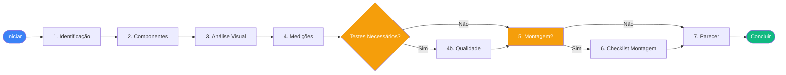

# Wireframe: Sistema de Diagnóstico e Metrologia

## 📐 Visão Geral

Interface wizard de 7 etapas para execução de diagnósticos técnicos completos com validação em tempo real, upload de fotos e geração automática de orçamentos.

---

## 🎨 Design System

**Paleta de Cores (Status):**
- 🟢 Verde (`hsl(var(--success))`) - Dentro da especificação
- 🟡 Amarelo (`hsl(var(--warning))`) - Atenção necessária
- 🔴 Vermelho (`hsl(var(--destructive))`) - Fora de especificação
- 🔵 Azul (`hsl(var(--primary))`) - Informação/Ação principal

**Componentes Shadcn:**
- `Card` - Container de seções
- `Badge` - Indicadores de status
- `Button` - Ações primárias/secundárias
- `Input` - Campos de texto
- `Select` - Dropdowns
- `Checkbox` / `RadioGroup` - Seleções
- `Progress` - Barra de progresso
- `Tabs` - Navegação de componentes
- `Dialog` - Modais de confirmação
- `Toast` - Feedback de ações

---

## 📱 Layout Responsivo

### Desktop (≥1024px)
```
┌────────────────────────────────────────────────────┐
│  Header: Diagnóstico #D-2025-001  [Salvar] [Sair] │
├────────────────────────────────────────────────────┤
│                                                    │
│  Progress: ●━●━●━○━○━○━○  Etapa 3 de 7           │
│                                                    │
├──────────────┬─────────────────────────────────────┤
│              │                                     │
│  [Sidebar]   │         [Conteúdo Principal]       │
│  - Etapas    │                                     │
│  - Ações     │         Formulários dinâmicos      │
│  - Resumo    │         baseados na etapa          │
│              │                                     │
│              │                                     │
├──────────────┴─────────────────────────────────────┤
│  [← Anterior]  [Salvar Rascunho]  [Próximo →]     │
└────────────────────────────────────────────────────┘
```

### Tablet (768px - 1023px)
- Sidebar colapsa em hamburguer menu
- Conteúdo principal ocupa 100% largura
- Botões de navegação fixos no rodapé

### Mobile (<768px)
- Wizard em tela cheia
- Steps indicados por números (1/7)
- Botões empilhados verticalmente
- Teclado numérico automático em medições

---

## 🚀 Fluxo de Telas (7 Etapas)



---

## 📋 ETAPA 1: Identificação do Motor

### Layout Desktop

```
┌────────────────────────────────────────────────────┐
│  🔍 Identificação do Motor                         │
├────────────────────────────────────────────────────┤
│                                                    │
│  Ordem de Serviço *                                │
│  [Dropdown: Selecione uma OS ▼]                    │
│  ┌──────────────────────────────────────────┐     │
│  │ 🔧 OS-2025-123 - João Silva              │     │
│  │ Fiat Palio 1.0 Fire - 2015               │     │
│  │ Placa: ABC-1234 | KM: 85.000             │     │
│  └──────────────────────────────────────────┘     │
│                                                    │
│  Dados do Motor                                    │
│  ┌─────────────────┬─────────────────────────┐    │
│  │ Tipo de Ciclo * │ Número do Motor         │    │
│  │ ○ Diesel        │ [___________________]   │    │
│  │ ● Otto (4T)     │                         │    │
│  └─────────────────┴─────────────────────────┘    │
│                                                    │
│  Situação *                                        │
│  ● Motor Completo                                  │
│  ○ Motor Parcial (faltam componentes)             │
│  ○ Componente Avulso (sem motor)                  │
│                                                    │
│  Montagem *                                        │
│  ○ Montado   ● Desmontado   ○ Parcialmente        │
│                                                    │
│  Responsável: [João Metrologista] (auto)          │
│  Data/Hora: [15/01/2025 10:30] (auto)             │
│                                                    │
└────────────────────────────────────────────────────┘
```

**Validações:**
- ✅ OS obrigatória
- ✅ Tipo de ciclo obrigatório
- ✅ Situação obrigatória
- ⚠️ Alerta se "Motor Parcial" → solicita especificar componentes faltantes

---

## 🔧 ETAPA 2: Seleção de Componentes

### Grid de Componentes

```
┌────────────────────────────────────────────────────┐
│  🔧 Seleção de Componentes Recebidos               │
├────────────────────────────────────────────────────┤
│                                                    │
│  Marque os componentes que serão diagnosticados:   │
│                                                    │
│  ┌─────────┬─────────┬─────────┬─────────┐        │
│  │ ☑ BLOCO │ ☑ CABEÇ │ ☑ VIRA  │ □ BIELAS│        │
│  │ 🏭      │ 🔩      │ ⚙️      │ 🔗      │        │
│  │ Qtd: 1  │ Qtd: 1  │ Qtd: 1  │ Qtd: 6  │        │
│  │ ✅ BOM  │ ⚠️ REG  │ ✅ BOM  │ ⚠️ REG  │        │
│  └─────────┴─────────┴─────────┴─────────┘        │
│                                                    │
│  ┌─────────┬─────────┬─────────┬─────────┐        │
│  │ □ COMANDO│ □ PISTÕES│ □ EIXO │ ☑ VOLANTE│       │
│  │ 📐      │ 🔘      │ ⚖️      │ 🎡      │        │
│  │ Qtd: 1  │ Qtd: 6  │ Qtd: 1  │ Qtd: 1  │        │
│  │         │         │         │ ⚠️ REG  │        │
│  └─────────┴─────────┴─────────┴─────────┘        │
│                                                    │
│  📊 Resumo: 4 componentes selecionados             │
│                                                    │
│  ⚠️ Nota: Componentes não marcados não serão      │
│  diagnosticados e não gerarão custos de inspeção.  │
│                                                    │
└────────────────────────────────────────────────────┘
```

**Interações:**
- Click no card → toggle checkbox
- Dropdown "Quantidade" aparece se selecionado
- Dropdown "Estado Geral" (Bom/Regular/Ruim/Péssimo)
- Hover → tooltip com descrição do componente

---

## 👁️ ETAPA 3: Análise Visual

### Tabs por Componente

```
┌────────────────────────────────────────────────────┐
│  👁️ Análise Visual por Componente                  │
├────────────────────────────────────────────────────┤
│                                                    │
│  [Bloco] [Cabeçote] [Virabrequim] [Volante]       │
│  ──────────────────────────────────────────────    │
│                                                    │
│  🏭 BLOCO DO MOTOR                                 │
│                                                    │
│  Inspeção Externa *                                │
│  ○ Bom    ● Regular    ○ Ruim    ○ Péssimo        │
│                                                    │
│  ┌─────────────────────────────────────────┐      │
│  │ Checklist de Problemas                  │      │
│  ├─────────────────────────────────────────┤      │
│  │ ☑ Possui trincas visíveis               │      │
│  │   └─ Localização: [Mancal Central]      │      │
│  │   └─ 📸 [2 fotos anexadas]              │      │
│  │                                         │      │
│  │ ☑ Oxidação/Corrosão                     │      │
│  │   ○ Leve  ● Moderada  ○ Severa          │      │
│  │                                         │      │
│  │ □ Desgastes anormais                    │      │
│  │ □ Quebras/Danos estruturais             │      │
│  └─────────────────────────────────────────┘      │
│                                                    │
│  Observações Técnicas (0/500 caracteres)           │
│  ┌──────────────────────────────────────────┐     │
│  │ Bloco apresenta oxidação moderada na     │     │
│  │ face superior, sem comprometimento       │     │
│  │ estrutural. Trinca superficial no mancal │     │
│  │ central necessita avaliação...           │     │
│  └──────────────────────────────────────────┘     │
│                                                    │
│  📸 Fotos Gerais (4/10)                            │
│  ┌────┬────┬────┬────┐                            │
│  │[x] │[x] │[x] │[x] │ [+ Adicionar]              │
│  │IMG1│IMG2│IMG3│IMG4│                            │
│  └────┴────┴────┴────┘                            │
│                                                    │
│  ✅ Validação: Componente Bloco concluído          │
│                                                    │
└────────────────────────────────────────────────────┘
```

**Regras:**
- Se marca "Possui trincas" → campo "Localização" torna-se obrigatório
- Se marca "Possui trincas" → upload de foto torna-se obrigatório (mín. 1)
- Se marca "Desgastes anormais" → campo "Descrição" aparece
- Upload de fotos: drag & drop funcional

---

## 📐 ETAPA 4: Medições Dimensionais

### Formulário Dinâmico (Exemplo: Bloco)

```
┌────────────────────────────────────────────────────┐
│  📐 Medições Dimensionais: BLOCO DO MOTOR          │
├────────────────────────────────────────────────────┤
│                                                    │
│  [Bloco] [Cabeçote] [Virabrequim] [Volante]       │
│  ──────────────────────────────────────────────    │
│                                                    │
│  🔍 MEDIDAS CRÍTICAS                               │
│                                                    │
│  ┌──────────────────────────────────────────┐     │
│  │ 1. Altura do Bloco *                     │     │
│  │    ┌────────┬─────────┬──────────┐       │     │
│  │    │ Medido │ Padrão  │ Status   │       │     │
│  │    ├────────┼─────────┼──────────┤       │     │
│  │    │ 218.95 │ 219.00  │ 🟢 OK    │       │     │
│  │    │   mm   │ ±0.05mm │          │       │     │
│  │    └────────┴─────────┴──────────┘       │     │
│  └──────────────────────────────────────────┘     │
│                                                    │
│  ┌──────────────────────────────────────────┐     │
│  │ 2. Planicidade da Face *                 │     │
│  │    ┌────────┬─────────┬──────────┐       │     │
│  │    │ Medido │ Máximo  │ Status   │       │     │
│  │    ├────────┼─────────┼──────────┤       │     │
│  │    │ 0.08   │ 0.05mm  │ 🔴 FORA  │       │     │
│  │    │   mm   │         │          │       │     │
│  │    └────────┴─────────┴──────────┘       │     │
│  │                                          │     │
│  │    ⚠️ Serviço Sugerido:                  │     │
│  │    └─ Plainar/Retificar Bloco (R$ 280)  │     │
│  └──────────────────────────────────────────┘     │
│                                                    │
│  ┌──────────────────────────────────────────┐     │
│  │ 3. Diâmetro dos Cilindros *              │     │
│  │                                          │     │
│  │    Cilindro 1:                           │     │
│  │    ┌──────┬──────┬──────┬────────────┐   │     │
│  │    │ Topo │ Meio │ Base │ Ø Padrão   │   │     │
│  │    ├──────┼──────┼──────┼────────────┤   │     │
│  │    │70.08 │70.06 │70.04 │70.00±0.03  │   │     │
│  │    └──────┴──────┴──────┴────────────┘   │     │
│  │                                          │     │
│  │    📊 Cálculos Automáticos:              │     │
│  │    • Ovalização: 0.08mm 🔴 (máx: 0.03)   │     │
│  │    • Conicidade: 0.04mm 🔴 (máx: 0.03)   │     │
│  │                                          │     │
│  │    ⚠️ Serviços Sugeridos:                │     │
│  │    └─ Retificar Cilindros 0.50mm (R$ 450│     │
│  │    └─ Pistões STD+0.50 x4 (R$ 340)      │     │
│  │    └─ Anéis 0.50mm x4 (R$ 280)          │     │
│  └──────────────────────────────────────────┘     │
│                                                    │
│  [Expandir Todos]  [Colapsar]                     │
│                                                    │
│  ✅ 8/12 medições concluídas                       │
│  ⚠️ 4 medições pendentes (obrigatórias)            │
│                                                    │
└────────────────────────────────────────────────────┘
```

**Features:**
- Máscara numérica com 2 decimais
- Validação em tempo real (onChange)
- Indicadores visuais: 🟢 OK / 🟡 Atenção / 🔴 Fora
- Cálculos automáticos (ovalização, conicidade)
- Sugestões automáticas de serviços
- Accordion para medições opcionais

---

## 🧪 ETAPA 4B: Testes de Qualidade (NOVO)

```
┌────────────────────────────────────────────────────┐
│  🧪 Testes de Qualidade Críticos                   │
├────────────────────────────────────────────────────┤
│                                                    │
│  ⚠️ Testes obrigatórios conforme tipo de motor     │
│                                                    │
│  ┌──────────────────────────────────────────┐     │
│  │ 🔍 TESTE DE TRINCA (Bloco)               │     │
│  ├──────────────────────────────────────────┤     │
│  │ Método Utilizado *                       │     │
│  │ ○ Líquido Penetrante                     │     │
│  │ ● Magnético (Magnaflux)                  │     │
│  │ ○ Ultrassom                              │     │
│  │                                          │     │
│  │ Resultado *                              │     │
│  │ ○ Aprovado  ● Reprovado                  │     │
│  │                                          │     │
│  │ Localização das Trincas:                 │     │
│  │ [Mancal central - parede cilindro 3]     │     │
│  │                                          │     │
│  │ 📸 Evidência Fotográfica * (2/5)         │     │
│  │ [IMG] [IMG] [+ Adicionar]                │     │
│  │                                          │     │
│  │ Ação Recomendada *                       │     │
│  │ ● Recuperar (solda + retífica)           │     │
│  │ ○ Substituir bloco                       │     │
│  │ ○ Descartar                              │     │
│  │                                          │     │
│  │ 💰 Serviço: Solda Bloco + Usinagem       │     │
│  │    Custo estimado: R$ 850,00             │     │
│  └──────────────────────────────────────────┘     │
│                                                    │
│  ┌──────────────────────────────────────────┐     │
│  │ 💧 TESTE HIDROSTÁTICO (Bloco)            │     │
│  ├──────────────────────────────────────────┤     │
│  │ Pressão Aplicada * [6.5] bar             │     │
│  │ Duração * [15] minutos                   │     │
│  │                                          │     │
│  │ Resultado *                              │     │
│  │ ● Aprovado  ○ Vazamento Detectado        │     │
│  │                                          │     │
│  │ 📸 Foto Resultado (1/3)                  │     │
│  │ [IMG] [+ Adicionar]                      │     │
│  │                                          │     │
│  │ ✅ Bloco aprovado para montagem           │     │
│  └──────────────────────────────────────────┘     │
│                                                    │
│  ┌──────────────────────────────────────────┐     │
│  │ ⚖️ BALANCEAMENTO (Virabrequim)           │     │
│  ├──────────────────────────────────────────┤     │
│  │ Desbalanceamento Inicial * [45.2] g.mm   │     │
│  │ Desbalanceamento Final * [3.8] g.mm      │     │
│  │                                          │     │
│  │ Norma: ISO 1940 (limite: 5 g.mm)         │     │
│  │ Status: ✅ APROVADO                       │     │
│  │                                          │     │
│  │ 📄 Relatório de Balanceamento (PDF)      │     │
│  │ [laudo_balanceamento_vira123.pdf] ✅      │     │
│  │ [+ Upload Laudo]                         │     │
│  └──────────────────────────────────────────┘     │
│                                                    │
│  📊 Resumo de Testes:                              │
│  • 3 testes realizados                             │
│  • 2 aprovados, 1 requer ação                      │
│  • Custo adicional estimado: R$ 850,00             │
│                                                    │
└────────────────────────────────────────────────────┘
```

**Regras:**
- Testes obrigatórios conforme componente selecionado
- Se reprovado → campos condicionais aparecem (localização, ação)
- Upload de foto obrigatório se reprovado
- Sistema sugere serviços automaticamente baseado na ação

---

## 🔩 ETAPA 5: Checklist de Montagem Final (NOVO)

```
┌────────────────────────────────────────────────────┐
│  🔩 Checklist de Montagem Final                    │
├────────────────────────────────────────────────────┤
│                                                    │
│  ☑ Montagem Completa Solicitada                    │
│  (Se desmarcado, esta etapa será pulada)           │
│                                                    │
│  ─────────────────────────────────────────────────│
│                                                    │
│  📋 VERIFICAÇÕES OBRIGATÓRIAS                      │
│                                                    │
│  🔧 Bloco e Mancais                                │
│  ☑ Mancais limpos e lubrificados                   │
│  ☑ Bronzinas instaladas corretamente               │
│  ☑ Folga axial virabrequim: [0.15] mm ✅           │
│  ☑ Torque parafusos mancais: [120] Nm ✅           │
│                                                    │
│  ⚙️ Virabrequim                                    │
│  ☑ Instalado e travado                             │
│  ☑ Giro suave (sem travamentos)                    │
│  □ Polia instalada e torqueada [___] Nm           │
│  □ Volante instalado e torqueado [___] Nm         │
│                                                    │
│  🔗 Bielas e Pistões                               │
│  ☑ Pistões com anéis instalados                    │
│  ☑ Pinos fixados com travas                        │
│  ☑ Bielas torqueadas: [45] Nm + [90]° ✅          │
│  ☑ Todos cilindros verificados (1-4)               │
│                                                    │
│  🏭 Cabeçote                                       │
│  ☑ Junta nova instalada                            │
│  ☑ Pinos-guia posicionados                         │
│  □ Parafusos torqueados em 3 etapas:              │
│     • 1ª: [___] Nm  • 2ª: [___] Nm  • 3ª: [___]°  │
│  □ Planicidade conferida                           │
│                                                    │
│  📐 Comando de Válvulas                            │
│  □ Sincronismo conforme marca OEM                  │
│  □ Folga térmica válvulas regulada                 │
│     • Admissão: [0.20] mm  • Escape: [0.25] mm    │
│  □ Tensão correia/corrente ajustada                │
│                                                    │
│  🛢️ Sistemas Auxiliares                            │
│  □ Bomba de óleo instalada                         │
│  □ Bomba d'água instalada                          │
│  □ Cárter instalado com vedante                    │
│  □ Tampa válvulas vedada                           │
│                                                    │
│  🧪 Testes Funcionais                              │
│  □ Giro manual completo (2 voltas) - OK           │
│  □ Compressão testada (mín 10 bar) - [___] bar    │
│  □ Pressão óleo (bancada): [___] bar              │
│  □ Vazamentos verificados - Nenhum                 │
│  □ Ruídos anormais - Ausentes                      │
│                                                    │
│  📊 Status Geral *                                 │
│  ● Aprovado para Entrega                           │
│  ○ Requer Ajustes Menores                          │
│  ○ Requer Desmontagem Parcial                      │
│                                                    │
│  📸 Foto Motor Montado * (obrigatória)             │
│  ┌────────────┬────────────┬────────────┐         │
│  │ [IMG Geral]│ [IMG Det.] │[+ Adicionar│         │
│  └────────────┴────────────┴────────────┘         │
│                                                    │
│  Observações Finais:                               │
│  ┌──────────────────────────────────────────┐     │
│  │ Montagem concluída sem intercorrências.  │     │
│  │ Motor pronto para teste de bancada.      │     │
│  └──────────────────────────────────────────┘     │
│                                                    │
│  ✅ 25/30 itens concluídos (83%)                   │
│  ⚠️ 5 itens pendentes (não críticos)               │
│                                                    │
└────────────────────────────────────────────────────┘
```

**Regras:**
- Etapa completamente opcional
- Só aparece se checkbox "Montagem Completa" marcado na Etapa 1
- 30+ itens de verificação com checkboxes
- Campos numéricos para torques e medidas
- Status geral obrigatório
- Foto do motor montado obrigatória
- Permite salvar com pendências (se não críticas)

---

## 📄 ETAPA 6: Parecer Técnico

```
┌────────────────────────────────────────────────────┐
│  📄 Parecer Técnico Automático                     │
├────────────────────────────────────────────────────┤
│                                                    │
│  ┌──────────────────────────────────────────┐     │
│  │ 📊 RESUMO EXECUTIVO                      │     │
│  ├──────────────────────────────────────────┤     │
│  │ Diagnóstico: #D-2025-001                 │     │
│  │ Ordem Serviço: OS-2025-123               │     │
│  │ Cliente: João Silva                      │     │
│  │ Veículo: Fiat Palio 1.0 Fire 2015        │     │
│  │ Motor: 176B2000 (ABC123)                 │     │
│  │                                          │     │
│  │ Data Diagnóstico: 15/01/2025             │     │
│  │ Responsável: João Metrologista           │     │
│  │                                          │     │
│  │ ─────────────────────────────────────    │     │
│  │                                          │     │
│  │ STATUS GERAL: ⚠️ REQUER INTERVENÇÃO      │     │
│  │                                          │     │
│  │ Componentes Analisados: 4                │     │
│  │ Não Conformidades: 8                     │     │
│  │ Itens Críticos: 2                        │     │
│  └──────────────────────────────────────────┘     │
│                                                    │
│  ┌──────────────────────────────────────────┐     │
│  │ 🔴 NÃO CONFORMIDADES CRÍTICAS            │     │
│  ├──────────────────────────────────────────┤     │
│  │ 1. Bloco - Trinca Mancal Central         │     │
│  │    • Medição: Trinca 15mm comprimento    │     │
│  │    • Risco: Comprometimento estrutural   │     │
│  │    • Ação: Solda + Retífica obrigatória  │     │
│  │                                          │     │
│  │ 2. Bloco - Cilindro 1 Fora de Spec       │     │
│  │    • Medição: Ø 70.08mm (lim: 70.03mm)   │     │
│  │    • Ovalização: 0.08mm (lim: 0.03mm)    │     │
│  │    • Ação: Retífica 0.50mm obrigatória   │     │
│  └──────────────────────────────────────────┘     │
│                                                    │
│  ┌──────────────────────────────────────────┐     │
│  │ 🟡 ITENS DE ATENÇÃO (6)                  │     │
│  ├──────────────────────────────────────────┤     │
│  │ • Virabrequim - Dureza 52 HRC (ideal 58) │     │
│  │ • Cabeçote - Planicidade 0.08mm (lim 0.05│     │
│  │ • Bronzinas - Desgaste moderado          │     │
│  │ • Guias válvula - Folga acima do ideal   │     │
│  │ • Volante - Cremalheira desgastada       │     │
│  │ • Comando - Ressalto escape 0.2mm abaixo │     │
│  └──────────────────────────────────────────┘     │
│                                                    │
│  ┌──────────────────────────────────────────┐     │
│  │ 🛠️ SERVIÇOS RECOMENDADOS (12)            │     │
│  ├──────────────────────────────────────────┤     │
│  │ CRÍTICOS:                                │     │
│  │ ☑ Solda e Retífica Bloco       R$ 850    │     │
│  │ ☑ Retificar Cilindros 0.50mm   R$ 450    │     │
│  │                                          │     │
│  │ RECOMENDADOS:                            │     │
│  │ ☑ Plainar Cabeçote             R$ 280    │     │
│  │ ☑ Retificar Virabrequim 0.25mm R$ 380    │     │
│  │ ☑ Trocar Guias Válvulas        R$ 320    │     │
│  │ ☑ Balancear Virabrequim        R$ 180    │     │
│  │ ☑ Trocar Cremalheira Volante   R$ 220    │     │
│  │ ... ver lista completa no orçamento      │     │
│  │                                          │     │
│  │ TOTAL SERVIÇOS: R$ 3.450,00              │     │
│  └──────────────────────────────────────────┘     │
│                                                    │
│  ┌──────────────────────────────────────────┐     │
│  │ 🔩 PEÇAS NECESSÁRIAS (estimativa)        │     │
│  ├──────────────────────────────────────────┤     │
│  │ • Pistões STD+0.50 x4          R$ 340    │     │
│  │ • Anéis 0.50mm x4              R$ 280    │     │
│  │ • Bronzinas Mancais 0.25 x5    R$ 425    │     │
│  │ • Bronzinas Bielas 0.25 x4     R$ 280    │     │
│  │ • Guias Válvulas x8            R$ 160    │     │
│  │ • Jogo Juntas Completo         R$ 380    │     │
│  │ • Cremalheira Volante          R$ 520    │     │
│  │ ... lista completa no orçamento          │     │
│  │                                          │     │
│  │ TOTAL PEÇAS: R$ 2.850,00                 │     │
│  └──────────────────────────────────────────┘     │
│                                                    │
│  ┌──────────────────────────────────────────┐     │
│  │ 💰 RESUMO FINANCEIRO                     │     │
│  ├──────────────────────────────────────────┤     │
│  │ Serviços:       R$ 3.450,00              │     │
│  │ Peças:          R$ 2.850,00              │     │
│  │ ───────────────────────────              │     │
│  │ Subtotal:       R$ 6.300,00              │     │
│  │ Desconto (5%):  R$  -315,00              │     │
│  │ ═══════════════════════════              │     │
│  │ TOTAL ESTIMADO: R$ 5.985,00              │     │
│  │                                          │     │
│  │ Prazo estimado: 8-10 dias úteis          │     │
│  │ Garantia: 12 meses (peças) / 6m (serv)   │     │
│  └──────────────────────────────────────────┘     │
│                                                    │
│  Observações Finais do Metrologista:               │
│  ┌──────────────────────────────────────────┐     │
│  │ Motor apresenta desgaste compatível com  │     │
│  │ quilometragem. Trinca no bloco requer    │     │
│  │ atenção imediata. Após intervenções      │     │
│  │ recomendadas, motor terá desempenho      │     │
│  │ restaurado a padrão de fábrica.          │     │
│  └──────────────────────────────────────────┘     │
│                                                    │
│  ──────────────────────────────────────────────   │
│  Assinatura Digital: João Metrologista             │
│  Data/Hora: 15/01/2025 14:30                       │
│  CRM/CREA: CREA-MG 123456                          │
│  ──────────────────────────────────────────────   │
│                                                    │
│  [📥 Baixar PDF]  [📧 Enviar Email]  [✏️ Editar]  │
│                                                    │
│  [🔙 Voltar ao Diagnóstico]  [💰 Gerar Orçamento]│
│                                                    │
└────────────────────────────────────────────────────┘
```

**Geração Automática:**
- Dados preenchidos automaticamente baseados nas etapas anteriores
- Lista de não conformidades gerada automaticamente
- Serviços sugeridos com base em medições fora de spec
- Peças calculadas com base nos serviços
- Valores da tabela `metrology_services` e `metrology_parts`
- PDF gerado com logo da empresa
- QR Code para consulta online (DNA do motor)

---

## 🔄 ETAPA 7: Integração com Orçamento

```
┌────────────────────────────────────────────────────┐
│  💰 Gerar Orçamento Formal                         │
├────────────────────────────────────────────────────┤
│                                                    │
│  ✅ Parecer técnico concluído com sucesso          │
│                                                    │
│  O que será criado automaticamente:                │
│                                                    │
│  📋 Orçamento #ORC-2025-089                        │
│  ├─ Vinculado à OS-2025-123                        │
│  ├─ Baseado no diagnóstico #D-2025-001             │
│  └─ Status inicial: "Aguardando Aprovação"         │
│                                                    │
│  Serviços Incluídos: 12 itens (R$ 3.450,00)        │
│  Peças Incluídas: 15 itens (R$ 2.850,00)           │
│  Total Estimado: R$ 5.985,00                       │
│                                                    │
│  ⚠️ Você poderá editar valores e observações na    │
│  tela de orçamento antes de enviar ao cliente.     │
│                                                    │
│  ┌────────────────────────────────────────────┐   │
│  │ [✓] Incluir todos os serviços recomendados│   │
│  │ [✓] Incluir todas as peças necessárias    │   │
│  │ [✓] Aplicar desconto padrão (5%)          │   │
│  │ [ ] Marcar como urgente (+15%)            │   │
│  └────────────────────────────────────────────┘   │
│                                                    │
│  [❌ Cancelar]  [💾 Salvar e Editar Depois]        │
│                                                    │
│  [💰 Criar Orçamento e Ir para Edição →]           │
│                                                    │
└────────────────────────────────────────────────────┘
```

**Ação:**
- Botão "Criar Orçamento" executa:
  1. Insere registro em `budgets` com status "draft"
  2. Vincula `diagnostic_response_id`
  3. Insere itens em `budget_items` baseado em `service_suggestions`
  4. Redireciona para `/budgets/{budget_id}/edit`

---

## 📊 Componentes Auxiliares

### 🎨 Tolerance Indicator Component

```tsx
<ToleranceIndicator
  measured={70.08}
  min={69.97}
  max={70.03}
  unit="mm"
/>

// Renderiza:
┌───────────────────────────┐
│ 📊 Status: 🔴 FORA        │
│ Medido: 70.08 mm          │
│ Padrão: 70.00 ± 0.03 mm   │
│ Desvio: +0.05 mm (167%)   │
└───────────────────────────┘
```

### 📸 Photo Upload Component

```tsx
<PhotoUpload
  maxPhotos={10}
  required={false}
  onUploadComplete={(urls) => {}}
/>

// Renderiza:
┌─────────────────────────────────┐
│ 📸 Fotos (3/10)                 │
├─────────────────────────────────┤
│ ┌────┬────┬────┬─────────────┐ │
│ │[X] │[X] │[X] │ Arraste ou  │ │
│ │IMG1│IMG2│IMG3│ [Selecione] │ │
│ └────┴────┴────┴─────────────┘ │
│ JPG, PNG, WEBP | Máx 10MB/foto │
└─────────────────────────────────┘
```

### ⚙️ Service Suggestion Card

```tsx
<ServiceSuggestionCard
  service={serviceData}
  reason="Cilindro 1 com ovalização 0.08mm"
  priority="CRITICAL"
/>

// Renderiza:
┌───────────────────────────────────────┐
│ 🔴 CRÍTICO                            │
│                                       │
│ Retificar Cilindros 0.50mm            │
│ R$ 450,00 | ~4 horas                  │
│                                       │
│ Motivo: Cilindro 1 com ovalização     │
│ de 0.08mm (limite: 0.03mm)            │
│                                       │
│ [Adicionar ao Orçamento] [Ver Mais]   │
└───────────────────────────────────────┘
```

---

## 🎯 Estados da Interface

### Loading
```
[⌛] Carregando checklist de bloco...
[⏳] Salvando medições...
[📡] Gerando parecer técnico (PDF)...
```

### Validação em Tempo Real
```
✅ Campo válido
⚠️ Atenção: valor próximo ao limite
❌ Erro: campo obrigatório
🔴 Crítico: fora de especificação
```

### Progresso
```
████████████████░░░░ 80%
Etapa 5 de 6
20 de 25 itens concluídos
```

### Erro
```
┌─────────────────────────────────┐
│ ❌ Erro ao salvar diagnóstico   │
│                                 │
│ Não foi possível conectar ao    │
│ servidor. Verifique sua conexão │
│ e tente novamente.              │
│                                 │
│ [Tentar Novamente] [Cancelar]   │
└─────────────────────────────────┘
```

---

## 📱 Navegação e Atalhos

### Desktop
- `Ctrl + S` - Salvar rascunho
- `Ctrl + →` - Próxima etapa
- `Ctrl + ←` - Etapa anterior
- `Esc` - Cancelar/Fechar modal
- `Tab` - Navegar entre campos

### Mobile
- Swipe right → Etapa anterior
- Swipe left → Próxima etapa
- Long press foto → Opções (deletar, visualizar)

---

## 🎨 Responsividade

### Mobile (<768px)
- Sidebar transforma em hamburguer
- Tabs horizontais com scroll
- Grid de fotos: 2 colunas
- Botões empilhados verticalmente
- Teclado numérico em campos de medição

### Tablet (768px - 1023px)
- Sidebar colapsa mas visível
- Tabs horizontais
- Grid de fotos: 3 colunas
- Botões lado a lado

### Desktop (≥1024px)
- Sidebar fixa
- Tabs horizontais
- Grid de fotos: 4-5 colunas
- Layout otimizado para telas grandes

---

## ♿ Acessibilidade

- ✅ ARIA labels em todos os ícones
- ✅ Navegação completa por teclado
- ✅ Focus indicators visíveis
- ✅ Contraste mínimo WCAG AA
- ✅ Screen reader friendly
- ✅ Textos alternativos em imagens
- ✅ Mensagens de erro descritivas

---

## ⚡ Performance

- Lazy loading de fotos (IntersectionObserver)
- Debounce em campos de texto (300ms)
- Compressão automática de imagens (client-side)
- Auto-save a cada 30 segundos (throttled)
- Cache de checklists e tolerâncias (React Query)
- Virtualization em listas longas (>50 itens)

---

**Última Atualização:** 2025-01-28  
**Versão:** 2.0  
**Designer:** Equipe UX
