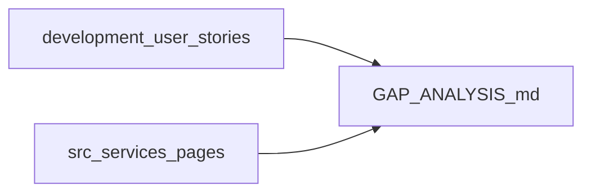

# Análise de cobertura — User stories financeiras vs app

**Última atualização:** 2026-02-05  
**App:** `erp-retifica-formiguense`  
**Fonte canônica das histórias:** repositório/pasta `erp-retifica-formiguense-development/docs/modules/financial/user-stories/` (US-FIN-001 a US-FIN-032).

**Disclaimer:** Os status abaixo refletem revisão por **objetivo principal** e presença no código/telas deste repositório. Critérios de aceite (AC) finos de cada `US-FIN-xxx.md` devem ser validados manualmente história a história.

**Legenda:** **Sim** = núcleo atendido na prática | **Parcial** | **Não** = ausente ou só backend sem uso

| ID | Título (development) | Status | Evidência (este repo) |
|----|----------------------|--------|------------------------|
| US-FIN-001 | Registrar Contas a Receber | Parcial | [`src/pages/ContasReceber.tsx`](../../../src/pages/ContasReceber.tsx), [`src/services/financial/accountsReceivableService.ts`](../../../src/services/financial/accountsReceivableService.ts) |
| US-FIN-002 | Faturar OS Aprovada (AR automático) | Não | [`src/services/financial/orderBillingService.ts`](../../../src/services/financial/orderBillingService.ts) existe; sem chamada no fluxo de OS |
| US-FIN-003 | Parcelamento e Ajustes de Contas a Receber | Parcial | `ContasReceber`: parcelas, baixa com juros/multa manual; AC completos a validar no `.md` |
| US-FIN-004 | Registrar Contas a Pagar | Parcial | [`src/pages/ContasPagar.tsx`](../../../src/pages/ContasPagar.tsx), [`accountsPayableService`](../../../src/services/financial/accountsPayableService.ts); fornecedor como texto; sem CC na UI |
| US-FIN-005 | Registrar Fluxo de Caixa Diário | Sim | [`src/pages/FluxoCaixa.tsx`](../../../src/pages/FluxoCaixa.tsx), [`cashFlowService.ts`](../../../src/services/financial/cashFlowService.ts) |
| US-FIN-006 | DRE Mensal Base | Parcial | [`src/pages/DRE.tsx`](../../../src/pages/DRE.tsx); detalhe mensal ainda usa aproximação percentual em parte |
| US-FIN-007 | Dashboard Financeiro Básico | Sim | [`src/pages/Financeiro.tsx`](../../../src/pages/Financeiro.tsx), [`financialKpiService.ts`](../../../src/services/financial/financialKpiService.ts) |
| US-FIN-008 | Projeção de Caixa Base (30 Dias) | Parcial | [`src/pages/FluxoProjetado.tsx`](../../../src/pages/FluxoProjetado.tsx) usa 90 dias (`ProjectionService.listByOrg(orgId, 90)`) |
| US-FIN-009 | Alertas de Contas Próximas ao Vencimento | Parcial | [`src/pages/RelatoriosFinanceiros.tsx`](../../../src/pages/RelatoriosFinanceiros.tsx) + [`financialReportService.ts`](../../../src/services/financial/financialReportService.ts) |
| US-FIN-010 | Gerenciar Categorias de Despesa | Sim | [`src/pages/ConfigFinanceiro.tsx`](../../../src/pages/ConfigFinanceiro.tsx), [`financialConfigService.ts`](../../../src/services/financial/financialConfigService.ts) |
| US-FIN-011 | Configurar Métodos de Pagamento/Recebimento | Sim | `ConfigFinanceiro`, `payment_methods` via service |
| US-FIN-012 | Configurar Contas Bancárias e Caixas | Não | [`financialConfigService.listBankAccounts`](../../../src/services/financial/financialConfigService.ts); sem CRUD na UI de config |
| US-FIN-013 | Fechamento de Caixa Diário | Sim | [`src/pages/FechamentoCaixa.tsx`](../../../src/pages/FechamentoCaixa.tsx), [`cashClosingService.ts`](../../../src/services/financial/cashClosingService.ts) |
| US-FIN-014 | Conciliação Bancária e de Cartões | Parcial | [`src/pages/ConciliacaoBancaria.tsx`](../../../src/pages/ConciliacaoBancaria.tsx); [`cardMachineService.ts`](../../../src/services/financial/cardMachineService.ts) sem uso em páginas |
| US-FIN-015 | Indicadores Financeiros Avançados | Parcial | KPIs no dashboard; indicadores “avançados” da US a confirmar no `.md` |
| US-FIN-016 | Fluxo de Caixa Projetado (3 meses) | Parcial | Projeção implementada com horizonte 90 dias; alinhar com AC da US |
| US-FIN-017 | Relatório para Reunião Mensal (Exportável) | Não | Sem tela ou export dedicado encontrado |
| US-FIN-018 | DRE Categorizada (não simulada) | Não | `DRE.tsx` ainda mistura lógica com rateio simulado no detalhe mensal |
| US-FIN-019 | Recorrência de Contas a Pagar | Não | [`apRecurringService.ts`](../../../src/services/financial/apRecurringService.ts); sem página consumindo |
| US-FIN-020 | Aging List de Inadimplência (AR) | Parcial | Aba aging em `RelatoriosFinanceiros` |
| US-FIN-021 | Alertas de Vencimento de Contas a Receber | Parcial | Sobreposição com US-FIN-009 (alertas agregados) |
| US-FIN-022 | Baixa Parcial e Renegociação de AR | Parcial | Status `renegotiated` na UI; tabela `ar_renegotiations` no schema; fluxo completo a validar |
| US-FIN-023 | Centro de Custo em AP e AR | Não | `cost_center_id` em services/modelo AP; [`ContasPagar.tsx`](../../../src/pages/ContasPagar.tsx) e `ContasReceber` sem campo CC |
| US-FIN-024 | Curva de Vencimentos e Recebimentos (AP/AR) | Parcial | Aba curva em `RelatoriosFinanceiros` |
| US-FIN-025 | Juros e Multa Automáticos em AR | Não | Juros/multa informados manualmente na baixa (`late_fee_charged`) |
| US-FIN-026 | Importar Extrato (OFX/CSV/CNAB) | Não | `ConciliacaoBancaria` sem upload/parser |
| US-FIN-027 | Matching Automático na Conciliação | Não | [`bankReconciliationService.matchLineToCashFlow`](../../../src/services/financial/bankReconciliationService.ts); UI não expõe |
| US-FIN-028 | Relatório Formal de Conciliação Bancária | Não | Apenas listagem simples de conciliações |
| US-FIN-029 | Retirada dos Sócios na DRE | Parcial | [`src/pages/RetiradasSocios.tsx`](../../../src/pages/RetiradasSocios.tsx), [`partnerWithdrawalService.ts`](../../../src/services/financial/partnerWithdrawalService.ts); integração explícita na DRE a confirmar |
| US-FIN-030 | Plano de Contas no Cadastro de Fornecedor | Não | Sem vínculo encontrado em cadastro de fornecedores |
| US-FIN-031 | Relatórios Filtráveis AP/AR (Consultoria) | Parcial | Relatórios existentes; filtros “consultoria” conforme `.md` |
| US-FIN-032 | Workflow de Aprovação com Alçadas em AP | Parcial | [`approvalApService.ts`](../../../src/services/financial/approvalApService.ts), [`AprovacaoContasPagar.tsx`](../../../src/pages/AprovacaoContasPagar.tsx); falta fluxo por faixa, rejeição com motivo, auditoria e bloqueio formal de pagamento como na US |

---

## Código preparatório não integrado

| Item | Onde | Observação |
|------|------|------------|
| Geração de AR a partir de OS | `OrderBillingService` | Não referenciado em hooks/páginas de ordens |
| Recorrência AP | `ApRecurringService` | Sem UI |
| Linhas de extrato + match | `BankReconciliationService.addStatementLines`, `matchLineToCashFlow` | `ConciliacaoBancaria` não usa |
| Máquinas de cartão | `CardMachineService` | Sem página |
| Contas bancárias | `bank_accounts` + `listBankAccounts` | Listagem usada em conciliação; cadastro só fora desta UI |

---

## Dívida de arquitetura (regras do projeto)

- Listagens financeiras devem priorizar **paginação e filtros no backend** (Supabase `.range`, `count: 'exact'`). Exemplo: [`ContasPagar.tsx`](../../../src/pages/ContasPagar.tsx) chama `getAccountsPayable(1, 200)` e filtra no cliente.
- Revisar outras telas com listas grandes (contas a receber, fluxo de caixa) pelo mesmo critério.

---

## Backlog sugerido (ordem)

1. **US-FIN-002:** acoplar aprovação/finalização de OS a `OrderBillingService.createReceivableFromOrder` (com regras de valor e datas).
2. **US-FIN-012 + US-FIN-026 + US-FIN-027:** CRUD de contas bancárias/caixas; import de extrato; tela de linhas e matching (reutilizar services existentes).
3. **US-FIN-023:** expor centro de custo em `ContasPagar` e `ContasReceber` (hooks já suportam parcialmente no AP).
4. **US-FIN-018 / US-FIN-029:** DRE a partir de categorias reais e retiradas de sócios refletidas no demonstrativo.
5. **US-FIN-032:** completar workflow de alçadas (tiers em `approval_tiers_ap`), rejeição, auditoria e impedimento de pagamento pré-aprovado.

---

## Referência cruzada

- Índice das histórias: pasta `erp-retifica-formiguense-development/docs/modules/financial/user-stories/`.
- Rotas do app: [`src/App.tsx`](../../../src/App.tsx).
