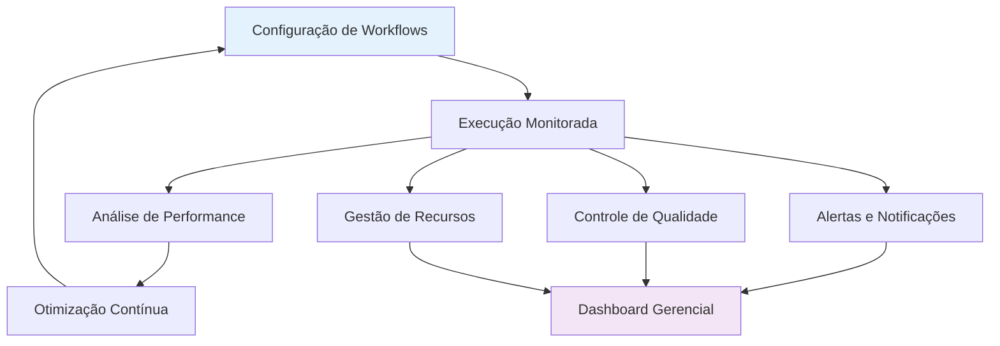
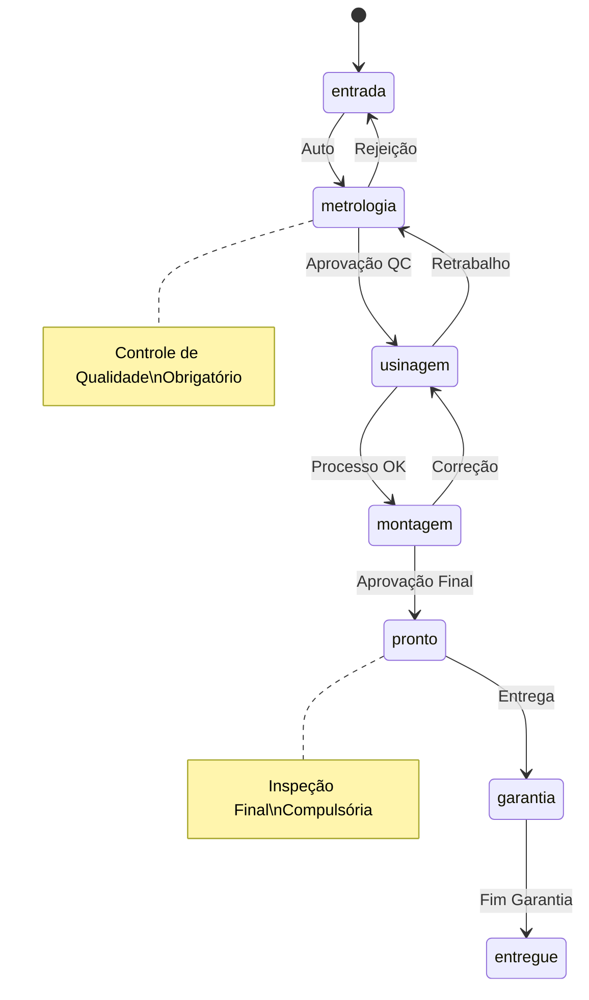
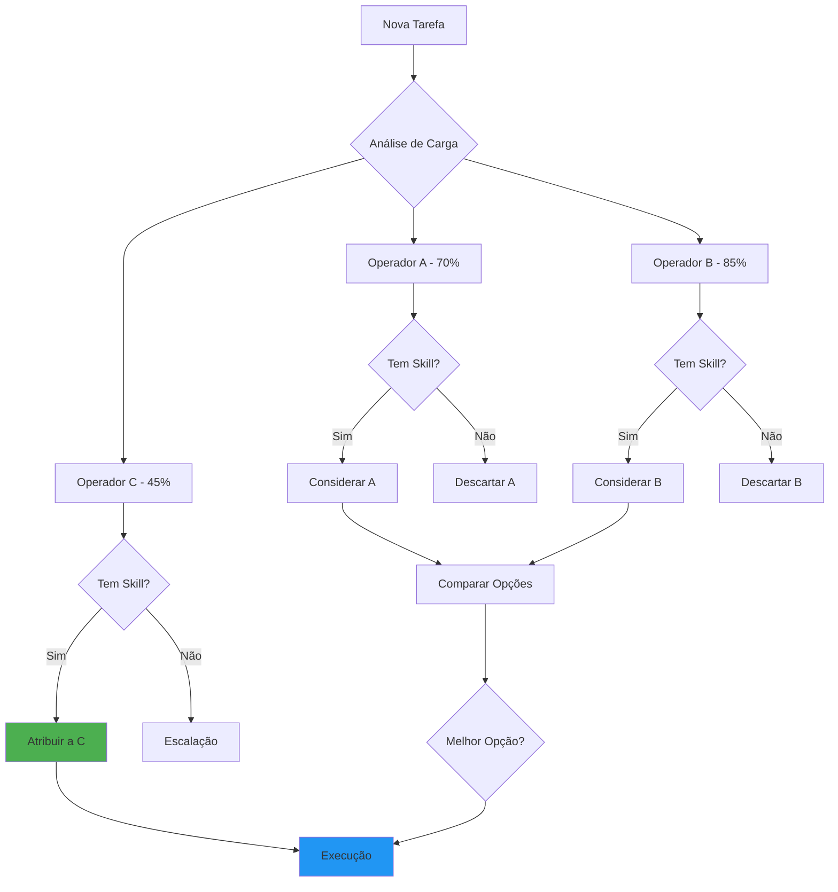
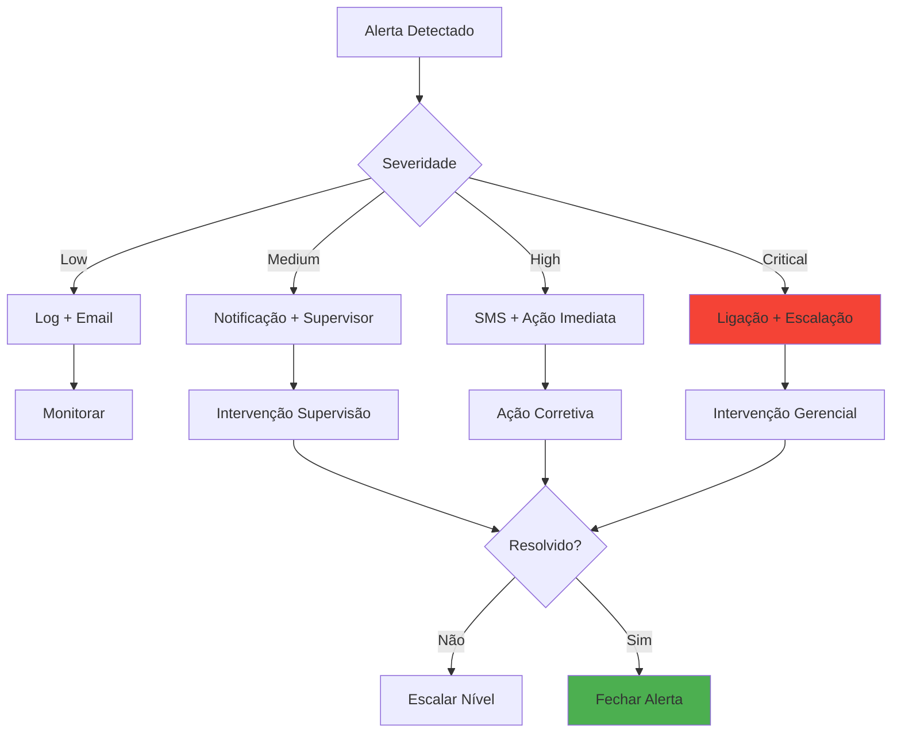
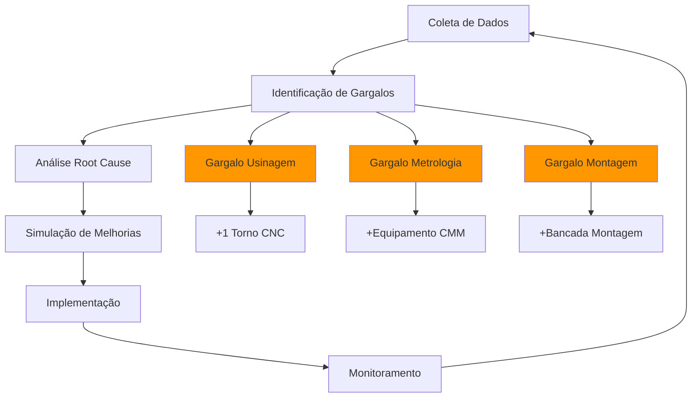
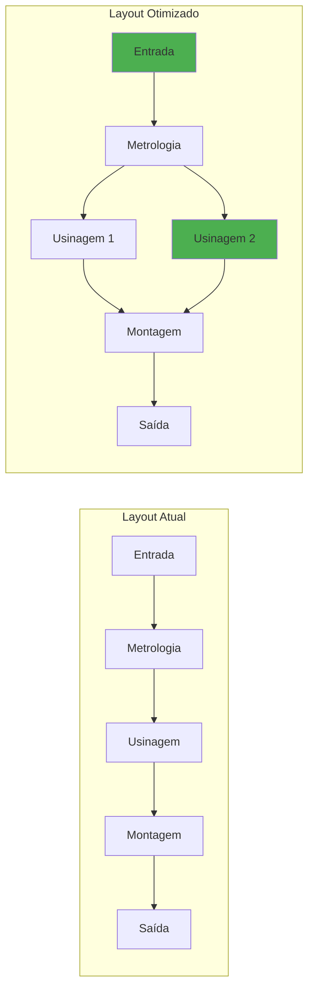
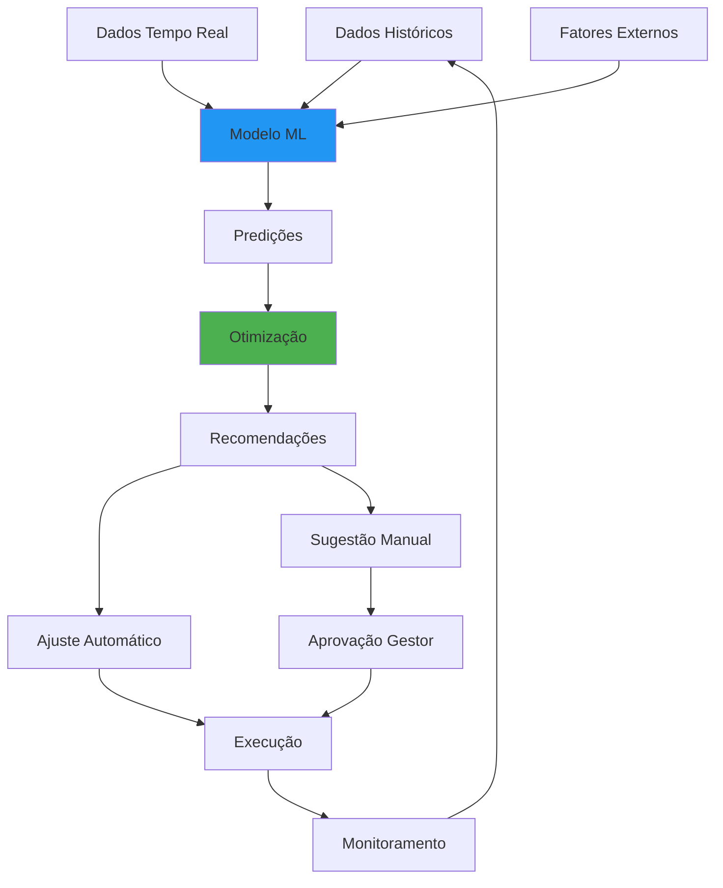
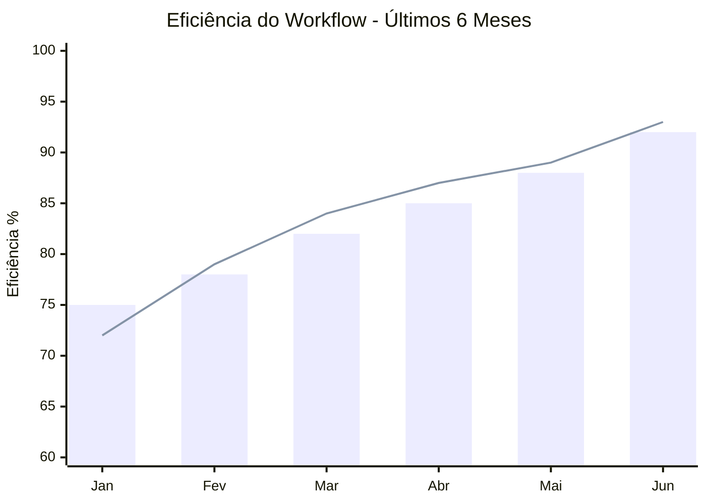

# Gestão de Workflows

Esta documentação detalha o sistema completo de gestão de workflows no módulo Operações & Serviços, incluindo configuração, monitoramento, otimização e controle de fluxos de trabalho.

## 🎯 Visão Geral da Gestão de Workflows

O sistema de gestão de workflows é responsável por orquestrar todos os processos operacionais, garantindo fluidez, rastreabilidade e otimização contínua dos fluxos de trabalho.



## ⚙️ Configuração de Workflows

### 1. **Estrutura Base dos Workflows**

#### 1.1 Definição de Estados
```typescript
enum WorkflowStatus {
  ENTRADA = 'entrada',
  METROLOGIA = 'metrologia', 
  USINAGEM = 'usinagem',
  MONTAGEM = 'montagem',
  PRONTO = 'pronto',
  GARANTIA = 'garantia',
  ENTREGUE = 'entregue'
}

interface WorkflowConfig {
  component: EngineComponent;
  states: WorkflowStatus[];
  transitions: {
    from: WorkflowStatus;
    to: WorkflowStatus[];
    conditions?: string[];
    required_approvals?: string[];
  }[];
  sla: {
    [key in WorkflowStatus]: number; // horas
  };
}
```

#### 1.2 Regras de Transição


#### 1.3 Configurações por Componente
```json
{
  "bloco": {
    "sla_hours": {
      "entrada": 4,
      "metrologia": 8,
      "usinagem": 72,
      "montagem": 24,
      "pronto": 4
    },
    "required_skills": ["usinagem_pesada", "medição_dimensional"],
    "quality_gates": ["entrada", "metrologia", "pronto"]
  },
  "eixo": {
    "sla_hours": {
      "entrada": 2,
      "metrologia": 6,
      "usinagem": 48,
      "montagem": 8,
      "pronto": 2
    },
    "required_skills": ["retifica", "balanceamento"],
    "quality_gates": ["metrologia", "pronto"]
  }
}
```

### 2. **Sistema de Roteamento Dinâmico**

#### 2.1 Algoritmo de Distribuição
```typescript
interface WorkloadDistribution {
  calculateOptimalAssignment(
    workflows: WorkflowItem[],
    operators: Operator[],
    constraints: Constraint[]
  ): Assignment[];
}

class WorkflowRouter {
  distribute(workflows: WorkflowItem[]): Assignment[] {
    return workflows.map(workflow => ({
      workflow_id: workflow.id,
      assigned_to: this.findBestOperator(workflow),
      estimated_completion: this.calculateETA(workflow),
      priority_score: this.calculatePriority(workflow)
    }));
  }
  
  private findBestOperator(workflow: WorkflowItem): string {
    // Algoritmo de otimização considerando:
    // - Habilidades requeridas
    // - Carga atual de trabalho
    // - Histórico de performance
    // - Disponibilidade
  }
}
```

#### 2.2 Balanceamento de Carga


## 📊 Monitoramento em Tempo Real

### 3. **Dashboard de Controle**

#### 3.1 Métricas em Tempo Real
```typescript
interface RealTimeMetrics {
  workflow_status: {
    [component: string]: {
      [status: string]: number;
    };
  };
  bottlenecks: {
    stage: WorkflowStatus;
    queue_length: number;
    avg_wait_time: number;
    trend: 'increasing' | 'stable' | 'decreasing';
  }[];
  operator_utilization: {
    operator_id: string;
    current_load: number;
    efficiency_score: number;
    active_tasks: number;
  }[];
  sla_compliance: {
    on_time: number;
    delayed: number;
    at_risk: number;
  };
}
```

#### 3.2 Visualização de Fluxos
```mermaid
sankey-beta
    Entrada,Metrologia,15
    Entrada,Usinagem,5
    Metrologia,Usinagem,18
    Metrologia,Retrabalho,2
    Usinagem,Montagem,20
    Usinagem,Retrabalho,3
    Montagem,Pronto,22
    Montagem,Correção,1
    Pronto,Entrega,23
```

### 4. **Sistema de Alertas Inteligentes**

#### 4.1 Tipos de Alertas
```typescript
enum AlertType {
  SLA_BREACH = 'sla_breach',
  QUALITY_ISSUE = 'quality_issue',
  RESOURCE_SHORTAGE = 'resource_shortage',
  BOTTLENECK_DETECTED = 'bottleneck_detected',
  EQUIPMENT_FAILURE = 'equipment_failure'
}

interface AlertConfig {
  type: AlertType;
  conditions: {
    threshold: number;
    duration: number;
    severity: 'low' | 'medium' | 'high' | 'critical';
  };
  recipients: string[];
  actions: {
    auto_escalate: boolean;
    auto_reassign: boolean;
    notify_customer: boolean;
  };
}
```

#### 4.2 Escalonamento Automático


## 🔄 Otimização Contínua

### 5. **Análise de Performance**

#### 5.1 KPIs de Workflow
```typescript
interface WorkflowKPIs {
  throughput: {
    items_per_hour: number;
    completion_rate: number;
    cycle_time_avg: number;
  };
  quality: {
    rework_percentage: number;
    defect_rate: number;
    customer_satisfaction: number;
  };
  efficiency: {
    resource_utilization: number;
    waste_percentage: number;
    value_added_ratio: number;
  };
  predictability: {
    schedule_adherence: number;
    forecast_accuracy: number;
    variability_index: number;
  };
}
```

#### 5.2 Análise de Gargalos


### 6. **Simulação e Modelagem**

#### 6.1 Modelos Preditivos
```typescript
class WorkflowSimulator {
  simulate(
    scenarios: Scenario[],
    timeHorizon: number,
    iterations: number
  ): SimulationResult[] {
    return scenarios.map(scenario => ({
      scenario_id: scenario.id,
      predicted_throughput: this.calculateThroughput(scenario),
      bottlenecks: this.identifyBottlenecks(scenario),
      resource_requirements: this.calculateResources(scenario),
      roi_estimate: this.calculateROI(scenario)
    }));
  }
}
```

#### 6.2 Otimização de Layout


## 🎛️ Configurações Avançadas

### 7. **Workflows Personalizados**

#### 7.1 Builder de Workflows
```typescript
interface WorkflowBuilder {
  createCustomWorkflow(config: {
    name: string;
    component: EngineComponent;
    stages: CustomStage[];
    rules: BusinessRule[];
    approvals: ApprovalRule[];
  }): CustomWorkflow;
}

interface CustomStage {
  id: string;
  name: string;
  duration_estimate: number;
  required_skills: string[];
  quality_checks: QualityCheck[];
  parallel_execution: boolean;
}
```

#### 7.2 Regras de Negócio
```typescript
interface BusinessRule {
  id: string;
  condition: string;
  action: 'auto_approve' | 'require_approval' | 'escalate' | 'reject';
  parameters: Record<string, any>;
}

// Exemplo de regras
const businessRules: BusinessRule[] = [
  {
    id: 'vip_customer_priority',
    condition: 'customer.tier === "VIP"',
    action: 'auto_approve',
    parameters: { priority_boost: 2 }
  },
  {
    id: 'high_value_approval',
    condition: 'order.value > 5000',
    action: 'require_approval',
    parameters: { approver_level: 'manager' }
  }
];
```

### 8. **Integração com IA e ML**

#### 8.1 Previsão de Demanda
```typescript
interface DemandForecast {
  predictWorkload(
    historical_data: WorkflowHistory[],
    external_factors: ExternalFactor[],
    time_horizon: number
  ): Prediction[];
}

interface Prediction {
  date: Date;
  component: EngineComponent;
  expected_volume: number;
  confidence_interval: [number, number];
  influencing_factors: string[];
}
```

#### 8.2 Otimização Automática


## 📈 Relatórios e Analytics

### 9. **Dashboard Executivo**

#### 9.1 Métricas Consolidadas
```typescript
interface ExecutiveDashboard {
  operational_overview: {
    total_active_workflows: number;
    completion_rate_today: number;
    average_cycle_time: number;
    efficiency_score: number;
  };
  financial_impact: {
    revenue_at_risk: number;
    cost_savings_opportunity: number;
    productivity_gain: number;
  };
  quality_metrics: {
    defect_rate: number;
    customer_satisfaction: number;
    warranty_claims: number;
  };
  resource_utilization: {
    human_resources: number;
    equipment_efficiency: number;
    capacity_utilization: number;
  };
}
```

#### 9.2 Tendências e Projeções


### 10. **Auditoria e Compliance**

#### 10.1 Trilha de Auditoria
```sql
CREATE TABLE workflow_audit_log (
  id UUID PRIMARY KEY DEFAULT gen_random_uuid(),
  workflow_id UUID NOT NULL,
  action_type TEXT NOT NULL,
  old_status TEXT,
  new_status TEXT,
  performed_by UUID REFERENCES auth.users(id),
  timestamp TIMESTAMP DEFAULT now(),
  reason TEXT,
  system_generated BOOLEAN DEFAULT false,
  org_id UUID NOT NULL
);
```

#### 10.2 Relatórios de Compliance
- **ISO 9001**: Rastreabilidade completa de processos
- **ISO 14001**: Controle de resíduos e impacto ambiental
- **OHSAS 18001**: Segurança no trabalho
- **Auditoria Interna**: Relatórios customizados

---

*Última atualização: 23/09/2025*