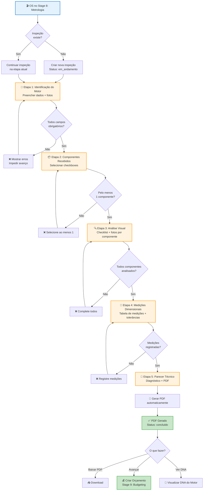
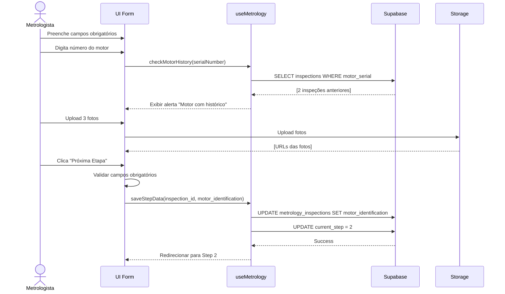
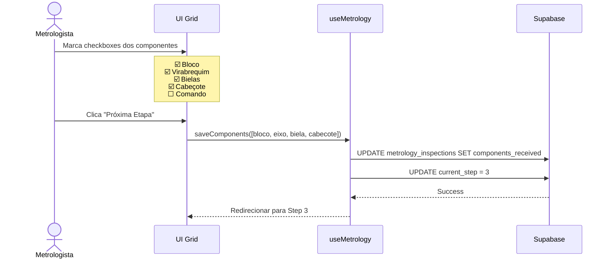
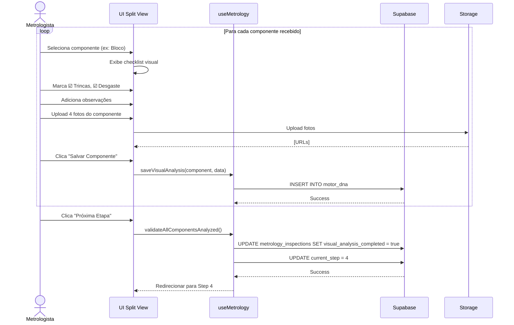
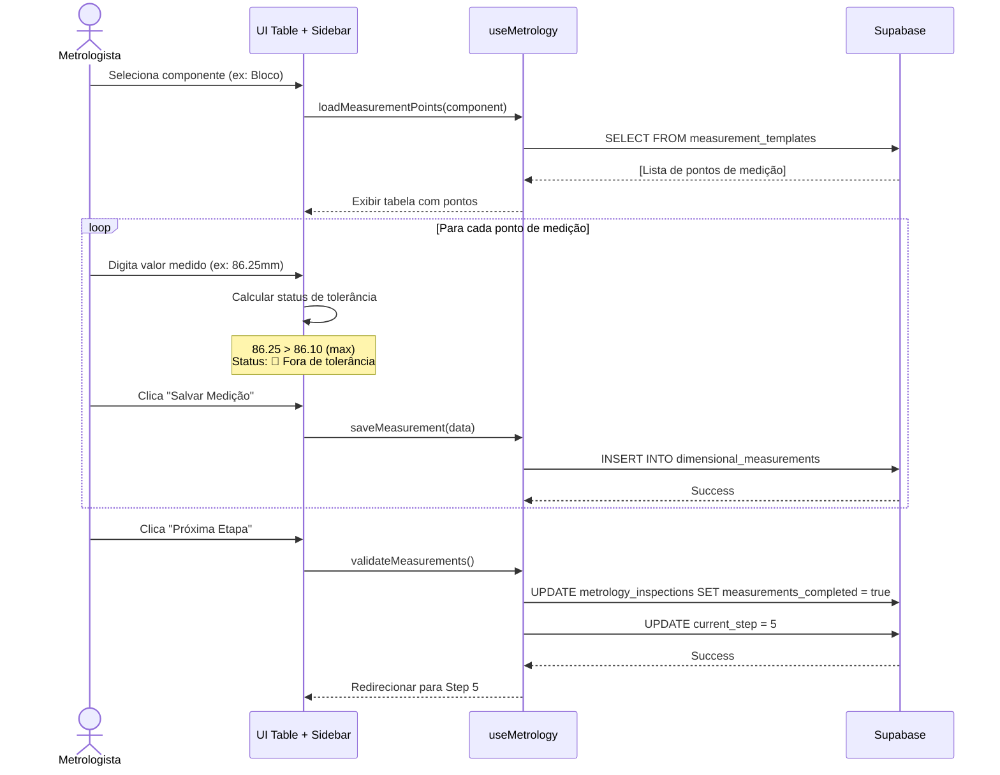
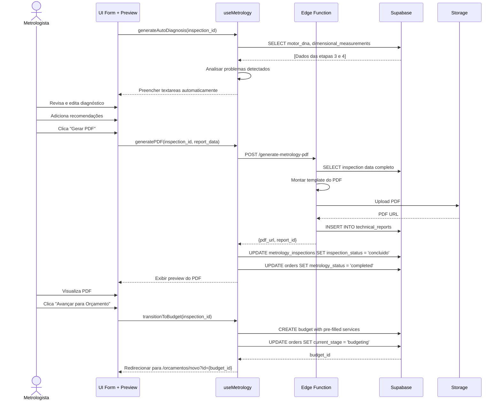
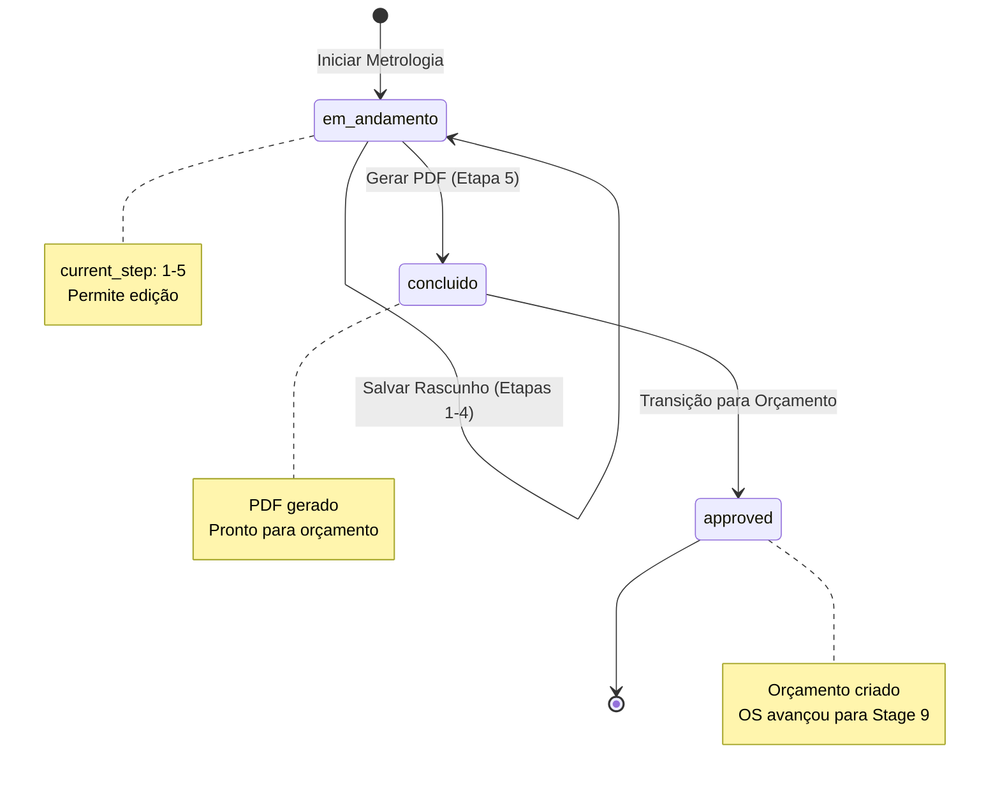

# Fluxo Completo: Metrologia (5 Etapas)

## 📊 Visão Geral

Este documento descreve o fluxo completo do processo de metrologia, desde a iniciação no Workflow Kanban até a geração do parecer técnico e transição para orçamento.

## 🎯 Objetivo

Fornecer uma visão end-to-end do processo de inspeção metrológica para facilitar o desenvolvimento e testes.

---

## 📍 Diagrama de Fluxo Principal



---

## 🔄 Fluxo Detalhado por Etapa

### **Etapa 1: Identificação do Motor**



**Dados Salvos:**
```json
{
  "motor_identification": {
    "motor_type": "Diesel Completo",
    "vehicle_brand": "Volkswagen",
    "vehicle_model": "Gol 1.0",
    "vehicle_year": 2018,
    "engine_serial_number": "ABC123456",
    "mileage": 95000,
    "entry_date": "2025-10-28",
    "entry_time": "14:30",
    "motor_photos": ["url1", "url2", "url3"]
  }
}
```

---

### **Etapa 2: Componentes Recebidos**



**Dados Salvos:**
```json
{
  "components_received": [
    { "component": "bloco", "code": "BL-001", "received": true },
    { "component": "eixo", "code": "VR-002", "received": true },
    { "component": "biela", "code": "BI-003", "received": true },
    { "component": "cabecote", "code": "CB-001", "received": true },
    { "component": "comando", "code": "CM-001", "received": false }
  ]
}
```

---

### **Etapa 3: Análise Visual**



**Dados Salvos (motor_dna):**
```json
{
  "component": "bloco",
  "component_code": "BL-001",
  "visual_analysis": {
    "has_cracks": true,
    "has_excessive_wear": true,
    "has_corrosion": false,
    "has_deformation": false,
    "notes": "Trinca de 5cm na lateral direita, próximo ao cilindro 2"
  },
  "photos": ["url1", "url2", "url3", "url4"]
}
```

---

### **Etapa 4: Medições Dimensionais**



**Dados Salvos (dimensional_measurements):**
```json
{
  "component": "bloco",
  "measurement_point": "Cilindro 1",
  "nominal_value": 86.00,
  "min_tolerance": 85.90,
  "max_tolerance": 86.10,
  "measured_value": 86.25,
  "tolerance_status": "out_of_tolerance",
  "unit": "mm",
  "measurement_method": "Micrômetro externo",
  "notes": "Desgaste acentuado na parte superior"
}
```

---

### **Etapa 5: Parecer Técnico**



**Dados Salvos (technical_reports):**
```json
{
  "diagnosis": "Análise dimensional identificou 3 medições fora de tolerância no bloco do motor (cilindros 1, 2 e 4). Análise visual detectou micro-trincas no cabeçote.",
  "probable_causes": "Desgaste natural por quilometragem elevada; Falta de manutenção preventiva; Superaquecimento",
  "recommendations": "Realizar retífica completa dos cilindros; Solda especial nas trincas; Teste de estanqueidade",
  "suggested_services": [
    { "code": "SRV-001", "name": "Retífica de Cilindros", "priority": "high" },
    { "code": "SRV-015", "name": "Solda Especial", "priority": "high" },
    { "code": "SRV-016", "name": "Teste de Estanqueidade", "priority": "high" }
  ],
  "pdf_url": "https://.../metrology-reports/org-123/MET-2025-0001.pdf",
  "pdf_pages": 4,
  "pdf_size_kb": 1250
}
```

---

## 🔐 Permissões por Etapa

| Etapa | Metrologista | Gerente | Admin | Consultor |
|-------|--------------|---------|-------|-----------|
| 1-5 (Edição) | ✅ | ✅ | ✅ | ❌ |
| Visualização | ✅ | ✅ | ✅ | ⚠️ (apenas resumo) |
| Gerar PDF | ✅ | ✅ | ✅ | ❌ |
| Transição p/ Orçamento | ✅ | ✅ | ✅ | ❌ |

---

## ⚡ Estados da Inspeção



---

## 📊 Métricas Coletadas

Durante todo o fluxo, o sistema coleta:

| Métrica | Quando | Uso |
|---------|--------|-----|
| Tempo total de análise | `created_at` → `inspected_at` | KPI Dashboard |
| Tempo por etapa | `step_started_at` → `step_completed_at` | Identificar gargalos |
| Componentes com problemas | Etapa 3 + 4 | Ranking de componentes |
| Taxa de retrabalho | `regenerated_count > 0` | KPI Dashboard |
| Completude de documentação | Campos obrigatórios preenchidos | KPI Dashboard |

---

## 🎯 Objetivos de Performance

| Métrica | Baseline Atual | Meta |
|---------|----------------|------|
| **Tempo médio total** | 32 horas | ≤ 24 horas |
| **Tempo Etapa 1** | 2 horas | ≤ 1 hora |
| **Tempo Etapa 3** | 8 horas | ≤ 6 horas |
| **Tempo Etapa 4** | 12 horas | ≤ 8 horas |
| **Taxa de completude** | 65% | 100% |
| **Taxa de retrabalho** | 8% | ≤ 2% |

---

**Última Atualização**: 28/10/2025  
**Autor**: Equipe de Desenvolvimento ERP Retífica
