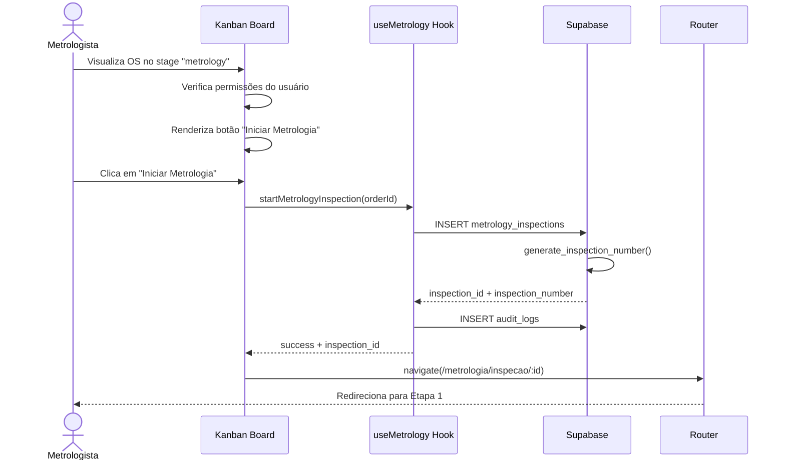

# US-MET-001: Iniciar Metrologia via Workflow Kanban

## 📌 Metadados

| Campo | Valor |
|-------|-------|
| **ID** | US-MET-001 |
| **Épico** | Formulário Digital de Metrologia |
| **Sprint** | Sprint 1 |
| **Prioridade** | Alta |
| **Estimativa** | 5 Story Points |
| **Status** | 📝 Pendente |

## 📝 História de Usuário

**Como** metrologista  
**Eu quero** iniciar uma inspeção de metrologia diretamente do card da OS no Workflow Kanban  
**Para que** eu possa digitalizar o processo de análise dimensional e visual sem usar formulários em papel

## 🎯 Objetivo de Negócio

Reduzir o tempo de análise de 32h para 24h eliminando retrabalho manual e garantindo completude de dados.

## 📋 Regras de Negócio

**RN001:** O botão "Iniciar Metrologia" só deve aparecer se:
- A OS está no stage `metrology` (Stage 8 do workflow)
- Não existe uma inspeção em andamento (`inspection_status != 'em_andamento'`)
- O usuário logado tem perfil `metrologista`, `gerente_producao` ou `admin`

**RN002:** Ao clicar em "Iniciar Metrologia", o sistema deve:
- Criar um registro na tabela `metrology_inspections` com status `em_andamento`
- Gerar automaticamente o número da inspeção no formato `MET-{ANO}-{SEQUENCIAL}`
- Redirecionar para `/metrologia/inspecao/:id` (Etapa 1 de 5)
- Registrar no audit log a ação de início da inspeção

**RN003:** Se já existir uma inspeção `em_andamento`, o botão deve mudar para "Continuar Metrologia" e redirecionar para a etapa atual

**RN004:** O número sequencial deve ser único por organização e resetar anualmente

**RN005:** Apenas usuários com permissão de metrologia podem ver e clicar no botão

## ✅ Critérios de Aceite

**CA001:** DADO QUE sou metrologista autenticado E a OS está no stage `metrology` QUANDO visualizo o card da OS no Kanban ENTÃO devo ver um botão destacado "Iniciar Metrologia"

**CA002:** DADO QUE cliquei em "Iniciar Metrologia" QUANDO o sistema está criando a inspeção ENTÃO devo ver um loader "Criando inspeção..." E após sucesso ser redirecionado para `/metrologia/inspecao/{id}` com a Etapa 1 ativa

**CA003:** DADO QUE já existe uma inspeção em andamento QUANDO visualizo o card ENTÃO devo ver "Continuar Metrologia (Etapa X de 5)" E ao clicar devo ir direto para a etapa atual

**CA004:** DADO QUE sou um consultor comercial (sem permissão) QUANDO visualizo o card ENTÃO NÃO devo ver o botão de iniciar metrologia

**CA005:** DADO QUE a OS está em outro stage (não `metrology`) QUANDO visualizo o card ENTÃO NÃO devo ver o botão de metrologia

## 🏗️ Definition of Done

**DOD001:** Componente `ComponentCard.tsx` atualizado para renderizar botão condicionalmente

**DOD002:** Hook `useMetrology.ts` criado com função `startMetrologyInspection(orderId: string)`

**DOD003:** Tabela `metrology_inspections` criada via migration com campos necessários

**DOD004:** Função de banco de dados `generate_inspection_number()` implementada

**DOD005:** RLS policies configuradas para isolamento por organização

**DOD006:** Página `/metrologia/inspecao/:id` criada (mesmo que vazia inicialmente)

**DOD007:** Roteamento configurado em `App.tsx`

**DOD008:** Testes unitários escritos para o hook `useMetrology.ts`

**DOD009:** Testes E2E escritos para o fluxo de início de inspeção

**DOD010:** Documentação técnica atualizada

## 🔧 Componentes Afetados

| Componente | Localização | Tipo |
|------------|-------------|------|
| `ComponentCard.tsx` | `src/components/workflow/` | Alterado |
| `useMetrology.ts` | `src/hooks/` | Novo |
| `MetrologyInspection.tsx` | `src/pages/` | Novo |
| `App.tsx` | `src/` | Alterado |

## 🗄️ Alterações no Banco de Dados

### Tabela: `metrology_inspections`

```sql
CREATE TABLE metrology_inspections (
  id UUID PRIMARY KEY DEFAULT gen_random_uuid(),
  org_id UUID NOT NULL REFERENCES organizations(id) ON DELETE CASCADE,
  order_id UUID NOT NULL REFERENCES orders(id) ON DELETE CASCADE,
  inspection_number TEXT NOT NULL UNIQUE,
  inspection_status TEXT NOT NULL DEFAULT 'em_andamento',
  current_step INTEGER NOT NULL DEFAULT 1,
  inspected_by UUID NOT NULL REFERENCES profiles(id),
  inspected_at TIMESTAMPTZ,
  created_at TIMESTAMPTZ NOT NULL DEFAULT now(),
  updated_at TIMESTAMPTZ NOT NULL DEFAULT now(),
  
  -- Constraints
  CONSTRAINT valid_status CHECK (
    inspection_status IN ('em_andamento', 'concluido', 'approved')
  ),
  CONSTRAINT valid_step CHECK (current_step BETWEEN 1 AND 5)
);

CREATE INDEX idx_metrology_inspections_org ON metrology_inspections(org_id);
CREATE INDEX idx_metrology_inspections_order ON metrology_inspections(order_id);
CREATE INDEX idx_metrology_inspections_number ON metrology_inspections(inspection_number);
```

### Função: `generate_inspection_number()`

```sql
CREATE OR REPLACE FUNCTION generate_inspection_number(p_org_id UUID)
RETURNS TEXT AS $$
DECLARE
  v_year TEXT := TO_CHAR(NOW(), 'YYYY');
  v_sequence INTEGER;
  v_number TEXT;
BEGIN
  -- Buscar o último número do ano atual
  SELECT COALESCE(
    MAX(
      CAST(
        SPLIT_PART(inspection_number, '-', 3) AS INTEGER
      )
    ), 
    0
  ) INTO v_sequence
  FROM metrology_inspections
  WHERE org_id = p_org_id
    AND inspection_number LIKE 'MET-' || v_year || '-%';
  
  -- Incrementar
  v_sequence := v_sequence + 1;
  
  -- Formatar com 4 dígitos
  v_number := 'MET-' || v_year || '-' || LPAD(v_sequence::TEXT, 4, '0');
  
  RETURN v_number;
END;
$$ LANGUAGE plpgsql;
```

## 🎨 Wireframe

```
┌─────────────────────────────────────┐
│ [Card da OS no Kanban]              │
│                                     │
│ OS-2025-0123                        │
│ Cliente: João Silva                 │
│ Motor: Diesel Completo ABC123456    │
│                                     │
│ Stage: Metrologia                   │
│                                     │
│ ┌─────────────────────────────────┐ │
│ │ 🔵 Iniciar Metrologia           │ │
│ └─────────────────────────────────┘ │
└─────────────────────────────────────┘
```

## 📊 Fluxo de Dados



## 🧪 Cenários de Teste

### Teste E2E 1: Iniciar inspeção com sucesso
```gherkin
Given sou metrologista autenticado
And existe uma OS no stage "metrology" sem inspeção
When clico no botão "Iniciar Metrologia"
Then devo ser redirecionado para /metrologia/inspecao/{id}
And devo ver "Etapa 1 de 5: Identificação do Motor"
And o número da inspeção deve estar no formato "MET-2025-0001"
```

### Teste E2E 2: Continuar inspeção existente
```gherkin
Given existe uma inspeção em andamento na etapa 3
When visualizo o card da OS
Then devo ver "Continuar Metrologia (Etapa 3 de 5)"
When clico no botão
Then devo ser redirecionado para a etapa 3
```

### Teste E2E 3: Sem permissão
```gherkin
Given sou consultor comercial (sem permissão de metrologia)
When visualizo o card da OS no stage "metrology"
Then NÃO devo ver o botão "Iniciar Metrologia"
```

## ⚠️ Escopo Negativo

Esta história **NÃO** entregará:
- Preenchimento automático de dados da OS na inspeção (será feito na US-MET-002)
- Interface completa das 5 etapas (apenas roteamento inicial)
- Upload de fotos (será feito nas etapas específicas)
- Geração do parecer técnico (será feito na US-MET-006)
- Dashboard de metrologia (será feito na US-MET-010)

## 🔗 Dependências

**Bloqueadores:**
- Nenhum (primeira história do épico)

**Depende de:**
- Sistema de Workflow Kanban estar funcional
- Tabela `orders` com campo `current_stage`
- Sistema de perfis e permissões implementado

**Bloqueia:**
- US-MET-002 (Identificação do Motor)
- Todas as outras histórias do épico de Metrologia

## 📚 Referências

- [Arquitetura do Módulo Operações](../../technical-specs/component-architecture.md)
- [Sistema de Workflow](../../technical-specs/workflow-status-configuration-api.md)
- [Modelo de Permissões](../../../../architecture/profile-permissions-system.md)

---

**Criado em**: 28/10/2025  
**Última atualização**: 28/10/2025  
**Responsável**: Equipe de Desenvolvimento
