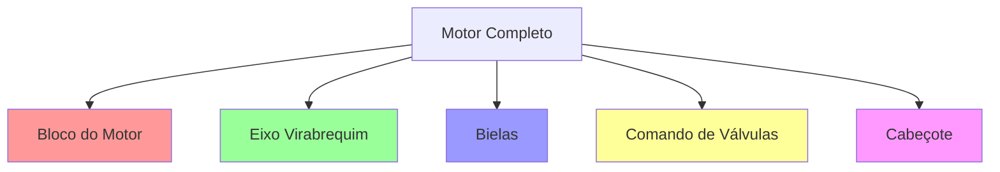
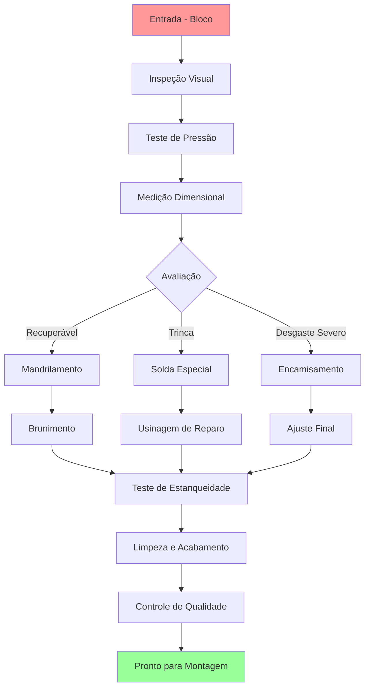
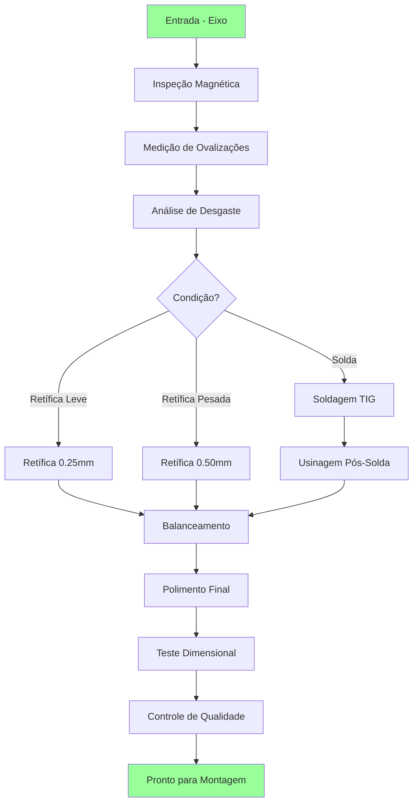
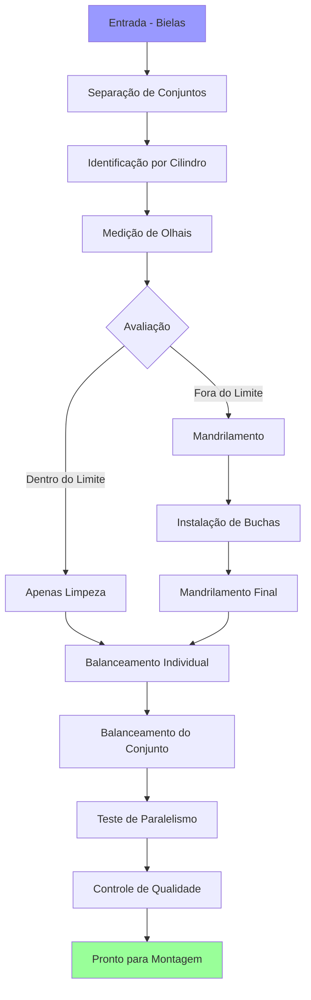
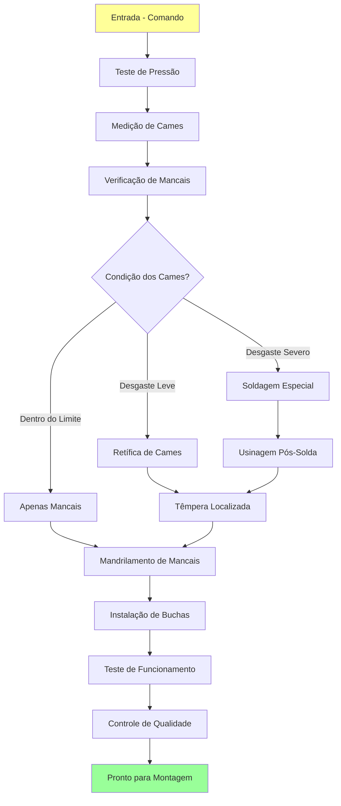
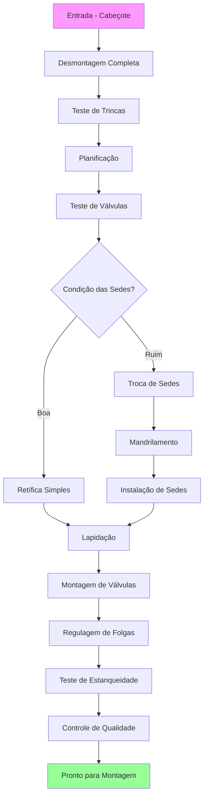

# Workflows por Componente do Motor

Esta documentação detalha os workflows específicos para cada componente do motor, incluindo processos técnicos, tempos estimados e requisitos de qualidade específicos para cada tipo de peça.

## 🔧 Visão Geral dos Componentes

O sistema suporta cinco tipos principais de componentes de motor, cada um com seu workflow específico e características técnicas únicas.

## 🏗️ **BLOCO DO MOTOR**

### Características Técnicas
- **Material**: Ferro fundido ou alumínio
- **Complexidade**: Alta
- **Tempo Médio**: 7-10 dias
- **Criticidade**: Muito Alta

### Workflow Específico

#### Etapas Detalhadas

##### 1. **Entrada** (1-2 horas)
- Recebimento e catalogação
- Identificação do modelo/ano
- Registro fotográfico inicial
- Teste de pressão preliminar

##### 2. **Metrologia** (4-6 horas)
- Medição de cilindros com súbito
- Verificação de planeza do bloco
- Teste de trincas com líquido penetrante
- Análise dimensional completa

##### 3. **Usinagem** (2-4 dias)
- **Mandrilamento**: Correção de cilindros ovalados
- **Brunimento**: Acabamento final dos cilindros
- **Planificação**: Correção da face superior
- **Roscamento**: Reparo de roscas danificadas

##### 4. **Montagem** (1-2 dias)
- Instalação de buchas e guias
- Montagem de tampões
- Teste de pressão final
- Aplicação de selantes

##### 5. **Pronto** (2-4 horas)
- Limpeza completa com desengraxante
- Teste final de estanqueidade
- Pintura com primer
- Embalagem para entrega

---

## ⚙️ **EIXO VIRABREQUIM**

### Características Técnicas
- **Material**: Aço forjado
- **Complexidade**: Muito Alta
- **Tempo Médio**: 5-8 dias
- **Criticidade**: Crítica

### Workflow Específico

#### Processos Especializados

##### **Retífica de Virabrequim**
- **0.25mm**: Desgaste normal, primeira retífica
- **0.50mm**: Desgaste acentuado, segunda retífica
- **0.75mm**: Limite máximo para retífica
- **> 0.75mm**: Substituição necessária

##### **Balanceamento Dinâmico**
- Tolerância: ±5 gramas por plano
- Velocidade de teste: 1800 RPM
- Verificação em 2 planos
- Certificado de balanceamento

---

## 🔗 **BIELAS**

### Características Técnicas
- **Material**: Aço forjado
- **Complexidade**: Média
- **Tempo Médio**: 3-5 dias
- **Criticidade**: Alta

### Workflow Específico

#### Controles Específicos

##### **Balanceamento de Bielas**
- **Individual**: Peso base ±2 gramas
- **Conjunto**: Diferença máxima 5 gramas
- **Usinagem de Correção**: Remoção de material
- **Adição de Peso**: Solda quando necessário

##### **Paralelismo**
- Tolerância: 0.05mm máximo
- Verificação com relógio comparador
- Correção por usinagem da face
- Teste final obrigatório

---

## 🕰️ **COMANDO DE VÁLVULAS**

### Características Técnicas
- **Material**: Ferro fundido nodular
- **Complexidade**: Alta
- **Tempo Médio**: 6-9 dias
- **Criticidade**: Alta

### Workflow Específico

#### Processos Críticos

##### **Retífica de Cames**
- Medição com micrômetro específico
- Perfil original preservado
- Acabamento superficial Ra 0.8
- Têmpera para dureza 58-62 HRC

##### **Teste de Funcionamento**
- Rotação manual suave
- Verificação de folgas
- Teste de vazamentos
- Sincronização de válvulas

---

## 🏠 **CABEÇOTE**

### Características Técnicas
- **Material**: Alumínio ou ferro fundido
- **Complexidade**: Muito Alta
- **Tempo Médio**: 8-12 dias
- **Criticidade**: Crítica

### Workflow Específico

#### Processos Especializados

##### **Planificação**
- Verificação com régua e calibres
- Limite máximo: 0.05mm
- Usinagem em fresadora específica
- Teste final obrigatório

##### **Teste de Estanqueidade**
- Pressão de 1.5 bar mínimo
- Submersão em água
- Verificação visual de bolhas
- Aprovação obrigatória para liberação

## ⏱️ Cronograma Consolidado

```mermaid
gantt
    title Cronograma de Workflows por Componente
    dateFormat X
    axisFormat %d dias
    
    section Bloco
    Metrologia     :a1, 0, 1d
    Usinagem       :a2, after a1, 4d
    Montagem       :a3, after a2, 2d
    Finalização    :a4, after a3, 1d
    
    section Eixo
    Metrologia     :b1, 0, 1d
    Retífica       :b2, after b1, 3d
    Balanceamento  :b3, after b2, 1d
    Finalização    :b4, after b3, 1d
    
    section Bielas
    Metrologia     :c1, 0, 1d
    Usinagem       :c2, after c1, 2d
    Balanceamento  :c3, after c2, 1d
    Finalização    :c4, after c3, 1d
    
    section Comando
    Metrologia     :d1, 0, 1d
    Retífica       :d2, after d1, 4d
    Montagem       :d3, after d2, 2d
    Finalização    :d4, after d3, 1d
    
    section Cabeçote
    Desmontagem    :e1, 0, 1d
    Usinagem       :e2, after e1, 5d
    Montagem       :e3, after e2, 3d
    Finalização    :e4, after e3, 1d
```

## 📊 Métricas por Componente

### Tempos Médios (em dias úteis)
| Componente | Entrada | Metrologia | Usinagem | Montagem | Pronto | Total |
|------------|---------|------------|----------|----------|--------|--------|
| Bloco      | 0.5     | 1.0        | 4.0      | 2.0      | 0.5    | 8.0    |
| Eixo       | 0.5     | 1.0        | 3.0      | 1.0      | 0.5    | 6.0    |
| Bielas     | 0.5     | 1.0        | 2.0      | 1.0      | 0.5    | 5.0    |
| Comando    | 0.5     | 1.0        | 4.0      | 2.0      | 0.5    | 8.0    |
| Cabeçote   | 0.5     | 1.0        | 5.0      | 3.0      | 0.5    | 10.0   |

### Taxa de Retrabalho
- **Bloco**: 5% (principalmente vazamentos)
- **Eixo**: 3% (balanceamento)
- **Bielas**: 2% (paralelismo)
- **Comando**: 8% (cames danificados)
- **Cabeçote**: 12% (trincas não detectadas)

---

*Última atualização: 23/09/2025*