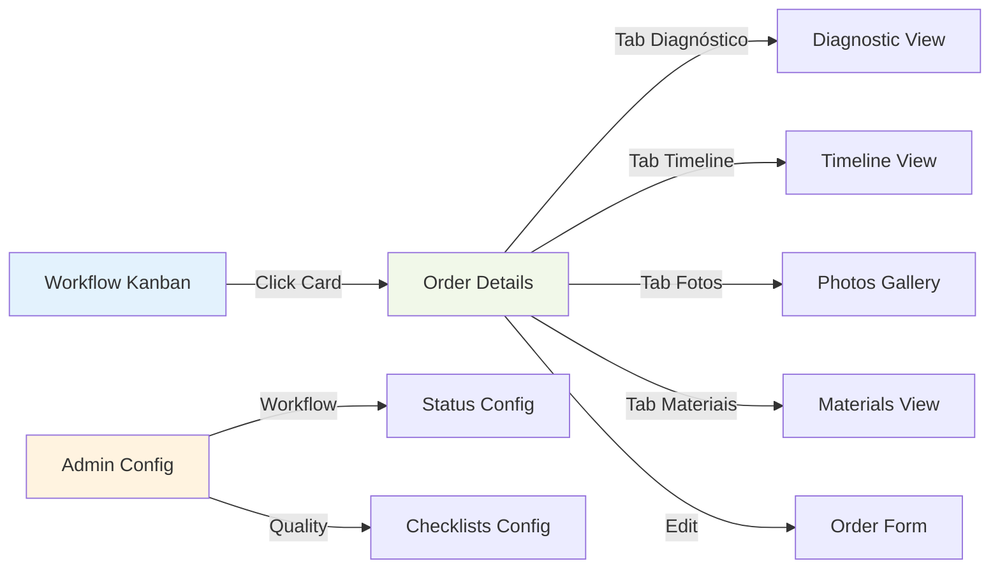

# Operations - Wireframes

## 📋 Índice de Wireframes

Este diretório contém os wireframes e especificações de interface do módulo de Operações e Serviços.

### Wireframes Disponíveis

1. **[Interface Kanban](./kanban-interface.md)**
   - Layout desktop, tablet e mobile
   - Colunas de status
   - Drag & drop de componentes
   - Filtros e busca

2. **[Detalhes da Ordem](./order-details.md)**
   - Header com informações principais
   - Sistema de abas
   - Timeline de eventos
   - Modal de edição

3. **[Interface de Diagnóstico](./diagnostic-interface.md)**
   - Seleção de componente
   - Checklist interativo
   - Upload de fotos
   - Geração de orçamento

4. **[Configuração de Workflow](./workflow-config-admin.md)**
   - Painel administrativo
   - Editor de status
   - Configuração de cores e ícones
   - Definição de SLA

5. **[Checklists de Qualidade](./quality-checklists.md)**
   - Interface de checklist
   - Itens obrigatórios
   - Medições e tolerâncias
   - Aprovação e bloqueio

## 🎨 Convenções Visuais

### Cores por Status
- **Pendente**: `bg-slate-100` (cinza claro)
- **Em Andamento**: `bg-blue-100` (azul claro)
- **Em Teste**: `bg-purple-100` (roxo claro)
- **Aguardando Aprovação**: `bg-yellow-100` (amarelo)
- **Aprovado**: `bg-green-100` (verde claro)
- **Concluído**: `bg-emerald-100` (verde escuro)

### Ícones por Componente
- **Bloco**: 🔷 (Package)
- **Eixo**: ➖ (Minus)
- **Biela**: 🔗 (Link)
- **Comando**: ⚙️ (Settings)
- **Cabeçote**: 🔝 (ChevronUp)

### Breakpoints
- **Mobile**: < 768px (1 coluna)
- **Tablet**: 768px - 1024px (3-4 colunas visíveis)
- **Desktop**: > 1024px (7 colunas simultâneas)

## 🔗 Fluxo de Navegação

## 🧩 Componentes Principais

### KanbanBoard
- Grid de colunas por status
- Drag & drop com @hello-pangea/dnd
- Filtros por componente
- Busca por número de ordem

### ComponentCard
- Informações do componente
- Status visual com cor
- Indicadores de prazo (SLA)
- Ações rápidas

### WorkflowModal
- Modal fullscreen (mobile)
- Sidebar (desktop)
- Form de edição
- Histórico de alterações

### DiagnosticInterface
- Checklist dinâmico por tipo de motor
- Upload múltiplo de fotos
- Validações em tempo real
- Preview de orçamento

## 🎯 Princípios de UX

### Mobile-First
- Layout adaptativo
- Touch targets adequados (mín. 44x44px)
- Swipe gestures para navegação
- Bottom sheets para modais

### Real-time
- WebSocket subscriptions
- Otimistic UI updates
- Conflict resolution
- Error recovery

### Performance
- Lazy loading de imagens
- Virtual scrolling em listas
- Code splitting por rota
- Prefetching de dados

## ♿ Acessibilidade

### WCAG 2.1 - Nível AA
- ✅ Contraste adequado
- ✅ Navegação por teclado
- ✅ Screen reader support
- ✅ ARIA labels
- ✅ Focus management
- ✅ Error announcements

### Keyboard Shortcuts
- **Tab**: Navegar entre cards
- **Enter**: Abrir detalhes
- **Esc**: Fechar modais
- **Arrow Keys**: Navegar em grid (opcional)

## 📝 Como Usar

1. Cada wireframe detalha uma interface específica
2. Diagramas Mermaid mostram estrutura visual
3. Especificações incluem comportamento responsivo
4. Estados cobrem loading, error e empty
5. Interações incluem animations e transitions

## 🔗 Links Relacionados

- [User Flows](../user-flows/)
- [Business Processes](../business-processes/)
- [Technical Specs](../technical-specs/)
- [Component Architecture](../technical-specs/component-architecture.md)

---

*Última atualização: 2025-10-09*
