# Interface Kanban - Wireframe

## 🎯 Visão Geral

Interface principal do módulo de Operações que exibe o workflow de componentes em um board Kanban drag-and-drop, permitindo visualização e gestão do status de cada componente das ordens de serviço.

## 🖥️ Layout Desktop (> 1024px)

```mermaid
graph TB
    subgraph Header["Header Bar - Full Width"]
        H1[Workflow Kanban]
        H2[Filtros: Componente + Ordem]
        H3[Busca + Refresh]
    end
    
    subgraph Kanban["Kanban Board - 7 Columns"]
        subgraph C1["Pendente"]
            C1_1[Component Card]
            C1_2[Component Card]
            C1_3[+ 3 more]
        end
        
        subgraph C2["Em Análise"]
            C2_1[Component Card]
            C2_2[Component Card]
        end
        
        subgraph C3["Em Serviço"]
            C3_1[Component Card]
            C3_2[Component Card]
            C3_3[Component Card]
        end
        
        subgraph C4["Em Teste"]
            C4_1[Component Card]
        end
        
        subgraph C5["Ag. Aprovação"]
            C5_1[Component Card]
            C5_2[Component Card]
        end
        
        subgraph C6["Aprovado"]
            C6_1[Component Card]
        end
        
        subgraph C7["Concluído"]
            C7_1[Component Card]
            C7_2[Component Card]
        end
    end
    
    Header --> Kanban
    
    style Header fill:#e3f2fd
    style C1 fill:#f5f5f5
    style C2 fill:#e3f2fd
    style C3 fill:#bbdefb
    style C4 fill:#e1bee7
    style C5 fill:#fff9c4
    style C6 fill:#c8e6c9
    style C7 fill:#a5d6a7
```



### Especificações Desktop
- **Grid**: 7 colunas fixas (repeat(7, minmax(280px, 1fr)))
- **Horizontal Scroll**: Habilitado quando necessário
- **Column Width**: Mínimo 280px, máximo flex
- **Gap**: 16px entre colunas
- **Card Height**: Auto (min-content)
- **Max Cards per View**: Virtual scroll após 20 cards

## 📱 Layout Tablet (768px - 1024px)

```mermaid
graph TB
    subgraph HeaderT["Header - Collapsed"]
        HT1[Kanban + Filter Drawer]
        HT2[Search]
    end
    
    subgraph KanbanT["Kanban Board - 3-4 Columns Visible"]
        CT1[Pendente<br/>Scroll ←]
        CT2[Em Análise]
        CT3[Em Serviço]
        CT4[Em Teste<br/>Scroll →]
    end
    
    subgraph Navigation["Column Navigation"]
        NT1[◀ Prev]
        NT2[• • • • • • •]
        NT3[Next ▶]
    end
    
    HeaderT --> KanbanT
    KanbanT --> Navigation
    
    style HeaderT fill:#e3f2fd
    style KanbanT fill:#f5f5f5
    style Navigation fill:#e0e0e0
```



### Especificações Tablet
- **Visible Columns**: 3-4 colunas
- **Column Width**: 240px fixo
- **Horizontal Scroll**: Snap scroll
- **Dots Navigation**: Indicadores de posição
- **Swipe Gesture**: Suportado

## 📱 Layout Mobile (< 768px)

```mermaid
graph TB
    subgraph HeaderM["Header - Compact"]
        HM1[≡ Menu]
        HM2[Kanban]
        HM3[⚙ Filters]
    end
    
    subgraph ColumnSelector["Column Selector"]
        CS1[< Prev  |  Em Serviço  |  Next >]
    end
    
    subgraph CardsM["Single Column View"]
        CM1[Component Card 1]
        CM2[Component Card 2]
        CM3[Component Card 3]
        CM4[+ Load More]
    end
    
    subgraph BottomActions["Bottom Action Bar"]
        BA1[Status Change Button]
    end
    
    HeaderM --> ColumnSelector
    ColumnSelector --> CardsM
    CardsM --> BottomActions
    
    style HeaderM fill:#e3f2fd
    style ColumnSelector fill:#fff3e0
    style CardsM fill:#f5f5f5
    style BottomActions fill:#e8eaf6
```

### Especificações Mobile
- **Layout**: 1 coluna por vez
- **Column Width**: 100% (viewport width - 32px padding)
- **Swipe**: Swipe horizontal para trocar coluna
- **Drag & Drop**: Desabilitado (usar bottom action)
- **Status Change**: Modal de seleção de status

## 🎴 Component Card Design

```mermaid
graph TB
    subgraph Card["Component Card - 260px x auto"]
        subgraph CardHeader["Card Header"]
            CH1[🔷 Bloco]
            CH2[#OS-2024-001]
        end
        
        subgraph CardBody["Card Body"]
            CB1[Cliente: João Silva]
            CB2[Motor: MWM X10]
            CB3[Técnico: Pedro Santos]
        end
        
        subgraph CardFooter["Card Footer"]
            CF1[⏱️ 2 dias]
            CF2[⚠️ SLA próximo]
        end
        
        subgraph CardActions["Card Actions"]
            CA1[👁️ Ver]
            CA2[✏️ Editar]
        end
    end
    
    CardHeader --> CardBody
    CardBody --> CardFooter
    CardFooter --> CardActions
    
    style CardHeader fill:#e3f2fd
    style CardBody fill:#ffffff
    style CardFooter fill:#fff3e0
    style CardActions fill:#f5f5f5
```



### Especificações do Card
**Estrutura**:
- **Width**: 260px (desktop/tablet), 100% (mobile)
- **Min Height**: 160px
- **Padding**: 16px
- **Border Radius**: 8px
- **Border**: 1px solid border-color
- **Background**: card background
- **Shadow**: sm (hover: md)

**Card Header**:
- Ícone do componente (24x24px)
- Número da OS (link clicável)
- Badge de status (se especial)

**Card Body**:
- Cliente (truncate se > 20 chars)
- Tipo de motor
- Técnico atribuído
- Data de início

**Card Footer**:
- Tempo no status atual
- Indicador de SLA (verde/amarelo/vermelho)
- Prioridade (se high/urgent)

**Card Actions**:
- Botão "Ver detalhes"
- Botão "Editar" (se permissão)
- Menu de ações (3 dots)

### Estados do Card

**Normal**:
```css
.card {
  background: hsl(var(--card));
  border: 1px solid hsl(var(--border));
  box-shadow: 0 1px 3px rgba(0, 0, 0, 0.1);
}
```

**Hover** (desktop):
```css
.card:hover {
  transform: translateY(-2px);
  box-shadow: 0 4px 8px rgba(0, 0, 0, 0.15);
  border-color: hsl(var(--primary));
}
```

**Dragging**:
```css
.card-dragging {
  opacity: 0.5;
  transform: rotate(3deg);
  box-shadow: 0 8px 16px rgba(0, 0, 0, 0.2);
}
```

**Drop Target Valid**:
```css
.card-drop-valid {
  border: 2px dashed hsl(var(--primary));
  background: hsl(var(--primary) / 0.05);
}
```

**SLA Status**:
- 🟢 **Verde**: > 50% do tempo restante
- 🟡 **Amarelo**: 20-50% do tempo restante
- 🔴 **Vermelho**: < 20% do tempo ou vencido

## 🎨 Interações Drag & Drop

### Desktop - Drag & Drop Habilitado


### Mobile - Status Change Modal


## 🔍 Filtros e Busca

```mermaid
graph LR
    subgraph Filters["Filter Bar"]
        F1[Componente:<br/>Todos ▾]
        F2[Ordem:<br/>Todas ▾]
        F3[Técnico:<br/>Todos ▾]
        F4[🔍 Buscar<br/>OS ou Cliente]
        F5[🔄 Refresh]
    end
    
    style F1 fill:#e3f2fd
    style F2 fill:#e3f2fd
    style F3 fill:#e3f2fd
    style F4 fill:#fff3e0
    style F5 fill:#c8e6c9
```



### Opções de Filtro

**Por Componente**:
- Todos
- Bloco
- Eixo
- Biela
- Comando
- Cabeçote

**Por Ordem**:
- Todas as ordens
- [Lista dinâmica das ordens ativas]

**Por Técnico**:
- Todos
- [Lista de técnicos atribuídos]

**Busca**:
- Por número de OS
- Por nome do cliente
- Debounce: 300ms

## 📊 Estados da Interface

### Loading State


**Elementos**:
- Skeleton columns com títulos
- Skeleton cards (3 por coluna)
- Shimmer animation
- Duração total: ~1-2 segundos

### Empty State (Coluna Vazia)

```mermaid
graph TB
    A[Empty Column] --> B[Icon: 📭]
    B --> C[Mensagem:<br/>Nenhum componente neste status]
    
    style A fill:#f5f5f5
    style B fill:#e0e0e0
    style C fill:#e0e0e0
```


### Empty State (Filtro Sem Resultados)


### Error State


## ♿ Acessibilidade

### ARIA Roles & Labels
```html
<div role="region" aria-label="Workflow Kanban Board">
  <div 
    role="list" 
    aria-label="Pendente - 5 componentes"
    class="kanban-column"
  >
    <div role="listitem" tabindex="0" aria-label="Bloco - OS-2024-001">
      <!-- Card Content -->
    </div>
  </div>
</div>
```

### Keyboard Navigation (Desktop)
- **Tab**: Navegar entre cards
- **Enter**: Abrir detalhes do card
- **Space**: Iniciar drag (acessível)
- **Arrow Keys**: Mover card entre colunas
- **Esc**: Cancelar drag

### Screen Reader Announcements
- "5 componentes na coluna Pendente"
- "Bloco movido para Em Serviço"
- "Atenção: SLA próximo do vencimento"

## 🎭 Animações e Transições

### Card Movement
```css
.card {
  transition: transform 200ms ease-out,
              box-shadow 200ms ease-out;
}

.card-entering {
  animation: slideIn 300ms ease-out;
}

@keyframes slideIn {
  from {
    opacity: 0;
    transform: translateY(-20px);
  }
  to {
    opacity: 1;
    transform: translateY(0);
  }
}
```

### Column Scroll (Tablet/Mobile)
```css
.kanban-board {
  scroll-snap-type: x mandatory;
  scroll-behavior: smooth;
}

.kanban-column {
  scroll-snap-align: start;
}
```

## 📱 Gestures Mobile

- **Swipe Horizontal**: Mudar de coluna
- **Long Press (500ms)**: Abrir menu de ações
- **Pull Down**: Refresh da board
- **Tap**: Abrir detalhes do card

## 🚀 Performance

### Otimizações
- Virtual scrolling para colunas com > 20 cards
- Lazy loading de imagens nos cards
- Debounce em filtros (300ms)
- Memoization de cards com React.memo
- useCallback para handlers de drag & drop

### Métricas Alvo
- **First Paint**: < 1 segundo
- **Interactive**: < 2 segundos
- **Drag & Drop Lag**: < 16ms (60fps)

## 🔗 Links Relacionados

- [Kanban Workflow User Flow](../user-flows/kanban-workflow.md)
- [Order Details](./order-details.md)
- [Component Architecture](../technical-specs/component-architecture.md)
- [Workflow Status Configuration](./workflow-config-admin.md)

---

*Última atualização: 2025-10-09*
