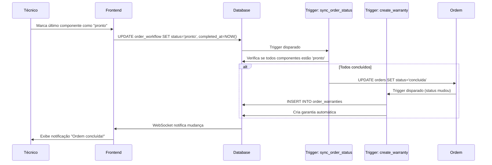

# Fluxo: Workflow → Ordem Concluída

## 📋 Visão Geral

Este documento explica **como o sistema atual funciona** e **como deveria funcionar** para que uma ordem de serviço mude automaticamente para status `'concluida'` quando todos os componentes do workflow são concluídos.

---

## 🔍 Situação Atual do Sistema

### 1. Estrutura da Tabela `order_workflow`

A tabela `order_workflow` armazena o workflow de cada componente da ordem:

```sql
- id (UUID)
- order_id (UUID) - FK para orders
- component (engine_component) - Componente do motor (bloco, cabeçote, etc.)
- status (workflow_status) - Status atual do workflow
- started_at (timestamp) - Quando o workflow foi iniciado
- completed_at (timestamp) - Quando o workflow foi concluído
- notes, assigned_to, etc.
```

### 2. Status do Workflow (Enum `workflow_status`)

O enum `workflow_status` contém os seguintes valores:
- `entrada` - Entrada do componente
- `metrologia` - Inspeção dimensional
- `usinagem` - Processo de usinagem
- `montagem` - Montagem do componente
- `pronto` - Componente pronto
- `garantia` - Em garantia
- `entregue` - Entregue

**⚠️ IMPORTANTE:** O status `'pronto'` indica que o componente está concluído.

### 3. Como o Workflow é Atualizado

#### 3.1 Atualização Manual via Frontend

O hook `useWorkflowUpdate.ts` fornece as seguintes funções:

1. **`updateWorkflowStatus(workflowId, newStatus)`**
   - Atualiza o `status` do workflow
   - Define `started_at` se necessário
   - Define `completed_at` quando status é `'pronto'`, `'garantia'` ou `'entregue'`
   - Registra no histórico (`workflow_status_history`)

2. **`completeWorkflow(workflowId, autoAdvance)`**
   - Define `completed_at = NOW()`
   - Se `autoAdvance = true`, tenta avançar para próximo status
   - **NÃO atualiza automaticamente o status da ordem**

3. **`advanceToNextStatus(currentWorkflow)`**
   - Verifica checklists obrigatórios
   - Busca próximo status permitido
   - Atualiza o workflow para o próximo status

#### 3.2 Verificação de Checklists

Antes de avançar, o sistema verifica:
- Se há checklists obrigatórios pendentes
- Se o checklist foi aprovado (`overall_status = 'approved'`)
- Se todos os pré-requisitos foram atendidos

---

## ❌ Problema Identificado

### Função de Sincronização NÃO Existe

A documentação (`US-OS-009.md`) menciona uma função `sync_order_status_from_workflow()` que deveria:

1. **Verificar se todos os componentes estão concluídos:**
   ```sql
   SELECT COUNT(*) = COUNT(CASE WHEN stage = 'completed' THEN 1 END)
   FROM order_workflow
   WHERE order_id = v_order_id;
   ```

2. **Atualizar status da ordem:**
   ```sql
   IF v_all_completed THEN
     UPDATE orders SET status = 'concluida' WHERE id = v_order_id;
   END IF;
   ```

**⚠️ PROBLEMA:** Esta função **NÃO existe no banco de dados atual!**

### Status da Ordem Atualmente

Atualmente, o status da ordem só muda para `'concluida'` quando:
- **Ação manual** via `updateOrderStatus(orderId, 'concluida')` no frontend
- Não há sincronização automática com o workflow

---

## ✅ Como Deveria Funcionar

### Passo a Passo Ideal

#### 1. **Técnico Conclui Último Componente**

Quando o último componente do workflow é marcado como `'pronto'`:

```typescript
// useWorkflowUpdate.ts - completeWorkflow()
await supabase
  .from('order_workflow')
  .update({
    status: 'pronto',
    completed_at: new Date().toISOString()
  })
  .eq('id', workflowId);
```

#### 2. **Trigger Detecta Mudança**

Um trigger `AFTER UPDATE` na tabela `order_workflow` deveria executar:

```sql
CREATE TRIGGER trigger_sync_order_status
AFTER UPDATE OF status, completed_at ON order_workflow
FOR EACH ROW
EXECUTE FUNCTION sync_order_status_from_workflow();
```

#### 3. **Função Verifica Todos os Componentes**

A função `sync_order_status_from_workflow()` deveria:

```sql
CREATE OR REPLACE FUNCTION sync_order_status_from_workflow()
RETURNS TRIGGER AS $$
DECLARE
  v_order_id UUID;
  v_all_completed BOOLEAN;
  v_total_components INTEGER;
  v_completed_components INTEGER;
BEGIN
  v_order_id := NEW.order_id;

  -- Contar total de componentes da ordem
  SELECT COUNT(*) INTO v_total_components
  FROM order_workflow
  WHERE order_id = v_order_id;

  -- Contar componentes concluídos (status = 'pronto' e completed_at IS NOT NULL)
  SELECT COUNT(*) INTO v_completed_components
  FROM order_workflow
  WHERE order_id = v_order_id
  AND status = 'pronto'
  AND completed_at IS NOT NULL;

  -- Se todos os componentes estão concluídos, atualizar ordem
  IF v_total_components > 0 AND v_completed_components = v_total_components THEN
    UPDATE orders 
    SET status = 'concluida'
    WHERE id = v_order_id
    AND status != 'concluida'; -- Evitar atualizações desnecessárias
  END IF;

  RETURN NEW;
END;
$$ LANGUAGE plpgsql SECURITY DEFINER;
```

#### 4. **Trigger Cria Garantia**

Quando a ordem muda para `'concluida'`, o trigger `create_warranty_trigger` deveria executar:

```sql
CREATE OR REPLACE FUNCTION create_order_warranty()
RETURNS TRIGGER AS $$
BEGIN
  IF NEW.status = 'concluida' AND (OLD.status IS NULL OR OLD.status != 'concluida') THEN
    INSERT INTO order_warranties (...)
    VALUES (...);
  END IF;
  RETURN NEW;
END;
$$;
```

**⚠️ PROBLEMA ATUAL:** A função verifica `'concluido'` (sem 'a') ao invés de `'concluida'`!

---

## 🔧 Implementação Necessária

### 1. Criar Função de Sincronização

```sql
CREATE OR REPLACE FUNCTION sync_order_status_from_workflow()
RETURNS TRIGGER AS $$
DECLARE
  v_order_id UUID;
  v_all_completed BOOLEAN;
  v_total_components INTEGER;
  v_completed_components INTEGER;
BEGIN
  v_order_id := NEW.order_id;

  -- Contar total de componentes
  SELECT COUNT(*) INTO v_total_components
  FROM order_workflow
  WHERE order_id = v_order_id;

  -- Contar componentes concluídos (status = 'pronto' e completed_at IS NOT NULL)
  SELECT COUNT(*) INTO v_completed_components
  FROM order_workflow
  WHERE order_id = v_order_id
  AND status = 'pronto'
  AND completed_at IS NOT NULL;

  -- Se todos estão concluídos, atualizar ordem
  IF v_total_components > 0 AND v_completed_components = v_total_components THEN
    UPDATE orders 
    SET status = 'concluida',
        updated_at = NOW()
    WHERE id = v_order_id
    AND status != 'concluida';
  END IF;

  RETURN NEW;
END;
$$ LANGUAGE plpgsql SECURITY DEFINER;
```

### 2. Criar Trigger

```sql
DROP TRIGGER IF EXISTS trigger_sync_order_status ON order_workflow;

CREATE TRIGGER trigger_sync_order_status
AFTER UPDATE OF status, completed_at ON order_workflow
FOR EACH ROW
WHEN (NEW.status = 'pronto' AND NEW.completed_at IS NOT NULL)
EXECUTE FUNCTION sync_order_status_from_workflow();
```

### 3. Corrigir Função de Garantia

```sql
CREATE OR REPLACE FUNCTION create_order_warranty()
RETURNS TRIGGER AS $$
BEGIN
  -- CORRIGIDO: Usar 'concluida' ao invés de 'concluido'
  IF NEW.status = 'concluida' AND (OLD.status IS NULL OR OLD.status != 'concluida') THEN
    INSERT INTO order_warranties (
      order_id,
      warranty_type,
      start_date,
      end_date,
      terms,
      org_id
    ) VALUES (
      NEW.id,
      'total',
      CURRENT_DATE,
      CURRENT_DATE + INTERVAL '1 month' * COALESCE(NEW.warranty_months, 3),
      'Garantia padrão para serviços executados',
      NEW.org_id
    )
    ON CONFLICT DO NOTHING;
  END IF;
  RETURN NEW;
END;
$$ LANGUAGE plpgsql SECURITY DEFINER;
```

---

## 📊 Fluxo Completo (Ideal)



---

## 🎯 Resumo

**Situação Atual:**
- ❌ Não há sincronização automática entre workflow e status da ordem
- ❌ Status `'concluida'` só muda manualmente
- ❌ Função de garantia verifica status errado (`'concluido'` ao invés de `'concluida'`)

**O que precisa ser feito:**
1. ✅ Criar função `sync_order_status_from_workflow()`
2. ✅ Criar trigger que executa após atualização do workflow
3. ✅ Corrigir função `create_order_warranty()` para usar `'concluida'`
4. ✅ Testar fluxo completo

**Critério para ordem ficar concluída:**
- Todos os componentes da ordem devem ter `status = 'pronto'`
- Todos os componentes devem ter `completed_at IS NOT NULL`
- Quando isso acontece, ordem muda automaticamente para `'concluida'`

