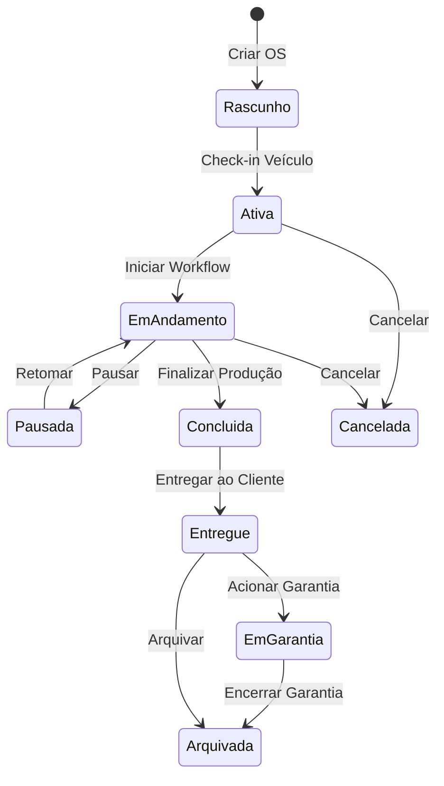

# 📋 Módulo de Ordens de Serviço

## Visão Geral

O módulo de Ordens de Serviço (OS) é o núcleo operacional do sistema ERP Retífica Formiguense, centralizando todas as informações e etapas do ciclo de vida de uma ordem de serviço, desde a criação até a entrega ao cliente.

## 🎯 Objetivos do Módulo

- Centralizar informações de veículos, clientes e serviços
- Rastrear todo o ciclo de vida da OS (criação → entrega)
- Integrar coleta, diagnóstico, orçamento, produção e metrologia
- Gerenciar timeline de eventos e histórico de ações
- Controlar garantias e materiais aplicados
- Fornecer visibilidade completa do status da OS

## 📊 Funcionalidades Principais

### Gestão de OS
- Criação de nova OS com check-in do veículo
- Listagem e filtros avançados (status, cliente, período)
- Visualização detalhada com abas (Detalhes, Timeline, Fotos, Materiais, Garantia)
- Edição de dados gerais da OS
- Controle de status e transições de workflow

### Documentação e Rastreabilidade
- Timeline completa de eventos
- Galeria de fotos por etapa
- Histórico de mudanças de status
- Registro de materiais aplicados
- Gestão de garantias

### Integração com Workflow
- Criação automática de itens no Kanban
- Transição entre etapas do workflow (14 stages)
- Validação de checklists obrigatórios
- Registro de tempo por etapa

### Gestão de Garantias
- Criação automática de garantia ao concluir OS
- Tipos de garantia (peças, serviço, total)
- Controle de vigência e termos
- Vinculação com componentes cobertos

## 🗂️ Estrutura de Documentação

```
docs/modules/orders/
├── README.md                           # Este arquivo
├── user-stories/                       # Histórias de usuário
│   ├── US-OS-001-criar-os.md
│   ├── US-OS-002-listar-os.md
│   ├── US-OS-003-editar-os.md
│   ├── US-OS-004-visualizar-detalhes.md
│   ├── US-OS-005-gerenciar-timeline.md
│   ├── US-OS-006-galeria-fotos.md
│   ├── US-OS-007-controle-garantias.md
│   ├── US-OS-008-vincular-materiais.md
│   ├── US-OS-009-transicao-workflow.md
│   └── US-OS-010-imprimir-pdf.md
├── flows/                              # Fluxos de usuário
│   ├── complete-flow.md                # Fluxo completo
│   ├── user-journey.md                 # Jornada do usuário
│   └── data-flow.md                    # Fluxo de dados
├── diagrams/                           # Diagramas Mermaid
│   ├── architecture.mmd                # Arquitetura do módulo
│   ├── database-erd.mmd                # ERD do banco
│   ├── workflow-stages.mmd             # Etapas do workflow
│   └── component-tree.mmd              # Árvore de componentes
├── database/                           # Scripts SQL
│   ├── schema.sql                      # Schema completo
│   ├── migrations.sql                  # Migrations aplicadas
│   ├── seeds.sql                       # Dados de exemplo
│   └── rls-policies.sql                # Políticas RLS
├── technical/                          # Documentação técnica
│   ├── components.md                   # Componentes React
│   ├── hooks.md                        # Custom hooks
│   ├── api.md                          # Queries Supabase
│   └── types.md                        # Interfaces TypeScript
├── wireframes/                         # Wireframes
│   ├── list-view.md                    # Tela de listagem
│   ├── detail-view.md                  # Tela de detalhes
│   └── form-view.md                    # Formulário de criação
└── testing/                            # Cenários de teste
    ├── unit-tests.md                   # Testes unitários
    ├── integration-tests.md            # Testes de integração
    └── e2e-scenarios.md                # Cenários E2E
```

## 🔗 Integração com Outros Módulos

| Módulo | Integração | Descrição |
|--------|------------|-----------|
| **Clientes** | `orders.customer_id` → `customers.id` | Dados do cliente proprietário |
| **Coleta** | `orders.id` ← `collection_requests.order_id` | Solicitação de coleta vinculada |
| **Workflow Kanban** | `orders.id` ← `order_workflow.order_id` | Itens no workflow de produção |
| **Diagnósticos** | `orders.id` ← `diagnostic_responses.order_id` | Diagnósticos realizados |
| **Orçamentos** | `orders.id` ← `detailed_budgets.order_id` | Orçamentos aprovados |
| **Metrologia** | `orders.id` ← `metrology_inspections.order_id` | Inspeções dimensionais |
| **Materiais** | `orders.id` ← `order_materials.order_id` | Peças aplicadas na OS |
| **Garantias** | `orders.id` ← `order_warranties.order_id` | Garantias emitidas |
| **Financeiro** | `orders.id` ← `accounts_receivable.order_id` | Contas a receber |

## 📈 KPIs e Indicadores

### Indicadores Operacionais
- **Total de OS**: Quantidade total de ordens criadas
- **OS Ativas**: Ordens em andamento (não entregues/canceladas)
- **OS Concluídas**: Ordens finalizadas no período
- **OS em Atraso**: Ordens com prazo vencido

### Indicadores de Performance
- **Lead Time Médio**: Tempo total desde criação até entrega
- **Cycle Time por Etapa**: Tempo médio em cada stage do workflow
- **Taxa de Conversão**: % de OSs que viram orçamento aprovado
- **Taxa de Retrabalho**: % de OSs que voltam para etapas anteriores

### Indicadores de Qualidade
- **NPS do Cliente**: Satisfação pós-entrega
- **Taxa de Garantia Acionada**: % de OSs com garantia utilizada
- **Tempo de Resposta**: Tempo médio para aprovar orçamento

## 🔄 Ciclo de Vida da OS



## 🛠️ Stack Tecnológica

### Frontend
- **React 18** - Biblioteca UI
- **TypeScript** - Tipagem estática
- **Tailwind CSS** - Estilização
- **Shadcn/ui** - Componentes base
- **React Hook Form** - Formulários
- **Zod** - Validação de schemas
- **React Query** - Cache e sincronização

### Backend
- **Supabase** - Backend as a Service
- **PostgreSQL** - Banco de dados
- **Row Level Security** - Segurança por organização
- **Triggers** - Automações no banco
- **Storage** - Armazenamento de fotos

## 📝 Convenções

### Nomenclatura de Campos
- `order_number`: Número sequencial da OS (ORG-YYYY-0001)
- `status`: Status atual da OS (enum)
- `priority`: Prioridade (1=Baixa, 2=Normal, 3=Alta, 4=Urgente)
- `estimated_delivery`: Previsão de entrega
- `actual_delivery`: Data real de entrega
- `warranty_months`: Meses de garantia (padrão: 3)

### Status da OS
| Status | Código | Descrição |
|--------|--------|-----------|
| Rascunho | `draft` | OS criada mas sem check-in |
| Ativa | `ativa` | Check-in realizado, aguardando workflow |
| Em Andamento | `em_andamento` | Em produção no workflow |
| Pausada | `pausada` | Temporariamente pausada |
| Concluída | `concluida` | Produção finalizada |
| Entregue | `entregue` | Entregue ao cliente |
| Em Garantia | `garantia` | Cliente acionou garantia |
| Cancelada | `cancelada` | OS cancelada |
| Arquivada | `arquivada` | Arquivada para histórico |

## 🔐 Segurança e Permissões

### RLS Policies
- Todas as tabelas do módulo utilizam `org_id` para isolamento
- Políticas de SELECT/INSERT/UPDATE/DELETE por organização
- Triggers automáticos para log de auditoria

### Permissões por Perfil
| Ação | Gerente | Técnico | Atendente | Visualizador |
|------|---------|---------|-----------|--------------|
| Criar OS | ✅ | ✅ | ✅ | ❌ |
| Visualizar OS | ✅ | ✅ | ✅ | ✅ |
| Editar OS | ✅ | ✅ | ✅ | ❌ |
| Cancelar OS | ✅ | ❌ | ❌ | ❌ |
| Gerenciar Materiais | ✅ | ✅ | ❌ | ❌ |
| Visualizar Garantias | ✅ | ✅ | ✅ | ✅ |

## 📅 Histórico de Atualizações

| Data | Versão | Descrição |
|------|--------|-----------|
| 28/10/2025 | 1.0 | Documentação inicial completa |
| 11/09/2025 | 0.9 | Implementação de garantias e materiais |
| 15/08/2025 | 0.8 | Sistema de timeline e fotos |
| 01/08/2025 | 0.7 | Integração com workflow Kanban |
| 15/07/2025 | 0.5 | CRUD básico de ordens |

## 📚 Referências

- [Documentação de Workflow](../workflow/README.md)
- [Documentação de Clientes](../customers/README.md)
- [Documentação de Diagnósticos](../diagnostics/README.md)
- [Documentação de Orçamentos](../budgets/README.md)
- [Padrões de API](../../API_PATTERNS.md)
- [Guia de Componentes](../../COMPONENT_LIBRARY.md)

---

**Status**: ✅ Em Produção  
**Última Atualização**: 28/10/2025  
**Responsável**: Equipe de Desenvolvimento ERP
