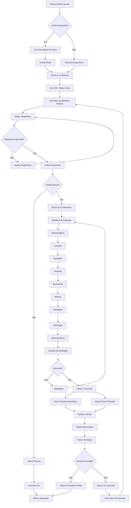

# Fluxo Completo: Ciclo de Vida da Ordem de Serviço

## Visão Geral

Este documento descreve o fluxo completo do ciclo de vida de uma Ordem de Serviço (OS) no sistema ERP Retífica Formiguense, desde a solicitação inicial até a entrega final e garantia.

## 🔄 Diagrama do Fluxo Completo



## 📋 Etapas Detalhadas

### 1. Solicitação e Coleta

#### 1.1 Cliente Solicita Serviço
- **Ator:** Cliente ou Atendente
- **Ação:** Contato inicial por telefone, WhatsApp ou presencial
- **Sistema:** Cadastrar cliente (se novo) em `/clientes`

#### 1.2 Decisão: Coleta Necessária?
- **Se SIM:** Criar solicitação de coleta em `/coleta`
  - Preencher endereço de coleta
  - Agendar data/hora
  - Definir responsável
  - Status: `pendente`
  
- **Se NÃO:** Cliente entrega motor diretamente na oficina

#### 1.3 Coleta/Recepção do Motor
- **Ação:** Equipe coleta motor ou cliente entrega
- **Sistema:** 
  - Atualizar status da coleta: `coletado`
  - Registrar fotos do estado atual
  - Realizar check-in do motor

### 2. Criação da OS

#### 2.1 Check-in e Criação
- **Tela:** `/coleta` ou diretamente em `/ordens-servico`
- **Dados Obrigatórios:**
  - Cliente (FK: `customers`)
  - Veículo/Motor (FK: `engines`)
  - Componentes solicitados (enum: bloco, cabeçote, etc.)
  - Tipo de serviço (retífica, metrologia, etc.)
  
- **Sistema Gera Automaticamente:**
  - Número da OS: `RET-2025-0001`
  - Data de criação
  - Usuário criador
  - Status inicial: `ativa`

#### 2.2 Criação de Itens no Workflow
- **Trigger Automático:** Ao salvar OS com status `ativa`
- **Ação:** Para cada componente solicitado, criar registro em `order_workflow`
- **Status Inicial:** `aguardando_diagnostico`

### 3. Diagnóstico

#### 3.1 Iniciar Diagnóstico
- **Tela:** `/workflow` (Kanban)
- **Ação:** Técnico move card para coluna "Diagnóstico"
- **Sistema:** 
  - Atualiza status do item: `em_diagnostico`
  - Registra timestamp de início

#### 3.2 Preencher Checklist
- **Tela:** Modal de Diagnóstico
- **Dados:**
  - Checklist dinâmico por componente
  - Respostas: sim/não, numérico, texto, múltipla escolha
  - Upload de fotos de defeitos
  - Observações técnicas

#### 3.3 Sistema Sugere Serviços
- **Baseado em:** Respostas do checklist
- **Ação:** Auto-preencher lista de serviços recomendados
- **Técnico:** Pode ajustar sugestões

#### 3.4 Aprovar Diagnóstico
- **Ação:** Técnico finaliza diagnóstico
- **Sistema:**
  - Status: `diagnostico_aprovado`
  - Move card para "Orçamento"
  - Notifica setor comercial

### 4. Orçamento

#### 4.1 Criar Orçamento Detalhado
- **Tela:** `/orcamentos/detalhado`
- **Dados:**
  - Serviços de mão de obra (tabela de preços)
  - Peças necessárias (estoque ou externa)
  - Cálculo automático: subtotal, desconto, impostos, total
  
#### 4.2 Revisar e Enviar
- **Aprovação Gerente:** Se valor > limite configurado
- **Ação:** Gerar PDF do orçamento
- **Envio:** Email/WhatsApp para cliente

#### 4.3 Cliente Aprova/Rejeita
- **Se APROVA:**
  - Status OS: `em_andamento`
  - Status orçamento: `aprovado`
  - Registrar aprovação (assinatura digital, documento)
  - Criar workflow de produção
  
- **Se REJEITA:**
  - Status OS: `cancelada`
  - Motivo: Orçamento não aprovado
  - Arquivar OS

### 5. Produção (Workflow de 14 Etapas)

Cada etapa segue o mesmo fluxo básico:

#### 5.1 Padrão de Transição
```
1. Técnico arrasta card no Kanban
2. Sistema valida checklist obrigatório (se houver)
3. Modal de confirmação abre
4. Técnico preenche:
   - Responsável (atribuir a si mesmo ou outro)
   - Observações
   - Upload de fotos (opcional)
5. Sistema registra:
   - Timestamp de início
   - Usuário responsável
   - Histórico de transição
```

#### 5.2 Etapas de Produção

| # | Etapa | Checklist? | Tempo Médio |
|---|-------|------------|-------------|
| 1 | Desmontagem | ✅ Sim | 2h |
| 2 | Lavação | ❌ Não | 1h |
| 3 | Usinagem | ✅ Sim | 4h |
| 4 | Têmpera | ❌ Não | 6h |
| 5 | Brunimento | ✅ Sim | 3h |
| 6 | Retífica | ✅ Sim | 5h |
| 7 | Montagem | ✅ Sim | 3h |
| 8 | Metrologia | ✅ Sim | 2h |
| 9 | Teste Dinâmico | ✅ Sim | 1h |
| 10 | Controle Qualidade | ✅ Sim | 1h |

#### 5.3 Registro de Materiais
- **Quando:** Durante montagem ou ao finalizar etapa
- **Tela:** Modal do Workflow ou aba "Materiais" em OrderDetails
- **Ação:** 
  - Selecionar peça do estoque
  - Informar quantidade
  - Sistema decrementa estoque automaticamente
  - Registra em `order_materials`

### 6. Metrologia (Inspeção Dimensional)

#### 6.1 Iniciar Metrologia
- **Tela:** Modal de Metrologia (5 etapas)
- **Etapa 1:** Identificação do Motor
  - Dados do motor
  - Número de série
  - Especificações técnicas

#### 6.2 Etapas 2-4: Inspeção
- **Etapa 2:** Componentes recebidos (checklist)
- **Etapa 3:** Análise visual (fotos + observações)
- **Etapa 4:** Medições dimensionais
  - Medidas em micrômetros
  - Comparação com especificações
  - Tolerâncias aceitáveis

#### 6.3 Etapa 5: Parecer Técnico
- **Resultado:** Aprovado / Aprovado com ressalvas / Reprovado
- **Ação:** Gerar PDF do laudo de metrologia
- **DNA do Motor:** Sistema registra histórico completo

### 7. Finalização

#### 7.1 Concluir OS
- **Condição:** Todas as etapas concluídas + metrologia aprovada
- **Ação Manual:** Gerente/Técnico marca OS como "Concluída"
- **Sistema Automático:**
  - Status: `concluida`
  - Registra data de conclusão
  - **Trigger 1:** Cria garantia automática
    - Tipo: `total`
    - Vigência: `warranty_months` (padrão 3 meses)
    - Termos padrão
  - **Trigger 2:** Cria conta a receber
    - Valor: Total do orçamento aprovado
    - Vencimento: Conforme negociado
    - Status: `pendente`

#### 7.2 Notificar Cliente
- **Canal:** Email + SMS/WhatsApp
- **Mensagem:** "Seu motor está pronto para retirada!"
- **Anexos:** 
  - Laudo de metrologia (PDF)
  - Garantia (PDF)
  - Nota fiscal (se emitida)

### 8. Entrega

#### 8.1 Cliente Retira Motor
- **Tela:** `/ordens-servico/:id` → Botão "Marcar como Entregue"
- **Ação:**
  - Solicitar assinatura do cliente (tablet/celular)
  - Registrar data/hora de entrega
  - Upload de foto do motor embalado
  - Status: `entregue`

#### 8.2 Solicitar Feedback
- **Ação:** Enviar pesquisa NPS
- **Prazo:** 7 dias após entrega

### 9. Garantia (Se Necessário)

#### 9.1 Cliente Aciona Garantia
- **Condição:** Dentro do prazo de vigência
- **Ação:** Cliente reporta problema
- **Sistema:**
  - Status OS original: `garantia`
  - Criar nova OS vinculada à original
  - Tipo: Garantia (sem custo)
  - Processo: Volta para etapa de diagnóstico

#### 9.2 Processar Garantia
- **Fluxo:** Mesmo workflow de produção
- **Financeiro:** Sem cobrança
- **Nova Garantia:** Emitir após conclusão

### 10. Arquivamento

#### 10.1 Arquivar Automaticamente
- **Condição:** OS entregue + 90 dias sem movimentação
- **Ação:** Cron job automático
- **Status:** `arquivada`

#### 10.2 Arquivar Manualmente
- **Quando:** Gerente decide arquivar antes do prazo
- **Permissão:** Somente perfil Gerente/Admin

## ⏱️ SLAs e Prazos

### Prazos Padrão por Componente

| Componente | Lead Time Total | Observação |
|------------|-----------------|------------|
| Bloco | 7-10 dias úteis | Mais complexo |
| Cabeçote | 5-7 dias úteis | Médio |
| Virabrequim | 3-5 dias úteis | Rápido |
| Comando | 3-5 dias úteis | Rápido |
| Biela | 2-4 dias úteis | Rápido |
| Pistão | 2-3 dias úteis | Mais rápido |
| Eixo | 2-4 dias úteis | Rápido |

### Alertas de Atraso

```typescript
// Alerta amarelo: 80% do prazo
const warningThreshold = 0.8;

// Alerta vermelho: 100% do prazo
const criticalThreshold = 1.0;

// Cálculo de progresso
const progress = (Date.now() - createdAt) / (estimatedDelivery - createdAt);

if (progress >= criticalThreshold) {
  return 'critical'; // Vermelho
} else if (progress >= warningThreshold) {
  return 'warning'; // Amarelo
} else {
  return 'normal'; // Verde
}
```

## 📊 Indicadores por Etapa

### KPIs Operacionais

1. **Lead Time Total:** Criação → Entrega
2. **Cycle Time:** Início produção → Conclusão
3. **Processing Time:** Soma dos tempos efetivos
4. **Waiting Time:** Tempo em espera entre etapas
5. **Taxa de Conversão:** Diagnóstico → Orçamento aprovado
6. **Taxa de Retrabalho:** % que voltam para etapas anteriores
7. **First Time Right:** % aprovadas sem retrabalho
8. **SLA Compliance:** % dentro do prazo

### Metas Sugeridas

- **Lead Time < 10 dias:** 80% das OSs
- **Taxa de Conversão > 70%**
- **Taxa de Retrabalho < 5%**
- **SLA Compliance > 90%**
- **NPS > 8.0**

## 🔔 Notificações Automáticas

### Eventos que Geram Notificação

| Evento | Destinatário | Canal |
|--------|--------------|-------|
| OS criada | Gerente, Técnico responsável | Sistema |
| Diagnóstico concluído | Comercial | Sistema + Email |
| Orçamento aprovado | Gerente, Técnico | Sistema |
| OS pausada por falta de peça | Compras, Gerente | Sistema + Email |
| 80% do prazo atingido | Gerente, Técnico | Sistema |
| OS atrasada | Gerente, Diretor | Sistema + Email |
| OS concluída | Cliente | Email + SMS |
| Cliente avaliou (NPS) | Gerente | Sistema |

## 🚨 Exceções e Casos Especiais

### OS Pausada

**Motivos Comuns:**
- Falta de peça no estoque
- Aguardando aprovação de custo adicional
- Problema técnico complexo
- Aguardando terceirização

**Ação:**
- Status: `pausada`
- Registrar motivo obrigatório
- Criar task para resolver bloqueio
- Notificar gerente

### OS Cancelada

**Motivos Comuns:**
- Cliente não aprovou orçamento
- Cliente desistiu do serviço
- Motor inviável de recuperar
- Erro de cadastro

**Ação:**
- Status: `cancelada`
- Registrar motivo detalhado
- Não gerar conta a receber
- Arquivar automaticamente

### Retrabalho

**Quando:** Controle de qualidade reprova
**Ação:**
- Mover card de volta para etapa com problema
- Registrar não conformidade
- Criar ocorrência de qualidade
- Não alterar prazo automaticamente (gerente decide)

---

**Documentado por:** Equipe de Desenvolvimento  
**Última Atualização:** 28/10/2025  
**Versão:** 1.0
