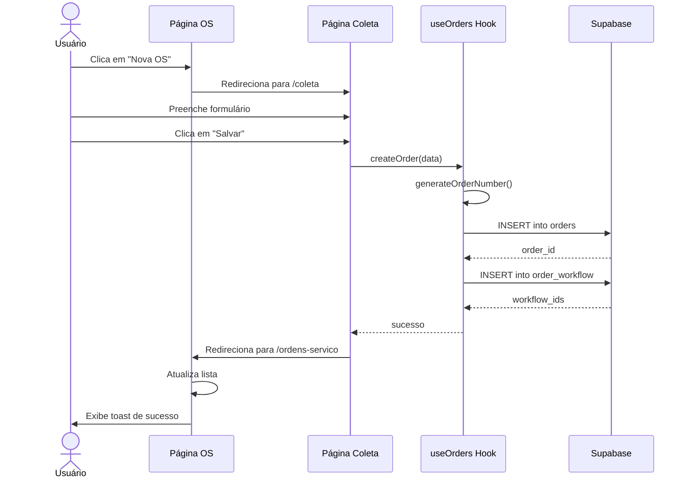
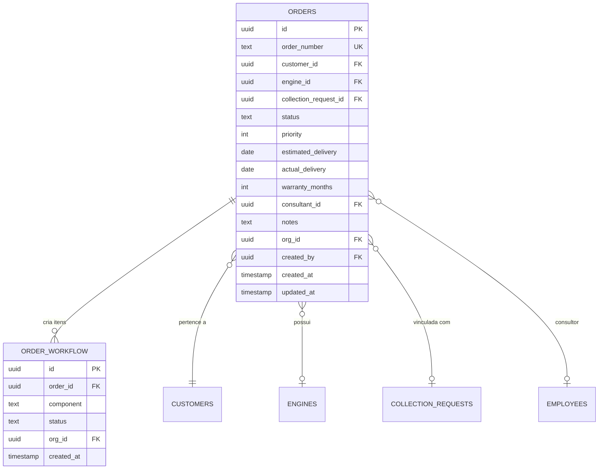

# US-OS-001: Criar Nova Ordem de Serviço com Check-in

## 📋 Metadados
- **Épico:** Gestão de Ordens de Serviço
- **Sprint:** Sprint 1
- **Prioridade:** Alta
- **Estimativa:** 8 Story Points
- **Status:** ✅ Implementado
- **Data de Implementação:** 15/07/2025

## 🎯 História de Usuário

**Como** atendente da oficina  
**Eu quero** criar uma nova ordem de serviço vinculada a um cliente  
**Para que** eu possa iniciar o processo de recepção do veículo e registrar todos os dados necessários para o serviço

## 💼 Objetivo

Permitir a criação de novas ordens de serviço com todas as informações essenciais para o início do atendimento, incluindo dados do cliente, veículo/motor, componentes solicitados e configurações iniciais. O sistema deve gerar automaticamente o número da OS e criar os registros necessários para o workflow de produção.

## 📐 Regras de Negócio

**RN001:** A OS deve estar vinculada obrigatoriamente a um cliente existente no sistema  
**RN002:** O número da OS deve seguir o padrão `ORG-YYYY-NNNN` onde:
- `ORG` = código da organização
- `YYYY` = ano atual
- `NNNN` = sequencial com 4 dígitos (ex: 0001, 0002...)

**RN003:** Ao criar a OS, o status inicial deve ser `draft` (rascunho)  
**RN004:** A data de criação deve ser automaticamente preenchida com a data/hora atual  
**RN005:** O campo `created_by` deve ser preenchido com o ID do usuário logado  
**RN006:** A prioridade padrão deve ser 2 (Normal) se não informada  
**RN007:** O prazo de garantia padrão deve ser 3 meses se não informado  
**RN008:** Se informado `collection_request_id`, validar que a solicitação existe e está disponível  
**RN009:** Ao salvar a OS com status `ativa`, deve ser criado automaticamente um registro na tabela `order_workflow` para cada componente solicitado  
**RN010:** O usuário pode navegar diretamente para a página de Coleta para criar uma OS vinculada automaticamente

## ✅ Critérios de Aceite

**CA001:** DADO QUE estou na tela de Ordens de Serviço QUANDO clico em "Nova OS" ENTÃO devo ser redirecionado para a página de Coleta onde posso criar uma nova solicitação que automaticamente gera uma OS

**CA002:** DADO QUE estou criando uma OS QUANDO seleciono um cliente ENTÃO o sistema deve carregar automaticamente os dados cadastrais do cliente e exibir o histórico de OSs anteriores

**CA003:** DADO QUE informei os dados obrigatórios (cliente, tipo de serviço) QUANDO clico em "Salvar" ENTÃO o sistema deve:
- Gerar o número da OS automaticamente
- Criar o registro na tabela `orders`
- Exibir mensagem de sucesso
- Redirecionar para a tela de detalhes da OS criada

**CA004:** DADO QUE criei uma OS com status `ativa` QUANDO a OS é salva ENTÃO o sistema deve criar automaticamente os registros no workflow Kanban (tabela `order_workflow`) para cada componente solicitado com status inicial `aguardando_diagnostico`

**CA005:** DADO QUE estou criando uma OS QUANDO não preencho campos obrigatórios ENTÃO o sistema deve exibir mensagens de validação claras indicando os campos faltantes

**CA006:** DADO QUE estou criando uma OS QUANDO informo uma previsão de entrega no passado ENTÃO o sistema deve exibir erro de validação

**CA007:** DADO QUE informei um `collection_request_id` QUANDO salvo a OS ENTÃO o sistema deve vincular a solicitação de coleta à OS criada

## 🏁 Definition of Done

**DOD001:** ✅ Componente React `CreateOrderForm` criado e funcional  
**DOD002:** ✅ Integração com Supabase para criar registro em `orders`  
**DOD003:** ✅ Geração automática do `order_number` implementada  
**DOD004:** ✅ Validação de campos obrigatórios com React Hook Form + Zod  
**DOD005:** ✅ Criação automática de `order_workflow` ao salvar com status `ativa`  
**DOD006:** ✅ Redirecionamento para página de Coleta ao clicar em "Nova OS"  
**DOD007:** ✅ Toast de sucesso/erro exibido corretamente  
**DOD008:** ✅ Testes unitários para validações  
**DOD009:** ✅ Testes E2E para fluxo completo de criação  
**DOD010:** ✅ Documentação técnica atualizada

## 🖥️ Telas Afetadas

### Tela Atual: Lista de Ordens de Serviço
- **Mudança:** Adição do botão "Nova OS" no cabeçalho
- **Comportamento:** Ao clicar, redireciona para `/coleta` em vez de abrir modal

### Tela Nova: Página de Coleta (aproveitada)
- **Rota:** `/coleta`
- **Descrição:** Formulário de solicitação de coleta que automaticamente cria uma OS vinculada
- **Campos:** Cliente, veículo, motor, componentes, observações
- **Ação:** Ao salvar coleta, cria OS automaticamente

## 📊 Campos

### Tabela: `orders`

| Campo | Tipo | Obrigatório | Descrição | Validação |
|-------|------|-------------|-----------|-----------|
| `id` | UUID | Sim | Identificador único (PK) | Auto-gerado |
| `order_number` | TEXT | Sim | Número da OS (único) | Padrão `ORG-YYYY-NNNN` |
| `customer_id` | UUID | Sim | Cliente vinculado (FK) | Deve existir em `customers` |
| `engine_id` | UUID | Não | Motor/veículo (FK) | Deve existir em `engines` |
| `collection_request_id` | UUID | Não | Solicitação de coleta (FK) | Se informado, deve existir |
| `status` | TEXT | Sim | Status da OS | Enum: `draft`, `ativa`, etc. |
| `priority` | INTEGER | Sim | Prioridade (1-4) | Default: 2 |
| `estimated_delivery` | DATE | Não | Previsão de entrega | Deve ser futura |
| `actual_delivery` | DATE | Não | Entrega real | - |
| `warranty_months` | INTEGER | Sim | Meses de garantia | Default: 3, Min: 1 |
| `consultant_id` | UUID | Não | Consultor responsável (FK) | Deve existir em `employees` |
| `notes` | TEXT | Não | Observações gerais | - |
| `org_id` | UUID | Sim | Organização (FK) | Auto-preenchido |
| `created_by` | UUID | Sim | Usuário criador (FK) | Auto-preenchido |
| `created_at` | TIMESTAMP | Sim | Data de criação | Auto-preenchido |
| `updated_at` | TIMESTAMP | Sim | Última atualização | Auto-atualizado |

### Tabela: `order_workflow` (criada automaticamente)

| Campo | Tipo | Obrigatório | Descrição |
|-------|------|-------------|-----------|
| `id` | UUID | Sim | Identificador único (PK) |
| `order_id` | UUID | Sim | OS vinculada (FK) |
| `component` | TEXT | Sim | Componente (enum) |
| `status` | TEXT | Sim | Status inicial: `aguardando_diagnostico` |
| `org_id` | UUID | Sim | Organização |
| `created_at` | TIMESTAMP | Sim | Data de criação |

## 🔢 Cálculos e Fórmulas

### Geração do Número da OS

```typescript
// Formato: ORG-YYYY-NNNN
// Exemplo: RET-2025-0001

const generateOrderNumber = async (orgCode: string): Promise<string> => {
  const year = new Date().getFullYear();
  const prefix = `${orgCode}-${year}`;
  
  // Buscar o último número da OS do ano atual
  const { data: lastOrder } = await supabase
    .from('orders')
    .select('order_number')
    .ilike('order_number', `${prefix}%`)
    .order('created_at', { ascending: false })
    .limit(1)
    .single();
  
  let nextSequence = 1;
  
  if (lastOrder?.order_number) {
    // Extrair o número sequencial do último pedido
    const lastSequence = parseInt(lastOrder.order_number.split('-')[2]);
    nextSequence = lastSequence + 1;
  }
  
  // Formatar com 4 dígitos (padding zeros à esquerda)
  const sequenceFormatted = nextSequence.toString().padStart(4, '0');
  
  return `${prefix}-${sequenceFormatted}`;
};
```

### Cálculo de Prioridade

```typescript
// Mapeamento de prioridade
const PRIORITY_MAP = {
  1: 'Baixa',
  2: 'Normal',
  3: 'Alta',
  4: 'Urgente'
} as const;

// Cor da prioridade para UI
const getPriorityColor = (priority: number): string => {
  const colors = {
    1: 'text-gray-500',
    2: 'text-blue-500',
    3: 'text-orange-500',
    4: 'text-red-500'
  };
  return colors[priority] || colors[2];
};
```

## 🧩 Componentes

### Componentes React Afetados

1. **`src/pages/OrdensServico.tsx`**
   - Adicionar botão "Nova OS" que redireciona para `/coleta`
   - Atualizar lista de OSs após criação

2. **`src/pages/Coleta.tsx`** (reutilizado)
   - Formulário de coleta que cria OS automaticamente
   - Validação de campos com React Hook Form
   - Integração com `useOrders` hook

3. **`src/hooks/useOrders.ts`**
   - Função `createOrder()` para criar nova OS
   - Função `generateOrderNumber()` para gerar número automático
   - Função `createWorkflowItems()` para criar itens no Kanban

4. **`src/components/orders/OrdersList.tsx`**
   - Atualização automática da lista após criação
   - Loading state durante criação

### Novos Componentes Necessários

Nenhum componente novo necessário, reutilização de componentes existentes.

## ❌ Escopo Negativo

**Não incluído nesta história:**
- Edição de OS após criação (US-OS-003)
- Upload de fotos na criação (US-OS-006)
- Vinculação de materiais na criação (US-OS-008)
- Geração de PDF da OS (US-OS-010)
- Aprovação de orçamento (módulo Orçamentos)
- Funcionalidades de timeline (US-OS-005)

## 📎 Diagramas

### Fluxo de Criação de OS



### Modelo de Dados



## 🧪 Cenários de Teste

### Teste E2E: Criar OS com Sucesso

```gherkin
Feature: Criar Ordem de Serviço

  Background:
    Given estou logado como "atendente@retifica.com"
    And existe um cliente "João Silva" cadastrado
    And estou na página "/ordens-servico"

  Scenario: Criar nova OS com dados mínimos
    When clico no botão "Nova OS"
    Then devo ser redirecionado para "/coleta"
    When seleciono o cliente "João Silva"
    And preencho o tipo de serviço "Retífica de Motor"
    And clico em "Salvar"
    Then devo ver a mensagem "Ordem de serviço criada com sucesso"
    And devo ser redirecionado para "/ordens-servico"
    And devo ver a nova OS na lista com status "Rascunho"
    And o número da OS deve seguir o padrão "RET-2025-NNNN"

  Scenario: Criar OS com todos os dados opcionais
    When clico no botão "Nova OS"
    And preencho todos os campos incluindo:
      | Cliente              | João Silva           |
      | Veículo              | Gol 1.0              |
      | Previsão de Entrega  | 30/11/2025          |
      | Prioridade           | Alta                 |
      | Garantia             | 6 meses              |
      | Observações          | Cliente antigo       |
    And clico em "Salvar"
    Then a OS deve ser criada com todos os dados preenchidos
    And a prioridade deve estar marcada como "Alta"
    And a garantia deve ser de 6 meses

  Scenario: Validação de campos obrigatórios
    When clico no botão "Nova OS"
    And clico em "Salvar" sem preencher nada
    Then devo ver a mensagem de erro "Cliente é obrigatório"
    And a OS não deve ser criada

  Scenario: Validação de data de entrega no passado
    When clico no botão "Nova OS"
    And preencho uma data de entrega no passado
    And clico em "Salvar"
    Then devo ver erro "A data de entrega deve ser futura"

  Scenario: Criar OS com status ativa gera workflow automaticamente
    When clico no botão "Nova OS"
    And preencho os dados da OS
    And seleciono componentes: "Bloco, Cabeçote"
    And marco status como "Ativa"
    And clico em "Salvar"
    Then a OS deve ser criada
    And devem ser criados 2 itens no workflow Kanban
    And ambos os itens devem ter status "Aguardando Diagnóstico"
```

### Teste Unitário: Geração de Número da OS

```typescript
describe('generateOrderNumber', () => {
  it('deve gerar o primeiro número do ano corretamente', async () => {
    const number = await generateOrderNumber('RET');
    expect(number).toMatch(/^RET-\d{4}-0001$/);
  });

  it('deve incrementar o número sequencial', async () => {
    // Mock do último pedido
    mockSupabase.from().select().single.mockResolvedValue({
      data: { order_number: 'RET-2025-0042' }
    });
    
    const number = await generateOrderNumber('RET');
    expect(number).toBe('RET-2025-0043');
  });

  it('deve reiniciar a sequência no novo ano', async () => {
    mockSupabase.from().select().single.mockResolvedValue({
      data: { order_number: 'RET-2024-9999' }
    });
    
    const number = await generateOrderNumber('RET');
    expect(number).toBe('RET-2025-0001');
  });
});
```

---

**Autor:** Equipe de Desenvolvimento  
**Revisor:** Product Owner  
**Última Atualização:** 28/10/2025
