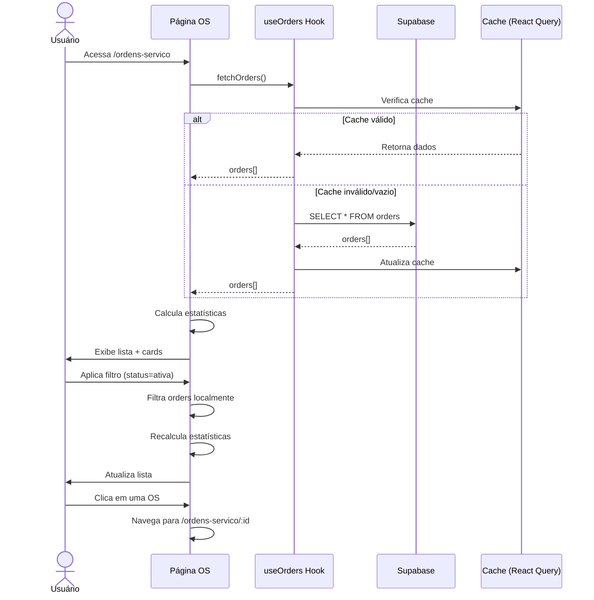
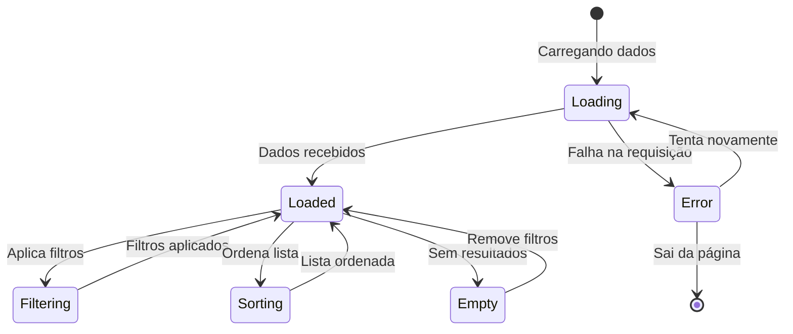

# US-OS-002: Listar e Filtrar Ordens de Serviço

## 📋 Metadados
- **Épico:** Gestão de Ordens de Serviço
- **Sprint:** Sprint 1
- **Prioridade:** Alta
- **Estimativa:** 5 Story Points
- **Status:** ✅ Implementado
- **Data de Implementação:** 18/07/2025

## 🎯 História de Usuário

**Como** usuário do sistema (atendente, técnico ou gerente)  
**Eu quero** visualizar uma lista de todas as ordens de serviço com filtros e ordenação  
**Para que** eu possa encontrar rapidamente as OSs que preciso acompanhar ou editar

## 💼 Objetivo

Fornecer uma interface de listagem completa das ordens de serviço com capacidade de filtrar por múltiplos critérios (status, cliente, período, prioridade), ordenar por colunas e visualizar informações resumidas de cada OS. A lista deve ser performática mesmo com grande volume de dados e atualizar automaticamente quando houver mudanças.

## 📐 Regras de Negócio

**RN001:** Por padrão, devem ser exibidas apenas as OSs da organização do usuário logado (filtro por `org_id`)  
**RN002:** A lista deve ser paginada para melhor performance (limite inicial de 50 registros)  
**RN003:** Filtros devem ser cumulativos (podem ser combinados)  
**RN004:** A ordenação padrão deve ser por `created_at DESC` (mais recentes primeiro)  
**RN005:** O status deve ser exibido com cores distintas para facilitar identificação visual  
**RN006:** Ordens em atraso (estimated_delivery < hoje e status != entregue/cancelada) devem ter indicador visual  
**RN007:** Ao clicar em uma OS, deve abrir a tela de detalhes (US-OS-004)  
**RN008:** O card de estatísticas no topo deve atualizar conforme os filtros aplicados  
**RN009:** Se o usuário não tiver permissão para ver uma OS específica, ela não deve aparecer na lista

## ✅ Critérios de Aceite

**CA001:** DADO QUE estou na página de Ordens de Serviço QUANDO a página carrega ENTÃO devo ver a lista de OSs da minha organização ordenadas por data de criação (mais recentes primeiro)

**CA002:** DADO QUE estou visualizando a lista de OSs QUANDO aplico um filtro por status (ex: "Ativa") ENTÃO a lista deve atualizar mostrando apenas as OSs com aquele status

**CA003:** DADO QUE estou visualizando a lista QUANDO aplico múltiplos filtros (ex: status "Ativa" + cliente "João Silva") ENTÃO a lista deve mostrar apenas OSs que atendem TODOS os critérios

**CA004:** DADO QUE apliquei filtros QUANDO clico em "Limpar Filtros" ENTÃO todos os filtros devem ser removidos e a lista deve voltar ao estado inicial

**CA005:** DADO QUE estou na lista de OSs QUANDO clico no cabeçalho de uma coluna (ex: "Número da OS") ENTÃO a lista deve ser reordenada por aquela coluna

**CA006:** DADO QUE uma OS está com prazo vencido QUANDO visualizo a lista ENTÃO devo ver um indicador visual destacado (badge vermelho ou ícone de alerta)

**CA007:** DADO QUE existem mais de 50 OSs QUANDO rolo até o final da lista ENTÃO o sistema deve carregar automaticamente os próximos registros (infinite scroll ou paginação)

**CA008:** DADO QUE estou visualizando a lista QUANDO clico em uma OS ENTÃO devo ser navegado para a tela de detalhes daquela OS

**CA009:** DADO QUE a lista está carregando QUANDO aguardo o carregamento ENTÃO devo ver skeletons ou loading indicators nas posições dos cards

**CA010:** DADO QUE não há OSs que atendem aos filtros QUANDO aplico filtros muito restritivos ENTÃO devo ver uma mensagem "Nenhuma ordem de serviço encontrada"

## 🏁 Definition of Done

**DOD001:** ✅ Componente `OrdersList` criado e renderizando dados  
**DOD002:** ✅ Integração com Supabase via `useOrders` hook  
**DOD003:** ✅ Filtros funcionando: status, cliente, período, prioridade  
**DOD004:** ✅ Ordenação por colunas implementada  
**DOD005:** ✅ Cards de estatísticas (Total, Ativas, Concluídas, Em Atraso) exibindo valores corretos  
**DOD006:** ✅ Indicador visual para OSs em atraso  
**DOD007:** ✅ Loading states com Skeleton  
**DOD008:** ✅ Empty state para lista vazia  
**DOD009:** ✅ Responsividade mobile/tablet/desktop  
**DOD010:** ✅ Navegação para detalhes ao clicar na OS  
**DOD011:** ✅ Testes E2E cobrindo fluxos de filtros

## 🖥️ Telas Afetadas

### Tela: Lista de Ordens de Serviço (`/ordens-servico`)

**Layout Desktop:**
```
┌─────────────────────────────────────────────────────────────┐
│ Ordens de Serviço                          [+ Nova OS]       │
│ Gerencie todas as ordens de serviço da oficina              │
├─────────────────────────────────────────────────────────────┤
│ ┌───────┐ ┌───────┐ ┌───────┐ ┌───────┐                   │
│ │Total  │ │Ativas │ │Concl. │ │Atraso │                   │
│ │  42   │ │  15   │ │  25   │ │   2   │                   │
│ └───────┘ └───────┘ └───────┘ └───────┘                   │
├─────────────────────────────────────────────────────────────┤
│ Filtros: [Status ▼] [Cliente ▼] [Período ▼] [Limpar]      │
├─────────────────────────────────────────────────────────────┤
│ ┌─────────────────────────────────────────────────────────┐ │
│ │ RET-2025-0042 │ João Silva    │ [Ativa]  │ 30/11/2025 │ │
│ │ Gol 1.0       │ Retífica Motor│ Alta     │            │ │
│ └─────────────────────────────────────────────────────────┘ │
│ ┌─────────────────────────────────────────────────────────┐ │
│ │ RET-2025-0041 │ Maria Santos  │ [Concluída] │ ⚠ Atraso│ │
│ │ Civic 1.8     │ Retífica Bloco│ Normal   │            │ │
│ └─────────────────────────────────────────────────────────┘ │
└─────────────────────────────────────────────────────────────┘
```

**Componentes Visuais:**
- Cards de estatísticas no topo (4 cards)
- Barra de filtros com selects e input de busca
- Lista de cards de OSs (responsivo)
- Badge de status com cores
- Indicador de atraso (ícone ou badge vermelho)
- Loading skeletons durante carregamento

## 📊 Campos

### Query Supabase: Lista de OSs

```typescript
const { data: orders } = await supabase
  .from('orders')
  .select(`
    *,
    customer:customers(id, name, document),
    engine:engines(id, brand, model, year),
    consultant:employees(id, name)
  `)
  .eq('org_id', currentOrg)
  .order('created_at', { ascending: false })
  .range(0, 49);
```

### Campos Exibidos na Lista

| Campo | Origem | Formatação | Obrigatório |
|-------|--------|------------|-------------|
| Número da OS | `order_number` | Texto | ✅ |
| Cliente | `customer.name` | Texto + link | ✅ |
| Veículo | `engine.brand + engine.model` | Texto | ❌ |
| Status | `status` | Badge colorido | ✅ |
| Prioridade | `priority` | Badge/Ícone | ✅ |
| Previsão | `estimated_delivery` | DD/MM/YYYY | ❌ |
| Criada em | `created_at` | DD/MM/YYYY HH:mm | ✅ |

## 🔢 Cálculos e Fórmulas

### Cálculo de Estatísticas

```typescript
// Total de OSs (filtradas)
const totalOrders = orders.length;

// OSs Ativas (não entregue e não cancelada)
const activeOrders = orders.filter(o => 
  !['entregue', 'cancelada'].includes(o.status)
).length;

// OSs Concluídas
const completedOrders = orders.filter(o => 
  o.status === 'concluida'
).length;

// OSs em Atraso
const delayedOrders = orders.filter(o => 
  o.estimated_delivery && 
  new Date(o.estimated_delivery) < new Date() && 
  !['entregue', 'cancelada'].includes(o.status)
).length;
```

### Identificação de Atraso

```typescript
const isDelayed = (order: Order): boolean => {
  if (!order.estimated_delivery) return false;
  if (['entregue', 'cancelada'].includes(order.status)) return false;
  
  const deadline = new Date(order.estimated_delivery);
  const today = new Date();
  today.setHours(0, 0, 0, 0); // Zerar horas
  
  return deadline < today;
};
```

### Cores de Status

```typescript
const getStatusBadgeColor = (status: string): string => {
  const colors = {
    draft: 'bg-gray-100 text-gray-800',
    ativa: 'bg-blue-100 text-blue-800',
    em_andamento: 'bg-purple-100 text-purple-800',
    pausada: 'bg-yellow-100 text-yellow-800',
    concluida: 'bg-green-100 text-green-800',
    entregue: 'bg-teal-100 text-teal-800',
    garantia: 'bg-orange-100 text-orange-800',
    cancelada: 'bg-red-100 text-red-800',
    arquivada: 'bg-gray-100 text-gray-600'
  };
  
  return colors[status] || colors.draft;
};
```

## 🧩 Componentes

### Hierarquia de Componentes

```
OrdensServico (Page)
├── Header (título + botão Nova OS)
├── StatisticsCards
│   ├── Card (Total)
│   ├── Card (Ativas)
│   ├── Card (Concluídas)
│   └── Card (Em Atraso)
├── FilterBar
│   ├── Select (Status)
│   ├── Select (Cliente)
│   ├── DateRangePicker (Período)
│   └── Button (Limpar Filtros)
└── OrdersList
    ├── OrderCard (item 1)
    ├── OrderCard (item 2)
    └── ...
```

### Componentes Detalhados

**1. `src/pages/OrdensServico.tsx`** (Principal)
- Gerencia estado dos filtros
- Calcula estatísticas
- Renderiza layout geral

**2. `src/components/orders/OrdersList.tsx`**
- Recebe array de orders
- Renderiza lista de OrderCard
- Gerencia loading e empty states

**3. `src/components/orders/OrderCard.tsx`** (Novo)
- Card individual de OS
- Exibe dados resumidos
- Click handler para navegação

**4. `src/hooks/useOrders.ts`**
- Hook customizado para buscar OSs
- Filtros e ordenação
- Cache com React Query

## ❌ Escopo Negativo

**Não incluído nesta história:**
- Busca textual por número de OS ou nome de cliente (feature futura)
- Exportação da lista para Excel/PDF
- Edição inline de campos na lista
- Seleção múltipla de OSs para ações em lote
- Visualização em diferentes layouts (grid, tabela, etc.)
- Favoritar/fixar OSs importantes
- Filtros salvos/personalizados

## 📎 Diagramas

### Fluxo de Listagem e Filtros



### Estados da Lista



## 🧪 Cenários de Teste

### Teste E2E: Listar e Filtrar OSs

```gherkin
Feature: Listar Ordens de Serviço

  Background:
    Given estou logado como "gerente@retifica.com"
    And existem as seguintes OSs cadastradas:
      | Número        | Cliente      | Status    | Previsão    |
      | RET-2025-0001 | João Silva   | ativa     | 30/11/2025  |
      | RET-2025-0002 | Maria Santos | concluida | 15/10/2025  |
      | RET-2025-0003 | Pedro Costa  | ativa     | 20/10/2025  |
    And estou na página "/ordens-servico"

  Scenario: Visualizar lista inicial de OSs
    Then devo ver 3 OSs na lista
    And o card "Total de OS" deve mostrar "3"
    And o card "OS Ativas" deve mostrar "2"
    And o card "Concluídas" deve mostrar "1"

  Scenario: Filtrar por status
    When seleciono o filtro de status "Ativa"
    Then devo ver apenas 2 OSs na lista
    And todas as OSs exibidas devem ter status "Ativa"
    And o card "Total de OS" deve mostrar "2"

  Scenario: Filtrar por cliente
    When seleciono o cliente "João Silva" no filtro
    Then devo ver apenas 1 OS na lista
    And a OS exibida deve ser "RET-2025-0001"

  Scenario: Combinar múltiplos filtros
    When seleciono o filtro de status "Ativa"
    And seleciono o cliente "João Silva"
    Then devo ver apenas 1 OS na lista
    And a OS deve ser "RET-2025-0001" com status "Ativa"

  Scenario: Limpar filtros
    When seleciono o filtro de status "Ativa"
    And clico em "Limpar Filtros"
    Then devo ver novamente todas as 3 OSs
    And os filtros devem estar vazios

  Scenario: Identificar OS em atraso
    Then a OS "RET-2025-0003" deve ter um indicador de atraso
    And o card "Em Atraso" deve mostrar "1"

  Scenario: Navegar para detalhes
    When clico na OS "RET-2025-0001"
    Then devo ser redirecionado para "/ordens-servico/[id]"
    And devo ver os detalhes completos da OS

  Scenario: Ordenar por número da OS
    When clico no cabeçalho "Número da OS"
    Then as OSs devem ser ordenadas em ordem crescente
    When clico novamente no cabeçalho "Número da OS"
    Then as OSs devem ser ordenadas em ordem decrescente

  Scenario: Lista vazia após filtros
    When seleciono o filtro de status "Cancelada"
    Then devo ver a mensagem "Nenhuma ordem de serviço encontrada"
    And não deve haver OSs na lista
```

---

**Autor:** Equipe de Desenvolvimento  
**Revisor:** Product Owner  
**Última Atualização:** 28/10/2025
