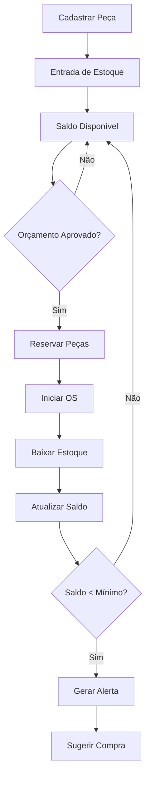

# Módulo de Gestão de Estoque

## Visão Geral
Sistema completo de controle de estoque de peças e componentes para retífica de motores, com rastreabilidade, alertas de reposição e integração com compras.

## User Stories Implementadas

### Gestão de Peças
- **US-EST-001**: Cadastrar Catálogo de Peças
- **US-EST-002**: Controlar Saldo de Estoque
- **US-EST-003**: Movimentações de Estoque
- **US-EST-004**: Alertas de Estoque Mínimo

### Operações
- **US-EST-005**: Reservar Peças para Orçamento
- **US-EST-006**: Baixa de Peças por OS
- **US-EST-007**: Contagem Física de Estoque
- **US-EST-008**: Ajustes e Perdas

### Análise e Relatórios
- **US-EST-009**: Relatórios de Movimentação
- **US-EST-010**: Curva ABC de Peças

## Regras de Negócio Principais

### RN-EST-001: Controle de Saldo
- Saldo nunca pode ser negativo
- Todas as movimentações devem ser auditadas
- Reservas não diminuem saldo físico

### RN-EST-002: Rastreabilidade
- Toda entrada/saída registra origem e destino
- Lote, data de fabricação e fornecedor são obrigatórios
- Histórico completo por peça

### RN-EST-003: Estoque Mínimo
- Alertas automáticos quando saldo < estoque mínimo
- Sugestão de quantidade de reposição
- Notificação ao setor de compras

### RN-EST-004: Valoração
- Custo médio ponderado (padrão)
- PEPS (Primeiro que Entra, Primeiro que Sai) opcional
- Atualização automática a cada entrada

## Funcionalidades Principais

### 1. Catálogo de Peças
- **Tela**: `/estoque/pecas`
- **Funcionalidades**:
  - Cadastro completo de peças
  - Categorização por tipo de componente
  - Especificações técnicas
  - Fornecedores alternativos
  - Estoque mínimo/máximo

### 2. Movimentações
- **Tela**: `/estoque/movimentacoes`
- **Tipos**:
  - Entrada (compra, devolução, ajuste)
  - Saída (venda, baixa, perda)
  - Transferência entre locais
  - Reserva/Liberação

### 3. Inventário
- **Tela**: `/estoque/inventario`
- **Funcionalidades**:
  - Contagem física
  - Comparação com saldo sistema
  - Ajustes automáticos
  - Relatório de divergências

### 4. Dashboard de Estoque
- **Tela**: `/estoque/dashboard`
- **Métricas**:
  - Valor total do estoque
  - Itens abaixo do mínimo
  - Movimentações do período
  - Giro de estoque

## Estrutura de Banco de Dados

### Tabela: parts (peças)
```sql
CREATE TABLE parts (
  id UUID PRIMARY KEY,
  org_id UUID REFERENCES organizations(id),
  code TEXT UNIQUE NOT NULL,
  name TEXT NOT NULL,
  description TEXT,
  category TEXT,
  component TEXT,  -- bloco, cabeçote, etc.
  unit_of_measure TEXT,
  current_stock NUMERIC(10,3),
  minimum_stock NUMERIC(10,3),
  maximum_stock NUMERIC(10,3),
  average_cost NUMERIC(10,2),
  location TEXT,
  active BOOLEAN DEFAULT true,
  created_at TIMESTAMPTZ DEFAULT now()
);
```

### Tabela: inventory_movements (movimentações)
```sql
CREATE TABLE inventory_movements (
  id UUID PRIMARY KEY,
  org_id UUID REFERENCES organizations(id),
  part_id UUID REFERENCES parts(id),
  movement_type TEXT,  -- entrada, saida, transferencia, ajuste
  quantity NUMERIC(10,3),
  unit_cost NUMERIC(10,2),
  previous_quantity NUMERIC(10,3),
  new_quantity NUMERIC(10,3),
  reason TEXT,
  order_id UUID REFERENCES orders(id),
  budget_id UUID REFERENCES detailed_budgets(id),
  created_by UUID REFERENCES profiles(id),
  created_at TIMESTAMPTZ DEFAULT now()
);
```

### Tabela: stock_reservations (reservas)
```sql
CREATE TABLE stock_reservations (
  id UUID PRIMARY KEY,
  budget_id UUID REFERENCES detailed_budgets(id),
  part_id UUID REFERENCES parts(id),
  quantity NUMERIC(10,3),
  status TEXT,  -- active, released, consumed
  reserved_at TIMESTAMPTZ,
  expires_at TIMESTAMPTZ,
  created_by UUID REFERENCES profiles(id)
);
```

## Validações Implementadas

### Frontend (Zod Schema)
```typescript
const partSchema = z.object({
  code: z.string().min(1, "Código obrigatório"),
  name: z.string().min(3, "Nome deve ter ao menos 3 caracteres"),
  category: z.string().min(1, "Categoria obrigatória"),
  minimum_stock: z.number().min(0, "Estoque mínimo não pode ser negativo"),
  average_cost: z.number().min(0, "Custo não pode ser negativo")
});

const movementSchema = z.object({
  part_id: z.string().uuid("Peça inválida"),
  movement_type: z.enum(['entrada', 'saida', 'ajuste', 'transferencia']),
  quantity: z.number().positive("Quantidade deve ser maior que zero"),
  reason: z.string().min(3, "Motivo obrigatório")
});
```

### Backend (RLS Policies)
- Acesso restrito por organização
- Validação de permissões por perfil
- Auditoria completa de movimentações
- Trigger para impedir saldo negativo

## Integrações

### 1. Compras
- **Trigger**: Alerta quando estoque < mínimo
- **Ação**: Sugestão automática de pedido de compra
- **Sincronização**: Entrada automática ao receber pedido

### 2. Orçamentos
- **Funcionalidade**: Verificação de disponibilidade
- **Reserva**: Automática ao aprovar orçamento
- **Baixa**: Ao iniciar produção da OS

### 3. Financeiro
- **Valoração**: Custo médio por peça
- **Relatórios**: Valor total do estoque
- **Integração**: Custos em orçamentos

## Fluxo de Processo



## Componentes Criados

### 1. Hooks
- `useParts.ts`: Gestão de peças
- `useInventoryMovements.ts`: Movimentações
- `useStockReservations.ts`: Reservas
- `useInventoryCounts.ts`: Contagens físicas
- `useStockReports.ts`: Relatórios

### 2. Componentes UI
- `PartForm.tsx`: Cadastro de peças
- `StockMovementForm.tsx`: Registro de movimentações
- `InventoryCountForm.tsx`: Contagem física
- `StockAlertsWidget.tsx`: Alertas no dashboard
- `ABCCurveChart.tsx`: Análise curva ABC

### 3. Páginas
- `Estoque.tsx`: Lista de peças
- `MovimentacoesEstoque.tsx`: Histórico
- `Inventario.tsx`: Contagens
- `RelatoriosEstoque.tsx`: Relatórios

## Melhorias Futuras

### Fase 1 (Próxima Sprint)
- [ ] Código de barras para rastreamento
- [ ] Leitura por leitor de código de barras
- [ ] App mobile para contagem
- [ ] Etiquetas de localização

### Fase 2 (Futuro)
- [ ] Integração com ERP externo
- [ ] Previsão de demanda com IA
- [ ] Otimização de reposição
- [ ] Gestão de lotes e validades
- [ ] RFID para rastreamento automático

## Observações Técnicas

### Performance
- Índices otimizados em movimentações
- Materialização de saldos para consulta rápida
- Paginação em listagens de peças
- Cache de relatórios pesados

### Segurança
- RLS granular por organização
- Auditoria de todas as ações
- Validação de saldo em transação
- Logs de alterações críticas

### Manutenibilidade
- Triggers para cálculos automáticos
- Views materializadas para relatórios
- Funções reutilizáveis no banco
- Testes automatizados de regras

## Métricas de Sucesso

### KPIs Principais
- **Acuracidade do estoque**: > 95%
- **Tempo de contagem**: < 2 horas/mês
- **Redução de faltas**: > 30%
- **Giro de estoque**: Otimizado por categoria

### Dashboards
- Valor total do estoque
- Itens em falta
- Itens obsoletos (sem movimento > 180 dias)
- Precisão de inventário

---

**Última atualização:** 2025-01-27  
**Versão:** 1.0
