# Módulo: Workflow Kanban

## Visão Geral

O módulo de Workflow Kanban é o coração do processo produtivo, permitindo visualização e gestão em tempo real do status de cada componente de motor através de 14 etapas de remanufatura.

### Objetivo

Substituir planilhas e controles manuais por uma interface visual drag-and-drop que:
- Mostre o status de cada componente em tempo real
- Permita transições rápidas entre etapas
- Valide checklists obrigatórios antes de avançar
- Forneça indicadores de SLA e atrasos
- Registre tempo de trabalho por etapa

---

## Estrutura de Arquivos

```
docs/modules/workflow/
├── README.md                          (Este arquivo)
├── user-stories/
│   ├── US-WKF-001-visualizar-kanban.md
│   ├── US-WKF-002-arrastar-soltar-cards.md
│   ├── US-WKF-003-filtros-avancados.md
│   ├── US-WKF-004-modal-detalhes-card.md
│   ├── US-WKF-005-validacao-checklists.md
│   ├── US-WKF-006-atribuir-tecnico.md
│   ├── US-WKF-007-registrar-tempo.md
│   ├── US-WKF-008-indicadores-sla.md
│   └── US-WKF-009-gestao-componentes.md
├── flows/
│   ├── complete-flow.md               (Fluxo completo das 14 etapas)
│   └── component-lifecycle.md         (Ciclo de vida de um componente)
├── diagrams/
│   ├── workflow-stages.mmd            (Diagrama de estágios)
│   ├── drag-drop-flow.mmd             (Fluxo drag & drop)
│   ├── checklist-validation.mmd       (Validação de checklists)
│   └── sla-calculation.mmd            (Cálculo de SLA)
├── database/
│   ├── schema.sql                     (Tabela order_workflow)
│   ├── views.sql                      (Views para Kanban)
│   └── functions.sql                  (Funções de validação)
├── technical/
│   ├── components.md                  (Componentes React)
│   ├── hooks.md                       (Hooks customizados)
│   └── dnd-library.md                 (@hello-pangea/dnd)
├── wireframes/
│   ├── kanban-board.md                (Wireframe do board)
│   └── card-detail-modal.md           (Wireframe do modal)
└── testing/
    ├── e2e-drag-drop.md               (Testes E2E)
    └── checklist-validation-tests.md  (Testes de validação)
```

---

## Epics e User Stories

### Epic 1: Visualização do Kanban
Implementar a interface visual do board com 14 colunas e cards de componentes.

**User Stories:**
- **US-WKF-001**: Visualizar Kanban com 14 colunas de workflow
- **US-WKF-003**: Filtros avançados (componente, técnico, prioridade, data)
- **US-WKF-008**: Indicadores de SLA e atrasos visuais

### Epic 2: Interação Drag & Drop
Permitir movimentação de cards entre colunas com validações.

**User Stories:**
- **US-WKF-002**: Arrastar e soltar cards entre stages
- **US-WKF-005**: Validação de checklists obrigatórios antes de avançar

### Epic 3: Gestão de Tarefas
Atribuição de técnicos, registro de tempo e acompanhamento.

**User Stories:**
- **US-WKF-006**: Atribuir técnico responsável ao componente
- **US-WKF-007**: Registrar tempo de trabalho em cada etapa
- **US-WKF-009**: Gestão de componentes individuais

### Epic 4: Detalhamento
Modal com informações completas de cada card.

**User Stories:**
- **US-WKF-004**: Modal de detalhes do card com histórico e ações

---

## 14 Etapas do Workflow

```mermaid
graph LR
    A[1. Entrada] --> B[2. Aguardando Análise]
    B --> C[3. Em Metrologia]
    C --> D[4. Aguardando Orçamento]
    D --> E[5. Orçamento Enviado]
    E --> F[6. Aguardando Aprovação]
    F --> G[7. Aprovado - Aguardando Produção]
    G --> H[8. Em Usinagem]
    H --> I[9. Em Montagem]
    I --> J[10. Em Teste]
    J --> K[11. Aguardando Expedição]
    K --> L[12. Em Expedição]
    L --> M[13. Entregue]
    M --> N[14. Em Garantia]
    
    style A fill:#e3f2fd
    style C fill:#fff3e0
    style H fill:#fce4ec
    style I fill:#f3e5f5
    style M fill:#e8f5e9
    style N fill:#e0f2f1
```



### Descrição das Etapas

1. **Entrada**: Motor/componente chegou à empresa
2. **Aguardando Análise**: Fila para metrologia
3. **Em Metrologia**: Análise dimensional em andamento
4. **Aguardando Orçamento**: Metrologia concluída, aguardando criação de orçamento
5. **Orçamento Enviado**: Proposta enviada ao cliente
6. **Aguardando Aprovação**: Cliente analisando orçamento
7. **Aprovado - Aguardando Produção**: Orçamento aprovado, na fila de produção
8. **Em Usinagem**: Processos de usinagem (retífica, brunimento, etc)
9. **Em Montagem**: Montagem do motor
10. **Em Teste**: Testes de funcionamento
11. **Aguardando Expedição**: Pronto para envio
12. **Em Expedição**: Em transporte para cliente
13. **Entregue**: Motor entregue ao cliente
14. **Em Garantia**: Período de garantia ativo

---

## Integração com Outros Módulos

### Ordens de Serviço
- Cada OS cria automaticamente registros em `order_workflow` para cada componente
- Status da OS é atualizado conforme progresso dos componentes

### Metrologia
- Etapa 3 (Em Metrologia) dispara criação de inspeção
- Conclusão da metrologia move automaticamente para etapa 4

### Orçamentos
- Etapa 5 permite criação de orçamento detalhado
- Aprovação do orçamento move para etapa 7

### Estoque
- Aplicação de materiais registrada durante usinagem/montagem
- Baixa automática de peças do inventário

### Financeiro
- Entrega (etapa 13) gera conta a receber
- Integração com fluxo de caixa

---

## Stack Tecnológica

### Frontend
- **React** 18.3+ com TypeScript
- **@hello-pangea/dnd** para drag-and-drop
- **Shadcn/ui** para componentes base
- **TanStack Query** para cache e sincronização
- **Zustand** para estado global do Kanban

### Backend
- **Supabase** (PostgreSQL + Realtime)
- **RLS Policies** para isolamento de dados
- **Database Functions** para validações
- **Triggers** para atualizações automáticas

### Bibliotecas Específicas
```json
{
  "@hello-pangea/dnd": "^18.0.1",
  "react-window": "^1.8.10",
  "date-fns": "^3.6.0"
}
```

---

## Componentes do Banco de Dados

### Tabela Principal

```sql
CREATE TABLE public.order_workflow (
  id UUID PRIMARY KEY DEFAULT gen_random_uuid(),
  order_id UUID NOT NULL REFERENCES public.orders(id),
  component TEXT NOT NULL CHECK (component IN (
    'biela', 'bloco', 'cabecote', 'comando', 'eixo', 'pistao', 'virabrequim'
  )),
  stage TEXT NOT NULL DEFAULT 'entrada',
  assigned_to UUID REFERENCES auth.users(id),
  started_at TIMESTAMP WITH TIME ZONE,
  completed_at TIMESTAMP WITH TIME ZONE,
  estimated_completion TIMESTAMP WITH TIME ZONE,
  priority TEXT DEFAULT 'normal' CHECK (priority IN ('baixa', 'normal', 'alta', 'urgente')),
  notes TEXT,
  metadata JSONB DEFAULT '{}'::jsonb,
  org_id UUID NOT NULL
);
```

### View: Kanban com Checklists Pendentes

```sql
CREATE VIEW v_workflows_with_pending_checklists AS
SELECT 
  ow.*,
  o.order_number,
  c.name AS customer_name,
  COUNT(CASE WHEN dr.status = 'pending' AND dci.is_required = true THEN 1 END) AS pending_required_checklists
FROM public.order_workflow ow
JOIN public.orders o ON ow.order_id = o.id
JOIN public.customers c ON o.customer_id = c.id
LEFT JOIN public.diagnostic_responses dr ON dr.order_id = ow.order_id AND dr.component = ow.component
LEFT JOIN public.diagnostic_checklist_items dci ON dr.checklist_id = dci.checklist_id
GROUP BY ow.id, o.order_number, c.name;
```

---

## Segurança e Permissões

### Roles de Usuário

| Role | Visualizar | Mover Cards | Atribuir Técnicos | Editar Qualquer Card |
|------|------------|-------------|-------------------|----------------------|
| **Técnico** | ✅ Seus cards | ✅ Seus cards | ❌ | ❌ |
| **Supervisor** | ✅ Todos | ✅ Todos | ✅ | ✅ |
| **Gerente** | ✅ Todos | ✅ Todos | ✅ | ✅ |
| **Admin** | ✅ Todos | ✅ Todos | ✅ | ✅ |

### Row Level Security (RLS)

```sql
-- Visualização: usuários veem apenas da sua org
CREATE POLICY "Users view org workflows"
ON public.order_workflow FOR SELECT
USING (org_id = (auth.jwt() ->> 'org_id')::uuid);

-- Atualização: técnicos apenas seus cards, gerentes todos
CREATE POLICY "Technicians update assigned workflows"
ON public.order_workflow FOR UPDATE
USING (
  assigned_to = auth.uid() OR
  auth.jwt() ->> 'role' IN ('manager', 'admin')
);
```

---

## Métricas e KPIs

### Indicadores por Etapa
- Quantidade de cards em cada coluna
- Tempo médio de permanência
- Taxa de conclusão
- SLA médio

### Indicadores por Componente
- Componente mais demorado
- Taxa de retrabalho
- Gargalos identificados

### Dashboard
- Cards atrasados (SLA vencido)
- Cards sem técnico atribuído
- Capacidade produtiva vs demanda
- Eficiência por técnico

---

## Performance

### Otimizações Implementadas
- **Virtualização**: Apenas cards visíveis são renderizados
- **Lazy Loading**: Imagens carregadas sob demanda
- **Debounce**: Buscas e filtros com 300ms
- **Memoization**: Componentes pesados otimizados
- **Realtime Seletivo**: Apenas colunas visíveis recebem updates

### Métricas Alvo
- **First Paint**: < 1s
- **Interactive**: < 2s
- **Drag & Drop Lag**: < 100ms
- **Query Time**: < 500ms

---

## Próximos Passos

1. ✅ Implementar US-WKF-001 a US-WKF-009
2. ⏳ Criar testes E2E completos
3. ⏳ Documentar API de integração
4. ⏳ Implementar analytics e relatórios
5. ⏳ Mobile app nativo (React Native)

---

**Última atualização**: 2025-01-27  
**Versão**: 1.0  
**Responsável**: Equipe de Desenvolvimento
