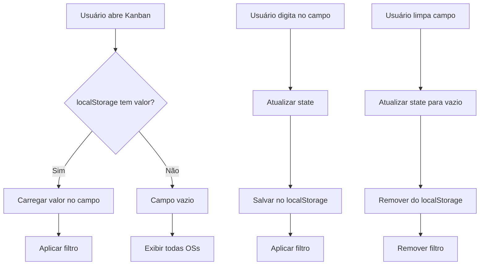

# Cacheamento de Filtro de Busca no Workflow Kanban

## 📋 Resumo

Implementado sistema de cacheamento do filtro de busca por OS no Workflow Kanban usando `localStorage`. O valor digitado no campo de busca é automaticamente salvo e restaurado quando o usuário retorna à página.

## ✅ Implementação

### **Arquivo:** `src/components/workflow/KanbanBoard.tsx`

#### **Alterações Realizadas:**

1. **Import do useEffect**
```typescript
import React, { useState, useMemo, useEffect } from 'react';
```

2. **Constante para chave do cache**
```typescript
const KANBAN_CACHE_KEY = 'kanban-order-search-filter';
```

3. **Carregar filtro salvo ao montar o componente**
```typescript
useEffect(() => {
  const cachedSearch = localStorage.getItem(KANBAN_CACHE_KEY);
  if (cachedSearch) {
    setOrderSearch(cachedSearch);
  }
}, []);
```

4. **Salvar filtro quando o usuário digitar**
```typescript
useEffect(() => {
  if (orderSearch) {
    localStorage.setItem(KANBAN_CACHE_KEY, orderSearch);
  } else {
    localStorage.removeItem(KANBAN_CACHE_KEY);
  }
}, [orderSearch]);
```

## 🎯 Funcionalidade

### **Comportamento:**

1. **Ao abrir a página pela primeira vez:**
   - Campo de busca vazio
   - Nenhum filtro aplicado

2. **Ao digitar no campo de busca:**
   - Valor é salvo automaticamente no `localStorage`
   - Filtro é aplicado imediatamente no Kanban

3. **Ao sair da página e retornar:**
   - Valor digitado anteriormente é restaurado
   - Filtro é aplicado automaticamente
   - OSs são filtradas conforme o valor salvo

4. **Ao limpar o campo (clicar no X):**
   - Valor é removido do `localStorage`
   - Filtro é removido
   - Todas as OSs são exibidas

## 💾 Estrutura do localStorage

### **Chave:**
```
kanban-order-search-filter
```

### **Valor:**
```
String contendo o número/texto da OS buscada
```

### **Exemplos:**

```javascript
// Usuário buscou pela OS "OS-001"
localStorage.getItem('kanban-order-search-filter')
// Retorna: "OS-001"

// Campo limpo
localStorage.getItem('kanban-order-search-filter')
// Retorna: null
```

## 🔄 Fluxo de Dados



## 🎨 Experiência do Usuário

### **Cenário 1: Busca Recorrente**
```
1. Usuário busca "OS-2025-001"
2. Navega para outra página
3. Retorna ao Kanban
4. ✅ Campo já está preenchido com "OS-2025-001"
5. ✅ OSs já estão filtradas
```

### **Cenário 2: Múltiplas Sessões**
```
1. Usuário busca "OS-2025-002"
2. Fecha o navegador
3. Abre o sistema novamente no dia seguinte
4. Navega para o Kanban
5. ✅ Campo ainda está com "OS-2025-002"
6. ✅ Filtro persiste entre sessões
```

### **Cenário 3: Limpar Filtro**
```
1. Usuário tem "OS-2025-003" filtrado
2. Clica no botão X para limpar
3. ✅ Campo é limpo
4. ✅ Todas as OSs aparecem
5. ✅ Cache é removido
6. Ao retornar, campo estará vazio
```

## 🔧 Manutenção

### **Limpar Cache Manualmente (Console do Navegador):**

```javascript
// Limpar apenas o filtro do Kanban
localStorage.removeItem('kanban-order-search-filter');

// Verificar valor atual
console.log(localStorage.getItem('kanban-order-search-filter'));
```

### **Depuração:**

```javascript
// Ver todos os itens do localStorage
console.table(Object.entries(localStorage));

// Monitorar mudanças
const originalSetItem = localStorage.setItem;
localStorage.setItem = function(key, value) {
  console.log(`localStorage.setItem('${key}', '${value}')`);
  originalSetItem.apply(this, arguments);
};
```

## 📊 Performance

- **Impacto:** Mínimo (operações síncronas do localStorage são rápidas)
- **Tamanho:** < 50 bytes (apenas texto da busca)
- **Leitura:** 1x ao montar o componente
- **Escrita:** 1x a cada mudança no campo (debounce natural do React state)

## 🔐 Privacidade

- ✅ Dados armazenados apenas localmente no navegador
- ✅ Não enviados para servidor
- ✅ Específicos por domínio/usuário
- ✅ Removidos ao limpar dados do navegador

## 🧪 Testes

### **Manual:**

1. Abrir Workflow Kanban
2. Digitar "OS-001" no campo de busca
3. Atualizar página (F5)
4. ✓ Verificar se "OS-001" ainda está no campo
5. Limpar o campo
6. Atualizar página (F5)
7. ✓ Verificar se campo está vazio

### **Edge Cases:**

- ✅ Campo vazio → não salva
- ✅ Valor null/undefined → não quebra
- ✅ localStorage desabilitado → funciona sem cache (sem erro)
- ✅ Múltiplas abas → cada aba tem seu state, mas compartilham cache

## 🚀 Melhorias Futuras

1. **Debounce na escrita:**
   - Evitar salvar a cada tecla digitada
   - Salvar apenas após 300ms de inatividade

2. **Cache de filtros de componentes:**
   - Aplicar mesma lógica para `selectedComponents`

3. **Limpar cache antigo:**
   - Adicionar timestamp ao cache
   - Limpar automaticamente após X dias

4. **Sincronização entre abas:**
   - Usar `storage` event para sincronizar
   - Atualizar filtro quando outra aba modificar

## 📝 Notas Técnicas

- **Compatibilidade:** Funciona em todos os navegadores modernos
- **Fallback:** Se localStorage não disponível, funciona sem cache
- **Isolamento:** Chave única evita conflitos com outros componentes
- **Limpeza:** Cache é removido automaticamente quando campo está vazio

