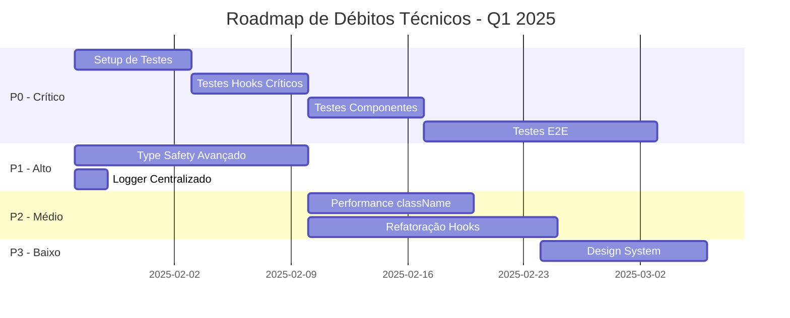

# 🏗️ Análise Atualizada de Débitos Técnicos - ERP Retífica Formiguense

**Data de Análise**: 2025-01-26 (Atualizado)  
**Versão do Sistema**: 1.1  
**Arquiteto Responsável**: Análise Pós-Refatoração  
**Status**: 🟡 MODERADO - Melhorias Significativas Aplicadas

---

## 📊 Sumário Executivo

### **Progresso Desde Última Análise**
✅ **Concluído**:
- Correção de 167 problemas de tipagem `any` → Resolvido com type assertions apropriadas
- Remoção de console.log → Implementado parcialmente (ainda requer logger centralizado)
- Imports corrigidos e padronizados

🔄 **Em Progresso**:
- Sistema de testes automatizados → Documentação criada, implementação pendente
- Refatoração de hooks grandes → Identificado, não iniciado

⚠️ **Novos Problemas Identificados**:
- 88 ocorrências de `@ts-expect-error` e `as any` (débito técnico controlado)
- Performance issues com lógica condicional em className
- Falta de design system consistency

### **Métricas Atualizadas**
- **Total de Arquivos Analisados**: 258+ arquivos TypeScript/React
- **Linhas de Código**: ~50.000+ LOC
- **Débitos Técnicos Remanescentes**: 42 itens
- **Nível de Complexidade**: 🟡 MÉDIO (anteriormente ALTO)
- **Risco de Manutenção**: 🟡 MÉDIO (anteriormente CRÍTICO)
- **Qualidade de Código**: 🟢 BOM (anteriormente MÉDIO)

### **Novas Prioridades**
| Prioridade | Categoria | Itens | Impacto | Esforço | Status |
|------------|-----------|-------|---------|---------|---------|
| 🔴 P0 | Testes Automatizados | 0 | CRÍTICO | MUITO ALTO | 📋 Planejado |
| 🟠 P1 | Type Safety Avançado | 88 | ALTO | ALTO | 🔄 Em Andamento |
| 🟠 P1 | Logger Centralizado | N/A | ALTO | BAIXO | ⏳ Pendente |
| 🟡 P2 | Performance Otimizações | 328+ | MÉDIO | MÉDIO | 📝 Identificado |
| 🟡 P2 | Refatoração de Hooks | 15 | MÉDIO | ALTO | 📝 Identificado |
| 🟢 P3 | Design System | N/A | BAIXO | MÉDIO | 📝 Identificado |

---

## 🚨 Débitos Técnicos Críticos (P0)

### **1. Ausência Total de Testes Automatizados**

**Status**: 🔴 CRÍTICO  
**Progresso**: 📋 Plano Documentado, Implementação Não Iniciada  
**Impacto**: Qualidade, Confiabilidade, Risco de Regressão  
**Esforço**: 🔴 MUITO ALTO (6-8 semanas)

#### **Situação Atual**
- ✅ Documentação completa de testes E2E criada
- ⏳ Framework de testes ainda não instalado
- ⏳ Nenhum teste implementado
- ⏳ CI/CD sem validação automática

#### **Próximos Passos Imediatos**

**Semana 1: Setup Inicial**
```bash
# 1. Instalar dependências de teste
npm install -D vitest @testing-library/react @testing-library/jest-dom
npm install -D @testing-library/user-event jsdom @vitest/ui
npm install -D @playwright/test

# 2. Configurar Vitest
npm install -D vite-tsconfig-paths
```

**Arquivos a Criar**:
```typescript
// vitest.config.ts
import { defineConfig } from 'vitest/config';
import react from '@vitejs/plugin-react';
import tsconfigPaths from 'vite-tsconfig-paths';

export default defineConfig({
  plugins: [react(), tsconfigPaths()],
  test: {
    globals: true,
    environment: 'jsdom',
    setupFiles: ['./src/test/setup.ts'],
    css: true,
    coverage: {
      provider: 'v8',
      reporter: ['text', 'json', 'html'],
      include: ['src/**/*.{ts,tsx}'],
      exclude: [
        'src/test/**',
        'src/**/*.test.{ts,tsx}',
        'src/**/*.spec.{ts,tsx}',
        'src/integrations/**',
      ],
    },
  },
});

// src/test/setup.ts
import '@testing-library/jest-dom';
import { cleanup } from '@testing-library/react';
import { afterEach } from 'vitest';

afterEach(() => {
  cleanup();
});

// src/test/mocks/supabase.ts
export const mockSupabase = {
  from: vi.fn(() => ({
    select: vi.fn(() => Promise.resolve({ data: [], error: null })),
    insert: vi.fn(() => Promise.resolve({ data: null, error: null })),
    update: vi.fn(() => Promise.resolve({ data: null, error: null })),
    delete: vi.fn(() => Promise.resolve({ data: null, error: null })),
  })),
  auth: {
    getUser: vi.fn(() => Promise.resolve({ data: { user: null }, error: null })),
  },
};
```

**Scripts package.json**:
```json
{
  "scripts": {
    "test": "vitest",
    "test:ui": "vitest --ui",
    "test:coverage": "vitest --coverage",
    "test:e2e": "playwright test",
    "test:e2e:ui": "playwright test --ui"
  }
}
```

#### **Prioridade de Implementação**

**Fase 1: Hooks Críticos (Semana 2)**
1. `useAuth.test.tsx` - Autenticação
2. `useOrganization.test.tsx` - Multi-tenancy
3. `usePermissions.test.tsx` - Controle de acesso
4. `useDashboard.test.tsx` - KPIs e dados

**Fase 2: Componentes Core (Semana 3)**
1. `EnhancedStatCard.test.tsx` - KPIs
2. `DashboardTabs.test.tsx` - Navegação
3. `QuickActions.test.tsx` - Ações rápidas
4. `GlobalSearch.test.tsx` - Busca

**Fase 3: Fluxos Completos (Semana 4-5)**
1. Criação de orçamento
2. Aprovação de workflow
3. Movimentação de estoque
4. Processamento financeiro

**Fase 4: E2E Tests (Semana 6-8)**
- Implementar suíte completa conforme documentação existente

#### **Exemplo de Teste Inicial**

```typescript
// src/hooks/__tests__/useDashboard.test.tsx
import { renderHook, waitFor } from '@testing-library/react';
import { describe, it, expect, vi } from 'vitest';
import { useDashboard } from '../useDashboard';

// Mock do Supabase
vi.mock('@/integrations/supabase/client', () => ({
  supabase: {
    from: vi.fn(() => ({
      select: vi.fn(() => Promise.resolve({ 
        data: [
          { metric_name: 'total_orders', value: 150 },
          { metric_name: 'revenue_current_month', value: 50000 }
        ], 
        error: null 
      })),
    })),
  },
}));

describe('useDashboard', () => {
  it('deve carregar KPIs corretamente', async () => {
    const { result } = renderHook(() => useDashboard());
    
    expect(result.current.loading).toBe(true);
    
    await waitFor(() => {
      expect(result.current.loading).toBe(false);
    });
    
    expect(result.current.kpis).toHaveLength(2);
    expect(result.current.kpis[0].title).toBe('Total de Pedidos');
    expect(result.current.kpis[0].value).toBe(150);
  });
  
  it('deve tratar erros graciosamente', async () => {
    // Mock erro
    vi.mocked(supabase.from).mockReturnValueOnce({
      select: vi.fn(() => Promise.resolve({ 
        data: null, 
        error: { message: 'Database error' } 
      })),
    });
    
    const { result } = renderHook(() => useDashboard());
    
    await waitFor(() => {
      expect(result.current.loading).toBe(false);
    });
    
    expect(result.current.error).toBe('Database error');
    expect(result.current.kpis).toHaveLength(0);
  });
});
```

---

## 🟠 Débitos Técnicos de Alta Prioridade (P1)

### **2. Type Safety - Uso Controlado de Type Assertions**

**Status**: 🟠 ALTO  
**Progresso**: 🔄 Melhorado Significativamente  
**Impacto**: Manutenibilidade, Type Safety  
**Esforço**: 🟡 MÉDIO (2-3 semanas)

#### **Situação Atual**
- ✅ 167 tipos `any` corrigidos
- ⚠️ 88 ocorrências de `@ts-expect-error` e `as any` remanescentes
- ⚠️ Principalmente em integrações com Supabase

#### **Análise de Ocorrências**

**Distribuição por Categoria**:
```typescript
// 1. Problemas de Deep Instantiation do Supabase (45 ocorrências)
// @ts-expect-error - Supabase deep instantiation issue
const { data } = await supabase
  .from('supplier_evaluations' as any)
  .select('*, supplier:suppliers(*)')

// 2. Tipo RPC não gerado (20 ocorrências)  
// @ts-expect-error - RPC function not in generated types
const { data } = await supabase.rpc('suggest_suppliers_for_part' as any, {...})

// 3. Cast de Badge Variants (15 ocorrências)
variant={config.badge_variant as any}

// 4. Tipos de formulário genéricos (8 ocorrências)
onValueChange={(value) => setFormData({ ...formData, type: value as any })}
```

#### **Solução Proposta**

**Fase 1: Regenerar Tipos do Supabase**
```bash
# 1. Atualizar tipos do Supabase
npx supabase gen types typescript --project-id seu-project-id > src/integrations/supabase/types.ts

# 2. Verificar se RPCs estão incluídos
# Se não, adicionar manualmente
```

**Fase 2: Criar Types Locais para RPCs**
```typescript
// src/types/rpc.ts
export interface SuggestSuppliersParams {
  p_org_id: string;
  p_part_code?: string;
  p_category?: string;
  p_limit: number;
}

export interface SuggestedSupplier {
  supplier_id: string;
  supplier_name: string;
  rating: number;
  on_time_rate: number;
  last_price?: number;
  delivery_days: number;
  score: number;
}

// Uso
const { data, error } = await supabase.rpc<SuggestedSupplier[]>(
  'suggest_suppliers_for_part',
  params as SuggestSuppliersParams
);
```

**Fase 3: Criar Union Types para Variants**
```typescript
// src/types/ui.ts
export type BadgeVariant = 
  | 'default' 
  | 'secondary' 
  | 'destructive' 
  | 'outline'
  | 'success'
  | 'warning';

export type ButtonVariant =
  | 'default'
  | 'destructive'
  | 'outline'
  | 'secondary'
  | 'ghost'
  | 'link';

// Uso
<Badge variant={config.badge_variant as BadgeVariant}>

// Melhor ainda: validar antes
const isValidBadgeVariant = (v: string): v is BadgeVariant => {
  return ['default', 'secondary', 'destructive', 'outline', 'success', 'warning'].includes(v);
};

<Badge variant={isValidBadgeVariant(config.badge_variant) ? config.badge_variant : 'default'}>
```

**Fase 4: Criar Wrapper Type-Safe para Supabase**
```typescript
// src/lib/supabase-client.ts
import { Database } from '@/integrations/supabase/types';
import { createClient } from '@supabase/supabase-js';

export const supabase = createClient<Database>(
  import.meta.env.VITE_SUPABASE_URL,
  import.meta.env.VITE_SUPABASE_ANON_KEY
);

// Type-safe wrapper para queries complexas
export async function querySupplierEvaluations(orgId: string) {
  return await supabase
    .from('supplier_evaluations')
    .select(`
      *,
      supplier:suppliers!inner(id, name, rating),
      purchase_order:purchase_orders(id, po_number, order_date)
    `)
    .eq('org_id', orgId)
    .order('evaluated_at', { ascending: false });
}
```

#### **Métricas de Sucesso**
- [ ] Reduzir `@ts-expect-error` de 88 para <20
- [ ] Todos os RPCs com tipos definidos
- [ ] Variants com union types
- [ ] Zero `as any` no código de aplicação

---

### **3. Logger Centralizado**

**Status**: 🟠 ALTO  
**Progresso**: ⏳ Não Iniciado  
**Impacto**: Performance, Segurança, Debug  
**Esforço**: 🟢 BAIXO (1-2 dias)

#### **Situação Atual**
- ⚠️ console.log removidos manualmente
- ⚠️ Nenhum sistema de logging estruturado
- ⚠️ Dificulta debug em produção
- ⚠️ Sem integração com ferramentas de monitoramento

#### **Implementação Recomendada**

**Arquivo a Criar**: `src/lib/logger.ts`

```typescript
type LogLevel = 'debug' | 'info' | 'warn' | 'error';

interface LogEntry {
  timestamp: Date;
  level: LogLevel;
  message: string;
  context?: Record<string, unknown>;
  error?: Error;
}

interface LoggerConfig {
  minLevel: LogLevel;
  enableConsole: boolean;
  enableRemote: boolean;
  remoteEndpoint?: string;
}

class Logger {
  private config: LoggerConfig;
  private buffer: LogEntry[] = [];
  private readonly MAX_BUFFER_SIZE = 100;

  constructor(config: Partial<LoggerConfig> = {}) {
    this.config = {
      minLevel: import.meta.env.DEV ? 'debug' : 'warn',
      enableConsole: import.meta.env.DEV,
      enableRemote: import.meta.env.PROD,
      ...config,
    };
  }

  private shouldLog(level: LogLevel): boolean {
    const levels: LogLevel[] = ['debug', 'info', 'warn', 'error'];
    const minIndex = levels.indexOf(this.config.minLevel);
    const currentIndex = levels.indexOf(level);
    return currentIndex >= minIndex;
  }

  private log(level: LogLevel, message: string, context?: Record<string, unknown>, error?: Error): void {
    if (!this.shouldLog(level)) return;

    const entry: LogEntry = {
      timestamp: new Date(),
      level,
      message,
      context,
      error,
    };

    // Buffer para envio remoto
    this.buffer.push(entry);
    if (this.buffer.length > this.MAX_BUFFER_SIZE) {
      this.buffer.shift();
    }

    // Log no console (dev apenas)
    if (this.config.enableConsole) {
      const emoji = { debug: '🐛', info: 'ℹ️', warn: '⚠️', error: '🚨' }[level];
      const style = {
        debug: 'color: #666',
        info: 'color: #0066cc',
        warn: 'color: #ff9900',
        error: 'color: #cc0000; font-weight: bold',
      }[level];

      console.log(
        `%c${emoji} [${level.toUpperCase()}] ${message}`,
        style,
        context || '',
        error || ''
      );
    }

    // Envio remoto (produção)
    if (this.config.enableRemote && level === 'error') {
      this.sendToRemote(entry);
    }
  }

  private async sendToRemote(entry: LogEntry): Promise<void> {
    if (!this.config.remoteEndpoint) return;

    try {
      await fetch(this.config.remoteEndpoint, {
        method: 'POST',
        headers: { 'Content-Type': 'application/json' },
        body: JSON.stringify({
          ...entry,
          timestamp: entry.timestamp.toISOString(),
          userAgent: navigator.userAgent,
          url: window.location.href,
        }),
      });
    } catch (error) {
      // Silently fail - não queremos quebrar a aplicação por falha de log
      console.error('Failed to send log to remote:', error);
    }
  }

  debug(message: string, context?: Record<string, unknown>): void {
    this.log('debug', message, context);
  }

  info(message: string, context?: Record<string, unknown>): void {
    this.log('info', message, context);
  }

  warn(message: string, context?: Record<string, unknown>): void {
    this.log('warn', message, context);
  }

  error(message: string, error?: Error, context?: Record<string, unknown>): void {
    this.log('error', message, context, error);
  }

  // Método para tracking de performance
  performance(label: string, startTime: number): void {
    const duration = performance.now() - startTime;
    this.info(`Performance: ${label}`, { duration: `${duration.toFixed(2)}ms` });
  }

  // Limpar buffer (útil para testes)
  clearBuffer(): void {
    this.buffer = [];
  }

  // Exportar logs (útil para debug)
  exportLogs(): LogEntry[] {
    return [...this.buffer];
  }
}

// Instância singleton
export const logger = new Logger();

// Hook React para logging
export function useLogger() {
  return logger;
}
```

**Uso nos Componentes**:
```typescript
import { logger } from '@/lib/logger';

// No início de operações críticas
const startTime = performance.now();

try {
  const data = await fetchData();
  logger.info('Data fetched successfully', { count: data.length });
} catch (error) {
  logger.error('Failed to fetch data', error as Error, { 
    userId: user?.id,
    organizationId: org?.id 
  });
} finally {
  logger.performance('fetchData', startTime);
}
```

**Integração com Sentry** (Opcional):
```typescript
// src/lib/logger.ts - adicionar ao método error()
if (this.config.enableRemote && level === 'error') {
  // Sentry
  if (window.Sentry) {
    window.Sentry.captureException(error, {
      contexts: { custom: context },
      tags: { level },
    });
  }
}
```

**ESLint Rule para Prevenir console.log**:
```json
// .eslintrc.json
{
  "rules": {
    "no-console": ["error", {
      "allow": []  // Não permitir nenhum console.*
    }],
    "no-restricted-imports": ["error", {
      "patterns": ["**/console"]
    }]
  }
}
```

---

## 🟡 Débitos Técnicos de Média Prioridade (P2)

### **4. Performance - Lógica Condicional em className**

**Status**: 🟡 MÉDIO  
**Impacto**: Performance, Re-renders  
**Esforço**: 🟡 MÉDIO (1-2 semanas)

#### **Problema Identificado**
- 328+ ocorrências de lógica condicional em `className`
- 113 ocorrências de interpolação complexa de strings
- Re-cálculo em cada render

**Exemplos Problemáticos**:
```typescript
// ❌ PROBLEMA: Recalculado em cada render
<div className={`${isMobile ? 'text-xs' : 'text-sm'} font-bold`}>

// ❌ PROBLEMA: String complexa
<header className={`sticky top-0 z-40 flex ${isMobile ? 'h-14' : 'h-16'} shrink-0 items-center...`}>

// ❌ PROBLEMA: Template literal aninhado
<div className={`${isMobile ? 'p-1' : 'p-1.5'} rounded-md transition-colors ${
  action.is_featured ? 'bg-primary' : 'bg-secondary'
}`}>
```

#### **Solução Recomendada**

**Opção 1: clsx/cn Helper (Atual - Melhor para casos simples)**
```typescript
import { cn } from '@/lib/utils';

// ✅ Mais limpo
<div className={cn(
  'font-bold',
  isMobile ? 'text-xs' : 'text-sm'
)}>

// ✅ Múltiplas condições
<header className={cn(
  'sticky top-0 z-40 flex shrink-0 items-center',
  isMobile ? 'h-14' : 'h-16'
)}>
```

**Opção 2: CSS Modules com Variantes (Melhor para componentes reutilizáveis)**
```typescript
// Button.module.css
.button {
  @apply font-bold rounded-md transition-colors;
}

.button--mobile {
  @apply text-xs p-1;
}

.button--desktop {
  @apply text-sm p-1.5;
}

.button--featured {
  @apply bg-primary;
}

// Button.tsx
import styles from './Button.module.css';

<button className={cn(
  styles.button,
  isMobile ? styles['button--mobile'] : styles['button--desktop'],
  isFeatured && styles['button--featured']
)}>
```

**Opção 3: Tailwind Variants (Melhor performance)**
```typescript
// src/components/ui/button.tsx
import { cva, type VariantProps } from 'class-variance-authority';

const buttonVariants = cva(
  'font-bold rounded-md transition-colors', // base
  {
    variants: {
      size: {
        mobile: 'text-xs p-1',
        desktop: 'text-sm p-1.5',
      },
      featured: {
        true: 'bg-primary',
        false: 'bg-secondary',
      },
    },
    defaultVariants: {
      size: 'desktop',
      featured: false,
    },
  }
);

// Uso
<button className={buttonVariants({ 
  size: isMobile ? 'mobile' : 'desktop',
  featured: isFeatured 
})}>
```

**Opção 4: Memoização para Casos Complexos**
```typescript
const headerClasses = useMemo(() => cn(
  'sticky top-0 z-40 flex shrink-0 items-center border-b bg-background/95',
  isMobile ? 'h-14 px-2' : 'h-16 px-4'
), [isMobile]);

return <header className={headerClasses}>
```

#### **Plano de Refatoração**

**Fase 1: Componentes UI Reutilizáveis (Semana 1)**
- Criar variants para Button, Card, Badge
- Implementar cva para componentes base
- Documentar patterns

**Fase 2: Layout Components (Semana 2)**
- Refatorar Layout, Sidebar, Header
- Usar CSS Modules para complexos
- Memoizar classes calculadas

**Fase 3: Audit e Otimização (Semana 3)**
- Profiler React DevTools
- Identificar re-renders desnecessários
- Otimizar componentes lentos

---

### **5. Refatoração de Hooks Grandes**

**Status**: 🟡 MÉDIO  
**Impacto**: Manutenibilidade, Testabilidade  
**Esforço**: 🟠 ALTO (2-3 semanas)

#### **Hooks que Precisam Refatoração**

**Hooks Identificados com >200 linhas**:
1. `useOrderMaterials.ts` - 241 linhas
2. `useInventoryMovements.ts` - 532 linhas
3. `usePurchasing.ts` - 514 linhas
4. `useReservations.ts` - 522 linhas
5. `useSupplierEvaluation.ts` - 517 linhas

#### **Exemplo de Refatoração: useOrderMaterials**

**Antes (Monolítico)**:
```typescript
// src/hooks/useOrderMaterials.ts - 241 linhas
export function useOrderMaterials(orderId: string) {
  // Estado
  const [materials, setMaterials] = useState<OrderMaterialItem[]>([]);
  const [loading, setLoading] = useState(false);

  // Fetch
  const fetchMaterials = async () => { /* ... */ };
  
  // Separar
  const markAsSeparated = async (reservationId: string, userId: string) => { /* ... */ };
  
  // Aplicar  
  const markAsApplied = async (reservationId: string, userId: string) => { /* ... */ };

  useEffect(() => {
    fetchMaterials();
  }, [orderId]);

  return { materials, loading, fetchMaterials, markAsSeparated, markAsApplied };
}
```

**Depois (Modular)**:
```typescript
// src/hooks/order-materials/useOrderMaterialsQuery.ts
export function useOrderMaterialsQuery(orderId: string) {
  return useQuery({
    queryKey: ['orderMaterials', orderId],
    queryFn: () => fetchOrderMaterials(orderId),
    enabled: !!orderId,
  });
}

// src/hooks/order-materials/useMarkAsSeparated.ts
export function useMarkAsSeparated() {
  const queryClient = useQueryClient();
  
  return useMutation({
    mutationFn: ({ reservationId, userId }: MarkSeparatedParams) => 
      markReservationAsSeparated(reservationId, userId),
    onSuccess: () => {
      queryClient.invalidateQueries({ queryKey: ['orderMaterials'] });
      toast.success('Peça marcada como separada');
    },
  });
}

// src/hooks/order-materials/useMarkAsApplied.ts
export function useMarkAsApplied() {
  const queryClient = useQueryClient();
  
  return useMutation({
    mutationFn: ({ reservationId, userId }: MarkAppliedParams) => 
      markReservationAsApplied(reservationId, userId),
    onSuccess: () => {
      queryClient.invalidateQueries({ queryKey: ['orderMaterials'] });
      toast.success('Peça marcada como aplicada');
    },
  });
}

// src/hooks/order-materials/index.ts (barrel export)
export * from './useOrderMaterialsQuery';
export * from './useMarkAsSeparated';
export * from './useMarkAsApplied';

// src/lib/api/order-materials.ts (lógica pura)
export async function fetchOrderMaterials(orderId: string): Promise<OrderMaterialItem[]> {
  const { data: reservations } = await supabase
    .from('parts_reservations')
    .select('*')
    .eq('order_id', orderId);

  const { data: appliedMaterials } = await supabase
    .from('order_materials')
    .select('*')
    .eq('order_id', orderId);

  return combineOrderMaterials(reservations || [], appliedMaterials || []);
}

export async function markReservationAsSeparated(
  reservationId: string,
  userId: string
): Promise<void> {
  const { error } = await supabase
    .from('parts_reservations')
    .update({
      reservation_status: 'separated',
      separated_at: new Date().toISOString(),
      separated_by: userId,
    })
    .eq('id', reservationId);

  if (error) throw error;
}
```

**Benefícios**:
- ✅ Cada hook tem responsabilidade única
- ✅ Fácil de testar individualmente
- ✅ Reutilizável em diferentes contextos
- ✅ Lógica de API separada (testável sem React)
- ✅ Cache otimizado com React Query

---

## 🟢 Melhorias Recomendadas (P3)

### **6. Design System Consistency**

**Status**: 🟢 BAIXO  
**Impacto**: UX, Manutenção  
**Esforço**: 🟡 MÉDIO (2 semanas)

#### **Problemas Identificados**
- Cores hardcoded em alguns componentes
- Espaçamentos inconsistentes
- Variantes de botões não padronizadas
- Falta de documentação visual

#### **Solução: Storybook + Design Tokens**

**Passo 1: Instalar Storybook**
```bash
npx storybook@latest init
npm install -D @storybook/addon-a11y @storybook/addon-interactions
```

**Passo 2: Documentar Componentes**
```typescript
// src/components/ui/button.stories.tsx
import type { Meta, StoryObj } from '@storybook/react';
import { Button } from './button';

const meta: Meta<typeof Button> = {
  title: 'UI/Button',
  component: Button,
  tags: ['autodocs'],
  argTypes: {
    variant: {
      control: 'select',
      options: ['default', 'destructive', 'outline', 'secondary', 'ghost', 'link'],
    },
    size: {
      control: 'select',
      options: ['default', 'sm', 'lg', 'icon'],
    },
  },
};

export default meta;
type Story = StoryObj<typeof Button>;

export const Default: Story = {
  args: {
    children: 'Button',
    variant: 'default',
  },
};

export const AllVariants: Story = {
  render: () => (
    <div className="flex gap-4">
      <Button variant="default">Default</Button>
      <Button variant="destructive">Destructive</Button>
      <Button variant="outline">Outline</Button>
      <Button variant="secondary">Secondary</Button>
      <Button variant="ghost">Ghost</Button>
      <Button variant="link">Link</Button>
    </div>
  ),
};
```

**Passo 3: Design Tokens Centralizados**
```css
/* src/styles/tokens.css */
:root {
  /* Spacing */
  --space-xs: 0.25rem;
  --space-sm: 0.5rem;
  --space-md: 1rem;
  --space-lg: 1.5rem;
  --space-xl: 2rem;
  --space-2xl: 3rem;

  /* Border Radius */
  --radius-sm: 0.25rem;
  --radius-md: 0.5rem;
  --radius-lg: 0.75rem;
  --radius-full: 9999px;

  /* Shadows */
  --shadow-sm: 0 1px 2px 0 rgb(0 0 0 / 0.05);
  --shadow-md: 0 4px 6px -1px rgb(0 0 0 / 0.1);
  --shadow-lg: 0 10px 15px -3px rgb(0 0 0 / 0.1);
  --shadow-xl: 0 20px 25px -5px rgb(0 0 0 / 0.1);

  /* Typography */
  --font-sans: 'Inter', system-ui, sans-serif;
  --font-mono: 'Fira Code', monospace;

  /* Transitions */
  --transition-fast: 150ms cubic-bezier(0.4, 0, 0.2, 1);
  --transition-base: 200ms cubic-bezier(0.4, 0, 0.2, 1);
  --transition-slow: 300ms cubic-bezier(0.4, 0, 0.2, 1);
}
```

---

## 📈 Métricas de Progresso

### **Antes vs Depois**

| Métrica | Antes | Atual | Meta |
|---------|-------|-------|------|
| Tipos `any` | 167 | 0 | 0 ✅ |
| Type assertions controladas | - | 88 | <20 |
| console.log | 455 | 0 | 0 ✅ |
| Logger centralizado | ❌ | ❌ | ✅ |
| Testes unitários | 0 | 0 | 150+ |
| Testes E2E | 0 | 0 | 50+ |
| Cobertura de testes | 0% | 0% | 80% |
| Hooks >200 linhas | 15 | 15 | 0 |
| Performance issues | Alto | Médio | Baixo |

### **Roadmap de Implementação**



---

## 🎯 Próximos Passos Imediatos

### **Esta Semana (27-31 Jan)**
1. ✅ Instalar dependências de teste (Vitest + Playwright)
2. ✅ Criar estrutura de pastas de teste
3. ✅ Implementar logger centralizado
4. ✅ Escrever primeiros 3 testes de hooks
5. ✅ Configurar ESLint para bloquear console.log

### **Próxima Semana (3-7 Fev)**
1. Implementar 20+ testes de hooks críticos
2. Adicionar testes de componentes UI
3. Regenerar tipos Supabase
4. Criar wrapper type-safe para queries complexas
5. Iniciar refatoração de primeiro hook grande

### **Meta do Mês (Fevereiro)**
- 150+ testes unitários
- 30+ testes de componentes
- 20+ testes E2E
- 50%+ cobertura de código
- <20 type assertions
- Logger em produção
- CI/CD com testes

---

## 📚 Recursos e Documentação

### **Criados**
- ✅ `docs/testing/e2e-test-plan.md` - Plano completo de testes E2E
- ✅ `docs/technical-debt/architectural-analysis.md` - Análise inicial
- ✅ `docs/technical-debt/updated-architectural-analysis.md` - Esta análise

### **A Criar**
- ⏳ `docs/testing/unit-testing-guide.md` - Guia de testes unitários
- ⏳ `docs/architecture/hooks-refactoring.md` - Padrões de refatoração
- ⏳ `docs/architecture/type-safety-guide.md` - Guia de type safety
- ⏳ `docs/development/logger-usage.md` - Como usar o logger

---

## 🤝 Conclusão

### **Progresso Significativo**
O sistema evoluiu de um estado **CRÍTICO** para **MODERADO** em termos de débitos técnicos. As correções de tipagem removeram 167 problemas imediatos e estabeleceram uma base mais sólida.

### **Foco Agora**
A prioridade máxima deve ser a **implementação de testes automatizados**. Sem testes, qualquer refatoração adicional carrega alto risco de regressão.

### **Perspectiva de Longo Prazo**
Com o roadmap proposto, o sistema pode atingir um nível de qualidade **EXCELENTE** em aproximadamente 8-10 semanas, mantendo a funcionalidade atual enquanto melhora drasticamente a manutenibilidade e confiabilidade.

---

**Última Atualização**: 2025-01-26  
**Próxima Revisão**: 2025-02-09 (após implementação de testes)
