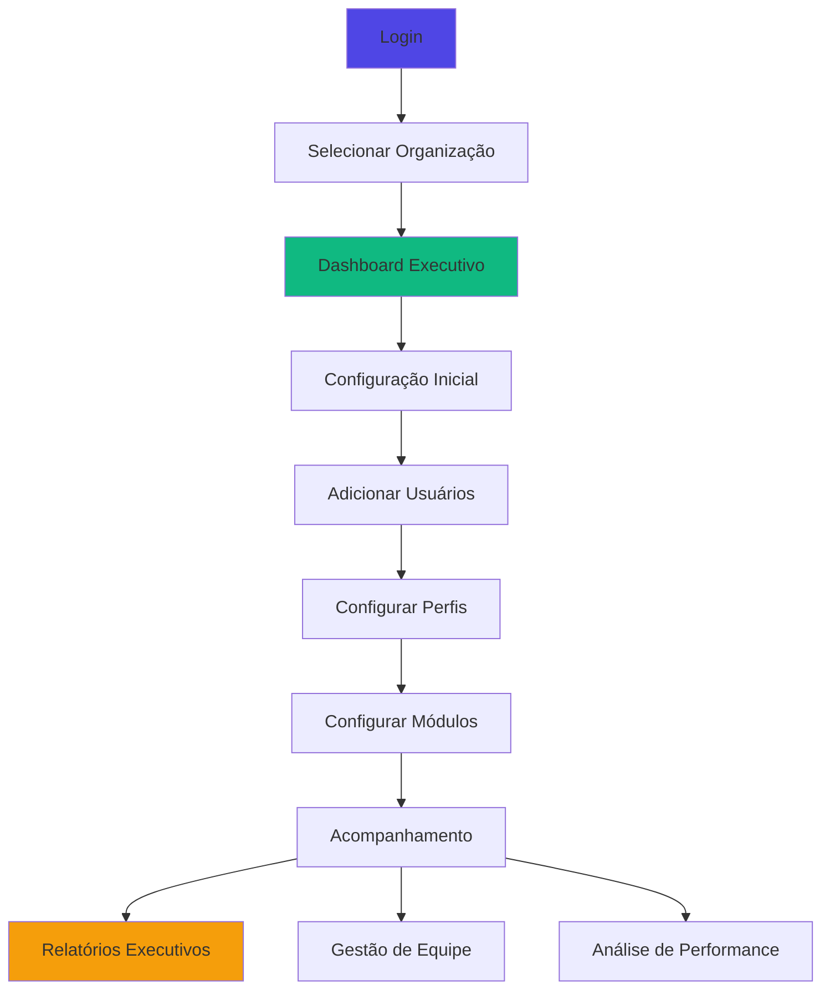
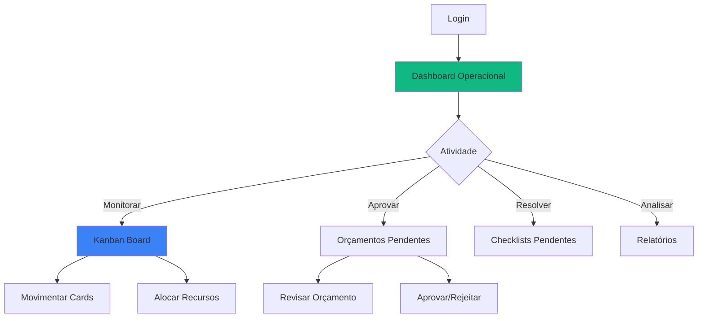
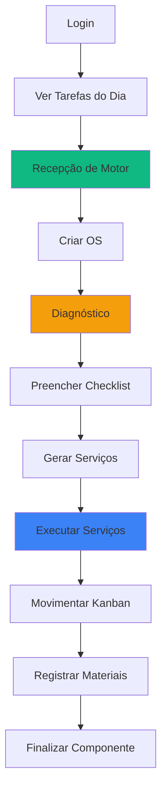
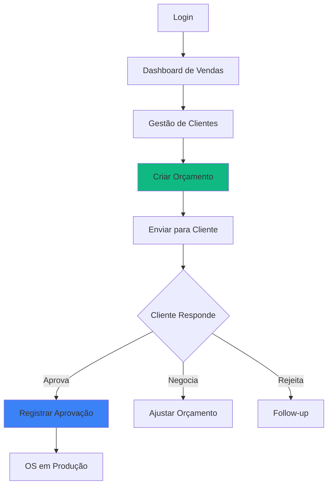
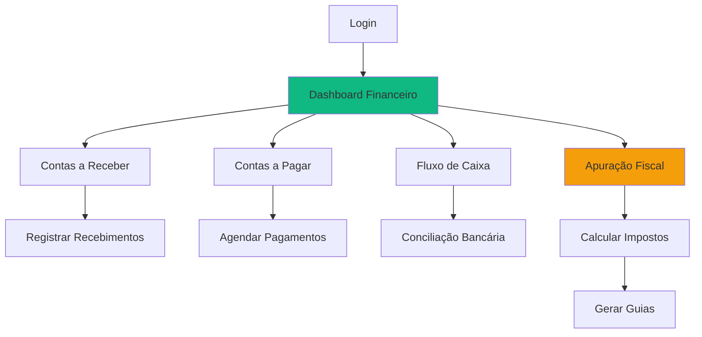

# 🗺️ Jornadas Completas de Usuários - ERP Retífica

## 📋 Índice
- [Administrador/Owner](#administradorowner)
- [Gerente de Operações](#gerente-de-operações)
- [Técnico/Operador](#técnicooperador)
- [Consultor/Vendedor](#consultorvendedor)
- [Financeiro/Contador](#financeirocontador)

---

## 👑 Administrador/Owner

### Jornada Completa

### 1. Login e Configuração Inicial
**Ações**: Login → Seleção de org → Dashboard → Configurações  
**Tempo médio**: 15 minutos (primeiro acesso)

### 2. Gestão de Usuários
**Menu**: Configurações > Gestão de Usuários  
**Ações possíveis**:
- Adicionar usuários
- Definir perfis
- Desativar usuários
- Resetar senhas

### 3. Configuração de Módulos
**Menu**: Configurações > Configurações de Operações/Fiscal/Financeiro  
**Configure**: Workflows, impostos, planos de conta

### 4. Relatórios Executivos
**Acesso diário**: Dashboard com KPIs consolidados  
**Relatórios**: DRE, Fluxo de Caixa, Performance Operacional

---

## 🏭 Gerente de Operações

### Jornada Completa

### Ações Principais
1. **Monitorar Workflow** (50% do tempo)
2. **Aprovar Orçamentos** (20% do tempo)
3. **Resolver Bloqueios** (15% do tempo)
4. **Relatórios** (15% do tempo)

---

## 🔧 Técnico/Operador

### Jornada Completa

### Ciclo Diário Típico
**8h-9h**: Recepção de motores  
**9h-12h**: Diagnósticos  
**13h-17h**: Execução de serviços  
**17h-18h**: Registro de materiais

---

## 💼 Consultor/Vendedor

### Jornada Completa

### KPIs Monitorados
- Taxa de conversão
- Ticket médio
- Orçamentos pendentes
- Tempo de resposta

---

## 💰 Financeiro/Contador

### Jornada Completa

### Rotinas Mensais
**Dia 5**: Fechamento do mês anterior  
**Dia 10**: Apuração fiscal  
**Dia 15**: Pagamento de impostos  
**Dia 20**: Geração de DRE  
**Dia 25**: Conciliação bancária

---

**Última Atualização**: 2025-01-14
