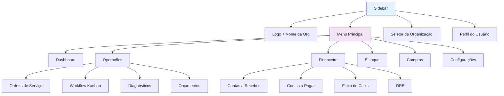
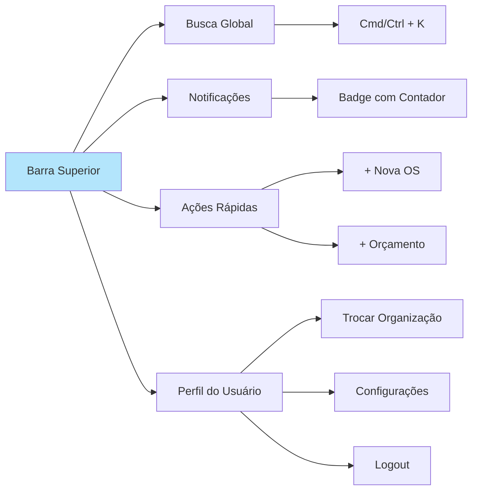

# 🖥️ Guia de Interface - ERP Retífica

## 🎯 Visão Geral

Este guia apresenta um tour completo pela interface do ERP Retífica, explicando cada componente, funcionalidade e atalho disponível.

---

## 🧭 Navegação Principal

### Sidebar (Menu Lateral)



#### Estrutura do Menu
- **Dashboard**: Página inicial com KPIs e visão geral
- **Operações**:
  - Ordens de Serviço (OS)
  - Workflow Kanban
  - Diagnósticos
  - Orçamentos
  - Clientes
- **Módulo Fiscal**:
  - Configurações Fiscais
  - Apuração Mensal
  - Relatórios Fiscais
  - SPED
- **Financeiro**:
  - Contas a Receber
  - Contas a Pagar
  - Fluxo de Caixa
  - DRE
- **Estoque**:
  - Peças
  - Movimentações
  - Inventário
  - Relatórios
- **Compras**:
  - Necessidades de Compra
  - Cotações
  - Pedidos de Compra
  - Fornecedores
- **Relatórios**:
  - Operacionais
  - Financeiros
  - Gerenciais
  - Customizados
- **Configurações**:
  - Usuários e Perfis
  - Setores
  - Workflow
  - Sistema
  - Integrações

#### Estado do Menu
- **Expandido** (padrão desktop): Mostra ícones + texto
- **Retraído** (mobile ou clique no botão): Apenas ícones
- **Item ativo**: Destacado com cor de fundo
- **Submenus**: Abrem ao clicar no item pai

### Navegação por Breadcrumbs
```
Home > Operações > Ordens de Serviço > OS-20250114-0001
```
- Clique em qualquer nível para navegar de volta
- Mostra o caminho atual na aplicação

### Tabs (Abas)
Algumas páginas têm navegação por tabs:
- **Dashboard**: Dashboard | Performance | Gamificação | Compras
- **Ordem de Serviço**: Detalhes | Materiais | Fotos | Timeline | Garantia
- **Relatórios**: Geral | Por Período | Por Cliente | Customizado

---

## 🔝 Barra Superior



### 1. Busca Global (🔍)
**Atalho**: `Cmd+K` (Mac) ou `Ctrl+K` (Windows/Linux)

**Busca em**:
- Ordens de Serviço (por número, cliente, motor)
- Clientes (por nome, CPF/CNPJ, telefone)
- Peças (por código, nome, fabricante)
- Orçamentos (por número, cliente)
- Fornecedores (por nome, CNPJ)

**Como usar**:
1. Digite para buscar
2. Use `↑` `↓` para navegar pelos resultados
3. `Enter` para abrir
4. `Esc` para fechar

**Filtros rápidos**:
- `os:` - Buscar apenas Ordens de Serviço
- `cliente:` - Buscar apenas Clientes
- `peca:` - Buscar apenas Peças

### 2. Central de Notificações (🔔)
**Badge**: Mostra quantidade de notificações não lidas

**Tipos de notificações**:
- 🔴 **Críticas**: Orçamento aprovado, pagamento vencido
- 🟡 **Importantes**: OS pronta, estoque baixo
- 🔵 **Informativas**: Comentário adicionado, relatório gerado

**Ações**:
- Clique em uma notificação para ver detalhes
- Clique no ícone de ✓ para marcar como lida
- Botão "Marcar todas como lidas"
- Filtros: Não lidas | Todas | Por tipo

### 3. Ações Rápidas (⚡)
**Botões de acesso rápido**:
- **+ Nova OS**: Criar Ordem de Serviço
- **+ Orçamento**: Criar Orçamento
- **+ Cliente**: Cadastrar Cliente
- **+ Peça**: Cadastrar Peça no Estoque

### 4. Perfil do Usuário (👤)
**Dropdown com**:
- Nome do usuário
- Perfil atual (Admin, Manager, etc.)
- **Trocar Organização** (se tiver acesso a múltiplas)
- **Minhas Configurações**
- **Tema** (Claro/Escuro)
- **Ajuda**
- **Logout**

---

## 📊 Componentes Principais

### 1. Cards de Estatísticas (KPIs)
```
┌─────────────────────────┐
│ 📈 Ordens em Andamento  │
│                         │
│         42              │
│    ↑ 15% vs. mês ant.   │
└─────────────────────────┘
```

**Elementos**:
- Ícone temático
- Título do KPI
- Valor principal (grande)
- Comparação (vs. período anterior)
- Cor de fundo (temática)

**Interação**:
- Clique para ver detalhes (drill-down)
- Hover mostra tooltip com info adicional

### 2. Tabelas de Dados
```
┌─────────────────────────────────────────────────────┐
│ [Buscar...] [Filtros ▼] [Exportar ▼]     [+ Novo]  │
├─────────────────────────────────────────────────────┤
│ ☐ | Número    | Cliente       | Status    | Ações  │
│ ☐ | OS-001    | João Silva    | Em Prod.  | [...]  │
│ ☐ | OS-002    | Maria Santos  | Pronto    | [...]  │
├─────────────────────────────────────────────────────┤
│ 1 2 3 ... 10 [>]          Mostrando 1-10 de 243    │
└─────────────────────────────────────────────────────┘
```

**Funcionalidades**:
- **Busca**: Campo de busca rápida
- **Filtros**: Dropdown com filtros avançados
- **Ordenação**: Clique no cabeçalho da coluna
- **Seleção múltipla**: Checkbox para ações em lote
- **Ações**: Menu [...] com opções (editar, deletar, etc.)
- **Paginação**: Navegação por páginas
- **Exportar**: PDF, Excel, CSV

**Atalhos**:
- `Space` ou `Enter`: Abrir item selecionado
- `Cmd+A`: Selecionar todos
- `Delete`: Deletar selecionados (com confirmação)

### 3. Formulários
```
┌─────────────────────────────────┐
│ Nova Ordem de Serviço           │
├─────────────────────────────────┤
│ Cliente *                       │
│ [Selecione ou crie novo...   ▼]│
│                                 │
│ Tipo de Motor *                 │
│ ○ Diesel 4 cil.                 │
│ ○ Diesel 6 cil.                 │
│ ● Gasolina 4 cil.               │
│                                 │
│ Sintomas                        │
│ [________________________]      │
│                                 │
│ [Cancelar]      [Salvar Ordem] │
└─────────────────────────────────┘
```

**Elementos**:
- **Campos obrigatórios**: Marcados com `*`
- **Validação em tempo real**: Erro mostrado embaixo do campo
- **Autocomplete**: Sugestões ao digitar
- **Tooltips**: Ícone `ℹ️` com ajuda
- **Campos condicionais**: Aparecem conforme outras seleções

**Navegação**:
- `Tab`: Próximo campo
- `Shift+Tab`: Campo anterior
- `Cmd+Enter`: Salvar formulário

### 4. Modais (Janelas de Diálogo)
```
┌─────────────────────────────────────────┐
│ Aprovar Orçamento               [X]     │
├─────────────────────────────────────────┤
│ Você está aprovando o orçamento         │
│ ORC-20250114-0001 no valor de           │
│ R$ 7.500,00.                            │
│                                         │
│ Método de aprovação:                    │
│ ○ WhatsApp                              │
│ ● Email                                 │
│ ○ Presencial/Assinatura                │
│                                         │
│ Anexar comprovante:                     │
│ [Escolher arquivo...]                   │
│                                         │
│ [Cancelar]              [Confirmar]     │
└─────────────────────────────────────────┘
```

**Características**:
- Fundo escurecido (overlay)
- Foco automático no modal
- `Esc`: Fechar modal
- Clique fora: Fechar modal (com confirmação se houver alterações)

### 5. Dropdown/Select
```
[Selecione...                         ▼]
┌─────────────────────────────────────┐
│ [Buscar...]                         │
├─────────────────────────────────────┤
│ ✓ João Silva - CPF: 123.456.789-00 │
│   Maria Santos - CPF: 987.654.321-00│
│   Pedro Oliveira - (11) 99999-9999  │
├─────────────────────────────────────┤
│ + Criar novo cliente                │
└─────────────────────────────────────┘
```

**Funcionalidades**:
- Busca integrada
- Múltipla seleção (quando aplicável)
- Opção de criar novo item
- Keyboard navigation (`↑` `↓` `Enter`)

### 6. Toast Notifications (Notificações Temporárias)
```
┌────────────────────────────────┐
│ ✅ Ordem de Serviço criada     │
│    OS-20250114-0001            │
│                           [X]  │
└────────────────────────────────┘
```

**Tipos**:
- ✅ **Sucesso** (verde): Ação completada
- ℹ️ **Info** (azul): Informação geral
- ⚠️ **Aviso** (amarelo): Atenção necessária
- ❌ **Erro** (vermelho): Falha na ação

**Duração**: 3-5 segundos (auto-dismiss)

**Posição**: Canto superior direito

---

## 🎨 Sistema de Temas

### Tema Claro (Light Mode)
- **Fundo**: Branco (#FFFFFF)
- **Texto**: Cinza escuro (#1A1A1A)
- **Sidebar**: Cinza claro (#F5F5F5)
- **Primário**: Azul (#3B82F6)
- **Sucesso**: Verde (#10B981)
- **Erro**: Vermelho (#EF4444)

### Tema Escuro (Dark Mode)
- **Fundo**: Cinza muito escuro (#0F172A)
- **Texto**: Branco (#FFFFFF)
- **Sidebar**: Cinza escuro (#1E293B)
- **Primário**: Azul claro (#60A5FA)
- **Sucesso**: Verde claro (#34D399)
- **Erro**: Vermelho claro (#F87171)

**Alternar tema**:
- Perfil do Usuário > Tema > Claro/Escuro
- Sistema detecta preferência do SO automaticamente

---

## 📱 Responsividade

### Desktop (> 1024px)
- Sidebar sempre visível
- Tabelas com todas as colunas
- Gráficos lado a lado
- Modais centralizados

### Tablet (768px - 1024px)
- Sidebar retrátil (apenas ícones)
- Tabelas com scroll horizontal
- Gráficos empilhados
- Cards em 2 colunas

### Mobile (< 768px)
- Sidebar como drawer (menu hambúrguer)
- Tabelas como cards
- Formulários de coluna única
- Navegação inferior (bottom navigation)
- Botões de ação flutuantes (FAB)

---

## ⌨️ Atalhos de Teclado

### Globais
- `Cmd/Ctrl + K`: Busca global
- `Cmd/Ctrl + /`: Mostrar todos os atalhos
- `Esc`: Fechar modal/dropdown/busca
- `Cmd/Ctrl + S`: Salvar (em formulários)

### Navegação
- `G + D`: Ir para Dashboard
- `G + O`: Ir para Ordens de Serviço
- `G + K`: Ir para Workflow Kanban
- `G + E`: Ir para Estoque
- `G + C`: Ir para Compras
- `G + F`: Ir para Financeiro

### Ações Rápidas
- `N`: Nova Ordem de Serviço
- `O`: Novo Orçamento
- `C`: Novo Cliente
- `P`: Nova Peça

### Tabelas
- `↑` `↓`: Navegar entre linhas
- `Space` ou `Enter`: Abrir item
- `Cmd/Ctrl + A`: Selecionar todos
- `/`: Focar no campo de busca

### Formulários
- `Tab`: Próximo campo
- `Shift + Tab`: Campo anterior
- `Cmd/Ctrl + Enter`: Salvar
- `Esc`: Cancelar

---

## ♿ Acessibilidade

### Navegação por Teclado
- Todos os elementos interativos são acessíveis via `Tab`
- Ordem lógica de foco
- Indicadores visuais de foco

### Leitores de Tela
- Labels descritivas em todos os campos
- ARIA labels em ícones e botões
- Anúncios de mudanças de estado
- Navegação por landmarks (header, main, aside, footer)

### Contraste
- WCAG 2.1 AA compliant
- Contraste mínimo de 4.5:1 para texto
- Contraste mínimo de 3:1 para elementos UI

### Tamanho de Fonte
- Possibilidade de aumentar fonte (Cmd/Ctrl + +)
- Mínimo de 16px para corpo de texto
- Elementos clicáveis com mínimo de 44x44px

---

## 🎥 Animações e Transições

### Transições de Página
- **Tipo**: Fade + Slide
- **Duração**: 300ms
- **Easing**: cubic-bezier(0.4, 0, 0.2, 1)

### Loading States
- **Skeleton screens**: Para tabelas e cards
- **Spinners**: Para botões e ações
- **Progress bars**: Para uploads/downloads

### Feedback Visual
- **Hover**: Mudança sutil de cor/elevação
- **Active**: Feedback imediato ao clicar
- **Success**: Animação de check ✓
- **Error**: Shake animation + cor vermelha

---

## 🔧 Dicas de Uso

### Para Iniciantes
1. Comece pelo **Dashboard** para ter visão geral
2. Use a **Busca Global** (`Cmd+K`) para encontrar rapidamente
3. Explore os **tooltips** (ícone ℹ️) para entender cada campo
4. Utilize as **Ações Rápidas** para tarefas comuns

### Para Usuários Avançados
1. Memorize os **atalhos de teclado** para agilizar
2. Customize o **Dashboard** com KPIs relevantes para você
3. Use **filtros salvos** em tabelas para consultas recorrentes
4. Configure **notificações personalizadas** para seus interesses

### Para Administradores
1. Configure **perfis customizados** para sua equipe
2. Personalize o **workflow** conforme seu processo
3. Integre com **sistemas externos** via API
4. Monitore **logs de auditoria** para segurança

---

## 📞 Suporte

**Em caso de dúvidas sobre a interface**:
- Acesse: **Perfil > Ajuda**
- Email: suporte@erpretifica.com.br
- Chat: Disponível no canto inferior direito
- WhatsApp: (11) 99999-9999

---

**Última Atualização**: 2025-01-14  
**Versão**: 1.0.0
