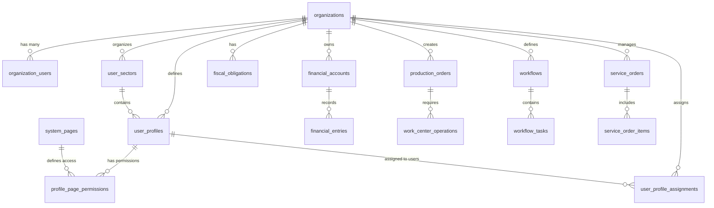

# Esquema do Banco de Dados

## Visão Geral

O banco de dados do ERP Retífica é estruturado em PostgreSQL com Row Level Security (RLS) para isolamento multitenancy. O esquema é organizado em módulos funcionais com relacionamentos bem definidos.

## Tabelas Principais

### 🏢 **Organizações e Usuários**

#### `organizations`
Tabela principal de organizações/empresas.

```sql
CREATE TABLE organizations (
  id UUID PRIMARY KEY DEFAULT gen_random_uuid(),
  name TEXT NOT NULL,
  slug TEXT UNIQUE NOT NULL,
  description TEXT,
  document TEXT, -- CNPJ
  settings JSONB DEFAULT '{}',
  created_at TIMESTAMPTZ DEFAULT NOW(),
  updated_at TIMESTAMPTZ DEFAULT NOW(),
  created_by UUID REFERENCES auth.users(id) NOT NULL
);
```

#### `organization_users`
Relacionamento usuários x organizações com roles.

```sql
CREATE TABLE organization_users (
  id UUID PRIMARY KEY DEFAULT gen_random_uuid(),
  organization_id UUID NOT NULL REFERENCES organizations(id) ON DELETE CASCADE,
  user_id UUID NOT NULL REFERENCES auth.users(id) ON DELETE CASCADE,
  role public.app_role NOT NULL DEFAULT 'user',
  invited_at TIMESTAMPTZ DEFAULT NOW(),
  joined_at TIMESTAMPTZ,
  invited_by UUID REFERENCES auth.users(id),
  is_active BOOLEAN DEFAULT TRUE,
  created_at TIMESTAMPTZ DEFAULT NOW(),
  updated_at TIMESTAMPTZ DEFAULT NOW(),
  UNIQUE(organization_id, user_id)
);
```

### 👥 **Sistema de Perfis de Usuário**

#### `user_sectors`
Setores organizacionais para agrupamento de perfis.

```sql
CREATE TABLE user_sectors (
  id UUID PRIMARY KEY DEFAULT gen_random_uuid(),
  name TEXT NOT NULL,
  color TEXT DEFAULT '#6b7280',
  org_id UUID NOT NULL REFERENCES organizations(id) ON DELETE CASCADE,
  is_active BOOLEAN DEFAULT TRUE,
  created_at TIMESTAMPTZ DEFAULT NOW(),
  updated_at TIMESTAMPTZ DEFAULT NOW(),
  
  -- Constraints de validação
  CONSTRAINT check_sector_name_not_empty CHECK (name IS NOT NULL AND name <> ''),
  CONSTRAINT check_sector_name_length CHECK (LENGTH(name) >= 2 AND LENGTH(name) <= 100),
  CONSTRAINT unique_sector_name_per_org UNIQUE (name, org_id)
);
```

#### `user_profiles`
Perfis de usuário com permissões específicas.

```sql
CREATE TABLE user_profiles (
  id UUID PRIMARY KEY DEFAULT gen_random_uuid(),
  name TEXT NOT NULL,
  description TEXT,
  sector_id UUID NOT NULL REFERENCES user_sectors(id) ON DELETE CASCADE,
  org_id UUID NOT NULL REFERENCES organizations(id) ON DELETE CASCADE,
  is_active BOOLEAN DEFAULT TRUE,
  created_at TIMESTAMPTZ DEFAULT NOW(),
  updated_at TIMESTAMPTZ DEFAULT NOW(),
  
  -- Constraints de validação
  CONSTRAINT check_profile_name_not_empty CHECK (name IS NOT NULL AND name <> ''),
  CONSTRAINT check_profile_name_length CHECK (LENGTH(name) >= 2 AND LENGTH(name) <= 100),
  CONSTRAINT unique_profile_name_per_org UNIQUE (name, org_id)
);
```

#### `system_pages`
Cadastro centralizado de páginas/rotas do sistema.

```sql
CREATE TABLE system_pages (
  id UUID PRIMARY KEY DEFAULT gen_random_uuid(),
  name TEXT NOT NULL UNIQUE,
  display_name TEXT NOT NULL,
  route_path TEXT NOT NULL UNIQUE,
  description TEXT,
  module_name TEXT,
  is_active BOOLEAN DEFAULT TRUE,
  created_at TIMESTAMPTZ DEFAULT NOW()
);
```

#### `profile_page_permissions`
Permissões granulares por página para cada perfil.

```sql
CREATE TABLE profile_page_permissions (
  id UUID PRIMARY KEY DEFAULT gen_random_uuid(),
  profile_id UUID NOT NULL REFERENCES user_profiles(id) ON DELETE CASCADE,
  page_id UUID NOT NULL REFERENCES system_pages(id) ON DELETE CASCADE,
  can_view BOOLEAN DEFAULT FALSE,
  can_edit BOOLEAN DEFAULT FALSE,
  can_delete BOOLEAN DEFAULT FALSE,
  created_at TIMESTAMPTZ DEFAULT NOW(),
  updated_at TIMESTAMPTZ DEFAULT NOW(),
  
  -- Constraint de unicidade
  CONSTRAINT unique_profile_page UNIQUE (profile_id, page_id)
);
```

#### `user_profile_assignments`
Atribuição de perfis a usuários.

```sql
CREATE TABLE user_profile_assignments (
  id UUID PRIMARY KEY DEFAULT gen_random_uuid(),
  user_id UUID NOT NULL REFERENCES auth.users(id) ON DELETE CASCADE,
  profile_id UUID NOT NULL REFERENCES user_profiles(id) ON DELETE CASCADE,
  org_id UUID NOT NULL REFERENCES organizations(id) ON DELETE CASCADE,
  is_active BOOLEAN DEFAULT TRUE,
  assigned_at TIMESTAMPTZ DEFAULT NOW(),
  assigned_by UUID REFERENCES auth.users(id),
  
  -- Constraint: um usuário pode ter apenas um perfil ativo por organização
  CONSTRAINT unique_user_profile_per_org UNIQUE (user_id, org_id)
);
```

### 💰 **Módulo Financeiro**

#### `financial_accounts`
Plano de contas contábil.

```sql
CREATE TABLE financial_accounts (
  id UUID PRIMARY KEY DEFAULT gen_random_uuid(),
  org_id UUID REFERENCES organizations(id) NOT NULL,
  code TEXT NOT NULL,
  name TEXT NOT NULL,
  account_type TEXT NOT NULL, -- 'asset', 'liability', 'equity', 'revenue', 'expense'
  parent_id UUID REFERENCES financial_accounts(id),
  is_active BOOLEAN DEFAULT TRUE,
  created_at TIMESTAMPTZ DEFAULT NOW()
);
```

#### `financial_entries`
Lançamentos contábeis (partidas dobradas).

```sql
CREATE TABLE financial_entries (
  id UUID PRIMARY KEY DEFAULT gen_random_uuid(),
  org_id UUID REFERENCES organizations(id) NOT NULL,
  account_id UUID REFERENCES financial_accounts(id) NOT NULL,
  reference_type TEXT, -- 'invoice', 'payment', 'manual'
  reference_id UUID,
  description TEXT NOT NULL,
  debit_amount DECIMAL(15,2) DEFAULT 0,
  credit_amount DECIMAL(15,2) DEFAULT 0,
  entry_date DATE NOT NULL,
  created_at TIMESTAMPTZ DEFAULT NOW()
);
```

### 📊 **Módulo Fiscal**

#### `tax_regimes`
Regimes tributários (Simples, Lucro Real, etc.).

```sql
CREATE TABLE tax_regimes (
  id UUID PRIMARY KEY DEFAULT gen_random_uuid(),
  org_id UUID REFERENCES organizations(id) NOT NULL,
  name TEXT NOT NULL,
  code TEXT NOT NULL,
  description TEXT,
  is_active BOOLEAN DEFAULT TRUE
);
```

#### `fiscal_obligations`
Obrigações fiscais da empresa.

```sql
CREATE TABLE fiscal_obligations (
  id UUID PRIMARY KEY DEFAULT gen_random_uuid(),
  org_id UUID REFERENCES organizations(id) NOT NULL,
  obligation_kind_id UUID REFERENCES obligation_kinds(id),
  jurisdiction_id UUID REFERENCES jurisdictions(id),
  name TEXT NOT NULL,
  frequency TEXT NOT NULL, -- 'monthly', 'quarterly', 'annual'
  due_day INTEGER,
  is_active BOOLEAN DEFAULT TRUE
);
```

### 🏭 **Módulo PCP (Produção)**

#### `production_orders`
Ordens de produção.

```sql
CREATE TABLE production_orders (
  id UUID PRIMARY KEY DEFAULT gen_random_uuid(),
  org_id UUID REFERENCES organizations(id) NOT NULL,
  order_number TEXT NOT NULL,
  product_id UUID REFERENCES products(id),
  quantity DECIMAL(10,3) NOT NULL,
  status TEXT DEFAULT 'pending', -- 'pending', 'in_progress', 'completed', 'cancelled'
  planned_start_date DATE,
  planned_end_date DATE,
  actual_start_date DATE,
  actual_end_date DATE,
  created_at TIMESTAMPTZ DEFAULT NOW()
);
```

#### `work_centers`
Centros de trabalho/máquinas.

```sql
CREATE TABLE work_centers (
  id UUID PRIMARY KEY DEFAULT gen_random_uuid(),
  org_id UUID REFERENCES organizations(id) NOT NULL,
  name TEXT NOT NULL,
  code TEXT NOT NULL,
  description TEXT,
  hourly_rate DECIMAL(10,2),
  capacity_per_hour DECIMAL(10,3),
  is_active BOOLEAN DEFAULT TRUE
);
```

### 📋 **Módulo Workflow**

#### `workflows`
Definição de workflows.

```sql
CREATE TABLE workflows (
  id UUID PRIMARY KEY DEFAULT gen_random_uuid(),
  org_id UUID REFERENCES organizations(id) NOT NULL,
  name TEXT NOT NULL,
  description TEXT,
  workflow_type TEXT NOT NULL, -- 'kanban', 'linear', 'parallel'
  config JSONB DEFAULT '{}',
  is_active BOOLEAN DEFAULT TRUE
);
```

#### `workflow_tasks`
Tarefas dentro dos workflows.

```sql
CREATE TABLE workflow_tasks (
  id UUID PRIMARY KEY DEFAULT gen_random_uuid(),
  org_id UUID REFERENCES organizations(id) NOT NULL,
  workflow_id UUID REFERENCES workflows(id),
  title TEXT NOT NULL,
  description TEXT,
  status TEXT DEFAULT 'todo', -- 'todo', 'in_progress', 'done'
  assigned_to UUID REFERENCES auth.users(id),
  due_date DATE,
  position INTEGER DEFAULT 0,
  created_at TIMESTAMPTZ DEFAULT NOW()
);
```

### 🔧 **Ordens de Serviço**

#### `service_orders`
Ordens de serviço.

```sql
CREATE TABLE service_orders (
  id UUID PRIMARY KEY DEFAULT gen_random_uuid(),
  org_id UUID REFERENCES organizations(id) NOT NULL,
  order_number TEXT NOT NULL,
  customer_id UUID REFERENCES customers(id),
  vehicle_info JSONB, -- Dados do veículo
  description TEXT NOT NULL,
  status TEXT DEFAULT 'open', -- 'open', 'in_progress', 'completed', 'cancelled'
  priority TEXT DEFAULT 'medium', -- 'low', 'medium', 'high', 'urgent'
  estimated_hours DECIMAL(5,2),
  actual_hours DECIMAL(5,2),
  created_at TIMESTAMPTZ DEFAULT NOW()
);
```

## Relacionamentos Principais

### Diagrama ER Simplificado



## Índices Importantes

### Índices de Performance

```sql
-- Índices para consultas por organização
CREATE INDEX idx_financial_entries_org_date ON financial_entries(org_id, entry_date);
CREATE INDEX idx_production_orders_org_status ON production_orders(org_id, status);
CREATE INDEX idx_workflow_tasks_org_assigned ON workflow_tasks(org_id, assigned_to);

-- Índices para consultas de dashboard
CREATE INDEX idx_service_orders_org_created ON service_orders(org_id, created_at);
CREATE INDEX idx_fiscal_obligations_org_due ON fiscal_obligations(org_id, due_day);

-- Índices para sistema de perfis
CREATE INDEX idx_user_sectors_org_active ON user_sectors(org_id, is_active);
CREATE INDEX idx_user_profiles_org_sector ON user_profiles(org_id, sector_id, is_active);
CREATE INDEX idx_profile_assignments_user_org ON user_profile_assignments(user_id, org_id, is_active);
CREATE INDEX idx_profile_permissions_profile ON profile_page_permissions(profile_id);
CREATE INDEX idx_system_pages_route ON system_pages(route_path, is_active);
```

### Índices para RLS

```sql
-- Todos os índices incluem org_id para otimização de RLS
CREATE INDEX idx_all_tables_org_id ON table_name(org_id);
```

## Políticas RLS

### Template Padrão

```sql
-- Política padrão para todas as tabelas
ALTER TABLE table_name ENABLE ROW LEVEL SECURITY;

CREATE POLICY "org_isolation_select" ON table_name
  FOR SELECT USING (org_id = current_org_id());

CREATE POLICY "org_isolation_insert" ON table_name
  FOR INSERT WITH CHECK (org_id = current_org_id());

CREATE POLICY "org_isolation_update" ON table_name
  FOR UPDATE USING (org_id = current_org_id());

CREATE POLICY "org_isolation_delete" ON table_name
  FOR DELETE USING (org_id = current_org_id());
```

### Políticas Específicas para Sistema de Perfis

```sql
-- Setores: apenas membros da organização podem visualizar
CREATE POLICY "org_members_can_view_sectors" ON user_sectors
  FOR SELECT USING (public.is_org_member(org_id));

-- Apenas admins e owners podem gerenciar setores
CREATE POLICY "admins_can_manage_sectors" ON user_sectors
  FOR ALL USING (
    public.has_org_role(org_id, 'admin') OR 
    public.has_org_role(org_id, 'owner')
  );

-- Perfis: apenas membros da organização podem visualizar
CREATE POLICY "org_members_can_view_profiles" ON user_profiles
  FOR SELECT USING (public.is_org_member(org_id));

-- Apenas admins e owners podem gerenciar perfis
CREATE POLICY "admins_can_manage_profiles" ON user_profiles
  FOR ALL USING (
    public.has_org_role(org_id, 'admin') OR 
    public.has_org_role(org_id, 'owner')
  );

-- Atribuições: usuários podem ver as próprias, admins podem ver todas
CREATE POLICY "users_can_view_assignments" ON user_profile_assignments
  FOR SELECT USING (
    user_id = auth.uid() OR 
    public.has_org_role(org_id, 'admin') OR 
    public.has_org_role(org_id, 'owner')
  );

-- Apenas admins e owners podem atribuir perfis
CREATE POLICY "admins_can_assign_profiles" ON user_profile_assignments
  FOR INSERT WITH CHECK (
    public.has_org_role(org_id, 'admin') OR 
    public.has_org_role(org_id, 'owner')
  );

-- Páginas do sistema: visíveis para todos (dados não sensíveis)
CREATE POLICY "all_can_view_system_pages" ON system_pages
  FOR SELECT USING (true);

-- Permissões de página: visíveis conforme perfil do usuário
CREATE POLICY "users_can_view_relevant_permissions" ON profile_page_permissions
  FOR SELECT USING (
    profile_id IN (
      SELECT profile_id 
      FROM user_profile_assignments 
      WHERE user_id = auth.uid() AND is_active = true
    ) OR
    EXISTS (
      SELECT 1 
      FROM user_profile_assignments upa
      JOIN user_profiles up ON upa.profile_id = up.id
      WHERE upa.user_id = auth.uid() 
      AND upa.is_active = true
      AND (public.has_org_role(up.org_id, 'admin') OR public.has_org_role(up.org_id, 'owner'))
    )
  );
```

## Triggers e Funções

### Funções de Utilidade para RLS

```sql
-- Função para obter organização atual do usuário
CREATE OR REPLACE FUNCTION current_org_id()
RETURNS UUID AS $$
DECLARE
  org_uuid UUID;
BEGIN
  SELECT organization_id INTO org_uuid
  FROM organization_users 
  WHERE user_id = auth.uid()
  AND is_active = TRUE
  LIMIT 1;
  
  RETURN org_uuid;
END;
$$ LANGUAGE plpgsql SECURITY DEFINER;

-- Função para verificar se usuário tem role específico
CREATE OR REPLACE FUNCTION has_org_role(org_uuid UUID, required_role TEXT)
RETURNS BOOLEAN AS $$
DECLARE
  user_role TEXT;
BEGIN
  SELECT role INTO user_role
  FROM organization_users
  WHERE user_id = auth.uid()
  AND organization_id = org_uuid
  AND is_active = TRUE;
  
  -- Owner tem todos os privilégios
  IF user_role = 'owner' THEN
    RETURN TRUE;
  END IF;
  
  -- Verifica role específico
  RETURN user_role = required_role;
END;
$$ LANGUAGE plpgsql SECURITY DEFINER;

-- Função para verificar se é membro da organização
CREATE OR REPLACE FUNCTION is_org_member(org_uuid UUID)
RETURNS BOOLEAN AS $$
BEGIN
  RETURN EXISTS (
    SELECT 1 
    FROM organization_users
    WHERE user_id = auth.uid()
    AND organization_id = org_uuid
    AND is_active = TRUE
  );
END;
$$ LANGUAGE plpgsql SECURITY DEFINER;
```

### Auditoria Automática

```sql
CREATE OR REPLACE FUNCTION audit_trigger()
RETURNS TRIGGER AS $$
BEGIN
  INSERT INTO audit_logs (
    org_id, user_id, action, table_name, 
    record_id, old_data, new_data, ip_address
  ) VALUES (
    COALESCE(NEW.org_id, OLD.org_id),
    auth.uid(),
    TG_OP,
    TG_TABLE_NAME,
    COALESCE(NEW.id, OLD.id),
    CASE WHEN TG_OP = 'DELETE' THEN row_to_json(OLD) ELSE NULL END,
    CASE WHEN TG_OP IN ('INSERT', 'UPDATE') THEN row_to_json(NEW) ELSE NULL END,
    inet_client_addr()
  );
  RETURN COALESCE(NEW, OLD);
END;
$$ LANGUAGE plpgsql SECURITY DEFINER;

-- Aplicar trigger de auditoria em tabelas do sistema de perfis
CREATE TRIGGER audit_user_sectors_trigger
  AFTER INSERT OR UPDATE OR DELETE ON user_sectors
  FOR EACH ROW EXECUTE FUNCTION audit_trigger();

CREATE TRIGGER audit_user_profiles_trigger
  AFTER INSERT OR UPDATE OR DELETE ON user_profiles
  FOR EACH ROW EXECUTE FUNCTION audit_trigger();

CREATE TRIGGER audit_user_profile_assignments_trigger
  AFTER INSERT OR UPDATE OR DELETE ON user_profile_assignments
  FOR EACH ROW EXECUTE FUNCTION audit_trigger();
```

### Timestamps Automáticos

```sql
CREATE OR REPLACE FUNCTION update_updated_at_column()
RETURNS TRIGGER AS $$
BEGIN
  NEW.updated_at = NOW();
  RETURN NEW;
END;
$$ LANGUAGE plpgsql;
```

## Estratégias de Backup

### Backup Completo

```bash
# Backup completo do banco
pg_dump -h hostname -U username -d database_name > full_backup.sql
```

### Backup por Organização

```bash
# Backup de uma organização específica
pg_dump -h hostname -U username -d database_name \
  --where="org_id='org-uuid-here'" > org_backup.sql
```

## Monitoramento e Otimização

### Consultas de Monitoramento

```sql
-- Consultas mais lentas
SELECT query, mean_time, calls 
FROM pg_stat_statements 
ORDER BY mean_time DESC LIMIT 10;

-- Uso de índices
SELECT schemaname, tablename, indexname, idx_scan 
FROM pg_stat_user_indexes 
WHERE idx_scan = 0;
```

### Estatísticas por Organização

```sql
-- Número de registros por organização
SELECT o.name, COUNT(*) as total_records
FROM organizations o
LEFT JOIN financial_entries fe ON o.id = fe.org_id
GROUP BY o.id, o.name
ORDER BY total_records DESC;

-- Estatísticas do sistema de perfis
SELECT 
  o.name as organization,
  COUNT(DISTINCT us.id) as total_sectors,
  COUNT(DISTINCT up.id) as total_profiles,
  COUNT(DISTINCT upa.id) as users_with_profiles,
  COUNT(DISTINCT ou.id) as total_users,
  ROUND(
    (COUNT(DISTINCT upa.id)::DECIMAL / NULLIF(COUNT(DISTINCT ou.id), 0)) * 100, 2
  ) as profile_adoption_rate
FROM organizations o
LEFT JOIN user_sectors us ON o.id = us.org_id AND us.is_active = true
LEFT JOIN user_profiles up ON o.id = up.org_id AND up.is_active = true
LEFT JOIN user_profile_assignments upa ON o.id = upa.org_id AND upa.is_active = true
LEFT JOIN organization_users ou ON o.id = ou.organization_id AND ou.is_active = true
GROUP BY o.id, o.name
ORDER BY profile_adoption_rate DESC;

-- Permissões mais comuns por página
SELECT 
  sp.display_name,
  sp.route_path,
  COUNT(CASE WHEN ppp.can_view THEN 1 END) as profiles_with_view,
  COUNT(CASE WHEN ppp.can_edit THEN 1 END) as profiles_with_edit,
  COUNT(CASE WHEN ppp.can_delete THEN 1 END) as profiles_with_delete,
  COUNT(ppp.id) as total_profile_permissions
FROM system_pages sp
LEFT JOIN profile_page_permissions ppp ON sp.id = ppp.page_id
WHERE sp.is_active = true
GROUP BY sp.id, sp.display_name, sp.route_path
ORDER BY total_profile_permissions DESC;
```