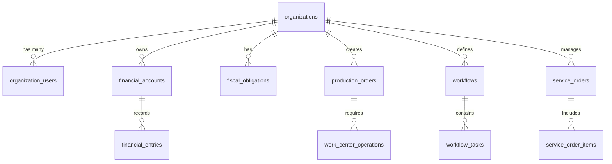

# Esquema do Banco de Dados

## Visão Geral

O banco de dados do ERP Retífica é estruturado em PostgreSQL com Row Level Security (RLS) para isolamento multitenancy. O esquema é organizado em módulos funcionais com relacionamentos bem definidos.

## Tabelas Principais

### 🏢 **Organizações e Usuários**

#### `organizations`
Tabela principal de organizações/empresas.

```sql
CREATE TABLE organizations (
  id UUID PRIMARY KEY DEFAULT gen_random_uuid(),
  name TEXT NOT NULL,
  slug TEXT UNIQUE NOT NULL,
  document TEXT, -- CNPJ
  settings JSONB DEFAULT '{}',
  created_at TIMESTAMPTZ DEFAULT NOW(),
  updated_at TIMESTAMPTZ DEFAULT NOW()
);
```

#### `organization_users`
Relacionamento usuários x organizações com roles.

```sql
CREATE TABLE organization_users (
  id UUID PRIMARY KEY DEFAULT gen_random_uuid(),
  org_id UUID REFERENCES organizations(id) ON DELETE CASCADE,
  user_id UUID REFERENCES auth.users(id) ON DELETE CASCADE,
  role TEXT NOT NULL DEFAULT 'user',
  is_active BOOLEAN DEFAULT TRUE,
  created_at TIMESTAMPTZ DEFAULT NOW(),
  UNIQUE(org_id, user_id)
);
```

### 💰 **Módulo Financeiro**

#### `financial_accounts`
Plano de contas contábil.

```sql
CREATE TABLE financial_accounts (
  id UUID PRIMARY KEY DEFAULT gen_random_uuid(),
  org_id UUID REFERENCES organizations(id) NOT NULL,
  code TEXT NOT NULL,
  name TEXT NOT NULL,
  account_type TEXT NOT NULL, -- 'asset', 'liability', 'equity', 'revenue', 'expense'
  parent_id UUID REFERENCES financial_accounts(id),
  is_active BOOLEAN DEFAULT TRUE,
  created_at TIMESTAMPTZ DEFAULT NOW()
);
```

#### `financial_entries`
Lançamentos contábeis (partidas dobradas).

```sql
CREATE TABLE financial_entries (
  id UUID PRIMARY KEY DEFAULT gen_random_uuid(),
  org_id UUID REFERENCES organizations(id) NOT NULL,
  account_id UUID REFERENCES financial_accounts(id) NOT NULL,
  reference_type TEXT, -- 'invoice', 'payment', 'manual'
  reference_id UUID,
  description TEXT NOT NULL,
  debit_amount DECIMAL(15,2) DEFAULT 0,
  credit_amount DECIMAL(15,2) DEFAULT 0,
  entry_date DATE NOT NULL,
  created_at TIMESTAMPTZ DEFAULT NOW()
);
```

### 📊 **Módulo Fiscal**

#### `tax_regimes`
Regimes tributários (Simples, Lucro Real, etc.).

```sql
CREATE TABLE tax_regimes (
  id UUID PRIMARY KEY DEFAULT gen_random_uuid(),
  org_id UUID REFERENCES organizations(id) NOT NULL,
  name TEXT NOT NULL,
  code TEXT NOT NULL,
  description TEXT,
  is_active BOOLEAN DEFAULT TRUE
);
```

#### `fiscal_obligations`
Obrigações fiscais da empresa.

```sql
CREATE TABLE fiscal_obligations (
  id UUID PRIMARY KEY DEFAULT gen_random_uuid(),
  org_id UUID REFERENCES organizations(id) NOT NULL,
  obligation_kind_id UUID REFERENCES obligation_kinds(id),
  jurisdiction_id UUID REFERENCES jurisdictions(id),
  name TEXT NOT NULL,
  frequency TEXT NOT NULL, -- 'monthly', 'quarterly', 'annual'
  due_day INTEGER,
  is_active BOOLEAN DEFAULT TRUE
);
```

### 🏭 **Módulo PCP (Produção)**

#### `production_orders`
Ordens de produção.

```sql
CREATE TABLE production_orders (
  id UUID PRIMARY KEY DEFAULT gen_random_uuid(),
  org_id UUID REFERENCES organizations(id) NOT NULL,
  order_number TEXT NOT NULL,
  product_id UUID REFERENCES products(id),
  quantity DECIMAL(10,3) NOT NULL,
  status TEXT DEFAULT 'pending', -- 'pending', 'in_progress', 'completed', 'cancelled'
  planned_start_date DATE,
  planned_end_date DATE,
  actual_start_date DATE,
  actual_end_date DATE,
  created_at TIMESTAMPTZ DEFAULT NOW()
);
```

#### `work_centers`
Centros de trabalho/máquinas.

```sql
CREATE TABLE work_centers (
  id UUID PRIMARY KEY DEFAULT gen_random_uuid(),
  org_id UUID REFERENCES organizations(id) NOT NULL,
  name TEXT NOT NULL,
  code TEXT NOT NULL,
  description TEXT,
  hourly_rate DECIMAL(10,2),
  capacity_per_hour DECIMAL(10,3),
  is_active BOOLEAN DEFAULT TRUE
);
```

### 📋 **Módulo Workflow**

#### `workflows`
Definição de workflows.

```sql
CREATE TABLE workflows (
  id UUID PRIMARY KEY DEFAULT gen_random_uuid(),
  org_id UUID REFERENCES organizations(id) NOT NULL,
  name TEXT NOT NULL,
  description TEXT,
  workflow_type TEXT NOT NULL, -- 'kanban', 'linear', 'parallel'
  config JSONB DEFAULT '{}',
  is_active BOOLEAN DEFAULT TRUE
);
```

#### `workflow_tasks`
Tarefas dentro dos workflows.

```sql
CREATE TABLE workflow_tasks (
  id UUID PRIMARY KEY DEFAULT gen_random_uuid(),
  org_id UUID REFERENCES organizations(id) NOT NULL,
  workflow_id UUID REFERENCES workflows(id),
  title TEXT NOT NULL,
  description TEXT,
  status TEXT DEFAULT 'todo', -- 'todo', 'in_progress', 'done'
  assigned_to UUID REFERENCES auth.users(id),
  due_date DATE,
  position INTEGER DEFAULT 0,
  created_at TIMESTAMPTZ DEFAULT NOW()
);
```

### 🔧 **Ordens de Serviço**

#### `service_orders`
Ordens de serviço.

```sql
CREATE TABLE service_orders (
  id UUID PRIMARY KEY DEFAULT gen_random_uuid(),
  org_id UUID REFERENCES organizations(id) NOT NULL,
  order_number TEXT NOT NULL,
  customer_id UUID REFERENCES customers(id),
  vehicle_info JSONB, -- Dados do veículo
  description TEXT NOT NULL,
  status TEXT DEFAULT 'open', -- 'open', 'in_progress', 'completed', 'cancelled'
  priority TEXT DEFAULT 'medium', -- 'low', 'medium', 'high', 'urgent'
  estimated_hours DECIMAL(5,2),
  actual_hours DECIMAL(5,2),
  created_at TIMESTAMPTZ DEFAULT NOW()
);
```

## Relacionamentos Principais

### Diagrama ER Simplificado



## Índices Importantes

### Índices de Performance

```sql
-- Índices para consultas por organização
CREATE INDEX idx_financial_entries_org_date ON financial_entries(org_id, entry_date);
CREATE INDEX idx_production_orders_org_status ON production_orders(org_id, status);
CREATE INDEX idx_workflow_tasks_org_assigned ON workflow_tasks(org_id, assigned_to);

-- Índices para consultas de dashboard
CREATE INDEX idx_service_orders_org_created ON service_orders(org_id, created_at);
CREATE INDEX idx_fiscal_obligations_org_due ON fiscal_obligations(org_id, due_day);
```

### Índices para RLS

```sql
-- Todos os índices incluem org_id para otimização de RLS
CREATE INDEX idx_all_tables_org_id ON table_name(org_id);
```

## Políticas RLS

### Template Padrão

```sql
-- Política padrão para todas as tabelas
ALTER TABLE table_name ENABLE ROW LEVEL SECURITY;

CREATE POLICY "org_isolation_select" ON table_name
  FOR SELECT USING (org_id = current_org_id());

CREATE POLICY "org_isolation_insert" ON table_name
  FOR INSERT WITH CHECK (org_id = current_org_id());

CREATE POLICY "org_isolation_update" ON table_name
  FOR UPDATE USING (org_id = current_org_id());

CREATE POLICY "org_isolation_delete" ON table_name
  FOR DELETE USING (org_id = current_org_id());
```

## Triggers e Funções

### Auditoria Automática

```sql
CREATE OR REPLACE FUNCTION audit_trigger()
RETURNS TRIGGER AS $$
BEGIN
  INSERT INTO audit_logs (
    org_id, user_id, action, table_name, 
    record_id, old_data, new_data
  ) VALUES (
    COALESCE(NEW.org_id, OLD.org_id),
    auth.uid(),
    TG_OP,
    TG_TABLE_NAME,
    COALESCE(NEW.id, OLD.id),
    CASE WHEN TG_OP = 'DELETE' THEN row_to_json(OLD) ELSE NULL END,
    CASE WHEN TG_OP IN ('INSERT', 'UPDATE') THEN row_to_json(NEW) ELSE NULL END
  );
  RETURN COALESCE(NEW, OLD);
END;
$$ LANGUAGE plpgsql SECURITY DEFINER;
```

### Timestamps Automáticos

```sql
CREATE OR REPLACE FUNCTION update_updated_at_column()
RETURNS TRIGGER AS $$
BEGIN
  NEW.updated_at = NOW();
  RETURN NEW;
END;
$$ LANGUAGE plpgsql;
```

## Estratégias de Backup

### Backup Completo

```bash
# Backup completo do banco
pg_dump -h hostname -U username -d database_name > full_backup.sql
```

### Backup por Organização

```bash
# Backup de uma organização específica
pg_dump -h hostname -U username -d database_name \
  --where="org_id='org-uuid-here'" > org_backup.sql
```

## Monitoramento e Otimização

### Consultas de Monitoramento

```sql
-- Consultas mais lentas
SELECT query, mean_time, calls 
FROM pg_stat_statements 
ORDER BY mean_time DESC LIMIT 10;

-- Uso de índices
SELECT schemaname, tablename, indexname, idx_scan 
FROM pg_stat_user_indexes 
WHERE idx_scan = 0;
```

### Estatísticas por Organização

```sql
-- Número de registros por organização
SELECT o.name, COUNT(*) as total_records
FROM organizations o
LEFT JOIN financial_entries fe ON o.id = fe.org_id
GROUP BY o.id, o.name
ORDER BY total_records DESC;
```