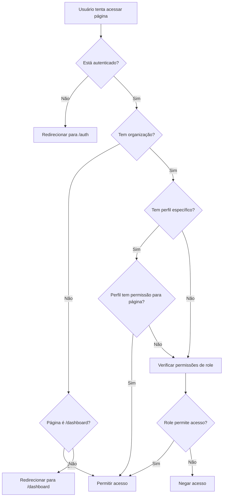

# Sistema de Permissões Baseado em Perfis

## Visão Geral

O ERP Retífica implementa um sistema híbrido de permissões que combina o modelo RBAC (Role-Based Access Control) tradicional com permissões granulares baseadas em perfis de usuário. Este sistema permite maior flexibilidade e controle fino sobre o que cada usuário pode acessar e fazer no sistema.

## Arquitetura do Sistema

### Componentes Principais

1. **Sistema RBAC Tradicional**: Baseado em roles organizacionais (`owner`, `admin`, `manager`, `user`, `viewer`)
2. **Sistema de Perfis**: Permissões específicas por página/funcionalidade
3. **Sistema Híbrido**: Combina ambos os sistemas com fallback inteligente

### Fluxo de Autorização



## Estrutura de Dados

### Tabelas do Sistema de Perfis

#### `user_sectors`
```sql
CREATE TABLE user_sectors (
  id UUID PRIMARY KEY DEFAULT gen_random_uuid(),
  name TEXT NOT NULL,
  color TEXT DEFAULT '#6b7280',
  org_id UUID NOT NULL REFERENCES organizations(id),
  is_active BOOLEAN DEFAULT true,
  created_at TIMESTAMPTZ DEFAULT NOW(),
  updated_at TIMESTAMPTZ DEFAULT NOW(),
  
  -- Constraints
  CONSTRAINT check_sector_name_not_empty CHECK (name IS NOT NULL AND name <> ''),
  CONSTRAINT check_sector_name_length CHECK (LENGTH(name) >= 2 AND LENGTH(name) <= 100),
  CONSTRAINT unique_sector_name_per_org UNIQUE (name, org_id)
);
```

#### `user_profiles`
```sql
CREATE TABLE user_profiles (
  id UUID PRIMARY KEY DEFAULT gen_random_uuid(),
  name TEXT NOT NULL,
  description TEXT,
  sector_id UUID NOT NULL REFERENCES user_sectors(id),
  org_id UUID NOT NULL REFERENCES organizations(id),
  is_active BOOLEAN DEFAULT true,
  created_at TIMESTAMPTZ DEFAULT NOW(),
  updated_at TIMESTAMPTZ DEFAULT NOW(),
  
  -- Constraints
  CONSTRAINT check_profile_name_not_empty CHECK (name IS NOT NULL AND name <> ''),
  CONSTRAINT check_profile_name_length CHECK (LENGTH(name) >= 2 AND LENGTH(name) <= 100),
  CONSTRAINT unique_profile_name_per_org UNIQUE (name, org_id)
);
```

#### `system_pages`
```sql
CREATE TABLE system_pages (
  id UUID PRIMARY KEY DEFAULT gen_random_uuid(),
  name TEXT NOT NULL UNIQUE,
  display_name TEXT NOT NULL,
  route_path TEXT NOT NULL UNIQUE,
  description TEXT,
  module_name TEXT,
  is_active BOOLEAN DEFAULT true,
  created_at TIMESTAMPTZ DEFAULT NOW()
);
```

#### `profile_page_permissions`
```sql
CREATE TABLE profile_page_permissions (
  id UUID PRIMARY KEY DEFAULT gen_random_uuid(),
  profile_id UUID NOT NULL REFERENCES user_profiles(id) ON DELETE CASCADE,
  page_id UUID NOT NULL REFERENCES system_pages(id) ON DELETE CASCADE,
  can_view BOOLEAN DEFAULT false,
  can_edit BOOLEAN DEFAULT false,
  can_delete BOOLEAN DEFAULT false,
  created_at TIMESTAMPTZ DEFAULT NOW(),
  updated_at TIMESTAMPTZ DEFAULT NOW(),
  
  -- Constraints
  CONSTRAINT unique_profile_page UNIQUE (profile_id, page_id)
);
```

#### `user_profile_assignments`
```sql
CREATE TABLE user_profile_assignments (
  id UUID PRIMARY KEY DEFAULT gen_random_uuid(),
  user_id UUID NOT NULL REFERENCES auth.users(id) ON DELETE CASCADE,
  profile_id UUID NOT NULL REFERENCES user_profiles(id) ON DELETE CASCADE,
  org_id UUID NOT NULL REFERENCES organizations(id) ON DELETE CASCADE,
  is_active BOOLEAN DEFAULT true,
  assigned_at TIMESTAMPTZ DEFAULT NOW(),
  assigned_by UUID REFERENCES auth.users(id),
  
  -- Constraints
  CONSTRAINT unique_user_profile_per_org UNIQUE (user_id, org_id)
);
```

## Implementação Frontend

### Hook `useProfilePermissions`

```typescript
export const useProfilePermissions = () => {
  const [userProfile, setUserProfile] = useState<UserProfileData | null>(null);
  const [pagePermissions, setPagePermissions] = useState<PagePermission[]>([]);
  const [loading, setLoading] = useState(true);

  const { currentOrganization } = useOrganization();
  const { user } = useAuth();
  const basePermissions = usePermissions(); // RBAC tradicional

  // Verificar se pode acessar uma página específica
  const canAccessPage = useCallback((routePath: string): boolean => {
    // 1. Verificar autenticação
    if (!user) return false;

    // 2. Permitir dashboard sem organização
    if (!currentOrganization) return routePath === '/dashboard';

    // 3. Verificar permissões específicas do perfil
    if (userProfile && pagePermissions.length > 0) {
      const pagePermission = pagePermissions.find(
        p => p.page?.route_path === routePath && p.page?.is_active
      );
      if (pagePermission) {
        return pagePermission.can_view;
      }
    }

    // 4. Fallback para permissões de role
    const module = PAGE_MODULE_MAPPING[routePath];
    if (module) {
      return basePermissions.canAccessModule(module);
    }

    // 5. Permitir acesso por padrão
    return true;
  }, [user, currentOrganization, userProfile, pagePermissions, basePermissions]);

  return {
    userProfile,
    pagePermissions,
    loading,
    canAccessPage,
    canEditPage,
    canDeletePage,
    // ... outras funções
  };
};
```

### Componente `ProfileProtectedRoute`

```typescript
interface ProfileProtectedRouteProps {
  children: React.ReactNode;
  level?: 'view' | 'edit' | 'delete';
  routePath?: string;
  fallback?: React.ReactNode;
  showErrorPage?: boolean;
}

export const ProfileProtectedRoute: React.FC<ProfileProtectedRouteProps> = ({
  children,
  level = 'view',
  routePath,
  fallback,
  showErrorPage = false
}) => {
  const location = useLocation();
  const permissions = useProfilePermissions();

  const currentPath = routePath || location.pathname;

  // Loading state
  if (permissions.loading) {
    return fallback || <LoadingSpinner />;
  }

  // Not authenticated
  if (!permissions.isAuthenticated) {
    return <Navigate to="/auth" replace />;
  }

  // Check permissions
  let hasPermission = false;
  switch (level) {
    case 'view':
      hasPermission = permissions.canAccessPage(currentPath);
      break;
    case 'edit':
      hasPermission = permissions.canEditPage(currentPath);
      break;
    case 'delete':
      hasPermission = permissions.canDeletePage(currentPath);
      break;
  }

  if (!hasPermission) {
    if (showErrorPage) {
      return <AccessDeniedPage />;
    }
    return <Navigate to="/dashboard" replace />;
  }

  return <>{children}</>;
};
```

## Mapeamento de Páginas para Módulos

```typescript
const PAGE_MODULE_MAPPING: Record<string, ModuleName> = {
  '/dashboard': 'admin',
  '/clientes': 'admin',
  '/consultores': 'admin',
  '/coleta': 'production',
  '/workflow': 'workflow',
  '/checkin': 'production',
  '/estoque': 'inventory',
  '/pcp': 'production',
  '/ordens-servico': 'production',
  '/compras': 'purchasing',
  '/gestao-funcionarios': 'hr',
  '/funcionarios': 'hr',
  '/gestao-usuarios': 'admin',
  '/gestao-usuarios/perfis': 'admin',
  '/orcamentos': 'financial',
  '/relatorios': 'reports',
  '/configuracoes': 'admin',
  '/financeiro': 'financial',
  '/contas-receber': 'financial',
  '/contas-pagar': 'financial',
  '/fluxo-caixa': 'financial',
  '/dre': 'financial',
  '/modulo-fiscal': 'fiscal',
};
```

## Políticas RLS

### Isolamento por Organização

```sql
-- Setores: apenas membros da organização podem ver
CREATE POLICY "org_members_can_view_sectors" ON user_sectors
FOR SELECT
USING (public.is_org_member(org_id));

-- Perfis: apenas membros da organização podem ver
CREATE POLICY "org_members_can_view_profiles" ON user_profiles
FOR SELECT
USING (public.is_org_member(org_id));

-- Atribuições: usuários podem ver suas próprias ou admins podem ver todas
CREATE POLICY "users_can_view_assignments" ON user_profile_assignments
FOR SELECT
USING (
  user_id = auth.uid() OR 
  public.has_org_role(org_id, 'admin') OR 
  public.has_org_role(org_id, 'owner')
);
```

### Gerenciamento de Perfis

```sql
-- Apenas admins e owners podem gerenciar setores
CREATE POLICY "admins_can_manage_sectors" ON user_sectors
FOR ALL
USING (
  public.has_org_role(org_id, 'admin') OR 
  public.has_org_role(org_id, 'owner')
);

-- Apenas admins e owners podem gerenciar perfis
CREATE POLICY "admins_can_manage_profiles" ON user_profiles
FOR ALL
USING (
  public.has_org_role(org_id, 'admin') OR 
  public.has_org_role(org_id, 'owner')
);

-- Apenas admins e owners podem atribuir perfis
CREATE POLICY "admins_can_assign_profiles" ON user_profile_assignments
FOR INSERT
WITH CHECK (
  public.has_org_role(org_id, 'admin') OR 
  public.has_org_role(org_id, 'owner')
);
```

## Interface de Usuário

### Sidebar Dinâmica

```typescript
const AppSidebar = () => {
  const profilePermissions = useProfilePermissions();

  const renderSidebarItem = (item: SidebarItem) => {
    // Verificar se usuário pode acessar esta página
    if (!profilePermissions.canAccessPage(item.url)) {
      return null;
    }

    return (
      <SidebarMenuButton asChild>
        <Link to={item.url}>
          <item.icon />
          <span>{item.title}</span>
        </Link>
      </SidebarMenuButton>
    );
  };

  const renderSidebarGroup = (group: SidebarGroup) => {
    const visibleItems = group.items.filter(item => 
      profilePermissions.canAccessPage(item.url)
    );

    if (visibleItems.length === 0) {
      return null;
    }

    return (
      <SidebarGroup>
        <SidebarGroupLabel>{group.label}</SidebarGroupLabel>
        <SidebarGroupContent>
          <SidebarMenu>
            {visibleItems.map(renderSidebarItem)}
          </SidebarMenu>
        </SidebarGroupContent>
      </SidebarGroup>
    );
  };

  return (
    <Sidebar>
      {sidebarGroups.map(renderSidebarGroup)}
      
      {/* Informações do perfil do usuário */}
      {profilePermissions.userProfile && (
        <SidebarFooter>
          <div className="flex items-center gap-2 p-2">
            <Badge 
              style={{ backgroundColor: profilePermissions.profileSectorColor }}
              className="text-white"
            >
              {profilePermissions.profileSector}
            </Badge>
            <span className="text-sm text-muted-foreground">
              {profilePermissions.profileName}
            </span>
          </div>
        </SidebarFooter>
      )}
    </Sidebar>
  );
};
```

### Gestão de Perfis

```typescript
const GestaoPerfiUsuarios = () => {
  const { sectors, profiles, createSector, createProfile } = useUserProfiles();
  const [newSectorData, setNewSectorData] = useState({ name: '', color: '#6b7280' });
  const [newProfileData, setNewProfileData] = useState({ 
    name: '', 
    description: '', 
    sector_id: '' 
  });

  // Validação frontend
  const [sectorValidationTouched, setSectorValidationTouched] = useState({
    name: false
  });

  const validateSectorName = (name: string) => {
    if (!name.trim()) return 'Nome é obrigatório';
    if (name.length < 2) return 'Nome deve ter pelo menos 2 caracteres';
    if (name.length > 100) return 'Nome deve ter no máximo 100 caracteres';
    return '';
  };

  const handleCreateSector = async () => {
    const nameError = validateSectorName(newSectorData.name);
    if (nameError) {
      toast.error(nameError);
      return;
    }

    try {
      await createSector(newSectorData.name, newSectorData.color);
      toast.success('Setor criado com sucesso!');
      setNewSectorData({ name: '', color: '#6b7280' });
    } catch (error) {
      console.error('Erro ao criar setor:', error);
      toast.error('Erro ao criar setor');
    }
  };

  return (
    <div className="space-y-6">
      {/* Interface para criar setores */}
      <Card>
        <CardHeader>
          <CardTitle>Criar Novo Setor</CardTitle>
        </CardHeader>
        <CardContent>
          <div className="grid grid-cols-1 md:grid-cols-3 gap-4">
            <div>
              <Label htmlFor="sector-name">Nome do Setor</Label>
              <Input
                id="sector-name"
                value={newSectorData.name}
                onChange={(e) => setNewSectorData({...newSectorData, name: e.target.value})}
                onBlur={() => setSectorValidationTouched({...sectorValidationTouched, name: true})}
                className={
                  sectorValidationTouched.name && validateSectorName(newSectorData.name)
                    ? 'border-red-500'
                    : ''
                }
              />
              {sectorValidationTouched.name && validateSectorName(newSectorData.name) && (
                <p className="text-sm text-red-500 mt-1">
                  {validateSectorName(newSectorData.name)}
                </p>
              )}
            </div>
            <div>
              <Label htmlFor="sector-color">Cor</Label>
              <Input
                id="sector-color"
                type="color"
                value={newSectorData.color}
                onChange={(e) => setNewSectorData({...newSectorData, color: e.target.value})}
              />
            </div>
            <div className="flex items-end">
              <Button onClick={handleCreateSector}>
                Criar Setor
              </Button>
            </div>
          </div>
        </CardContent>
      </Card>

      {/* Lista de setores existentes */}
      <Card>
        <CardHeader>
          <CardTitle>Setores Existentes</CardTitle>
        </CardHeader>
        <CardContent>
          <div className="grid grid-cols-1 md:grid-cols-2 lg:grid-cols-3 gap-4">
            {sectors.map((sector) => (
              <div key={sector.id} className="flex items-center gap-2 p-2 border rounded">
                <div 
                  className="w-4 h-4 rounded-full" 
                  style={{ backgroundColor: sector.color }}
                />
                <span>{sector.name}</span>
              </div>
            ))}
          </div>
        </CardContent>
      </Card>
    </div>
  );
};
```

## Validação e Segurança

### Validação Frontend

```typescript
const validateSectorName = (name: string): string => {
  if (!name.trim()) return 'Nome é obrigatório';
  if (name.length < 2) return 'Nome deve ter pelo menos 2 caracteres';
  if (name.length > 100) return 'Nome deve ter no máximo 100 caracteres';
  return '';
};

const validateProfileName = (name: string): string => {
  if (!name.trim()) return 'Nome é obrigatório';
  if (name.length < 2) return 'Nome deve ter pelo menos 2 caracteres';
  if (name.length > 100) return 'Nome deve ter no máximo 100 caracteres';
  return '';
};
```

### Validação Backend

```typescript
export const createSector = async (name: string, color: string = '#6b7280') => {
  // Validação
  if (!name || name.trim().length === 0) {
    throw new Error('Nome do setor é obrigatório');
  }
  if (name.length < 2 || name.length > 100) {
    throw new Error('Nome deve ter entre 2 e 100 caracteres');
  }

  try {
    const { data, error } = await supabase
      .from('user_sectors')
      .insert({ name: name.trim(), color, org_id: currentOrganization.id })
      .select()
      .single();

    if (error) {
      if (error.code === '23505') { // unique_violation
        throw new Error('Já existe um setor com este nome');
      }
      throw error;
    }

    return data;
  } catch (error) {
    console.error('Erro ao criar setor:', error);
    throw error;
  }
};
```

### Constraints de Banco

```sql
-- Validação de nome não vazio e tamanho
ALTER TABLE user_sectors
ADD CONSTRAINT check_sector_name_not_empty CHECK (name IS NOT NULL AND name <> ''),
ADD CONSTRAINT check_sector_name_length CHECK (LENGTH(name) >= 2 AND LENGTH(name) <= 100);

-- Unicidade por organização
ALTER TABLE user_sectors
ADD CONSTRAINT unique_sector_name_per_org UNIQUE (name, org_id);
```

## Casos de Uso

### Cenário 1: Usuário com Perfil Específico

1. **Usuário**: João (role: `user`)
2. **Perfil**: "Operador de Produção"
3. **Setor**: "Produção"
4. **Permissões do Perfil**:
   - `/coleta`: view, edit
   - `/estoque`: view
   - `/pcp`: view

**Resultado**: João só consegue acessar as páginas definidas no perfil, mesmo tendo role `user` que normalmente teria acesso a outras páginas.

### Cenário 2: Usuário sem Perfil Específico

1. **Usuário**: Maria (role: `admin`)
2. **Perfil**: Nenhum
3. **Permissões**: Baseadas no role `admin`

**Resultado**: Maria tem acesso a todos os módulos conforme definido para o role `admin`.

### Cenário 3: Usuário Admin Gerenciando Perfis

1. **Usuário**: Carlos (role: `admin`)
2. **Ação**: Criar novo perfil "Supervisor de Qualidade"
3. **Permissões**: Pode definir permissões específicas para páginas

**Resultado**: Carlos pode criar perfis e definir permissões granulares para outros usuários.

## Vantagens do Sistema

### Flexibilidade
- Combina RBAC tradicional com permissões granulares
- Permite customização específica por organização
- Suporte a hierarquias organizacionais através de setores

### Segurança
- Isolamento completo por organização via RLS
- Validação em múltiplas camadas (frontend, backend, banco)
- Auditoria completa de todas as ações

### Escalabilidade
- Fácil adição de novas páginas e permissões
- Suporte a organizações de diferentes tamanhos
- Cache eficiente de permissões

### Usabilidade
- Interface intuitiva para gestão de perfis
- Sidebar dinâmica baseada em permissões
- Feedback visual claro sobre permissões do usuário

## Considerações de Performance

### Otimizações Implementadas

1. **Cache de Permissões**: Permissões são carregadas uma vez e mantidas em contexto
2. **Lazy Loading**: Componentes protegidos só carregam quando necessário
3. **Índices de Banco**: Todos os campos de busca têm índices apropriados
4. **Queries Otimizadas**: Joins eficientes para buscar permissões

### Monitoramento

```sql
-- Métricas de uso do sistema de perfis
SELECT 
  COUNT(*) as total_profiles,
  COUNT(DISTINCT sector_id) as total_sectors,
  AVG(permissions_per_profile) as avg_permissions
FROM (
  SELECT 
    p.id,
    p.sector_id,
    COUNT(ppp.id) as permissions_per_profile
  FROM user_profiles p
  LEFT JOIN profile_page_permissions ppp ON p.id = ppp.profile_id
  WHERE p.is_active = true
  GROUP BY p.id, p.sector_id
) stats;
```

## Roadmap Futuro

### Funcionalidades Planejadas

1. **Permissões Temporárias**: Acesso limitado por tempo
2. **Aprovação de Permissões**: Workflow de aprovação para mudanças
3. **Permissões Condicionais**: Baseadas em contexto/dados
4. **Auditoria Avançada**: Relatórios detalhados de uso de permissões
5. **API de Permissões**: Endpoint para sistemas externos consultarem permissões

### Melhorias de Performance

1. **Cache Redis**: Cache distribuído para permissões
2. **Pré-computação**: Permissões calculadas em background
3. **Índices Parciais**: Otimização específica para consultas frequentes
4. **Compressão de Dados**: Reduzir payload de permissões
