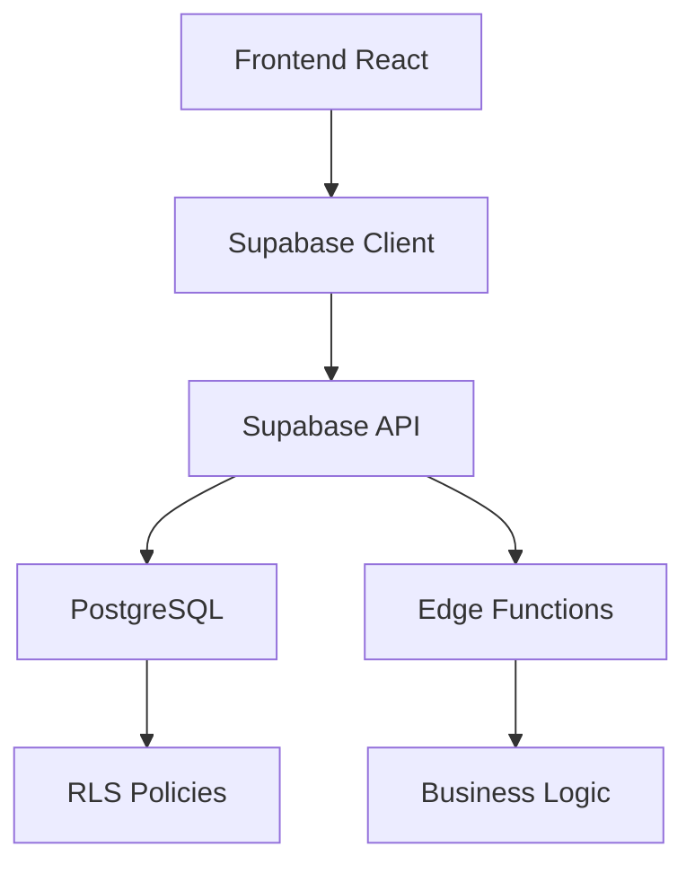

# Visão Geral do Sistema ERP Retífica

## Introdução

O ERP Retífica é um sistema completo de gestão empresarial desenvolvido especificamente para empresas do setor de retífica e usinagem. O sistema oferece funcionalidades abrangentes para gestão fiscal, financeira, produção, workflow e recursos humanos.

## Características Principais

### 🏢 **Multitenancy Nativo**
- Sistema preparado para múltiplas organizações
- Isolamento completo de dados por organização
- Gestão de usuários e permissões por organização

### 📊 **Módulos Integrados**
- **Dashboard**: Visão consolidada com KPIs e métricas
- **Fiscal**: Gestão completa de obrigações fiscais
- **Financeiro**: Contas a pagar/receber, fluxo de caixa, DRE
- **PCP**: Planejamento e controle de produção
- **Workflow**: Sistema Kanban para processos
- **Ordens de Serviço**: Gestão completa de OS
- **Compras**: Requisições e gestão de fornecedores
- **Estoque**: Controle de peças e materiais
- **RH**: Gestão de funcionários e folha de pagamento

### 🛡️ **Segurança Avançada**
- Row Level Security (RLS) nativo
- Autenticação via Supabase Auth
- Políticas granulares de acesso
- Auditoria completa de ações

## Arquitetura Tecnológica

### **Frontend**
- **React 18** com TypeScript
- **Vite** para build e desenvolvimento
- **Tailwind CSS** para estilização
- **shadcn/ui** para componentes
- **React Router** para navegação
- **React Query** para cache e sincronização

### **Backend**
- **Supabase** como BaaS (Backend as a Service)
- **PostgreSQL** como banco de dados principal
- **Edge Functions** para lógica de negócio
- **Row Level Security** para isolamento de dados

### **Infraestrutura**
- **Vercel/Netlify** para deploy do frontend
- **Supabase Cloud** para backend e banco
- **CDN** para assets estáticos

## Fluxo de Dados



## Padrões de Desenvolvimento

### **Estrutura de Pastas**
```
src/
├── components/          # Componentes reutilizáveis
├── pages/              # Páginas da aplicação
├── hooks/              # Custom hooks
├── contexts/           # Contextos React
├── lib/                # Utilitários e configurações
└── integrations/       # Integrações externas
```

### **Convenções**
- Componentes em PascalCase
- Hooks com prefixo `use`
- Contextos com sufixo `Context`
- Páginas com nomes descritivos

## Próximos Passos

Para mais detalhes sobre cada aspecto do sistema, consulte:

- [Documentação de Multitenancy](./multitenancy.md)
- [Esquema do Banco de Dados](./database-schema.md)
- [Modelo de Segurança](./security-model.md)
- [Stack Tecnológico](./tech-stack.md)