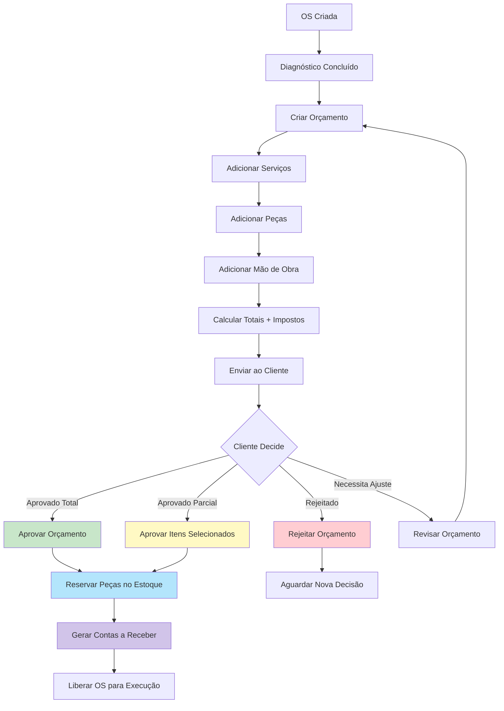
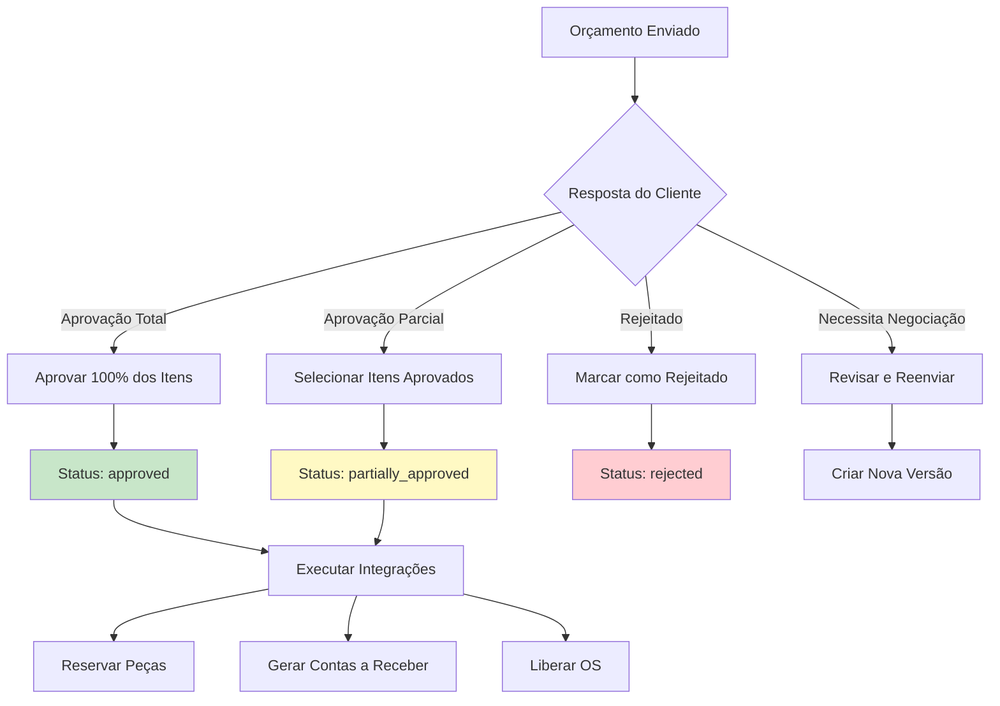
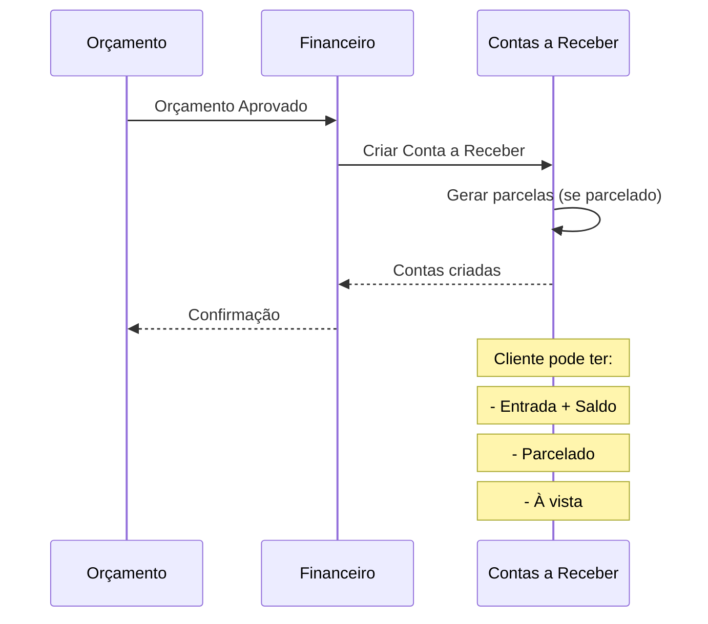

# 💰 Orçamentos e Aprovação - Regras de Negócio

## 🎯 Visão Geral

O módulo de Orçamentos gerencia todo o processo de cotação, aprovação e documentação de serviços, integrando-se automaticamente com módulos financeiro, estoque e operações.

---

## 📋 Fluxo Completo de Orçamento



---

## 💼 Criação de Orçamento

### Formulário de Orçamento

#### **Informações Gerais**
```typescript
{
  "order_id": "uuid",
  "number": "ORC-20250114-0001", // Auto-incrementado
  "created_by": "user_id",
  "created_at": "2025-01-14T10:30:00Z",
  "valid_until": "2025-01-28T23:59:59Z", // 14 dias padrão
  "budget_type": "complete" | "partial" | "diagnostic",
  "status": "pending",
  "notes": "Observações gerais do orçamento"
}
```

### Tipos de Orçamento
- **Completo**: Retífica total do motor
- **Parcial**: Apenas alguns componentes
- **Diagnóstico**: Somente análise técnica
- **Emergencial**: Reparo urgente
- **Manutenção Preventiva**: Serviços programados

---

## 🛠️ Itens do Orçamento

### 1. Serviços

```typescript
{
  "id": "uuid",
  "budget_id": "uuid",
  "service_type": "retifica_cilindros",
  "description": "Retífica e brunimento de 4 cilindros",
  "quantity": 4,
  "unit": "unidade",
  "unit_price": 200.00,
  "discount_percentage": 0,
  "discount_value": 0,
  "subtotal": 800.00,
  "estimated_hours": 6,
  "observations": "Necessário sobremetal de 0.25mm"
}
```

#### Serviços Comuns
- Retífica de cilindros
- Retífica de virabrequim
- Retífica de comando
- Brunimento
- Alinhamento de bielas
- Montagem completa
- Teste de bancada
- Solda de trinca
- Troca de guias de válvula
- Retífica de válvulas

### 2. Peças/Materiais

```typescript
{
  "id": "uuid",
  "budget_id": "uuid",
  "part_id": "uuid", // Referência ao estoque
  "part_code": "PST-001-STD",
  "part_name": "Pistão STD Completo",
  "manufacturer": "Mahle",
  "quantity": 4,
  "unit_price": 150.00,
  "discount_percentage": 10,
  "discount_value": 60.00,
  "subtotal": 540.00,
  "in_stock": true,
  "supplier": "Auto Peças XYZ",
  "lead_time_days": 0, // Em estoque
  "observations": "Inclui anéis e pino"
}
```

#### Peças Comuns
- Pistões (STD, 0.25, 0.50, 0.75, 1.00mm)
- Anéis
- Bronzinas de mancais
- Bronzinas de bielas
- Retentores
- Juntas
- Válvulas
- Guias de válvula
- Molas de válvulas
- Correia dentada/corrente
- Bomba de óleo
- Bomba d'água

### 3. Mão de Obra

```typescript
{
  "id": "uuid",
  "budget_id": "uuid",
  "description": "Montagem completa do motor",
  "hours": 12,
  "hour_rate": 80.00,
  "total": 960.00,
  "technician_level": "senior",
  "observations": "Inclui ajustes e regulagens"
}
```

#### Tipos de Mão de Obra
- Desmontagem
- Montagem
- Usinagem
- Testes
- Regulagem
- Diagnóstico especializado

---

## 🧮 Cálculo Automático

### Fórmula de Cálculo

```typescript
// 1. Calcular subtotal de cada item
item.subtotal = (item.unit_price * item.quantity) - item.discount_value;

// 2. Somar todos os subtotais
budget.services_total = sum(services.subtotal);
budget.parts_total = sum(parts.subtotal);
budget.labor_total = sum(labor.total);
budget.subtotal = budget.services_total + budget.parts_total + budget.labor_total;

// 3. Aplicar desconto global (se houver)
budget.discount_amount = budget.subtotal * (budget.discount_percentage / 100);
budget.subtotal_after_discount = budget.subtotal - budget.discount_amount;

// 4. Calcular impostos (se módulo fiscal ativo)
const taxCalculation = calculateTaxes({
  value: budget.subtotal_after_discount,
  tax_regime: organization.tax_regime,
  service_type: "retifica_motores",
  customer_type: customer.type // PF ou PJ
});

budget.tax_icms = taxCalculation.icms;
budget.tax_pis = taxCalculation.pis;
budget.tax_cofins = taxCalculation.cofins;
budget.tax_iss = taxCalculation.iss;
budget.taxes_total = taxCalculation.total;

// 5. Total final
budget.total = budget.subtotal_after_discount + budget.taxes_total;
```

### Exemplo Prático
```
Serviços:           R$ 3.200,00
Peças:              R$ 2.500,00
Mão de Obra:        R$ 1.600,00
----------------------------------------
Subtotal:           R$ 7.300,00
Desconto (5%):      R$   365,00
----------------------------------------
Subtotal com Desc.: R$ 6.935,00
Impostos (15%):     R$ 1.040,25
----------------------------------------
TOTAL:              R$ 7.975,25
```

---

## ✅ Tipos de Aprovação



### 1. Aprovação Total
**Quando**: Cliente aceita 100% do orçamento

**Ações automáticas**:
```typescript
async function approveFullBudget(budgetId, approvalData) {
  // 1. Atualizar status do orçamento
  await updateBudget(budgetId, {
    status: 'approved',
    approved_at: new Date(),
    approved_by: approvalData.approved_by,
    approval_method: approvalData.method, // whatsapp, email, presencial
    approval_document: approvalData.document_url
  });
  
  // 2. Reservar todas as peças no estoque
  const parts = await getBudgetParts(budgetId);
  for (const part of parts) {
    await reserveInventoryPart({
      part_id: part.part_id,
      quantity: part.quantity,
      reserved_for: 'budget',
      reference_id: budgetId,
      notes: `Reservado para orçamento ${budget.number}`
    });
  }
  
  // 3. Gerar Contas a Receber
  await createAccountReceivable({
    customer_id: budget.customer_id,
    order_id: budget.order_id,
    budget_id: budgetId,
    amount: budget.total,
    due_date: calculateDueDate(budget.payment_terms),
    description: `Orçamento ${budget.number} - OS ${order.number}`,
    installments: budget.installments || 1
  });
  
  // 4. Liberar OS para execução
  await updateOrderStatus(budget.order_id, 'approved_to_start');
  
  // 5. Criar termo de garantia
  await createWarrantyTerm({
    order_id: budget.order_id,
    budget_id: budgetId,
    warranty_days: 90, // Padrão
    start_date: null, // Inicia na entrega
    coverage: 'full'
  });
  
  // 6. Notificar equipe
  await notify('budget_approved', {
    budget_id: budgetId,
    order_number: order.number,
    total: budget.total
  });
}
```

### 2. Aprovação Parcial
**Quando**: Cliente aceita apenas alguns itens

**Processo**:
```typescript
async function approvePartialBudget(budgetId, approvedItems) {
  // 1. Marcar itens aprovados
  for (const itemId of approvedItems) {
    await updateBudgetItem(itemId, { approved: true });
  }
  
  // 2. Recalcular totais
  const newTotal = await recalculateBudgetTotal(budgetId, approvedItems);
  
  // 3. Atualizar orçamento
  await updateBudget(budgetId, {
    status: 'partially_approved',
    approved_items_total: newTotal,
    approved_at: new Date()
  });
  
  // 4. Reservar apenas peças aprovadas
  const approvedParts = await getApprovedParts(budgetId);
  for (const part of approvedParts) {
    await reserveInventoryPart({...});
  }
  
  // 5. Gerar Contas a Receber com valor parcial
  await createAccountReceivable({
    amount: newTotal,
    ...
  });
  
  // 6. OS liberada apenas para serviços aprovados
  await updateOrder(budget.order_id, {
    status: 'partial_approval',
    approved_services: approvedItems
  });
}
```

### 3. Rejeitado
**Quando**: Cliente não aceita o orçamento

**Ações**:
- Status alterado para `rejected`
- Motivo da rejeição registrado
- OS fica aguardando nova decisão
- Notificação para gerente comercial
- Não gera integrações financeiras/estoque

### 4. Revisão
**Quando**: Cliente solicita alterações

**Processo**:
- Cria nova versão do orçamento
- Mantém histórico de versões anteriores
- Permite comparação entre versões
- Status: `under_revision`

---

## 📄 Métodos de Aprovação

### 1. WhatsApp
- Cliente envia mensagem confirmando
- Print da conversa anexado ao orçamento
- Data/hora capturados automaticamente

### 2. Email
- Cliente responde email com confirmação
- Email arquivado como comprovante
- Link de aprovação direto (opcional)

### 3. Presencial/Assinatura Digital
- Cliente assina termo físico ou tablet
- Documento escaneado/fotografado
- Upload do comprovante obrigatório

### 4. Portal do Cliente (futuro)
- Cliente acessa portal seguro
- Visualiza orçamento detalhado
- Aprova com um clique
- Assinatura digital integrada

---

## 📸 Documentação de Aprovação

### Arquivos Aceitos
- **Imagens**: JPG, PNG, PDF
- **Tamanho máximo**: 10MB
- **Armazenamento**: Supabase Storage (`budget-approvals/`)

### Estrutura do Arquivo
```
budget-approvals/
├── org_123/
│   ├── 2025/
│   │   ├── 01/
│   │   │   ├── ORC-20250114-0001_whatsapp.jpg
│   │   │   ├── ORC-20250114-0001_signature.pdf
│   │   │   └── ORC-20250114-0002_email.pdf
```

### Metadados
```typescript
{
  "document_type": "whatsapp" | "email" | "signature" | "other",
  "upload_date": "2025-01-14T15:30:00Z",
  "uploaded_by": "user_id",
  "file_size": 2048576,
  "file_name": "aprovacao_cliente_silva.jpg"
}
```

---

## 🔄 Integrações Automáticas

### 1. Módulo Financeiro



#### Exemplo de Parcelamento
```typescript
// Cliente escolheu: 30% entrada + 2x
const budget_total = 7975.25;
const down_payment = budget_total * 0.30; // R$ 2.392,58
const remaining = budget_total - down_payment; // R$ 5.582,67
const installment = remaining / 2; // R$ 2.791,34

// Contas a Receber geradas:
[
  {
    description: "Entrada - Orçamento ORC-001",
    amount: 2392.58,
    due_date: "2025-01-15", // Antes de começar
    status: "pending"
  },
  {
    description: "Parcela 1/2 - Orçamento ORC-001",
    amount: 2791.34,
    due_date: "2025-02-15",
    status: "pending"
  },
  {
    description: "Parcela 2/2 - Orçamento ORC-001",
    amount: 2791.33,
    due_date: "2025-03-15",
    status: "pending"
  }
]
```

### 2. Módulo Estoque

```typescript
// Reserva automática de peças
async function reservePartsFromBudget(budgetId) {
  const parts = await getBudgetParts(budgetId);
  
  for (const part of parts) {
    // Verifica disponibilidade
    const available = await checkPartAvailability(part.part_id);
    
    if (available.quantity >= part.quantity) {
      // Reserva
      await createInventoryReservation({
        part_id: part.part_id,
        quantity: part.quantity,
        reserved_for: 'budget',
        reference_id: budgetId,
        status: 'reserved',
        expires_at: addDays(new Date(), 30) // Reserva por 30 dias
      });
    } else {
      // Cria necessidade de compra automática
      await createPurchaseNeed({
        part_id: part.part_id,
        quantity_needed: part.quantity - available.quantity,
        priority: 'high',
        reason: `Orçamento ${budget.number} aprovado`,
        required_by: order.expected_delivery
      });
    }
  }
}
```

### 3. Módulo Operações

```typescript
// Libera OS para execução
async function releaseOrderForExecution(orderId) {
  await updateOrder(orderId, {
    status: 'ready_to_start', // Pode iniciar Kanban
    budget_approved_at: new Date(),
    can_start_production: true
  });
  
  // Notifica equipe técnica
  await notifyTeam('order_ready', {
    order_id: orderId,
    priority: order.priority,
    expected_delivery: order.expected_delivery
  });
}
```

---

## 🛡️ Sistema de Garantia

### Criação do Termo
Ao aprovar orçamento, sistema cria termo de garantia:

```typescript
{
  "id": "uuid",
  "order_id": "uuid",
  "budget_id": "uuid",
  "warranty_days": 90, // Configurável
  "start_date": null, // Inicia na entrega
  "end_date": null, // Calculado na entrega
  "coverage_type": "full" | "parts_only" | "labor_only",
  "conditions": [
    "Garantia válida para defeitos de fabricação/montagem",
    "Não cobre uso inadequado ou acidentes",
    "Motor deve ser usado conforme manual",
    "Garantia perde validade se motor for aberto por terceiros"
  ],
  "status": "pending_delivery"
}
```

### Período de Garantia
- **Início**: Data de entrega do motor
- **Fim**: Início + warranty_days
- **Monitoramento**: Sistema acompanha automaticamente
- **Alertas**: 
  - 7 dias antes do fim: Notificar cliente
  - No fim: Mover OS para status `finished`

### Registro de Reclamações
```typescript
{
  "warranty_id": "uuid",
  "reported_at": "2025-02-10T14:30:00Z",
  "issue_description": "Motor apresentou ruído no comando",
  "reported_by": "customer_id",
  "status": "under_analysis",
  "resolution": null,
  "covered_by_warranty": null // true/false após análise
}
```

---

## 🔒 Permissões

| Ação | Super Admin | Owner | Admin | Manager | Operator | Viewer |
|------|-------------|-------|-------|---------|----------|--------|
| Criar Orçamento | ✅ | ✅ | ✅ | ✅ | ✏️ | ❌ |
| Editar Orçamento (pendente) | ✅ | ✅ | ✅ | ✅ | ✏️ | ❌ |
| Deletar Orçamento (pendente) | ✅ | ✅ | ✅ | ❌ | ❌ | ❌ |
| Aprovar Orçamento | ✅ | ✅ | ✅ | ✅ | ❌ | ❌ |
| Aplicar Desconto > 10% | ✅ | ✅ | ✅ | ✅ | ❌ | ❌ |
| Aplicar Desconto > 20% | ✅ | ✅ | ✅ | ❌ | ❌ | ❌ |
| Ver Orçamentos | ✅ | ✅ | ✅ | ✅ | ✅ | 📖 |
| Editar após Aprovação | ✅ | ✅ | ❌ | ❌ | ❌ | ❌ |

---

## 📊 Relatórios e Métricas

### Taxa de Aprovação
```typescript
(Orçamentos Aprovados / Total de Orçamentos Enviados) * 100
```
- **Benchmark**: 65-75%
- **Meta**: > 70%

### Tempo Médio de Resposta
```typescript
AVG(approved_at - created_at) WHERE status IN ('approved', 'rejected')
```
- **Meta**: < 3 dias

### Ticket Médio
```typescript
AVG(total) FROM budgets WHERE status = 'approved'
```

### Conversão por Vendedor
```typescript
SELECT 
  created_by,
  COUNT(*) as total_budgets,
  SUM(CASE WHEN status = 'approved' THEN 1 ELSE 0 END) as approved,
  AVG(total) as average_value
FROM budgets
GROUP BY created_by
```

---

**Última Atualização**: 2025-01-14  
**Versão**: 1.0.0
