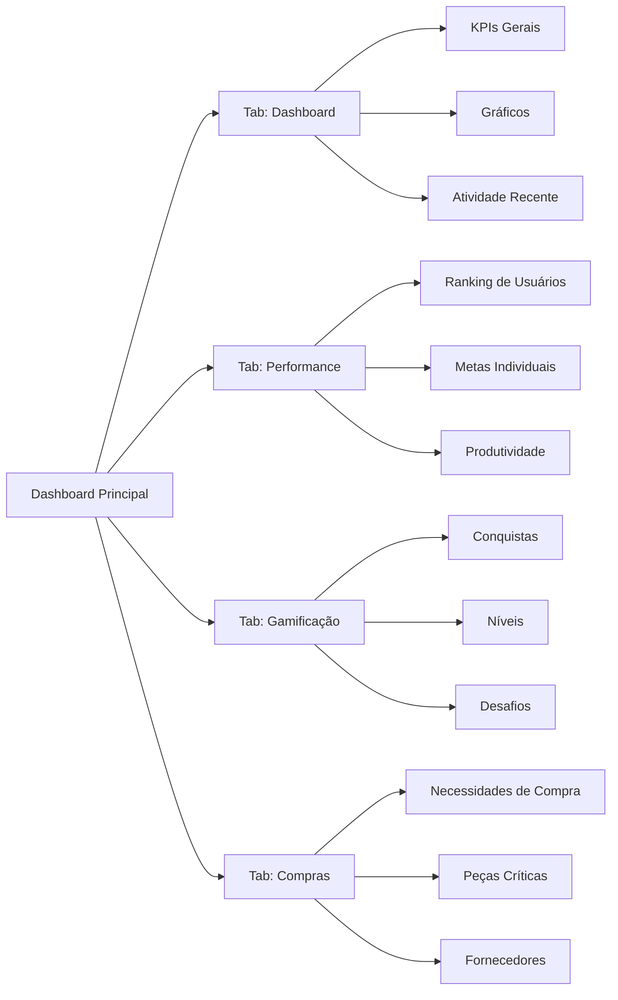
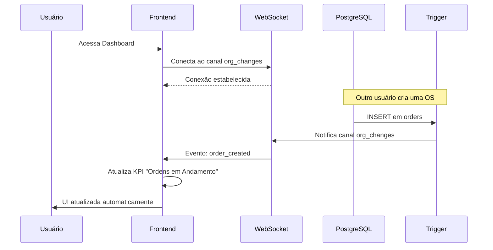
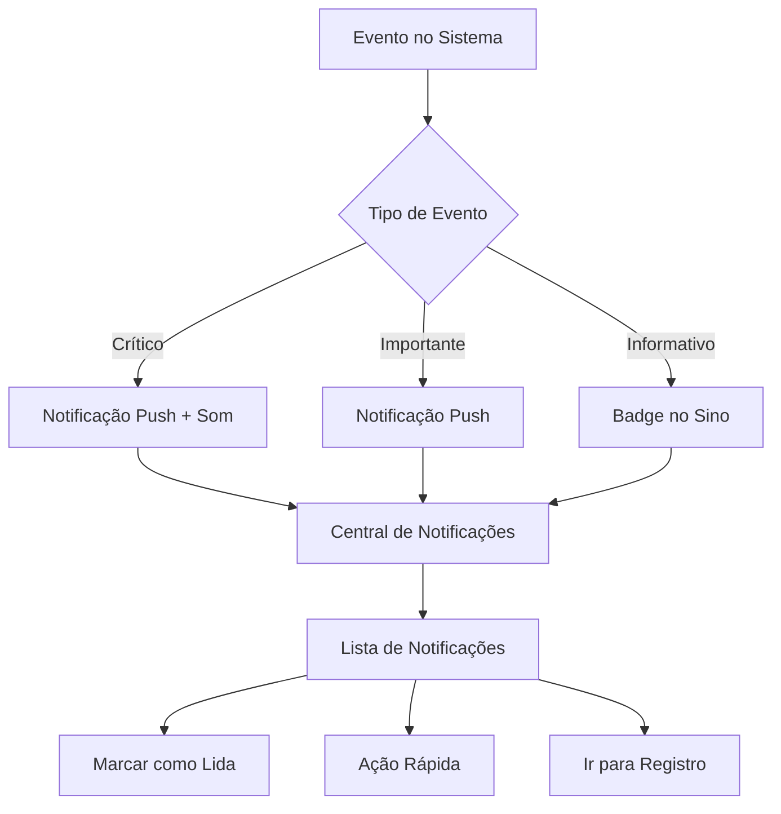

# 📊 Dashboard e KPIs - Regras de Negócio

## 🎯 Visão Geral

O Dashboard é o centro de controle do ERP Retífica, fornecendo visão em tempo real de todas as operações através de KPIs (Key Performance Indicators) e métricas estratégicas.

---

## 📈 Métricas Disponíveis e Cálculos

### KPIs Principais

#### 1. **Ordens em Andamento**
```typescript
// Cálculo
SELECT COUNT(*) FROM orders 
WHERE org_id = current_org 
AND status NOT IN ('delivered', 'cancelled')
```
- **Atualização**: Tempo real via WebSocket
- **Filtros**: Por período, técnico, cliente
- **Drill-down**: Clique para ver lista de ordens

#### 2. **Orçamentos Pendentes**
```typescript
// Cálculo
SELECT COUNT(*) FROM budgets 
WHERE org_id = current_org 
AND status = 'pending'
```
- **Alerta**: Mais de 5 pendentes há mais de 7 dias
- **Ação rápida**: Botão para enviar lembrete

#### 3. **Faturamento do Mês**
```typescript
// Cálculo
SELECT SUM(total_value) FROM budgets 
WHERE org_id = current_org 
AND status = 'approved'
AND approved_at >= first_day_of_month
```
- **Comparação**: vs. mês anterior
- **Meta**: Configurável por organização
- **Drill-down**: Ver orçamentos aprovados

#### 4. **Peças em Falta**
```typescript
// Cálculo
SELECT COUNT(*) FROM inventory_parts 
WHERE org_id = current_org 
AND current_quantity <= minimum_stock
```
- **Priorização**: Por urgência (reservadas vs. não reservadas)
- **Ação rápida**: Criar necessidade de compra

#### 5. **Taxa de Aprovação**
```typescript
// Cálculo
(Orçamentos Aprovados / Total de Orçamentos) * 100
WHERE created_at >= period_start
```
- **Benchmark**: Média da indústria: 65-75%
- **Comparação**: Por vendedor/consultor

#### 6. **Tempo Médio de Serviço**
```typescript
// Cálculo
AVG(DATEDIFF(delivered_at, created_at)) FROM orders
WHERE status = 'delivered'
AND delivered_at >= period_start
```
- **Meta**: Configurável (padrão: 15 dias)
- **Alerta**: Se > 20 dias

---

## 🎨 Sistema de Tabs



### Tab 1: Dashboard (Principal)
**Componentes**:
- KPIs principais (6 cards)
- Gráfico de faturamento (últimos 6 meses)
- Ordens em andamento (lista)
- Atividade recente (timeline)
- Alertas inteligentes

**Permissões**: Todos os perfis

### Tab 2: Performance
**Componentes**:
- Ranking de técnicos (por OS finalizadas)
- Ranking de vendedores (por faturamento)
- Comparação mensal
- Metas individuais vs. realizadas
- Tempo médio por etapa do workflow

**Permissões**: Manager, Admin, Owner, Super Admin

### Tab 3: Gamificação
**Componentes**:
- Sistema de níveis (1-100)
- Conquistas desbloqueadas
- Progresso para próximo nível
- Desafios ativos
- Leaderboard global

**Permissões**: Todos os perfis

### Tab 4: Compras
**Componentes**:
- Necessidades de compra pendentes
- Peças com estoque crítico
- Pedidos de compra em andamento
- Sugestões de fornecedores
- Alertas de compras urgentes

**Permissões**: Admin, Owner, Manager, Purchasing

---

## ⚡ Sistema de Atualização em Tempo Real



### Eventos Monitorados
- `order_created`, `order_updated`, `order_deleted`
- `budget_created`, `budget_approved`, `budget_rejected`
- `inventory_movement`
- `payment_received`
- `workflow_status_changed`

### Indicador de Conexão
- 🟢 **Verde**: Conectado (atualizações em tempo real)
- 🟡 **Amarelo**: Reconectando...
- 🔴 **Vermelho**: Desconectado (clique para reconectar)

---

## 🔍 Filtros e Personalizações

### Filtros Globais
- **Período**: Hoje, Esta semana, Este mês, Últimos 3/6/12 meses, Customizado
- **Técnico**: Filtrar por responsável
- **Cliente**: Filtrar por cliente específico
- **Status**: Filtrar por status de ordem
- **Tipo de Serviço**: Retífica, Manutenção, Diagnóstico

### Personalizações por Usuário
```typescript
// Salvo em user_preferences
{
  "dashboard_layout": "compact" | "expanded",
  "default_period": "month",
  "favorite_kpis": ["orders_in_progress", "revenue"],
  "chart_type": "line" | "bar",
  "show_alerts": true,
  "notification_sound": true
}
```

### KPIs Customizáveis
Usuários Admin podem criar KPIs personalizados:
- Nome do KPI
- Query SQL (validada no backend)
- Tipo de visualização (número, percentual, moeda)
- Cor do card
- Ícone
- Meta (opcional)

---

## 🔔 Sistema de Notificações



### Tipos de Notificações

#### 🔴 Críticas (Vermelho)
- Orçamento aprovado
- Falha em pagamento
- Estoque crítico de peça reservada
- **Som**: Sim
- **Push**: Sim

#### 🟡 Importantes (Amarelo)
- Novo comentário em OS
- OS pronta para próxima etapa
- Orçamento vencendo (7 dias)
- **Som**: Não
- **Push**: Sim

#### 🔵 Informativas (Azul)
- OS criada
- Relatório gerado
- Meta alcançada
- **Som**: Não
- **Push**: Não

### Central de Notificações
- **Acesso**: Clique no ícone de sino (canto superior direito)
- **Badge**: Mostra quantidade não lidas
- **Filtros**: Não lidas, Todas, Por tipo
- **Ações**:
  - Marcar como lida
  - Marcar todas como lidas
  - Ir para registro relacionado
  - Executar ação rápida (aprovar, rejeitar, etc.)

---

## 🎯 Sistema de Metas

### Configuração de Metas
```typescript
// Exemplo de meta mensal
{
  "type": "revenue",
  "target_value": 150000,
  "period": "monthly",
  "assigned_to": "organization" | "user_id",
  "start_date": "2025-01-01",
  "end_date": "2025-01-31"
}
```

### Tipos de Metas
1. **Faturamento**: Valor monetário
2. **OS Finalizadas**: Quantidade
3. **Taxa de Aprovação**: Percentual
4. **Tempo Médio**: Dias
5. **Satisfação do Cliente**: NPS

### Acompanhamento
- **Progresso em tempo real**: Barra de progresso
- **Projeção**: Com base no ritmo atual
- **Alertas**:
  - 🟢 Acima da meta (>100%)
  - 🟡 No caminho certo (80-100%)
  - 🔴 Abaixo da meta (<80%)

### Gamificação de Metas
- **Bônus de XP**: +500 XP por meta alcançada
- **Conquistas**: Desbloqueadas ao atingir metas específicas
- **Ranking**: Comparação entre equipes

---

## 📊 Gráficos e Visualizações

### Gráfico de Faturamento
- **Tipo**: Linha ou Barra
- **Período**: Últimos 6 ou 12 meses
- **Dados**: Faturamento mensal, comparação com mês anterior
- **Interação**: Hover para detalhes, clique para drill-down

### Gráfico de OS por Status
- **Tipo**: Pizza ou Rosca
- **Dados**: Distribuição de ordens por status
- **Cores**: Baseadas no status (configurável)

### Gráfico de Performance de Técnicos
- **Tipo**: Barra horizontal
- **Dados**: OS finalizadas por técnico (período selecionado)
- **Ranking**: Ordenado por quantidade

### Gráfico de Tendências
- **Tipo**: Linha com área
- **Dados**: KPI selecionado ao longo do tempo
- **Comparação**: Período anterior em linha tracejada

---

## ⚙️ Configurações do Dashboard

### Admin: Configurar Dashboard
**Acesso**: Configurações > Dashboard

**Opções**:
- Ativar/desativar KPIs específicos
- Definir ordem dos KPIs
- Configurar cores dos cards
- Definir metas organizacionais
- Configurar alertas automáticos
- Personalizar gráficos padrão

### Usuário: Preferências
**Acesso**: Perfil > Preferências

**Opções**:
- Layout do dashboard (compacto/expandido)
- Período padrão ao abrir
- Tema (claro/escuro)
- Notificações (ativar/desativar por tipo)
- Sons de alerta

---

## 🔒 Permissões por Perfil

| KPI/Funcionalidade | Super Admin | Owner | Admin | Manager | Operator | Viewer |
|-------------------|-------------|-------|-------|---------|----------|--------|
| Ver KPIs Gerais | ✅ | ✅ | ✅ | ✅ | ✅ | ✅ |
| Ver Faturamento | ✅ | ✅ | ✅ | ✅ | ❌ | 📖 |
| Tab Performance | ✅ | ✅ | ✅ | ✅ | 📖 | 📖 |
| Tab Gamificação | ✅ | ✅ | ✅ | ✅ | ✅ | ✅ |
| Tab Compras | ✅ | ✅ | ✅ | ✅ | ✏️ | 📖 |
| Configurar Dashboard | ✅ | ✅ | ✅ | ❌ | ❌ | ❌ |
| Criar KPIs Customizados | ✅ | ✅ | ✅ | ❌ | ❌ | ❌ |

---

## 📱 Responsividade

### Desktop (>1024px)
- Layout em grid: 3 colunas de KPIs
- Gráficos lado a lado
- Sidebar fixa

### Tablet (768px - 1024px)
- Layout em grid: 2 colunas de KPIs
- Gráficos empilhados
- Sidebar retrátil

### Mobile (<768px)
- Layout em coluna única
- KPIs condensados
- Navegação por abas inferior
- Gráficos simplificados

---

## 🚀 Performance

### Otimizações Implementadas
- **React Query**: Cache de 5 minutos para KPIs
- **WebSocket**: Atualização em tempo real sem polling
- **Lazy Loading**: Gráficos carregam sob demanda
- **Memoization**: Cálculos pesados são cacheados
- **Debounce**: Filtros aplicados após 500ms de inatividade

### Métricas de Performance
- **Tempo de carregamento inicial**: < 2 segundos
- **Atualização de KPI**: < 500ms
- **Renderização de gráfico**: < 1 segundo

---

**Última Atualização**: 2025-01-14  
**Versão**: 1.0.0
