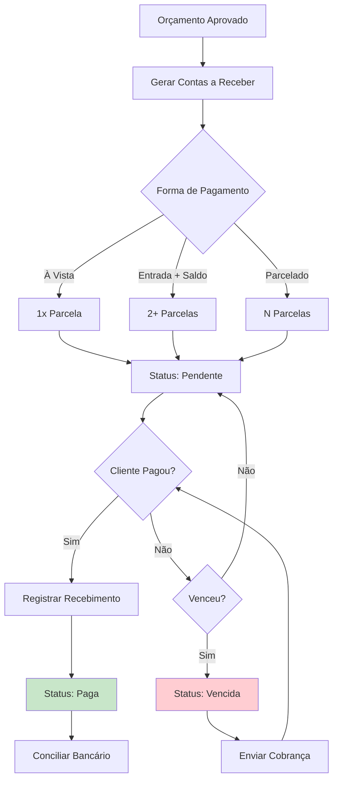
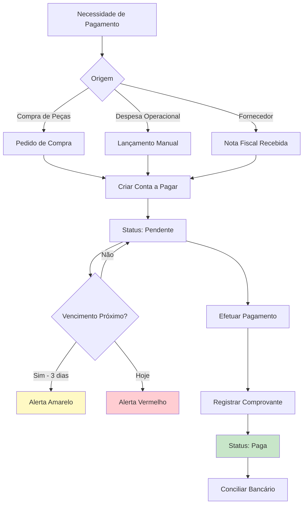
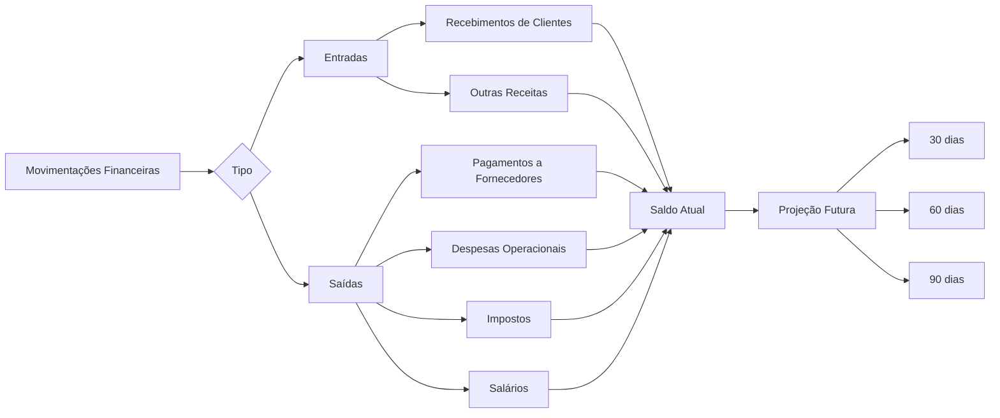
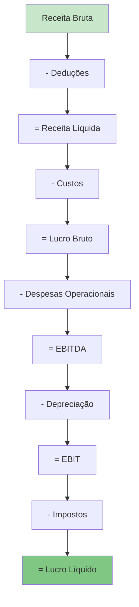
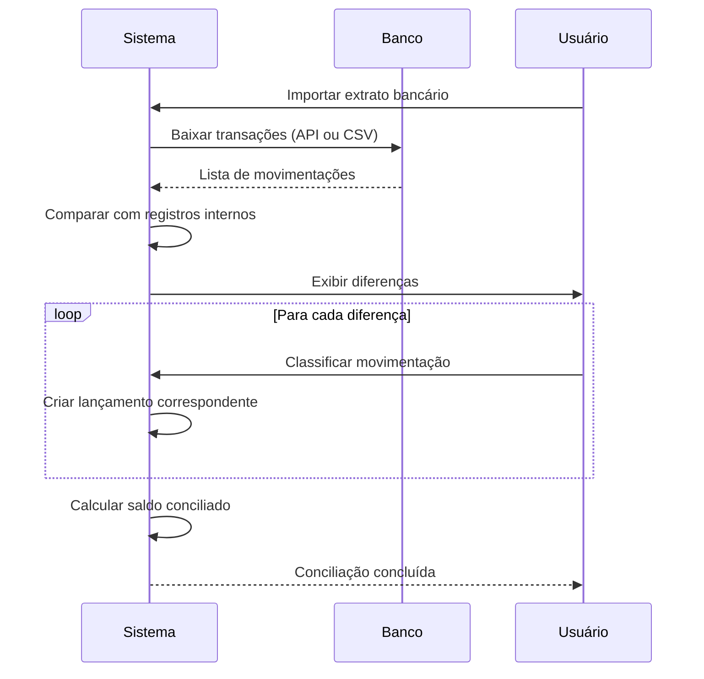

# 💵 Módulo Financeiro - Regras de Negócio

## 🎯 Visão Geral

O Módulo Financeiro gerencia todo o fluxo de caixa, contas a pagar e receber, controle bancário, DRE e relatórios financeiros, integrando-se automaticamente com outros módulos do sistema.

---

## 💰 Contas a Receber



### Geração Automática
Ao aprovar um orçamento, o sistema cria automaticamente as contas a receber:

```typescript
async function createReceivablesFromBudget(budget) {
  const {
    payment_terms,
    down_payment_percentage,
    installments_count,
    total
  } = budget;
  
  let accounts = [];
  
  if (payment_terms === 'cash') {
    // À vista
    accounts.push({
      customer_id: budget.customer_id,
      order_id: budget.order_id,
      budget_id: budget.id,
      description: `Orçamento ${budget.number} - À vista`,
      amount: total,
      due_date: addDays(new Date(), 1), // Amanhã
      status: 'pending',
      installment: 1,
      total_installments: 1
    });
    
  } else if (payment_terms === 'down_payment_installments') {
    // Entrada + Parcelas
    const downPayment = total * (down_payment_percentage / 100);
    const remaining = total - downPayment;
    const installmentValue = remaining / installments_count;
    
    // Entrada
    accounts.push({
      description: `Orçamento ${budget.number} - Entrada`,
      amount: downPayment,
      due_date: addDays(new Date(), 1),
      status: 'pending',
      installment: 1,
      total_installments: installments_count + 1
    });
    
    // Parcelas
    for (let i = 1; i <= installments_count; i++) {
      accounts.push({
        description: `Orçamento ${budget.number} - Parcela ${i}/${installments_count}`,
        amount: i === installments_count 
          ? remaining - (installmentValue * (installments_count - 1)) // Ajuste último
          : installmentValue,
        due_date: addDays(new Date(), 30 * i), // A cada 30 dias
        status: 'pending',
        installment: i + 1,
        total_installments: installments_count + 1
      });
    }
    
  } else if (payment_terms === 'installments') {
    // Parcelado sem entrada
    const installmentValue = total / installments_count;
    
    for (let i = 1; i <= installments_count; i++) {
      accounts.push({
        description: `Orçamento ${budget.number} - Parcela ${i}/${installments_count}`,
        amount: i === installments_count
          ? total - (installmentValue * (installments_count - 1))
          : installmentValue,
        due_date: addDays(new Date(), 30 * i),
        status: 'pending',
        installment: i,
        total_installments: installments_count
      });
    }
  }
  
  // Inserir no banco
  for (const account of accounts) {
    await createAccountReceivable({
      ...budget.customer_info,
      ...account,
      org_id: budget.org_id,
      created_by: budget.approved_by
    });
  }
  
  return accounts;
}
```

### Status das Contas
- **Pendente** (`pending`): Aguardando pagamento
- **Paga** (`paid`): Recebimento confirmado
- **Vencida** (`overdue`): Passou da data de vencimento sem pagamento
- **Parcialmente Paga** (`partially_paid`): Recebeu apenas parte do valor
- **Cancelada** (`cancelled`): Orçamento foi cancelado

### Registro de Recebimento
```typescript
async function registerPayment(accountId, paymentData) {
  const account = await getAccountReceivable(accountId);
  
  // Registrar pagamento
  await createPaymentRecord({
    account_id: accountId,
    payment_date: paymentData.date,
    amount_paid: paymentData.amount,
    payment_method: paymentData.method, // cash, pix, card, bank_transfer
    bank_account_id: paymentData.bank_account,
    notes: paymentData.notes,
    receipt_url: paymentData.receipt_url
  });
  
  // Atualizar status
  const totalPaid = await getTotalPaid(accountId);
  
  if (totalPaid >= account.amount) {
    await updateAccount(accountId, { 
      status: 'paid',
      paid_at: new Date()
    });
  } else {
    await updateAccount(accountId, { 
      status: 'partially_paid',
      paid_amount: totalPaid
    });
  }
  
  // Atualizar fluxo de caixa
  await updateCashFlow({
    type: 'income',
    amount: paymentData.amount,
    date: paymentData.date,
    category: 'receita_servicos',
    reference_id: accountId
  });
  
  // Notificar (se configurado)
  if (account.total_paid === account.amount) {
    await notifyPaymentReceived(account);
  }
}
```

### Formas de Pagamento
- 💵 **Dinheiro** (`cash`)
- 🔲 **PIX** (`pix`)
- 💳 **Cartão de Crédito** (`credit_card`)
- 💳 **Cartão de Débito** (`debit_card`)
- 🏦 **Transferência Bancária** (`bank_transfer`)
- 📄 **Cheque** (`check`)
- 🔄 **Boleto** (`bank_slip`)

---

## 💸 Contas a Pagar



### Criação de Contas a Pagar

#### 1. Automática (via Compras)
Ao receber materiais de um pedido de compra:
```typescript
async function createPayableFromPurchaseOrder(poId, receivingData) {
  const po = await getPurchaseOrder(poId);
  
  await createAccountPayable({
    org_id: po.org_id,
    supplier_id: po.supplier_id,
    purchase_order_id: poId,
    description: `Pedido de Compra ${po.number}`,
    amount: po.total,
    due_date: calculateDueDate(po.payment_terms),
    category: 'materiais',
    status: 'pending',
    invoice_number: receivingData.invoice_number,
    invoice_url: receivingData.invoice_url
  });
}
```

#### 2. Manual (Despesas Operacionais)
```typescript
// Exemplos de despesas
const expenseCategories = [
  'energia_eletrica',
  'agua',
  'telefone_internet',
  'aluguel',
  'salarios',
  'encargos',
  'manutencao_equipamentos',
  'combustivel',
  'materiais_consumo',
  'servicos_terceiros',
  'impostos',
  'outros'
];
```

### Pagamento de Contas
```typescript
async function payAccountPayable(accountId, paymentData) {
  const account = await getAccountPayable(accountId);
  
  // Registrar pagamento
  await createPaymentRecord({
    account_payable_id: accountId,
    payment_date: paymentData.date,
    amount_paid: paymentData.amount,
    payment_method: paymentData.method,
    bank_account_id: paymentData.bank_account,
    voucher_url: paymentData.voucher_url,
    notes: paymentData.notes
  });
  
  // Atualizar status
  await updateAccountPayable(accountId, {
    status: 'paid',
    paid_at: paymentData.date,
    paid_by: paymentData.user_id
  });
  
  // Atualizar fluxo de caixa
  await updateCashFlow({
    type: 'expense',
    amount: paymentData.amount,
    date: paymentData.date,
    category: account.category,
    reference_id: accountId
  });
  
  // Se pagou antes do vencimento, calcular desconto obtido
  if (paymentData.date < account.due_date && paymentData.amount < account.amount) {
    const discount = account.amount - paymentData.amount;
    await recordDiscount(accountId, discount, 'early_payment');
  }
}
```

### Alertas de Vencimento
```typescript
// Job diário que verifica vencimentos
async function checkUpcomingPayments() {
  const today = new Date();
  const threeDaysAhead = addDays(today, 3);
  
  // Contas vencendo em 3 dias
  const upcoming = await getAccountsPayable({
    status: 'pending',
    due_date: { between: [today, threeDaysAhead] }
  });
  
  for (const account of upcoming) {
    await createAlert({
      type: 'payment_due_soon',
      severity: 'warning',
      title: `Pagamento vence em ${differenceInDays(account.due_date, today)} dias`,
      description: `${account.description} - R$ ${account.amount}`,
      reference_id: account.id,
      assigned_to: 'financial_manager'
    });
  }
  
  // Contas vencidas
  const overdue = await getAccountsPayable({
    status: 'pending',
    due_date: { lessThan: today }
  });
  
  for (const account of overdue) {
    await updateAccountPayable(account.id, { status: 'overdue' });
    
    await createAlert({
      type: 'payment_overdue',
      severity: 'critical',
      title: `Pagamento vencido há ${differenceInDays(today, account.due_date)} dias`,
      description: `${account.description} - R$ ${account.amount}`,
      reference_id: account.id,
      assigned_to: 'financial_manager'
    });
  }
}
```

---

## 💹 Fluxo de Caixa



### Componentes do Fluxo de Caixa

#### 1. Saldo Inicial
```typescript
const saldoInicial = await getBankAccountsBalance();
```

#### 2. Entradas Realizadas (Mês Atual)
```typescript
const entradasRealizadas = await sumPayments({
  type: 'income',
  date: { between: [startOfMonth, endOfMonth] },
  status: 'confirmed'
});
```

#### 3. Saídas Realizadas (Mês Atual)
```typescript
const saidasRealizadas = await sumPayments({
  type: 'expense',
  date: { between: [startOfMonth, endOfMonth] },
  status: 'confirmed'
});
```

#### 4. Saldo Atual
```typescript
const saldoAtual = saldoInicial + entradasRealizadas - saidasRealizadas;
```

#### 5. Projeções Futuras
```typescript
// Próximos 30 dias
const projecao30dias = {
  entradas_previstas: await sumAccountsReceivable({
    status: ['pending', 'partially_paid'],
    due_date: { between: [today, add30days] }
  }),
  saidas_previstas: await sumAccountsPayable({
    status: 'pending',
    due_date: { between: [today, add30days] }
  })
};

projecao30dias.saldo_projetado = saldoAtual 
  + projecao30dias.entradas_previstas 
  - projecao30dias.saidas_previstas;
```

### Gráfico de Fluxo de Caixa
- **Eixo X**: Tempo (dias/meses)
- **Eixo Y**: Valor (R$)
- **Linhas**:
  - 🟢 Entradas (verde)
  - 🔴 Saídas (vermelho)
  - 🔵 Saldo acumulado (azul)
  - 📊 Projeção (linha tracejada)

---

## 📊 DRE (Demonstração do Resultado do Exercício)



### Estrutura da DRE

```typescript
interface DRE {
  // RECEITAS
  receita_bruta: {
    receita_servicos: number;
    receita_pecas: number;
    outras_receitas: number;
    total: number;
  };
  
  // DEDUÇÕES
  deducoes: {
    impostos_sobre_vendas: number; // ISS, PIS, COFINS
    devolucoes: number;
    descontos: number;
    total: number;
  };
  
  receita_liquida: number;
  
  // CUSTOS
  custos: {
    custo_pecas: number;
    custo_materiais: number;
    mao_de_obra_direta: number;
    total: number;
  };
  
  lucro_bruto: number;
  margem_bruta: number; // %
  
  // DESPESAS OPERACIONAIS
  despesas_operacionais: {
    despesas_administrativas: {
      salarios_admin: number;
      encargos: number;
      materiais_escritorio: number;
      total: number;
    };
    despesas_comerciais: {
      comissoes: number;
      marketing: number;
      total: number;
    };
    despesas_gerais: {
      aluguel: number;
      energia: number;
      agua: number;
      telefone: number;
      manutencao: number;
      outras: number;
      total: number;
    };
    total: number;
  };
  
  ebitda: number; // Lucro antes de juros, impostos, depreciação e amortização
  
  // OUTRAS DESPESAS/RECEITAS
  depreciacao: number;
  despesas_financeiras: number;
  receitas_financeiras: number;
  
  ebit: number; // Lucro operacional
  
  // IMPOSTOS
  impostos: {
    irpj: number;
    csll: number;
    total: number;
  };
  
  lucro_liquido: number;
  margem_liquida: number; // %
}
```

### Cálculo Automático
```typescript
async function calculateDRE(orgId, startDate, endDate) {
  // 1. RECEITAS
  const receitas = await calculateRevenue(orgId, startDate, endDate);
  
  // 2. DEDUÇÕES
  const deducoes = await calculateDeductions(orgId, startDate, endDate);
  
  // 3. RECEITA LÍQUIDA
  const receitaLiquida = receitas.total - deducoes.total;
  
  // 4. CUSTOS
  const custos = await calculateCosts(orgId, startDate, endDate);
  
  // 5. LUCRO BRUTO
  const lucroBruto = receitaLiquida - custos.total;
  const margemBruta = (lucroBruto / receitas.total) * 100;
  
  // 6. DESPESAS OPERACIONAIS
  const despesas = await calculateOperationalExpenses(orgId, startDate, endDate);
  
  // 7. EBITDA
  const ebitda = lucroBruto - despesas.total;
  
  // 8. DEPRECIAÇÃO
  const depreciacao = await calculateDepreciation(orgId, startDate, endDate);
  
  // 9. EBIT
  const ebit = ebitda - depreciacao;
  
  // 10. IMPOSTOS (IRPJ, CSLL)
  const impostos = await calculateIncomeTaxes(orgId, ebit);
  
  // 11. LUCRO LÍQUIDO
  const lucroLiquido = ebit - impostos.total;
  const margemLiquida = (lucroLiquido / receitas.total) * 100;
  
  return {
    receita_bruta: receitas,
    deducoes,
    receita_liquida: receitaLiquida,
    custos,
    lucro_bruto: lucroBruto,
    margem_bruta: margemBruta,
    despesas_operacionais: despesas,
    ebitda,
    depreciacao,
    ebit,
    impostos,
    lucro_liquido: lucroLiquido,
    margem_liquida: margemLiquida
  };
}
```

### Visualização
- **Tabela detalhada**: Todos os valores por categoria
- **Gráfico de barras**: Comparação receita x despesas x lucro
- **Gráfico de linha**: Evolução mensal do lucro líquido
- **Indicadores**: Margem bruta, margem líquida, EBITDA

---

## 🏦 Conciliação Bancária



### Processo de Conciliação
1. **Importar extrato**: CSV, OFX ou integração via API bancária
2. **Matching automático**: Sistema tenta associar movimentações
3. **Revisão manual**: Usuário confirma ou corrige associações
4. **Lançamentos pendentes**: Criar registros para movimentações não identificadas
5. **Conferência de saldo**: Saldo do sistema = Saldo bancário

---

## 📁 Plano de Contas

Estrutura hierárquica para categorização de receitas e despesas:

```
1. RECEITAS
  1.1. Receitas Operacionais
    1.1.1. Receita de Serviços
    1.1.2. Receita de Peças
    1.1.3. Receita de Mão de Obra
  1.2. Outras Receitas
    1.2.1. Receitas Financeiras
    1.2.2. Receitas Eventuais

2. CUSTOS
  2.1. Custos Diretos
    2.1.1. Peças e Materiais
    2.1.2. Mão de Obra Direta
  2.2. Custos Indiretos
    2.2.1. Materiais de Consumo
    2.2.2. Manutenção de Equipamentos

3. DESPESAS
  3.1. Despesas Administrativas
    3.1.1. Salários Administrativos
    3.1.2. Encargos
    3.1.3. Material de Escritório
  3.2. Despesas Comerciais
    3.2.1. Comissões
    3.2.2. Marketing
  3.3. Despesas Gerais
    3.3.1. Aluguel
    3.3.2. Energia Elétrica
    3.3.3. Água
    3.3.4. Telefone/Internet
    3.3.5. Combustível
  3.4. Despesas Financeiras
    3.4.1. Juros
    3.4.2. Tarifas Bancárias

4. IMPOSTOS
  4.1. Impostos Federais
  4.2. Impostos Estaduais
  4.3. Impostos Municipais
```

---

## 🎯 Centro de Custos

Permite segregar custos/despesas por área:

```typescript
const centroDeCustos = [
  { code: 'CC001', name: 'Produção/Usinagem' },
  { code: 'CC002', name: 'Montagem' },
  { code: 'CC003', name: 'Qualidade' },
  { code: 'CC004', name: 'Administrativo' },
  { code: 'CC005', name: 'Comercial' },
  { code: 'CC006', name: 'Logística' }
];
```

**Utilização**: Ao lançar uma despesa, atribuir a um centro de custo para análise de rentabilidade por área.

---

## 🔒 Permissões

| Ação | Super Admin | Owner | Admin | Manager | Operator | Viewer |
|------|-------------|-------|-------|---------|----------|--------|
| Ver Contas a Receber | ✅ | ✅ | ✅ | ✅ | ❌ | 📖 |
| Registrar Recebimento | ✅ | ✅ | ✅ | ✅ | ❌ | ❌ |
| Ver Contas a Pagar | ✅ | ✅ | ✅ | 📖 | ❌ | ❌ |
| Criar Conta a Pagar | ✅ | ✅ | ✅ | ❌ | ❌ | ❌ |
| Pagar Conta | ✅ | ✅ | ✅ | ❌ | ❌ | ❌ |
| Ver Fluxo de Caixa | ✅ | ✅ | ✅ | 📖 | ❌ | 📖 |
| Ver DRE | ✅ | ✅ | ✅ | 📖 | ❌ | ❌ |
| Conciliação Bancária | ✅ | ✅ | ✅ | ❌ | ❌ | ❌ |

---

**Última Atualização**: 2025-01-14  
**Versão**: 1.0.0
