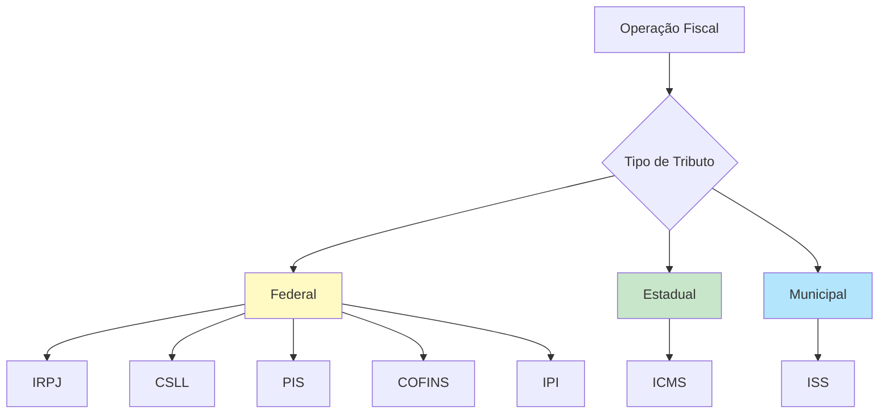
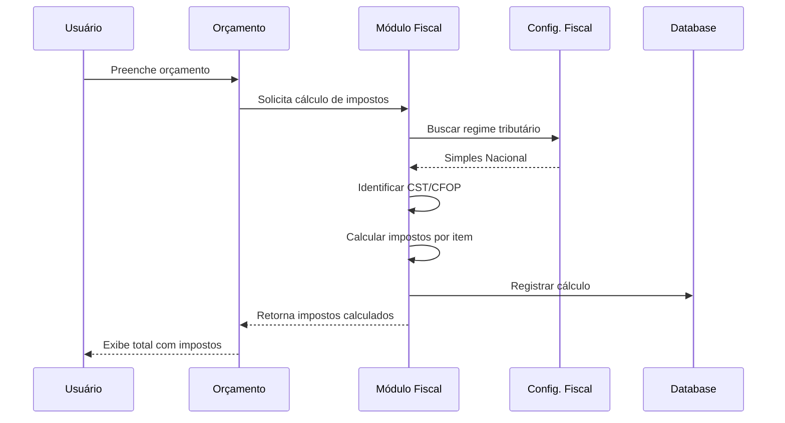
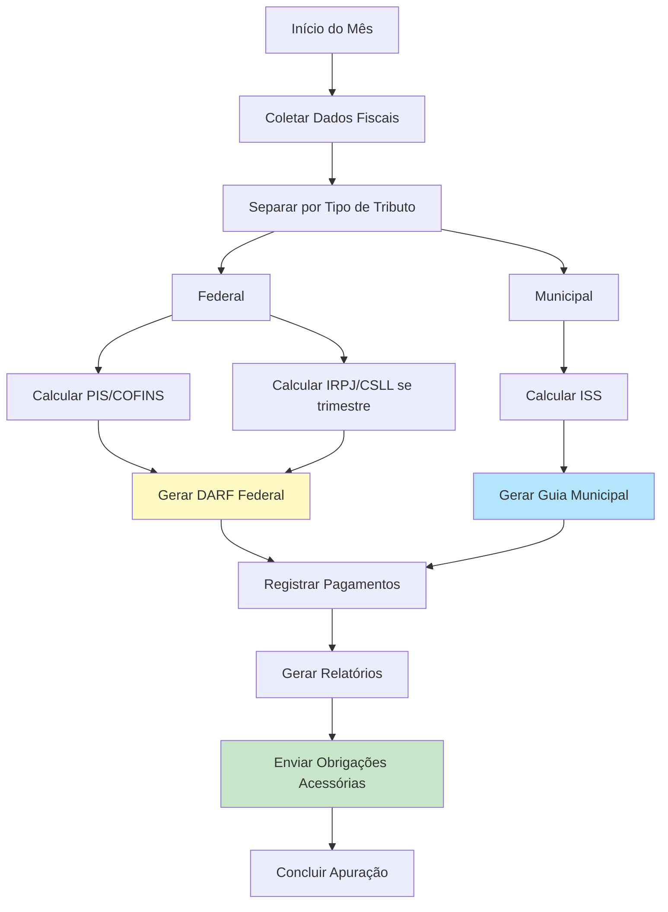

# 🧾 Módulo Fiscal - Regras de Negócio

## 🎯 Visão Geral

O Módulo Fiscal do ERP Retífica gerencia toda a tributação, obrigações acessórias e apuração de impostos, garantindo conformidade com a legislação brasileira para os principais regimes tributários.

---

## 📋 Regimes Tributários Suportados

### 1. Simples Nacional
**Público-alvo**: Empresas com faturamento até R$ 4,8 milhões/ano

**Características**:
- Tributação simplificada em guia única (DAS)
- Alíquotas progressivas por faixa de faturamento
- Menos obrigações acessórias
- Não destaca impostos na nota fiscal

**Anexos Aplicáveis para Retíficas**:
- **Anexo III**: Serviços (alíquota 6% a 33%)
- **Anexo II**: Indústria (se fabricar peças)

**Impostos incluídos no DAS**:
- IRPJ, CSLL, PIS, COFINS, IPI, CPP, ICMS/ISS

```typescript
// Cálculo simplificado (Anexo III)
const faturamento12meses = 180000.00;
const faixaAtual = identificarFaixa(faturamento12meses);

// Faixas do Anexo III (valores 2024)
const tabela = [
  { limite: 180000, aliquota: 0.06, deducao: 0 },
  { limite: 360000, aliquota: 0.112, deducao: 9360 },
  { limite: 720000, aliquota: 0.135, deducao: 17640 },
  // ... demais faixas
];

const aliquotaEfetiva = (faturamento12meses * faixaAtual.aliquota - faixaAtual.deducao) / faturamento12meses;
const impostoDevido = valorNota * aliquotaEfetiva;
```

### 2. Lucro Presumido
**Público-alvo**: Empresas com faturamento até R$ 78 milhões/ano

**Características**:
- Base de cálculo presumida (32% da receita bruta para serviços)
- Apuração trimestral (IRPJ e CSLL)
- Destaca impostos na nota
- Mais obrigações que Simples

**Impostos**:
- **IRPJ**: 15% sobre lucro presumido (+ 10% sobre excedente de R$ 60k/trimestre)
- **CSLL**: 9% sobre lucro presumido
- **PIS**: 0,65% sobre faturamento
- **COFINS**: 3% sobre faturamento
- **ISS**: Varia por município (2% a 5%)

```typescript
// Exemplo de cálculo
const faturamentoTrimestre = 150000.00;
const lucroPresumido = faturamentoTrimestre * 0.32; // R$ 48.000

const irpj = lucroPresumido * 0.15; // R$ 7.200
const csll = lucroPresumido * 0.09; // R$ 4.320
const pis = faturamentoTrimestre * 0.0065; // R$ 975
const cofins = faturamentoTrimestre * 0.03; // R$ 4.500
const iss = faturamentoTrimestre * 0.05; // R$ 7.500 (5% exemplo)

const totalImpostos = irpj + csll + pis + cofins + iss; // R$ 24.495
```

### 3. Lucro Real
**Público-alvo**: Empresas com faturamento > R$ 78 milhões ou obrigadas por atividade

**Características**:
- Tributação sobre lucro contábil efetivo
- Apuração trimestral ou anual (com antecipações mensais)
- Permite compensação de prejuízos
- Máximo de obrigações acessórias

**Impostos**:
- **IRPJ**: 15% + 10% (sobre lucro real)
- **CSLL**: 9% (sobre lucro real)
- **PIS**: 1,65% (não cumulativo)
- **COFINS**: 7,6% (não cumulativo)
- **ISS**: Varia por município

---

## 🏛️ Jurisdições Fiscais



### Federal
- **Responsável**: Receita Federal do Brasil
- **Impostos**: IRPJ, CSLL, PIS, COFINS, IPI
- **Obrigações**: DCTF, EFD-Contribuições, ECF

### Estadual
- **Responsável**: SEFAZ de cada estado
- **Impostos**: ICMS (quando aplicável - venda de peças)
- **Obrigações**: SPED Fiscal, GIA

### Municipal
- **Responsável**: Prefeitura local
- **Impostos**: ISS (Imposto Sobre Serviços)
- **Obrigações**: Nota Fiscal Eletrônica de Serviços (NFS-e)

---

## 📊 Classificações Fiscais

### 1. NCM (Nomenclatura Comum do Mercosul)
Código de 8 dígitos para classificar mercadorias (peças):

**Exemplos**:
- **8409.91.10**: Blocos de cilindros, cabeçotes
- **8409.91.20**: Bielas
- **8409.91.30**: Virabrequins
- **8409.91.40**: Pistões
- **8409.91.90**: Outras peças de motores

### 2. CFOP (Código Fiscal de Operações e Prestações)
Código de 4 dígitos que identifica a natureza da operação:

**Saídas (Vendas/Serviços)**:
- **5.101**: Venda de produção própria (dentro do estado)
- **5.102**: Venda de mercadoria adquirida para revenda
- **5.933**: Prestação de serviço tributado pelo ISSQN (retífica)
- **6.101**: Venda para fora do estado
- **6.933**: Prestação de serviço fora do estado

**Entradas (Compras)**:
- **1.101**: Compra para industrialização
- **1.102**: Compra para revenda
- **2.101**: Compra de fora do estado

### 3. CST/CSOSN (Código de Situação Tributária)

#### CST (Regimes Lucro Presumido/Real)
- **00**: Tributada integralmente
- **20**: Com redução de base de cálculo
- **30**: Isenta ou não tributada
- **40**: Isenta
- **41**: Não tributada
- **60**: ICMS cobrado anteriormente por substituição tributária

#### CSOSN (Simples Nacional)
- **101**: Tributada pelo Simples Nacional
- **102**: Sem permissão de crédito
- **103**: Isenção do ICMS para faixa de receita bruta
- **201**: Tributada com permissão de crédito
- **500**: ICMS cobrado anteriormente

---

## 💰 Tipos de Impostos

### 1. ISS (Imposto Sobre Serviços)
**Incidência**: Serviços de retífica, montagem, diagnóstico

**Alíquota**: 2% a 5% (varia por município)

**Base de cálculo**: Valor total do serviço

**Responsável**: Tomador ou prestador (conforme legislação municipal)

```typescript
// Cálculo ISS
const valorServico = 5000.00;
const aliquotaISS = 0.05; // 5% (exemplo São Paulo)
const iss = valorServico * aliquotaISS; // R$ 250,00
```

### 2. ICMS (Imposto sobre Circulação de Mercadorias)
**Incidência**: Venda de peças (não se aplica a serviços)

**Alíquota**: Varia por estado (7% a 18%)

**Observação**: Retíficas geralmente NÃO são contribuintes de ICMS, exceto quando vendem peças como comércio.

### 3. PIS (Programa de Integração Social)
**Regimes**:
- **Cumulativo**: 0,65% (Lucro Presumido)
- **Não cumulativo**: 1,65% (Lucro Real) - permite créditos

### 4. COFINS (Contribuição para Financiamento da Seguridade Social)
**Regimes**:
- **Cumulativo**: 3% (Lucro Presumido)
- **Não cumulativo**: 7,6% (Lucro Real) - permite créditos

### 5. IRPJ (Imposto de Renda Pessoa Jurídica)
**Alíquota**: 15% + 10% (sobre lucro > R$ 20k/mês)

**Base de cálculo**:
- Lucro Real: Lucro contábil ajustado
- Lucro Presumido: 32% da receita bruta (serviços)

### 6. CSLL (Contribuição Social sobre o Lucro Líquido)
**Alíquota**: 9%

**Base de cálculo**: Mesma do IRPJ

---

## 🧮 Cálculo de Impostos no Orçamento/Nota Fiscal



### Exemplo Prático: Orçamento Completo

```typescript
// Dados do orçamento
const orcamento = {
  servicos: 3500.00,
  pecas: 2500.00,
  maoDeObra: 1200.00
};

const subtotal = 7200.00;

// Configuração fiscal da empresa
const regime = "simples_nacional";
const aliquotaSimples = 0.065; // 6.5% (Anexo III - faixa exemplo)

// Cálculo de impostos
if (regime === "simples_nacional") {
  // Simples não destaca impostos, mas pode informar
  const impostoAproximado = subtotal * aliquotaSimples; // R$ 468,00
  const total = subtotal; // Não adiciona ao valor (já incluso)
  
  // Informação na nota: "Tributos aproximados: R$ 468,00"
  
} else if (regime === "lucro_presumido") {
  // Destaca impostos
  const pis = subtotal * 0.0065; // R$ 46,80
  const cofins = subtotal * 0.03; // R$ 216,00
  const iss = orcamento.servicos * 0.05; // R$ 175,00 (só sobre serviços)
  
  const totalImpostos = pis + cofins + iss; // R$ 437,80
  const total = subtotal + totalImpostos; // R$ 7.637,80
}
```

---

## 📁 Obrigações Acessórias

### 1. SPED Fiscal (EFD ICMS/IPI)
**Quem entrega**: Contribuintes de ICMS/IPI

**Periodicidade**: Mensal

**Prazo**: Até o dia 25 do mês seguinte

**Conteúdo**:
- Todas as entradas e saídas de mercadorias
- Inventário
- Apuração de ICMS/IPI

**Status no ERP**: ⚠️ **Parcialmente implementado** (retíficas geralmente não precisam)

### 2. EFD-Contribuições (SPED PIS/COFINS)
**Quem entrega**: Pessoas jurídicas do Lucro Presumido/Real

**Periodicidade**: Mensal

**Prazo**: Até o 10º dia útil do 2º mês seguinte

**Conteúdo**:
- Receitas
- Créditos de PIS/COFINS (não cumulativo)
- Apuração

**Status no ERP**: ✅ **Implementado** (geração de arquivo)

### 3. DCTF (Declaração de Débitos e Créditos Tributários Federais)
**Quem entrega**: Todas as pessoas jurídicas (exceto Simples em alguns casos)

**Periodicidade**: Mensal

**Prazo**: Até o 15º dia útil do 2º mês seguinte

**Conteúdo**:
- Débitos federais (IRPJ, CSLL, PIS, COFINS, etc.)
- Pagamentos efetuados

**Status no ERP**: 🔄 **Em desenvolvimento**

### 4. ECF (Escrituração Contábil Fiscal)
**Quem entrega**: Pessoas jurídicas do Lucro Presumido/Real

**Periodicidade**: Anual

**Prazo**: Último dia útil de julho do ano seguinte

**Conteúdo**:
- Lucro contábil
- Ajustes fiscais
- Apuração de IRPJ e CSLL

**Status no ERP**: 🔄 **Em desenvolvimento**

### 5. DEFIS (Declaração de Informações Socioeconômicas e Fiscais)
**Quem entrega**: Empresas do Simples Nacional

**Periodicidade**: Anual

**Prazo**: 31 de março

**Conteúdo**:
- Faturamento mensal
- Dados de empregados
- Informações patrimoniais

**Status no ERP**: 🔄 **Planejado**

### 6. NFS-e (Nota Fiscal de Serviços Eletrônica)
**Quem emite**: Prestadores de serviços

**Quando**: A cada serviço prestado

**Integração**: Via API da prefeitura (cada cidade tem seu padrão)

**Status no ERP**: ✅ **Implementado** (integração configurável por município)

---

## 📊 Apuração Fiscal Mensal



### Processo Automatizado

```typescript
// Executado automaticamente no dia 1º de cada mês
async function apuracaoFiscalMensal(orgId, referenceMonth) {
  // 1. Coletar todos os orçamentos aprovados do mês
  const budgets = await getApprovedBudgets(orgId, referenceMonth);
  
  // 2. Coletar todas as notas fiscais emitidas
  const invoices = await getIssuedInvoices(orgId, referenceMonth);
  
  // 3. Calcular totais por tipo de receita
  const totals = {
    receita_servicos: 0,
    receita_pecas: 0,
    receita_total: 0
  };
  
  for (const invoice of invoices) {
    totals.receita_servicos += invoice.services_value;
    totals.receita_pecas += invoice.parts_value;
  }
  totals.receita_total = totals.receita_servicos + totals.receita_pecas;
  
  // 4. Buscar regime tributário
  const fiscalConfig = await getFiscalConfig(orgId);
  
  // 5. Calcular impostos conforme regime
  let impostos = {};
  
  if (fiscalConfig.regime === 'simples_nacional') {
    impostos = calcularSimples(totals.receita_total, fiscalConfig);
  } else if (fiscalConfig.regime === 'lucro_presumido') {
    impostos = calcularLucroPresumido(totals, fiscalConfig);
  } else if (fiscalConfig.regime === 'lucro_real') {
    impostos = calcularLucroReal(totals, fiscalConfig);
  }
  
  // 6. Registrar apuração
  const apuracao = await createFiscalAppraisal({
    org_id: orgId,
    reference_month: referenceMonth,
    revenue: totals,
    taxes: impostos,
    status: 'pending_payment'
  });
  
  // 7. Gerar guias de pagamento (DARFs, ISS)
  await generatePaymentSlips(apuracao);
  
  // 8. Notificar responsável fiscal
  await notifyFiscalManager(orgId, apuracao);
  
  return apuracao;
}
```

---

## 📄 Relatórios Fiscais

### 1. Relatório de Faturamento Mensal
- Receitas por tipo (serviços, peças, mão de obra)
- Comparação mês a mês
- Gráfico de evolução
- Exportação para Excel/PDF

### 2. Relatório de Impostos Pagos
- Por tipo de imposto
- Por período
- Comparação com faturamento (carga tributária %)
- Projeção de impostos futuros

### 3. Livro de Registro de Serviços Prestados
- Todas as NFS-e emitidas
- Dados do tomador
- Valores e impostos
- Base de cálculo ISS

### 4. Demonstrativo de Apuração
- Base de cálculo de cada imposto
- Alíquotas aplicadas
- Valores devidos
- Vencimentos e pagamentos

### 5. Posição de Obrigações Acessórias
- Obrigações do mês/ano
- Status (pendente, entregue, atrasada)
- Prazos
- Alertas de vencimento

---

## ⚙️ Configuração Fiscal da Empresa

### Dados Obrigatórios
```typescript
{
  "org_id": "uuid",
  "tax_regime": "simples_nacional" | "lucro_presumido" | "lucro_real",
  "cnae_principal": "2950-6/00", // Recondicionamento de motores
  "state_registration": "123.456.789", // IE (se contribuinte ICMS)
  "municipal_registration": "98765432", // IM
  "iss_rate": 0.05, // Alíquota ISS do município
  "simples_annex": "III", // Se Simples Nacional
  "accountant": {
    "name": "José Silva",
    "cpf": "123.456.789-00",
    "crc": "CRC-SP 123456/O-0",
    "email": "contador@empresa.com.br",
    "phone": "(11) 99999-9999"
  },
  "nfse_config": {
    "city_code": "3550308", // São Paulo
    "provider": "ginfes", // Padrão da prefeitura
    "username": "empresa_login",
    "password_encrypted": "...",
    "certificate": "..." // Certificado digital A1/A3
  }
}
```

---

## 🔒 Permissões

| Ação | Super Admin | Owner | Admin | Manager | Operator | Viewer |
|------|-------------|-------|-------|---------|----------|--------|
| Ver Relatórios Fiscais | ✅ | ✅ | ✅ | 📖 | ❌ | ❌ |
| Configurar Regime | ✅ | ✅ | ✅ | ❌ | ❌ | ❌ |
| Gerar SPED | ✅ | ✅ | ✅ | ❌ | ❌ | ❌ |
| Fazer Apuração | ✅ | ✅ | ✅ | 📖 | ❌ | ❌ |
| Emitir NFS-e | ✅ | ✅ | ✅ | ✅ | ✏️ | ❌ |

---

## 🚨 Alertas Fiscais

### Automáticos
- ⚠️ Obrigação acessória vencendo em 5 dias
- 🔴 Obrigação atrasada
- 💰 Impostos a pagar no mês
- 📊 Mudança de faixa do Simples Nacional
- 🎯 Faturamento próximo ao limite do regime

### Configuráveis
- Meta de faturamento mensal
- Carga tributária acima de X%
- Necessidade de provisionamento de impostos

---

**Última Atualização**: 2025-01-14  
**Versão**: 1.0.0
