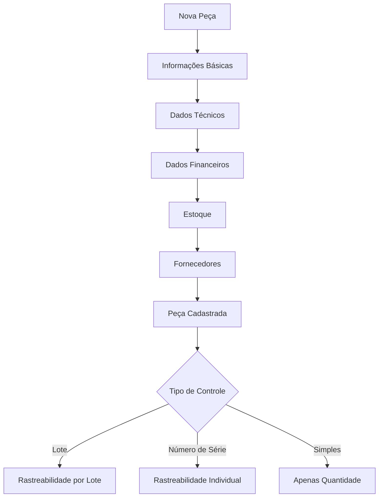
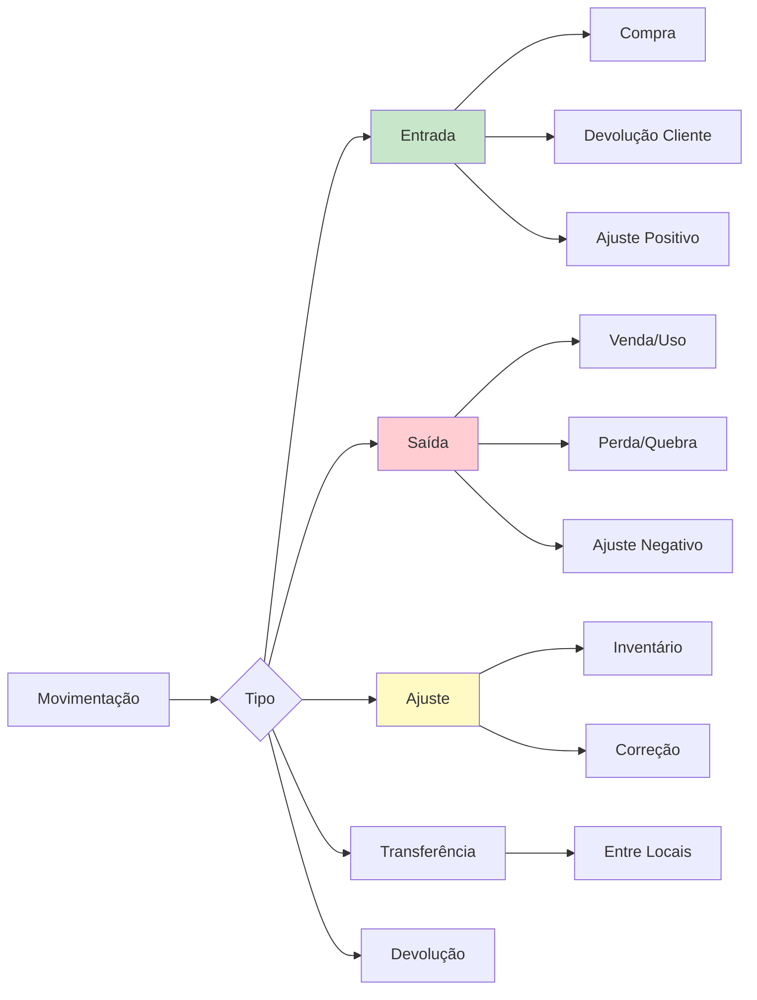
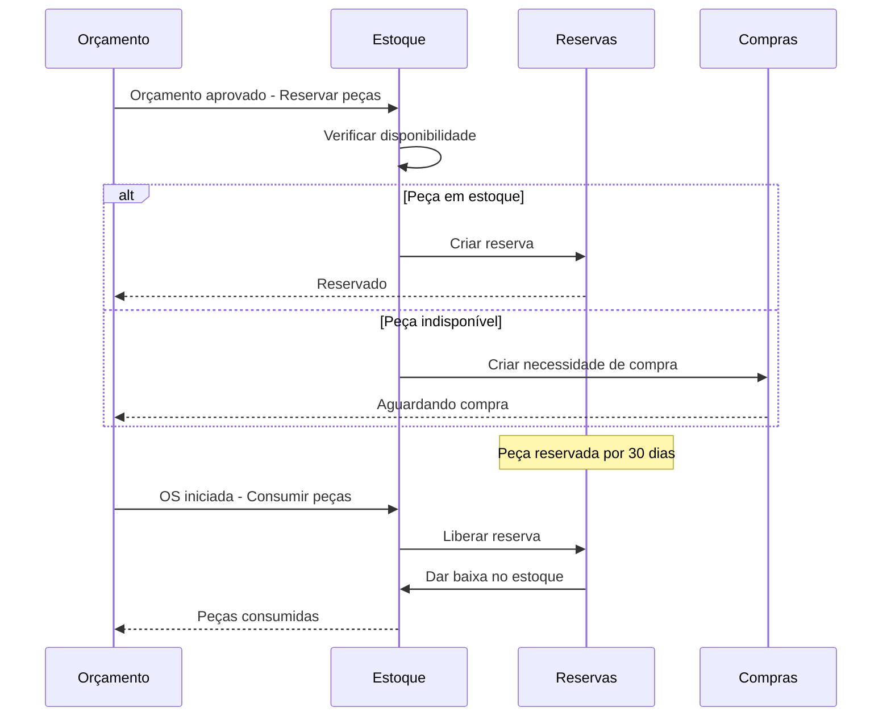
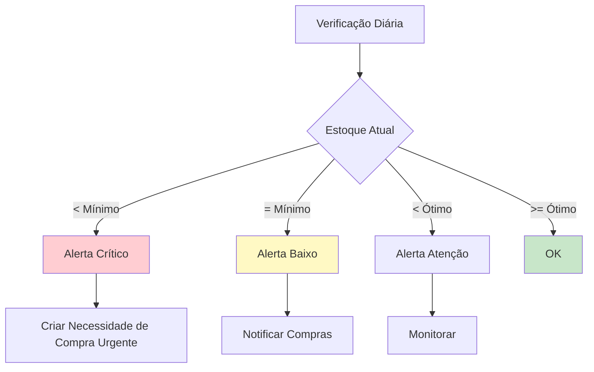
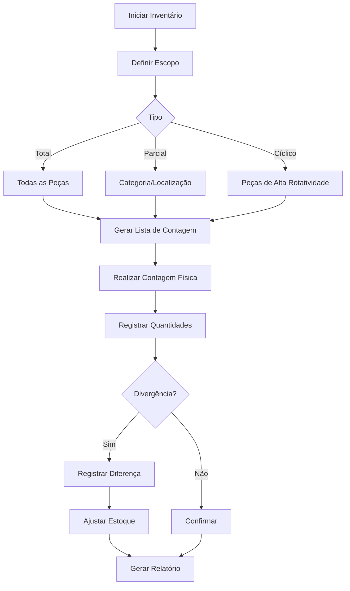

# 📦 Módulo de Estoque - Regras de Negócio

## 🎯 Visão Geral

O Módulo de Estoque gerencia todo o inventário de peças e materiais, controlando entradas, saídas, reservas, alertas de estoque baixo, contagens físicas e rastreabilidade completa.

---

## 🏷️ Cadastro de Peças



### Estrutura de Dados

```typescript
interface InventoryPart {
  // Identificação
  id: string;
  org_id: string;
  code: string; // Código interno (ex: "PST-001-STD")
  sku: string; // Código alternativo
  barcode?: string; // Código de barras
  
  // Descrição
  name: string; // "Pistão STD Completo"
  description: string;
  manufacturer: string; // "Mahle"
  manufacturer_code?: string; // Código do fabricante
  
  // Classificação
  category: 'pistoes' | 'aneis' | 'bronzinas' | 'juntas' | 'retentores' 
    | 'valvulas' | 'guias' | 'molas' | 'correntes' | 'correias' | 'bombas' 
    | 'outros';
  subcategory?: string;
  
  // Aplicação
  applications: string[]; // ["Motor Diesel", "4 cilindros"]
  compatible_engines: string[]; // IDs de tipos de motor
  
  // Dados Técnicos
  technical_specs: {
    diameter?: number; // mm
    length?: number; // mm
    weight?: number; // kg
    material?: string;
    finish?: string;
    other_specs?: Record<string, any>;
  };
  
  // Estoque
  unit_type: 'piece' | 'kit' | 'meter' | 'liter' | 'kg';
  current_quantity: number;
  minimum_stock: number; // Alerta de estoque baixo
  maximum_stock?: number;
  optimal_stock?: number; // Quantidade ideal
  
  // Localização Física
  warehouse_location?: string; // "Prateleira A1"
  storage_zone?: string; // "Zona de Pistões"
  
  // Controle
  tracking_type: 'simple' | 'lot' | 'serial_number';
  lot_control: boolean;
  expiry_control: boolean; // Para itens perecíveis
  
  // Financeiro
  unit_cost: number; // Custo médio
  selling_price: number;
  margin_percentage: number;
  last_purchase_price?: number;
  last_purchase_date?: Date;
  
  // Fornecedores
  preferred_supplier_id?: string;
  suppliers: Array<{
    supplier_id: string;
    supplier_code: string;
    lead_time_days: number;
    minimum_order_quantity: number;
    last_price: number;
    is_active: boolean;
  }>;
  
  // Flags
  is_active: boolean;
  is_reserved: boolean;
  requires_inspection: boolean; // Inspeção ao receber
  
  // Metadados
  photo_url?: string;
  notes?: string;
  created_at: Date;
  updated_at: Date;
}
```

---

## 📥 Movimentações de Estoque



### Tipos de Movimentação

#### 1. Entrada por Compra
```typescript
async function receivePartFromPurchase(poId, receivingData) {
  const po = await getPurchaseOrder(poId);
  
  for (const item of receivingData.items) {
    // Criar movimentação
    await createInventoryMovement({
      org_id: po.org_id,
      part_id: item.part_id,
      movement_type: 'in',
      reason: 'purchase',
      quantity: item.quantity_received,
      unit_cost: item.unit_price,
      total_cost: item.quantity_received * item.unit_price,
      reference_type: 'purchase_order',
      reference_id: poId,
      supplier_id: po.supplier_id,
      invoice_number: receivingData.invoice_number,
      lot_number: item.lot_number, // Se controle de lote
      expiry_date: item.expiry_date, // Se aplicável
      warehouse_location: item.location,
      notes: receivingData.notes,
      created_by: receivingData.received_by
    });
    
    // Atualizar quantidade em estoque
    await updatePartQuantity({
      part_id: item.part_id,
      delta: item.quantity_received,
      new_cost: recalculateAverageCost(item.part_id, item.unit_price, item.quantity_received)
    });
    
    // Se tinha reserva pendente, marcar como disponível
    await checkPendingReservations(item.part_id);
  }
}
```

#### 2. Saída por Uso em OS
```typescript
async function consumePartInOrder(orderId, consumptionData) {
  const order = await getOrder(orderId);
  
  for (const item of consumptionData.items) {
    // Verificar se tem reserva
    const reservation = await getReservation({
      part_id: item.part_id,
      reference_id: order.budget_id
    });
    
    if (reservation) {
      // Liberar reserva
      await releaseReservation(reservation.id, item.quantity);
    }
    
    // Criar movimentação de saída
    await createInventoryMovement({
      org_id: order.org_id,
      part_id: item.part_id,
      movement_type: 'out',
      reason: 'production_use',
      quantity: item.quantity,
      unit_cost: await getCurrentAverageCost(item.part_id),
      reference_type: 'order',
      reference_id: orderId,
      consumed_by: consumptionData.technician_id,
      notes: `Usado em OS ${order.number}`,
      created_by: consumptionData.registered_by
    });
    
    // Atualizar estoque
    await updatePartQuantity({
      part_id: item.part_id,
      delta: -item.quantity
    });
    
    // Verificar estoque mínimo
    await checkMinimumStock(item.part_id);
  }
}
```

#### 3. Ajuste Manual
```typescript
async function adjustInventory(adjustmentData) {
  // Para correções, perdas, quebras, etc.
  await createInventoryMovement({
    org_id: adjustmentData.org_id,
    part_id: adjustmentData.part_id,
    movement_type: adjustmentData.delta > 0 ? 'in' : 'out',
    reason: 'adjustment',
    quantity: Math.abs(adjustmentData.delta),
    adjustment_reason: adjustmentData.reason, // 'loss', 'damage', 'found', 'correction'
    unit_cost: await getCurrentAverageCost(adjustmentData.part_id),
    notes: adjustmentData.notes,
    requires_approval: Math.abs(adjustmentData.delta * unit_cost) > 500, // > R$ 500 precisa aprovação
    created_by: adjustmentData.user_id
  });
  
  // Se precisa aprovação, aguardar
  if (!requires_approval) {
    await updatePartQuantity({
      part_id: adjustmentData.part_id,
      delta: adjustmentData.delta
    });
  }
}
```

#### 4. Transferência entre Locais
```typescript
async function transferPartLocation(transferData) {
  await createInventoryMovement({
    org_id: transferData.org_id,
    part_id: transferData.part_id,
    movement_type: 'transfer',
    reason: 'location_transfer',
    quantity: transferData.quantity,
    from_location: transferData.from_location,
    to_location: transferData.to_location,
    notes: transferData.notes,
    created_by: transferData.user_id
  });
  
  // Atualizar localização da peça
  await updatePartLocation(transferData.part_id, transferData.to_location);
}
```

---

## 🔒 Sistema de Reservas



### Criação de Reserva
```typescript
async function reservePartsFromBudget(budgetId) {
  const budget = await getBudget(budgetId);
  const parts = await getBudgetParts(budgetId);
  
  for (const part of parts) {
    const available = await getPartAvailableQuantity(part.part_id);
    
    if (available >= part.quantity) {
      // Reservar
      await createReservation({
        org_id: budget.org_id,
        part_id: part.part_id,
        quantity: part.quantity,
        reserved_for: 'budget',
        reference_id: budgetId,
        order_id: budget.order_id,
        status: 'reserved',
        reserved_at: new Date(),
        expires_at: addDays(new Date(), 30), // 30 dias
        reserved_by: budget.approved_by
      });
      
      // Atualizar quantidade disponível (não altera estoque físico)
      await updatePartAvailability(part.part_id, -part.quantity);
      
    } else {
      // Reservar disponível + criar necessidade de compra para faltante
      const deficit = part.quantity - available;
      
      if (available > 0) {
        await createReservation({...});
        await updatePartAvailability(part.part_id, -available);
      }
      
      await createPurchaseNeed({
        part_id: part.part_id,
        quantity_needed: deficit,
        priority: 'high',
        reason: `Faltante para orçamento ${budget.number}`,
        required_by: budget.expected_delivery,
        generated_from: 'budget_approval',
        reference_id: budgetId
      });
    }
  }
}
```

### Liberação de Reserva
```typescript
async function releaseReservation(reservationId, quantityUsed) {
  const reservation = await getReservation(reservationId);
  
  if (quantityUsed < reservation.quantity) {
    // Usou menos que reservado - liberar o excedente
    const excess = reservation.quantity - quantityUsed;
    
    await updateReservation(reservationId, {
      quantity: quantityUsed,
      status: 'released',
      released_at: new Date()
    });
    
    await updatePartAvailability(reservation.part_id, excess);
    
  } else {
    // Usou tudo
    await updateReservation(reservationId, {
      status: 'released',
      released_at: new Date()
    });
  }
}
```

### Expiração de Reservas
```typescript
// Job diário que verifica reservas expiradas
async function checkExpiredReservations() {
  const expired = await getReservations({
    status: 'reserved',
    expires_at: { lessThan: new Date() }
  });
  
  for (const reservation of expired) {
    // Liberar reserva
    await updateReservation(reservation.id, {
      status: 'expired',
      expired_at: new Date()
    });
    
    // Devolver disponibilidade ao estoque
    await updatePartAvailability(reservation.part_id, reservation.quantity);
    
    // Notificar responsável
    await notify('reservation_expired', {
      reservation_id: reservation.id,
      part: reservation.part_name,
      quantity: reservation.quantity
    });
  }
}
```

---

## ⚠️ Alertas de Estoque



### Níveis de Alerta
```typescript
// Job diário
async function checkStockLevels() {
  const parts = await getAllActiveParts();
  
  for (const part of parts) {
    const currentQty = await getPartAvailableQuantity(part.id);
    const reserved = await getReservedQuantity(part.id);
    const available = currentQty - reserved;
    
    if (available <= 0 && reserved > 0) {
      // Peça totalmente reservada
      await createAlert({
        type: 'stock_fully_reserved',
        severity: 'warning',
        title: `${part.name} - Totalmente reservado`,
        description: `Quantidade em estoque: ${currentQty}, Reservado: ${reserved}`,
        reference_id: part.id,
        assigned_to: 'purchasing_team'
      });
      
    } else if (available < part.minimum_stock) {
      // Abaixo do mínimo
      const urgency = available === 0 ? 'critical' : 'high';
      
      await createAlert({
        type: 'stock_below_minimum',
        severity: urgency === 'critical' ? 'critical' : 'warning',
        title: `${part.name} - Estoque crítico`,
        description: `Disponível: ${available}, Mínimo: ${part.minimum_stock}`,
        reference_id: part.id,
        assigned_to: 'purchasing_team'
      });
      
      // Criar necessidade de compra automática
      const quantityToOrder = part.optimal_stock 
        ? part.optimal_stock - available 
        : part.minimum_stock * 2;
      
      await createPurchaseNeed({
        part_id: part.id,
        quantity_needed: quantityToOrder,
        priority: urgency,
        reason: 'stock_below_minimum',
        auto_generated: true
      });
    }
  }
}
```

---

## 📊 Contagem Física (Inventário)



### Processo de Inventário
```typescript
async function startInventoryCount(inventoryData) {
  // 1. Criar inventário
  const inventory = await createInventory({
    org_id: inventoryData.org_id,
    type: inventoryData.type, // 'full', 'partial', 'cyclic'
    scope: inventoryData.scope, // 'all', 'category', 'location'
    scheduled_date: inventoryData.date,
    status: 'planned',
    created_by: inventoryData.user_id
  });
  
  // 2. Gerar lista de peças a contar
  let partsToCount = [];
  
  if (inventoryData.type === 'full') {
    partsToCount = await getAllActiveParts();
  } else if (inventoryData.scope === 'category') {
    partsToCount = await getPartsByCategory(inventoryData.category);
  } else if (inventoryData.scope === 'location') {
    partsToCount = await getPartsByLocation(inventoryData.location);
  }
  
  // 3. Criar itens de contagem
  for (const part of partsToCount) {
    await createInventoryCountItem({
      inventory_id: inventory.id,
      part_id: part.id,
      system_quantity: part.current_quantity,
      counted_quantity: null, // A ser preenchido
      variance: null,
      status: 'pending'
    });
  }
  
  return inventory;
}

async function registerCount(itemId, countData) {
  const item = await getInventoryCountItem(itemId);
  
  // Registrar contagem
  await updateInventoryCountItem(itemId, {
    counted_quantity: countData.quantity,
    counted_by: countData.user_id,
    counted_at: new Date(),
    variance: countData.quantity - item.system_quantity,
    notes: countData.notes,
    status: 'counted'
  });
  
  // Se divergência, criar ajuste
  if (countData.quantity !== item.system_quantity) {
    const variance = countData.quantity - item.system_quantity;
    
    await createInventoryAdjustment({
      inventory_id: item.inventory_id,
      part_id: item.part_id,
      variance: variance,
      reason: 'physical_count',
      requires_approval: Math.abs(variance) > 10 || 
        (Math.abs(variance) * item.part.unit_cost) > 500,
      status: 'pending_approval'
    });
  }
}

async function finalizeInventory(inventoryId) {
  const inventory = await getInventory(inventoryId);
  
  // Aplicar todos os ajustes aprovados
  const adjustments = await getInventoryAdjustments({
    inventory_id: inventoryId,
    status: 'approved'
  });
  
  for (const adj of adjustments) {
    await applyInventoryAdjustment(adj.id);
  }
  
  // Gerar relatório
  const report = await generateInventoryReport(inventoryId);
  
  // Concluir
  await updateInventory(inventoryId, {
    status: 'completed',
    completed_at: new Date(),
    report_url: report.url
  });
}
```

---

## 🔍 Rastreabilidade

### Por Lote
```typescript
interface LotTracking {
  lot_number: string;
  part_id: string;
  quantity: number;
  received_date: Date;
  expiry_date?: Date;
  supplier_id: string;
  purchase_order_id: string;
  quality_status: 'approved' | 'quarantine' | 'rejected';
  current_location: string;
  
  // Movimentações deste lote
  movements: Array<{
    movement_id: string;
    quantity: number;
    date: Date;
    type: 'in' | 'out';
    reference: string;
  }>;
}

// Rastrear onde está um lote específico
async function trackLot(lotNumber) {
  const lot = await getLot(lotNumber);
  const movements = await getLotMovements(lotNumber);
  const currentStock = await getLotCurrentStock(lotNumber);
  
  return {
    lot_info: lot,
    history: movements,
    current_stock: currentStock,
    used_in_orders: await getOrdersUsingLot(lotNumber)
  };
}
```

### Por Número de Série (Peças Críticas)
```typescript
// Para peças de alto valor que precisam rastreamento individual
interface SerialNumberTracking {
  serial_number: string;
  part_id: string;
  received_date: Date;
  supplier_id: string;
  warranty_until?: Date;
  status: 'in_stock' | 'reserved' | 'used' | 'returned';
  
  // Histórico completo
  history: Array<{
    date: Date;
    action: 'received' | 'reserved' | 'used' | 'returned';
    order_id?: string;
    user_id: string;
  }>;
}
```

---

## 📈 Relatórios de Estoque

### 1. Posição de Estoque
- Lista completa de peças
- Quantidade atual, reservada, disponível
- Valor em estoque (custo médio)
- Status de cada peça

### 2. Curva ABC
- **Classe A**: 20% das peças que representam 80% do valor
- **Classe B**: 30% das peças que representam 15% do valor
- **Classe C**: 50% das peças que representam 5% do valor

### 3. Giro de Estoque
```typescript
turnoverRate = (Custo das Saídas) / (Estoque Médio)
```

### 4. Acuracidade de Inventário
```typescript
accuracy = (Itens Corretos / Total de Itens Contados) * 100
```

---

## 🔒 Permissões

| Ação | Super Admin | Owner | Admin | Manager | Operator | Viewer |
|------|-------------|-------|-------|---------|----------|--------|
| Ver Estoque | ✅ | ✅ | ✅ | ✅ | ✅ | 📖 |
| Cadastrar Peça | ✅ | ✅ | ✅ | ✅ | ❌ | ❌ |
| Editar Peça | ✅ | ✅ | ✅ | ✅ | ❌ | ❌ |
| Entrada de Estoque | ✅ | ✅ | ✅ | ✅ | ✏️ | ❌ |
| Saída de Estoque | ✅ | ✅ | ✅ | ✅ | ✏️ | ❌ |
| Ajuste de Estoque | ✅ | ✅ | ✅ | ❌ | ❌ | ❌ |
| Fazer Inventário | ✅ | ✅ | ✅ | ✅ | ✏️ | ❌ |
| Aprovar Ajustes | ✅ | ✅ | ✅ | ❌ | ❌ | ❌ |

---

**Última Atualização**: 2025-01-14  
**Versão**: 1.0.0
