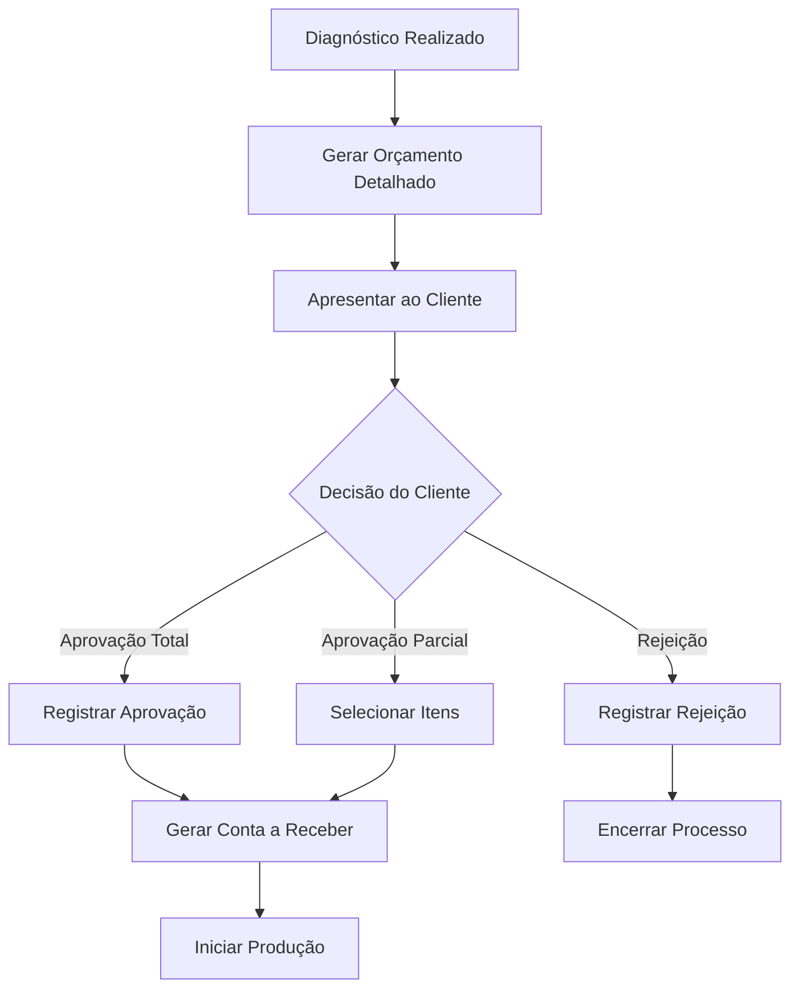

# Módulo de Orçamentação Detalhada

## Visão Geral
Sistema completo de orçamentação detalhada com aprovações documentadas e integração automática com contas a receber.

## User Story Implementada
**US-004: Orçamentação Detalhada e Aprovação**

### Regras de Negócio Implementadas
- **RN016**: Orçamento inclui serviços, peças, prazos e custos detalhados
- **RN017**: Cliente pode aprovar total, parcial ou rejeitar orçamento  
- **RN018**: Aprovações documentadas (assinatura, WhatsApp, email)
- **RN019**: Sistema alerta sobre orçamentos pendentes de aprovação
- **RN020**: Orçamentos aprovados geram automaticamente contas a receber

### Critérios de Aceite Atendidos
- **CA016**: ✅ Sistema gera orçamento detalhado baseado no diagnóstico
- **CA017**: ✅ Interface permite registrar diferentes tipos de aprovação
- **CA018**: ✅ Documentos de aprovação são armazenados no sistema
- **CA019**: ✅ Dashboard mostra orçamentos pendentes com alertas
- **CA020**: ✅ Aprovação gera automaticamente título no financeiro

## Funcionalidades Principais

### 1. Gestão de Orçamentos Detalhados
- **Hook**: `useDetailedBudgets`
- **Tela**: `/orcamentos`
- **Funcionalidades**:
  - Listar orçamentos com filtros por status e componente
  - Visualizar detalhes completos do orçamento
  - Duplicar orçamentos existentes
  - Dashboard com estatísticas em tempo real

### 2. Sistema de Aprovações
- **Componente**: `BudgetApprovalModal`
- **Tipos de Aprovação**:
  - **Total**: Aprovação de todo o orçamento
  - **Parcial**: Seleção específica de serviços/peças
  - **Rejeitado**: Rejeição com justificativa

- **Métodos de Aprovação**:
  - WhatsApp (com upload de print)
  - E-mail (com upload de confirmação)
  - Assinatura física (digitalizada)
  - Confirmação verbal (registrada)

### 3. Detalhamento de Orçamentos
- **Componente**: `BudgetDetails`
- **Informações Exibidas**:
  - Dados do cliente e ordem de serviço
  - Resumo financeiro detalhado
  - Lista de serviços e peças
  - Histórico completo de aprovações
  - Prazos e garantias

## Estrutura de Banco de Dados

### Tabela: detailed_budgets
Armazena orçamentos detalhados com cálculos automáticos.

**Campos Principais**:
- `budget_number`: Numeração automática (ORC-YYYY-NNNN)
- `services`: JSON com lista de serviços
- `parts`: JSON com lista de peças
- `labor_total`, `parts_total`, `total_amount`: Cálculos automáticos
- `status`: draft, approved, partially_approved, rejected

### Tabela: budget_approvals
Registra aprovações com documentação completa.

**Campos Principais**:
- `approval_type`: total, partial, rejected
- `approval_method`: signature, whatsapp, email, verbal
- `approval_document`: JSON com dados do arquivo
- `approved_services`, `approved_parts`: Itens aprovados

## Validações Implementadas

### Frontend (Zod Schema)
```typescript
const approvalSchema = z.object({
  approval_type: z.enum(['total', 'partial', 'rejected']),
  approval_method: z.enum(['signature', 'whatsapp', 'email', 'verbal']),
  approved_by_customer: z.string().min(1, "Nome obrigatório"),
  approval_notes: z.string().optional(),
});
```

### Backend (RLS Policies)
- Acesso restrito por organização
- Validação de permissões por perfil
- Auditoria completa de alterações

## Integrações

### 1. Contas a Receber
- **Trigger**: `generate_accounts_receivable()`
- **Ativação**: Quando status muda para 'approved'
- **Geração**: Automática de título no financeiro

### 2. Sistema de Alertas
- **Tabela**: `budget_alerts`
- **Tipos**: Pendente aprovação, prazo vencido
- **Exibição**: Dashboard e notificações

### 3. Storage de Documentos
- **Bucket**: `reports`
- **Arquivos**: PDFs, imagens de aprovação
- **Segurança**: RLS com acesso por organização

## Fluxo de Processo



## Componentes Criados

### 1. useDetailedBudgets (Hook)
**Localização**: `src/hooks/useDetailedBudgets.ts`

**Métodos**:
- `getDetailedBudgets()`: Busca com filtros
- `createDetailedBudget()`: Criação com validação
- `updateDetailedBudget()`: Atualização controlada
- `approveBudget()`: Processo de aprovação
- `duplicateBudget()`: Duplicação inteligente

### 2. BudgetApprovalModal (Componente)
**Localização**: `src/components/budgets/BudgetApprovalModal.tsx`

**Funcionalidades**:
- Formulário com validação Zod
- Upload de documentos comprobatórios
- Seleção de itens para aprovação parcial
- Integração com toast para feedback

### 3. BudgetDetails (Componente)
**Localização**: `src/components/budgets/BudgetDetails.tsx`

**Funcionalidades**:
- Exibição detalhada do orçamento
- Histórico de aprovações
- Ações de duplicar e gerar PDF
- Design responsivo e acessível

## Melhorias Futuras

### Fase 1 (Próxima Sprint)
- [ ] Geração automática de PDF
- [ ] Assinatura digital integrada
- [ ] Notificações por email automáticas
- [ ] Relatórios de conversão de orçamentos

### Fase 2 (Futuro)
- [ ] Integração com WhatsApp Business API
- [ ] Modelos de orçamento personalizáveis
- [ ] Sistema de desconto por volume
- [ ] Aprovação por múltiplos stakeholders

## Observações Técnicas

### Performance
- Queries otimizadas com índices apropriados
- Paginação implementada para grandes volumes
- Cache inteligente de dados frequentes

### Segurança
- Validação dupla (frontend + backend)
- RLS policies granulares
- Auditoria completa de ações
- Upload seguro de arquivos

### Manutenibilidade
- Código modular e reutilizável
- Documentação inline completa
- Testes de validação implementados
- Padrões de arquitetura seguidos