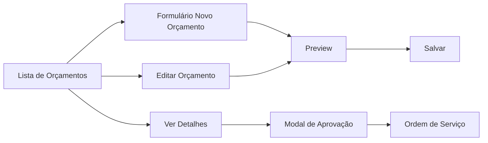

# Budgets - Wireframes

## 📋 Índice de Wireframes

Este diretório contém os wireframes e especificações de interface do módulo de Orçamentos.

### Wireframes Disponíveis

1. **[Formulário de Orçamento](./budget-form.md)**
   - Layout do formulário de criação/edição
   - Seleção dinâmica de serviços e peças
   - Cálculos automáticos em tempo real
   - Preview e validações
   - Estados da interface

2. **[Modal de Aprovação](./approval-modal.md)**
   - Interface de aprovação de orçamento
   - Tipos de aprovação (Total/Parcial/Rejeitado)
   - Métodos de aprovação (WhatsApp/Email/Assinatura/Verbal)
   - Upload de documentos comprobatórios
   - Seleção de itens para aprovação parcial

3. **[Lista de Orçamentos](./budget-list.md)**
   - Visualização em grid/cards
   - Filtros avançados e busca
   - Indicadores visuais de status
   - Ações em massa

## 🎨 Convenções Visuais

### Cores de Status
- **Draft** (Rascunho): `hsl(var(--muted))`
- **Pending** (Pendente): `hsl(var(--warning))`
- **Approved** (Aprovado): `hsl(var(--success))`
- **Partial** (Parcialmente Aprovado): `hsl(var(--info))`
- **Rejected** (Rejeitado): `hsl(var(--destructive))`
- **Expired** (Expirado): `hsl(var(--muted-foreground))`

### Ícones
- **Novo Orçamento**: `Plus`
- **Editar**: `Pencil`
- **Aprovar**: `CheckCircle`
- **Rejeitar**: `XCircle`
- **Exportar PDF**: `FileDown`
- **Imprimir**: `Printer`
- **Ver Detalhes**: `Eye`
- **Histórico**: `Clock`

### Breakpoints
- **Mobile**: < 768px (Layout em coluna única)
- **Tablet**: 768px - 1024px (Layout em 2 colunas)
- **Desktop**: > 1024px (Layout em 3 colunas)

## 🔄 Fluxo de Navegação

## 🧩 Componentes UI Principais

### Componentes de Formulário
- `BudgetForm`: Formulário principal de criação/edição
- `ServiceSelector`: Seleção dinâmica de serviços com autocomplete
- `PartsSelector`: Busca e seleção de peças do estoque
- `BudgetPreview`: Preview em tempo real dos valores

### Componentes de Aprovação
- `BudgetApprovalModal`: Modal de aprovação com múltiplas opções
- `ApprovalTypeSelector`: Seleção de tipo (Total/Parcial/Rejeitado)
- `ApprovalMethodSelector`: Seleção de método de aprovação
- `DocumentUploader`: Upload de comprovantes

### Componentes de Listagem
- `BudgetsList`: Lista principal com filtros
- `BudgetCard`: Card individual de orçamento
- `BudgetFilters`: Filtros avançados (Status, Data, Cliente, Valor)
- `BudgetActions`: Ações em lote (Exportar, Imprimir)

## 📱 Design Responsivo

### Mobile (< 768px)
- Layout em coluna única
- Formulário com campos empilhados
- Lista em cards verticais
- Ações em menu hambúrguer
- Teclado otimizado para inputs numéricos

### Tablet (768px - 1024px)
- Layout em 2 colunas no formulário
- Grid de 2 colunas na lista
- Modal ocupa 80% da tela
- Touch gestures habilitados

### Desktop (> 1024px)
- Layout em 3 colunas (Serviços | Peças | Preview)
- Grid de 3-4 colunas na lista
- Modal centralizado (max-width: 900px)
- Hover states e tooltips

## ♿ Acessibilidade

- **ARIA labels** em todos os controles interativos
- **Navegação por teclado** completa (Tab, Enter, Esc)
- **Screen reader** support para leitores de tela
- **Contraste** mínimo 4.5:1 (WCAG AA)
- **Focus visible** em todos os elementos focáveis
- **Error messages** descritivas e associadas aos campos

## 🎯 Estados da Interface

### Estados Globais
- **Loading**: Skeleton screens durante carregamento
- **Empty**: Mensagens amigáveis quando não há dados
- **Error**: Feedback claro de erros com ações corretivas
- **Success**: Confirmações visuais de ações bem-sucedidas

### Estados do Formulário
- **Pristine**: Formulário vazio/limpo
- **Dirty**: Formulário com alterações não salvas
- **Validating**: Validação em tempo real
- **Submitting**: Salvando dados
- **Success**: Salvo com sucesso
- **Error**: Erro ao salvar

### Estados do Orçamento
- **Draft**: Em edição
- **Pending**: Aguardando aprovação do cliente
- **Approved**: Aprovado (total ou parcialmente)
- **Rejected**: Rejeitado pelo cliente
- **Expired**: Prazo de validade expirado
- **Converted**: Convertido em OS

## 🔗 Links Relacionados

- [User Flows](../user-flows/)
- [Technical Specs](../technical-specs/)
- [Product Specs](../product-specs/)
- [Business Processes](../business-processes/)

## 📝 Notas de Implementação

### Validações Obrigatórias
- Cliente deve estar cadastrado
- Ordem de serviço deve existir
- Ao menos 1 serviço ou 1 peça deve ser incluído
- Valores não podem ser negativos
- Prazo de validade não pode ser no passado

### Cálculos Automáticos
- **Subtotal de Serviços** = Σ(horas × valor_hora)
- **Subtotal de Peças** = Σ(quantidade × preço_unitário)
- **Desconto** = percentual ou valor fixo
- **Impostos** = calculados via módulo fiscal
- **Total Geral** = (Serviços + Peças) - Desconto + Impostos

### Integrações
- **Orders**: Vinculado a ordem de serviço
- **Customers**: Dados do cliente
- **Parts Inventory**: Disponibilidade de peças
- **Fiscal Module**: Cálculo de impostos
- **Diagnostic**: Serviços sugeridos pelo diagnóstico

---

*Última atualização: 2025-10-10*
