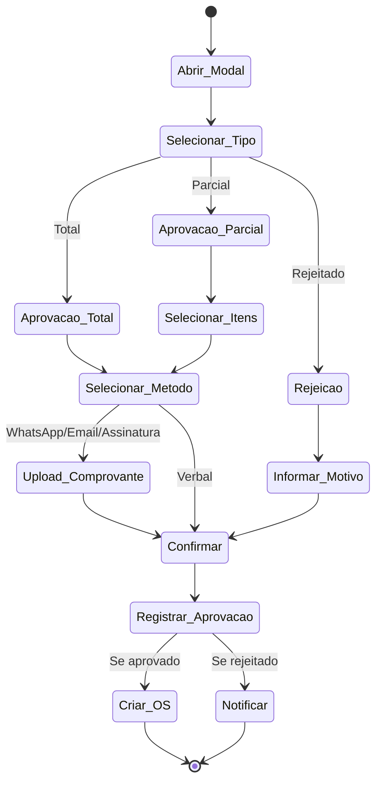
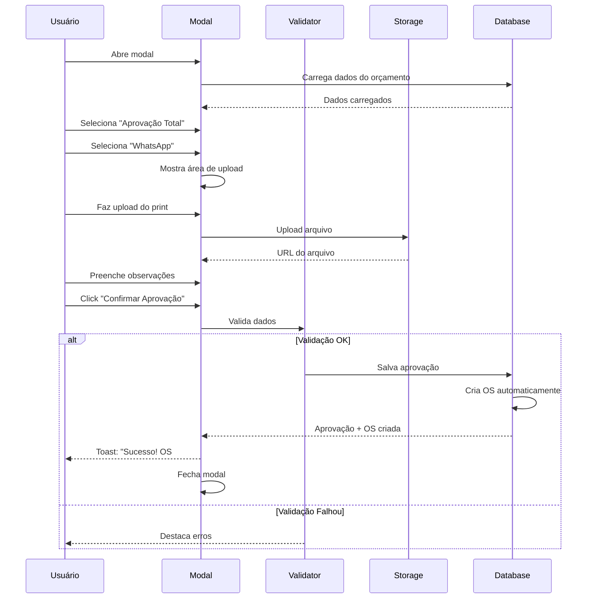
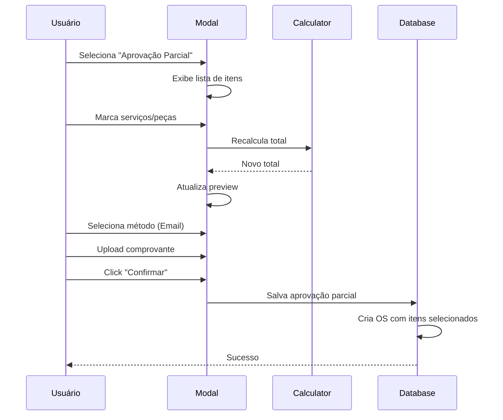
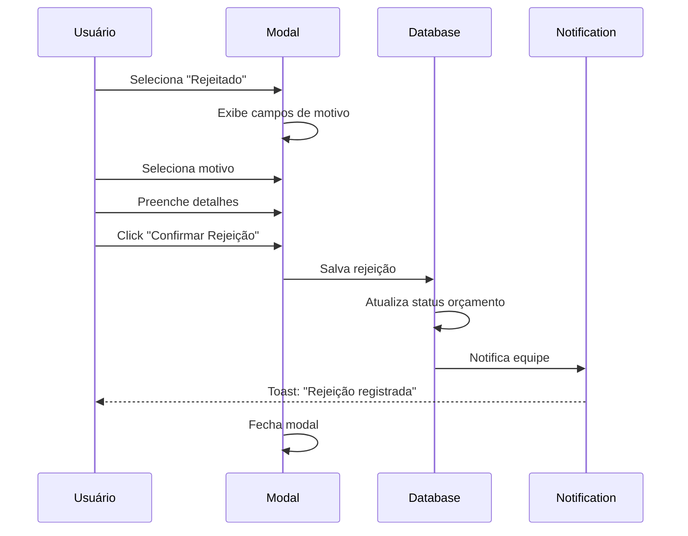

# Wireframe: Modal de Aprovação de Orçamento

## Visão Geral

Interface modal para registro de aprovação de orçamentos pelo cliente, com suporte a múltiplos tipos (Total, Parcial, Rejeitado) e métodos de aprovação (WhatsApp, Email, Assinatura, Verbal), incluindo upload de documentos comprobatórios.

## Fluxo de Aprovação



## Layout do Modal

### Desktop (max-width: 900px)

```
┌──────────────────────────────────────────────────────────────┐
│ ✕  Aprovação de Orçamento #000123                            │
├──────────────────────────────────────────────────────────────┤
│                                                              │
│ ┌────────────────────────────────────────────────────────┐  │
│ │ RESUMO DO ORÇAMENTO                                    │  │
│ │                                                        │  │
│ │ Cliente: João da Silva - Workshop Mecânica Silva      │  │
│ │ OS: #000456 - Ford Zetec 1.8                          │  │
│ │ Componente: Bloco                                     │  │
│ │ Data Orçamento: 10/10/2025                            │  │
│ │ Válido até: 25/10/2025 (15 dias restantes)            │  │
│ │                                                        │  │
│ │ Total: R$ 2.755,80                                     │  │
│ └────────────────────────────────────────────────────────┘  │
│                                                              │
│ ┌────────────────────────────────────────────────────────┐  │
│ │ TIPO DE APROVAÇÃO *                                    │  │
│ │                                                        │  │
│ │ ○ Aprovação Total    ⦿ Aprovação Parcial  ○ Rejeitado │  │
│ └────────────────────────────────────────────────────────┘  │
│                                                              │
│ [Conteúdo Dinâmico baseado no tipo selecionado]             │
│                                                              │
│ ┌────────────────────────────────────────────────────────┐  │
│ │ MÉTODO DE APROVAÇÃO *                                  │  │
│ │                                                        │  │
│ │ [WhatsApp] [Email] [Assinatura Digital] [Verbal]      │  │
│ └────────────────────────────────────────────────────────┘  │
│                                                              │
│ [Seção de Upload - Aparece para WhatsApp/Email/Assinatura]  │
│                                                              │
│ ┌────────────────────────────────────────────────────────┐  │
│ │ OBSERVAÇÕES                                            │  │
│ │ [Textarea para notas adicionais]                       │  │
│ └────────────────────────────────────────────────────────┘  │
│                                                              │
├──────────────────────────────────────────────────────────────┤
│                             [Cancelar]    [Confirmar Aprovação] │
└──────────────────────────────────────────────────────────────┘
```

---

## Seções Detalhadas

### 1. Resumo do Orçamento (Não editável)

```
┌────────────────────────────────────────────────────────┐
│ RESUMO DO ORÇAMENTO                                    │
│                                                        │
│ Cliente: João da Silva - Workshop Mecânica Silva      │
│ Documento: 123.456.789-00                             │
│                                                        │
│ OS: #000456 - Ford Zetec 1.8                          │
│ Componente: Bloco                                     │
│ Data Orçamento: 10/10/2025                            │
│ Válido até: 25/10/2025 (⚠ 15 dias restantes)         │
│                                                        │
│ ┌──────────────────────────────────────────────────┐  │
│ │ Serviços (2):              R$ 1.920,00           │  │
│ │ Peças (2):                 R$ 700,00             │  │
│ │ Desconto:                 -R$ 100,00             │  │
│ │ Impostos:                 +R$ 235,80             │  │
│ │ ─────────────────────────────────────────────    │  │
│ │ TOTAL:                     R$ 2.755,80           │  │
│ └──────────────────────────────────────────────────┘  │
│                                                        │
│ [📄 Ver Orçamento Completo]                            │
└────────────────────────────────────────────────────────┘
```

**Elementos:**
- Informações do cliente (nome, documento)
- Dados da OS (número, modelo de motor)
- Datas (criação e validade)
- Badge visual para prazo:
  - Verde: > 7 dias restantes
  - Amarelo: 3-7 dias restantes
  - Vermelho: < 3 dias restantes
- Resumo financeiro em card destacado
- Link para visualizar orçamento completo (abre em nova aba)

---

### 2. Tipo de Aprovação

```
┌────────────────────────────────────────────────────────┐
│ TIPO DE APROVAÇÃO *                                    │
│                                                        │
│ ┌──────────┐  ┌──────────────┐  ┌──────────┐        │
│ │   ✓      │  │              │  │          │        │
│ │ Aprovação│  │  Aprovação   │  │ Rejeitado│        │
│ │  Total   │  │   Parcial    │  │          │        │
│ └──────────┘  └──────────────┘  └──────────┘        │
│                                                        │
└────────────────────────────────────────────────────────┘
```

**Opções:**
1. **Aprovação Total**
   - Cliente aprova todos os serviços e peças
   - Valor total: R$ 2.755,80
   
2. **Aprovação Parcial**
   - Cliente aprova apenas alguns itens
   - Permite selecionar serviços e peças individualmente
   - Recalcula valor total automaticamente
   
3. **Rejeitado**
   - Cliente recusa o orçamento
   - Requer informar motivo

**Visual:**
- Cards grandes e clicáveis
- Ícones ilustrativos
- Card selecionado: borda destacada + background levemente colorido

---

### 3. Conteúdo Dinâmico por Tipo

#### 3.1 Aprovação Total (Padrão)

```
[Nenhuma seção adicional]
[Vai direto para Método de Aprovação]
```

---

#### 3.2 Aprovação Parcial

```
┌────────────────────────────────────────────────────────┐
│ SELECIONE OS ITENS APROVADOS                           │
├────────────────────────────────────────────────────────┤
│                                                        │
│ SERVIÇOS                                               │
│ ☑ Retífica de Bloco Padrão       R$ 1.200,00          │
│ ☐ Usinagem de Eixo Comando       R$ 720,00            │
│                                                        │
│ PEÇAS                                                  │
│ ☑ Bronzina Biela STD (4x)        R$ 340,00            │
│ □ Válvula Admissão (8x)          R$ 360,00  [Editar Qtd] │
│                                                        │
├────────────────────────────────────────────────────────┤
│ Itens Selecionados:              3 / 4                 │
│                                                        │
│ ┌──────────────────────────────────────────────────┐  │
│ │ NOVO TOTAL                                       │  │
│ │                                                  │  │
│ │ Serviços:                  R$ 1.200,00           │  │
│ │ Peças:                     R$ 340,00             │  │
│ │ Desconto Proporcional:    -R$ 58,78              │  │
│ │ Impostos:                 +R$ 138,27             │  │
│ │ ─────────────────────────────────────────        │  │
│ │ TOTAL APROVADO:            R$ 1.619,49           │  │
│ └──────────────────────────────────────────────────┘  │
│                                                        │
└────────────────────────────────────────────────────────┘
```

**Funcionalidades:**
- Checkboxes para cada serviço e peça
- **Editar Quantidade**: Para peças, permite ajustar qtd aprovada
  - Abre mini-modal: "Quantidade aprovada: [input] de 8"
- **Recálculo Automático**:
  - Desconto e impostos recalculados proporcionalmente
  - Total atualizado em tempo real
- **Validação**: Ao menos 1 item deve ser selecionado
- **Badge**: "X / Y itens selecionados"

**Estados do Checkbox:**
- ☑ Selecionado (verde)
- ☐ Não selecionado (cinza)
- Disabled: se for único item obrigatório

---

#### 3.3 Rejeitado

```
┌────────────────────────────────────────────────────────┐
│ MOTIVO DA REJEIÇÃO *                                   │
│                                                        │
│ [Dropdown: Selecione o motivo]                         │
│   • Preço muito alto                                   │
│   • Prazo de entrega muito longo                       │
│   • Serviços não necessários                           │
│   • Optou por outro fornecedor                         │
│   • Outros (especificar abaixo)                        │
│                                                        │
│ Detalhes (opcional)                                    │
│ [Textarea: Adicione mais informações...]               │
│                                                        │
└────────────────────────────────────────────────────────┘
```

**Campos:**
- **Motivo*** (Select obrigatório)
- **Detalhes** (Textarea opcional, max 500 caracteres)

**Validação:**
- Se "Outros" for selecionado, campo "Detalhes" torna-se obrigatório

---

### 4. Método de Aprovação

```
┌────────────────────────────────────────────────────────┐
│ MÉTODO DE APROVAÇÃO *                                  │
│                                                        │
│ Como o cliente aprovou o orçamento?                    │
│                                                        │
│ ┌──────────┐ ┌──────────┐ ┌──────────┐ ┌──────────┐  │
│ │ WhatsApp │ │  Email   │ │Assinatura│ │  Verbal  │  │
│ │    ✓     │ │          │ │          │ │          │  │
│ └──────────┘ └──────────┘ └──────────┘ └──────────┘  │
│                                                        │
└────────────────────────────────────────────────────────┘
```

**Opções:**
1. **WhatsApp**
   - Requer upload de print da conversa
   - Formatos: JPG, PNG, PDF
   
2. **Email**
   - Requer upload de email ou PDF anexado
   - Formatos: PDF, EML, MSG
   
3. **Assinatura Digital**
   - Requer upload de documento assinado
   - Formatos: PDF
   
4. **Verbal**
   - Não requer comprovante
   - Registra nome de quem recebeu a aprovação

**Visual:**
- Botões em formato de cards
- Ícones ilustrativos (WhatsApp, Email, Document, Phone)
- Tooltips explicando cada opção

---

### 5. Seção de Upload (Condicional)

#### Visível para: WhatsApp, Email, Assinatura

```
┌────────────────────────────────────────────────────────┐
│ COMPROVANTE DE APROVAÇÃO                               │
│                                                        │
│ ┌──────────────────────────────────────────────────┐  │
│ │                                                  │  │
│ │            📎  Arraste arquivos aqui             │  │
│ │                      ou                          │  │
│ │              [Clique para selecionar]            │  │
│ │                                                  │  │
│ │   Formatos aceitos: JPG, PNG, PDF                │  │
│ │   Tamanho máximo: 5 MB                           │  │
│ │                                                  │  │
│ └──────────────────────────────────────────────────┘  │
│                                                        │
│ [Lista de arquivos enviados]                           │
│ 📄 aprovacao_whatsapp.jpg (2.3 MB)          [×]       │
│                                                        │
└────────────────────────────────────────────────────────┘
```

**Funcionalidades:**
- **Drag & Drop**: Arrastar arquivo para área pontilhada
- **Click to Upload**: Abrir seletor de arquivos
- **Preview**: Thumbnail do arquivo enviado
- **Validações**:
  - Formatos permitidos: JPG, PNG, PDF (WhatsApp/Email), apenas PDF (Assinatura)
  - Tamanho máximo: 5 MB
  - Máximo 3 arquivos
- **Remover**: Botão [×] ao lado de cada arquivo
- **Obrigatório**: Ao menos 1 arquivo deve ser enviado

**Estados:**
- **Idle**: Área pontilhada cinza
- **Hover**: Área pontilhada azul
- **Uploading**: Barra de progresso
- **Success**: Arquivo listado com ícone de sucesso
- **Error**: Mensagem de erro abaixo

---

#### Visível para: Verbal

```
┌────────────────────────────────────────────────────────┐
│ CONFIRMAÇÃO VERBAL                                     │
│                                                        │
│ Nome de quem recebeu a aprovação *                     │
│ [Input: Nome completo]                                 │
│                                                        │
│ Telefone do cliente (confirmação) *                    │
│ [Input: (XX) XXXXX-XXXX]                               │
│                                                        │
│ Data e Hora da Aprovação *                             │
│ [DateTime Picker: DD/MM/YYYY HH:MM]                    │
│                                                        │
└────────────────────────────────────────────────────────┘
```

**Campos:**
- **Nome*** (Text input)
- **Telefone*** (Masked input)
- **Data/Hora*** (DateTime picker, padrão: agora)

**Validações:**
- Todos os campos obrigatórios
- Telefone deve ter 10-11 dígitos
- Data não pode ser futura

---

### 6. Observações (Opcional)

```
┌────────────────────────────────────────────────────────┐
│ OBSERVAÇÕES                                            │
│                                                        │
│ [Textarea]                                             │
│ Adicione informações adicionais sobre a aprovação...   │
│                                                        │
│                                          (0 / 500)     │
└────────────────────────────────────────────────────────┘
```

**Funcionalidades:**
- Textarea opcional
- Max 500 caracteres
- Contador de caracteres

---

### 7. Footer: Ações

```
┌──────────────────────────────────────────────────────────┐
│                          [Cancelar]  [Confirmar Aprovação] │
└──────────────────────────────────────────────────────────┘
```

**Botões:**
1. **Cancelar** (secondary)
   - Fecha modal sem salvar
   - Confirmação se houver dados preenchidos
   
2. **Confirmar Aprovação** (primary)
   - Label dinâmica:
     - "Confirmar Aprovação Total" (Total)
     - "Confirmar Aprovação Parcial" (Parcial)
     - "Confirmar Rejeição" (Rejeitado)
   - Valida todos os campos obrigatórios
   - Registra aprovação no banco
   - Cria OS automaticamente (se aprovado)
   - Exibe toast de sucesso
   - Fecha modal

**Estados:**
- Desabilitado: enquanto validações não forem atendidas
- Loading: durante submissão

---

## Layout Responsivo

### Tablet (768px - 1024px)

```
┌─────────────────────────────────┐
│ Modal (90% largura)             │
├─────────────────────────────────┤
│ Resumo (full-width)             │
├─────────────────────────────────┤
│ Tipo de Aprovação (stack)       │
├─────────────────────────────────┤
│ [Conteúdo Dinâmico]             │
├─────────────────────────────────┤
│ Método (2x2 grid)               │
├─────────────────────────────────┤
│ Upload (full-width)             │
├─────────────────────────────────┤
│ Footer (botões lado a lado)    │
└─────────────────────────────────┘
```

---

### Mobile (< 768px)

```
┌──────────────────────┐
│ ✕ Aprovação #000123  │
├──────────────────────┤
│ Resumo Compacto      │
│ [Expandir detalhes]  │
├──────────────────────┤
│ Tipo Aprovação       │
│ (cards verticais)    │
├──────────────────────┤
│ [Conteúdo Dinâmico]  │
├──────────────────────┤
│ Método (stack)       │
├──────────────────────┤
│ Upload               │
├──────────────────────┤
│ Sticky Footer        │
└──────────────────────┘
```

**Ajustes Específicos:**
- Modal ocupa 100% da altura/largura (fullscreen)
- Resumo colapsável (accordion)
- Botões de tipo empilhados verticalmente
- Método em 2 colunas (2x2)
- Footer fixo na parte inferior

---

## Estados da Interface

### 1. Loading Inicial
```
┌─────────────────────────────────┐
│ [Skeleton: Header]              │
│ [Skeleton: Resumo (5 linhas)]   │
│ [Skeleton: Cards (3 blocos)]    │
└─────────────────────────────────┘
```

### 2. Validação em Tempo Real
- **Campo válido**: borda verde + ✓
- **Campo inválido**: borda vermelha + mensagem
- **Campo obrigatório não preenchido**: destacado ao tentar submeter

### 3. Uploading Arquivo
```
┌────────────────────────────────┐
│ 📄 aprovacao.jpg               │
│ ████████░░░░░░░░░░░ 45%       │
│ Enviando... 2.1 MB de 4.6 MB  │
└────────────────────────────────┘
```

### 4. Submitting
- Overlay no modal
- Spinner + "Registrando aprovação..."
- Botões desabilitados

### 5. Sucesso
- Modal fecha automaticamente
- Toast: "Aprovação registrada com sucesso!"
- Se aprovado: "OS #XXXX criada automaticamente"
- Redireciona para detalhes da OS (opcional)

### 6. Erro
- Toast: "Erro ao registrar aprovação"
- Detalhes do erro
- Opção "Tentar novamente"
- Modal permanece aberto

---

## Fluxos de Interação

### Fluxo 1: Aprovação Total com WhatsApp



### Fluxo 2: Aprovação Parcial



### Fluxo 3: Rejeição



---

## Acessibilidade

### ARIA Labels
```html
<div role="dialog" aria-labelledby="modal-title" aria-modal="true">
  <h2 id="modal-title">Aprovação de Orçamento #000123</h2>
  
  <fieldset aria-labelledby="approval-type">
    <legend id="approval-type">Tipo de Aprovação</legend>
    <input type="radio" aria-label="Aprovação Total" />
    ...
  </fieldset>
  
  <div role="group" aria-labelledby="approval-method">
    <h3 id="approval-method">Método de Aprovação</h3>
    ...
  </div>
</div>
```

### Navegação por Teclado
- `Esc`: Fecha modal (com confirmação)
- `Tab`: Navega entre campos
- `Shift+Tab`: Volta campo anterior
- `Space`: Marca/desmarca checkboxes
- `Enter`: Confirma ação (no botão ativo)

### Screen Reader
- Anúncio de abertura: "Modal de aprovação de orçamento aberto"
- Feedback de seleções: "Aprovação total selecionada"
- Leitura de totais: "Total aprovado: dois mil setecentos e cinquenta e cinco reais e oitenta centavos"
- Confirmação: "Aprovação registrada com sucesso. Ordem de serviço 456 criada"

---

## Performance

### Otimizações
- **Lazy loading** de resumo do orçamento
- **Debounce** em recálculos (aprovação parcial) - 300ms
- **Optimistic UI**: Feedback imediato antes da resposta do servidor
- **Image compression**: Comprimir uploads automática (max 2MB)

### Métricas Alvo
- Abertura do modal: < 500ms
- Upload de arquivo: progresso em tempo real
- Recálculo de totais: < 200ms
- Submissão: < 2s

---

*Última atualização: 2025-10-10*
