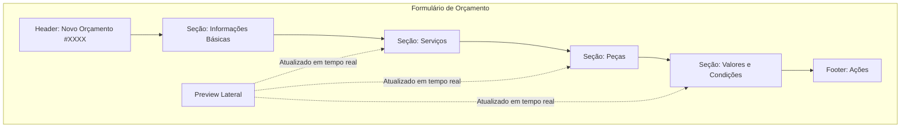
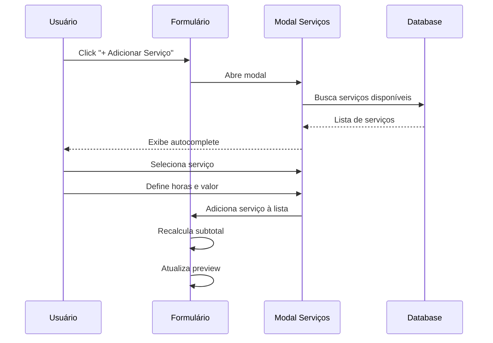
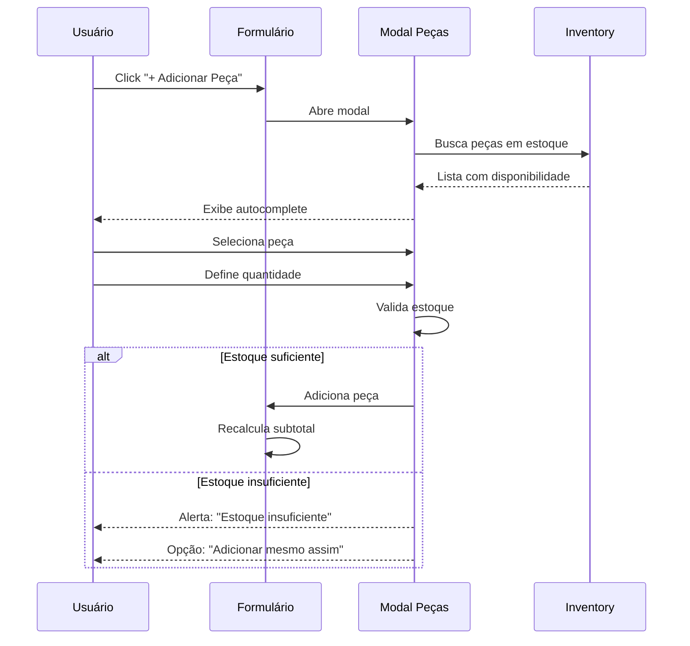
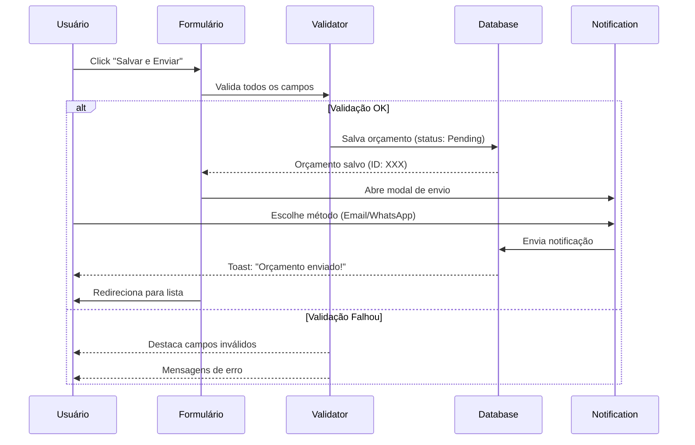

# Wireframe: Formulário de Orçamento

## Visão Geral

Interface de criação e edição de orçamentos detalhados, com seleção dinâmica de serviços e peças, cálculos automáticos em tempo real e preview visual.

## Layout Desktop (> 1024px)



## Estrutura Detalhada

### 1. Header

```
┌─────────────────────────────────────────────────────────────┐
│ ← Voltar    Novo Orçamento #000123    [Salvar] [Cancelar]  │
└─────────────────────────────────────────────────────────────┘
```

**Elementos:**
- Botão "Voltar" (icon: `ArrowLeft`)
- Título dinâmico: "Novo Orçamento" ou "Editar Orçamento #XXXX"
- Badge de status (Draft/Pending/Approved)
- Botões de ação:
  - **Salvar** (primary button)
  - **Cancelar** (secondary button)

**Estados:**
- Desabilitado durante submissão
- Mostra loading spinner ao salvar
- Badge muda cor conforme status

---

### 2. Seção: Informações Básicas

```
┌─────────────────────────────────────────────────────────────┐
│ INFORMAÇÕES BÁSICAS                                         │
├─────────────────────────────────────────────────────────────┤
│                                                             │
│ Ordem de Serviço *          Cliente                        │
│ [Dropdown: OS List]         [Readonly: Nome do Cliente]    │
│                                                             │
│ Componente *                 Válido até *                   │
│ [Select: Bloco/Cabeçote...] [Date Picker: DD/MM/YYYY]     │
│                                                             │
│ Observações                                                 │
│ [Textarea: Observações internas ou para o cliente]         │
│                                                             │
└─────────────────────────────────────────────────────────────┘
```

**Campos:**
1. **Ordem de Serviço*** (Dropdown searchable)
   - Lista de OS abertas da organização
   - Exibe: "OS #XXXX - Cliente - Motor"
   - Ao selecionar: carrega dados do cliente automaticamente
   
2. **Cliente** (Readonly)
   - Preenchido automaticamente ao selecionar OS
   - Exibe nome completo do cliente
   
3. **Componente*** (Select)
   - Opções: Bloco, Cabeçote, Eixo, Biela, Comando, Pistão, Virabrequim
   - Filtro de serviços/peças compatíveis
   
4. **Válido até*** (Date Picker)
   - Data mínima: hoje
   - Sugestão padrão: hoje + 15 dias
   - Formato: DD/MM/YYYY
   
5. **Observações** (Textarea)
   - Opcional
   - Max 500 caracteres
   - Contador de caracteres

**Validações:**
- Campos obrigatórios (*) não podem estar vazios
- Data de validade não pode ser no passado
- OS selecionada deve estar ativa

---

### 3. Seção: Serviços

```
┌─────────────────────────────────────────────────────────────┐
│ SERVIÇOS                                      [+ Adicionar] │
├─────────────────────────────────────────────────────────────┤
│                                                             │
│ ┌─────────────────────────────────────────────────────┐   │
│ │ 1. Retífica de Bloco Padrão                 [Editar]│   │
│ │    Horas: 8.0h × R$ 150,00/h = R$ 1.200,00  [Remover]│   │
│ └─────────────────────────────────────────────────────┘   │
│                                                             │
│ ┌─────────────────────────────────────────────────────┐   │
│ │ 2. Usinagem de Eixo Comando                 [Editar]│   │
│ │    Horas: 4.0h × R$ 180,00/h = R$ 720,00   [Remover]│   │
│ └─────────────────────────────────────────────────────┘   │
│                                                             │
│ Subtotal Serviços:                      R$ 1.920,00       │
└─────────────────────────────────────────────────────────────┘
```

**Funcionalidades:**
1. **Botão "+ Adicionar Serviço"**
   - Abre modal de seleção de serviços
   - Autocomplete com serviços cadastrados
   - Filtrados por componente selecionado
   
2. **Card de Serviço**
   - Nome do serviço
   - Horas estimadas (input numérico)
   - Valor por hora (input monetário)
   - Cálculo automático: horas × valor/hora
   - Botões: Editar (inline) e Remover (confirmação)
   
3. **Subtotal de Serviços**
   - Soma automática de todos os serviços
   - Atualizado em tempo real

**Validações:**
- Horas devem ser > 0
- Valor por hora deve ser > 0
- Não permite serviços duplicados

---

### 4. Seção: Peças

```
┌─────────────────────────────────────────────────────────────┐
│ PEÇAS                                         [+ Adicionar] │
├─────────────────────────────────────────────────────────────┤
│                                                             │
│ ┌─────────────────────────────────────────────────────────┐ │
│ │ Código      Peça              Qtd    Unit.    Total    │ │
│ ├─────────────────────────────────────────────────────────┤ │
│ │ BX-001   Bronzina Biela STD    4    R$ 85,00  R$ 340,00│ │
│ │          [Estoque: 12 un] [Remover]                    │ │
│ │                                                         │ │
│ │ EX-042   Válvula Admissão      8    R$ 45,00  R$ 360,00│ │
│ │          [Estoque: 50 un] [Remover]                    │ │
│ └─────────────────────────────────────────────────────────┘ │
│                                                             │
│ Subtotal Peças:                             R$ 700,00      │
└─────────────────────────────────────────────────────────────┘
```

**Funcionalidades:**
1. **Botão "+ Adicionar Peça"**
   - Abre modal de busca de peças no estoque
   - Autocomplete por código ou nome
   - Mostra disponibilidade em estoque
   - Filtradas por componente selecionado
   
2. **Tabela de Peças**
   - **Código**: Código da peça (readonly)
   - **Peça**: Nome da peça (readonly)
   - **Quantidade**: Input numérico (min: 1)
   - **Unit.**: Preço unitário (editável)
   - **Total**: Qtd × Preço unitário (calculado)
   - **Estoque**: Badge com disponibilidade
     - Verde: Estoque suficiente
     - Amarelo: Estoque baixo
     - Vermelho: Estoque insuficiente
   - **Ação**: Botão Remover
   
3. **Subtotal de Peças**
   - Soma automática de todas as peças
   - Atualizado em tempo real

**Validações:**
- Quantidade deve ser > 0
- Alertar se quantidade > estoque disponível
- Preço unitário deve ser > 0
- Não permite peças duplicadas

---

### 5. Seção: Valores e Condições

```
┌─────────────────────────────────────────────────────────────┐
│ VALORES E CONDIÇÕES                                         │
├─────────────────────────────────────────────────────────────┤
│                                                             │
│ Desconto                       Garantia                     │
│ [Input: R$] ou [Input: %]     [Input: 3] meses             │
│                                                             │
│ Impostos                       Prazo de Entrega            │
│ [Calculado: R$ XXX,XX]        [Input: 7] dias úteis        │
│                                                             │
│ ┌─────────────────────────────────────────────────────┐   │
│ │ RESUMO FINANCEIRO                                   │   │
│ │ Subtotal Serviços:              R$ 1.920,00         │   │
│ │ Subtotal Peças:                 R$ 700,00           │   │
│ │ Desconto:                      -R$ 100,00 (3.82%)   │   │
│ │ Impostos:                      +R$ 235,80           │   │
│ │ ─────────────────────────────────────────────       │   │
│ │ TOTAL GERAL:                    R$ 2.755,80         │   │
│ └─────────────────────────────────────────────────────┘   │
│                                                             │
└─────────────────────────────────────────────────────────────┘
```

**Campos:**
1. **Desconto**
   - Toggle entre valor fixo (R$) ou percentual (%)
   - Cálculo automático do correspondente
   - Validação: não pode exceder subtotal
   
2. **Garantia** (meses)
   - Padrão: 3 meses
   - Min: 0, Max: 24
   
3. **Impostos**
   - Calculado automaticamente via módulo fiscal
   - Baseado no regime tributário da empresa
   - Readonly (com ícone de info explicando o cálculo)
   
4. **Prazo de Entrega** (dias úteis)
   - Padrão: 7 dias
   - Min: 1, Max: 90

**Resumo Financeiro (Card destacado):**
- Subtotal Serviços
- Subtotal Peças
- Desconto (valor e %)
- Impostos (detalhamento via tooltip)
- **Total Geral** (destaque visual - fonte maior, negrito)

**Validações:**
- Desconto não pode ser maior que subtotal
- Garantia deve estar entre 0 e 24 meses
- Prazo de entrega deve ser > 0

---

### 6. Preview Lateral (Desktop)

```
┌───────────────────────────────┐
│ PREVIEW DO ORÇAMENTO          │
├───────────────────────────────┤
│                               │
│ OS #000123                    │
│ Cliente: João da Silva        │
│ Motor: Ford Zetec 1.8         │
│ Componente: Bloco             │
│                               │
│ ───────────────────────────── │
│                               │
│ Serviços (2):                 │
│ • Retífica Padrão             │
│ • Usinagem Eixo               │
│                               │
│ Peças (2):                    │
│ • Bronzina Biela STD (4x)     │
│ • Válvula Admissão (8x)       │
│                               │
│ ───────────────────────────── │
│                               │
│ Total: R$ 2.755,80            │
│ Garantia: 3 meses             │
│ Prazo: 7 dias úteis           │
│ Válido até: 25/10/2025        │
│                               │
│ [Exportar PDF]                │
│                               │
└───────────────────────────────┘
```

**Funcionalidades:**
- Atualizado em tempo real conforme preenchimento
- Sticky (fixo na tela ao rolar)
- Botão "Exportar PDF" para preview completo
- Mostra apenas informações preenchidas

---

### 7. Footer: Ações

```
┌─────────────────────────────────────────────────────────────┐
│                      [Cancelar]    [Salvar como Rascunho]  │
│                                    [Salvar e Enviar]        │
└─────────────────────────────────────────────────────────────┘
```

**Botões:**
1. **Cancelar** (secondary)
   - Confirmação se houver alterações não salvas
   - Volta para lista de orçamentos
   
2. **Salvar como Rascunho** (secondary)
   - Salva com status "Draft"
   - Permite continuar editando depois
   - Não requer todos os campos obrigatórios
   
3. **Salvar e Enviar** (primary)
   - Valida todos os campos obrigatórios
   - Salva com status "Pending"
   - Abre modal de envio (Email/WhatsApp)

---

## Layout Responsivo

### Tablet (768px - 1024px)

```
┌─────────────────────────────────────┐
│ Header                              │
├─────────────────────────────────────┤
│ Informações Básicas (2 colunas)    │
├─────────────────────────────────────┤
│ Serviços (lista vertical)           │
├─────────────────────────────────────┤
│ Peças (tabela scrollable)           │
├─────────────────────────────────────┤
│ Valores (2 colunas)                 │
│ Resumo Financeiro (full-width)     │
├─────────────────────────────────────┤
│ Footer Ações                        │
└─────────────────────────────────────┘
```

**Ajustes:**
- Preview lateral se torna bottom sheet (accordion)
- Campos em 2 colunas quando possível
- Tabela de peças com scroll horizontal
- Botões empilhados no footer

---

### Mobile (< 768px)

```
┌────────────────────┐
│ Header Compacto    │
├────────────────────┤
│ Info Básicas       │
│ (1 coluna)         │
├────────────────────┤
│ Serviços           │
│ (cards verticais)  │
├────────────────────┤
│ Peças              │
│ (cards simplific.) │
├────────────────────┤
│ Valores (1 col)    │
│ Resumo Financial   │
├────────────────────┤
│ Sticky Footer      │
└────────────────────┘
```

**Ajustes Específicos:**
- Todos os campos em coluna única
- Serviços e peças como cards verticais
- Inputs numéricos com teclado otimizado
- Preview acessível via bottom drawer
- Footer fixo na parte inferior (sticky)
- Botões "Salvar" e "Cancelar" lado a lado
- Menu "⋮" para ações secundárias

---

## Estados da Interface

### 1. Loading
```
┌─────────────────────────────────────┐
│ [Skeleton: Header]                  │
│ [Skeleton: Campos (6 linhas)]       │
│ [Skeleton: Cards (3 blocos)]        │
└─────────────────────────────────────┘
```

### 2. Validação em Tempo Real
- Campo válido: borda verde + ✓ ícone
- Campo inválido: borda vermelha + mensagem de erro abaixo
- Campo obrigatório vazio: borda amarela ao blur

### 3. Salvando
- Overlay semi-transparente
- Spinner centralizado
- Mensagem: "Salvando orçamento..."
- Botões desabilitados

### 4. Sucesso
- Toast notification: "Orçamento salvo com sucesso!"
- Redirecionamento automático em 2s

### 5. Erro
- Toast notification: "Erro ao salvar orçamento"
- Detalhes do erro abaixo
- Opção "Tentar novamente"

---

## Interações Principais

### Adicionar Serviço



### Adicionar Peça



### Salvar e Enviar



---

## Acessibilidade

### ARIA Labels
```html
<form aria-label="Formulário de orçamento">
  <section aria-labelledby="basic-info">
    <h2 id="basic-info">Informações Básicas</h2>
    ...
  </section>
  
  <section aria-labelledby="services">
    <h2 id="services">Serviços</h2>
    <button aria-label="Adicionar novo serviço">+</button>
    ...
  </section>
</form>
```

### Navegação por Teclado
- `Tab`: Navega entre campos
- `Shift+Tab`: Volta campo anterior
- `Enter`: Adiciona item (em modais)
- `Esc`: Fecha modais
- `Ctrl+S`: Salva como rascunho
- `Ctrl+Enter`: Salva e envia

### Screen Reader Support
- Anúncio de erros de validação
- Feedback de ações ("Serviço adicionado", "Peça removida")
- Leitura de valores calculados
- Contador de itens ("2 serviços adicionados")

---

## Performance

### Otimizações
- **Debounce** em inputs de busca (300ms)
- **Throttle** em recálculos (100ms)
- **Lazy loading** de dados de estoque
- **Memoização** de cálculos complexos
- **Virtual scrolling** em listas grandes (>50 itens)

### Métricas Alvo
- First Paint: < 1s
- Time to Interactive: < 2s
- Validação de campo: < 100ms
- Recálculo de totais: < 200ms

---

*Última atualização: 2025-10-10*
