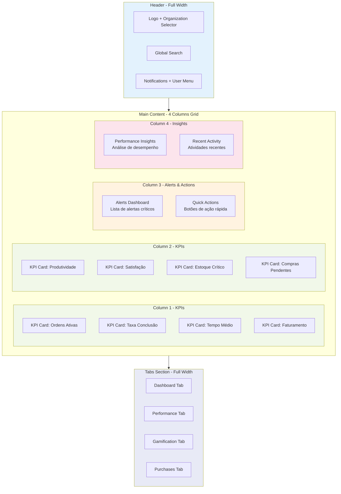
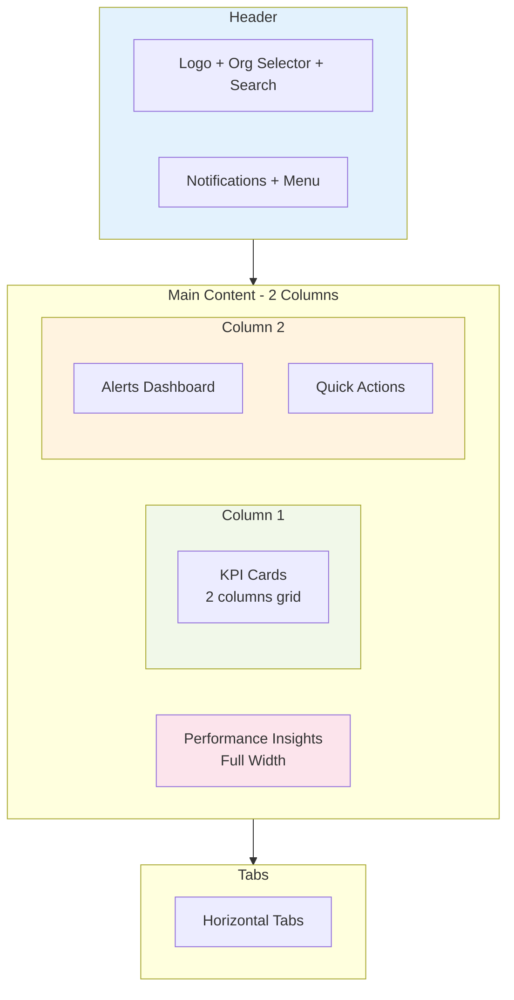
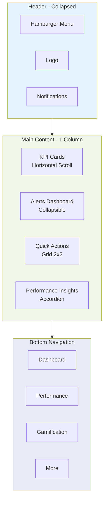
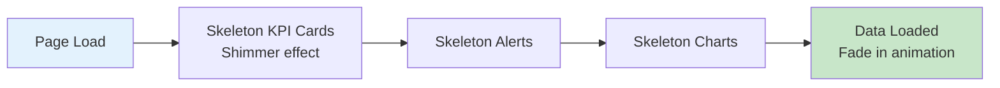
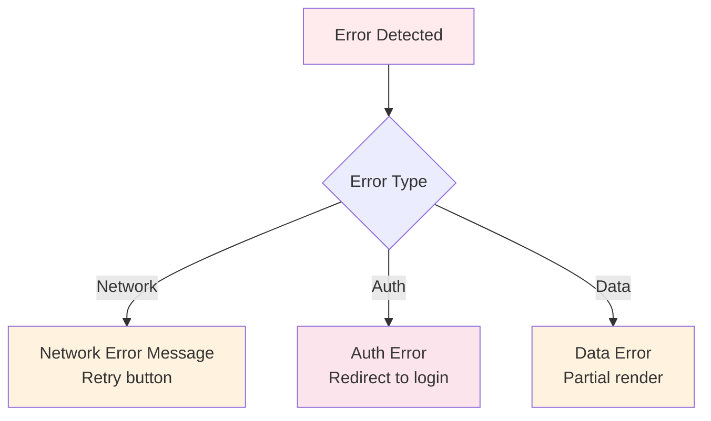
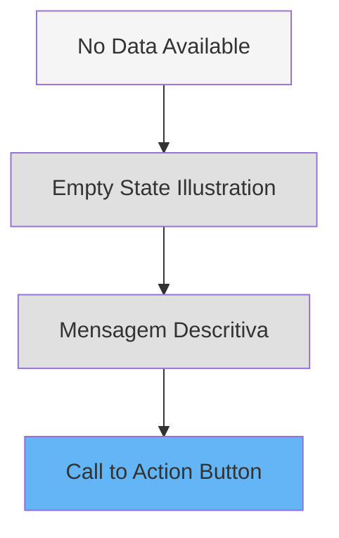

# Dashboard Principal - Wireframe

## 🎯 Visão Geral

Interface principal do dashboard que apresenta KPIs, alertas, ações rápidas e insights de desempenho em um layout responsivo e intuitivo.

## 🖥️ Layout Desktop



### Especificações Desktop
- **Grid**: 4 colunas (repeat(4, 1fr))
- **Gap**: 24px entre cards
- **Max Width**: 1920px (centralizado)
- **Padding**: 32px

## 📱 Layout Tablet (768px - 1024px)



### Especificações Tablet
- **Grid KPIs**: 2 colunas (repeat(2, 1fr))
- **Gap**: 16px
- **Padding**: 24px
- **Alerts**: Stack verticalmente

## 📱 Layout Mobile (< 768px)



### Especificações Mobile
- **Grid**: 1 coluna (100%)
- **KPIs**: Horizontal scroll (snap)
- **Gap**: 12px
- **Padding**: 16px
- **Navigation**: Bottom tab bar (fixed)

## 🧩 Componentes Principais

### 1. EnhancedStatCard
**Props**:
- `title: string`
- `value: number | string`
- `trend: { value: number, direction: 'up' | 'down' | 'stable' }`
- `icon: LucideIcon`
- `variant: 'default' | 'success' | 'warning' | 'error'`

**Estados**:
- Loading: Skeleton placeholder
- Loaded: Valor + trend + sparkline
- Error: Mensagem de erro
- Empty: Placeholder "Sem dados"

### 2. AlertsDashboard
**Layout**:
- Header: "Alertas" + contador
- Lista: Máximo 5 alertas visíveis
- Footer: "Ver todos" (link)

**Tipos de Alerta**:
- 🔴 Critical (error)
- 🟡 Warning (warning)
- 🔵 Info (info)
- 🟢 Success (success)

### 3. DynamicQuickActions
**Grid**: 2x2 (mobile) / 3x2 (tablet) / 4x2 (desktop)

**Ações Comuns**:
- Nova Ordem de Serviço
- Novo Orçamento
- Registrar Entrada
- Ver Workflow

### 4. PerformanceInsights
**Seções**:
- Visão Geral (gauge charts)
- Análise de Tendências (line chart)
- Top Performers (ranking)
- Recomendações (list)

## 📊 Estados da Interface

### Loading State


**Elementos**:
- Skeleton cards com animação shimmer
- Spinners para gráficos
- Duração: 300ms fade-in

### Error State


**Comportamento**:
- Toast notification para erros gerais
- Inline error para componentes específicos
- Retry button com exponential backoff

### Empty State


**Elementos**:
- Ilustração SVG
- Título: "Nenhum dado disponível"
- Descrição contextual
- CTA para criar primeiro item

## ♿ Acessibilidade

### WCAG 2.1 - Nível AA
- ✅ Contraste mínimo 4.5:1 para texto
- ✅ Contraste 3:1 para elementos UI
- ✅ Labels em todos os inputs
- ✅ ARIA roles adequados
- ✅ Navegação por teclado
- ✅ Focus indicators visíveis
- ✅ Screen reader support

### Semantic HTML
```html
<header role="banner">
  <nav role="navigation" aria-label="Main">
  </nav>
</header>

<main role="main">
  <section aria-labelledby="kpis-heading">
    <h2 id="kpis-heading">Indicadores</h2>
  </section>
</main>
```

## 📱 Responsividade

### Breakpoints
```css
/* Mobile First */
.dashboard-grid {
  display: grid;
  grid-template-columns: 1fr;
  gap: 12px;
  padding: 16px;
}

/* Tablet */
@media (min-width: 768px) {
  .dashboard-grid {
    grid-template-columns: repeat(2, 1fr);
    gap: 16px;
    padding: 24px;
  }
}

/* Desktop */
@media (min-width: 1024px) {
  .dashboard-grid {
    grid-template-columns: repeat(4, 1fr);
    gap: 24px;
    padding: 32px;
  }
}
```

### Touch Targets
- Mínimo: 44x44px (iOS) / 48x48px (Android)
- Espaçamento entre botões: 8px
- Swipe gestures para tabs (mobile)

## 🎨 Interações

### Animações
- **Page Load**: Fade in + slide up (300ms)
- **Card Hover**: Scale 1.02 + shadow (150ms)
- **Tab Change**: Fade in/out (200ms)
- **Data Update**: Pulse effect (500ms)

### Transições
```css
.stat-card {
  transition: all 150ms cubic-bezier(0.4, 0, 0.2, 1);
}

.stat-card:hover {
  transform: translateY(-2px);
  box-shadow: 0 4px 12px rgba(0, 0, 0, 0.1);
}
```

## 🔗 Links Relacionados

- [User Journey](../user-flows/dashboard-user-journey.md)
- [Component Architecture](../technical-specs/component-architecture.md)
- [Tabs System](./tabs-interfaces.md)

---

*Última atualização: 2025-10-09*
